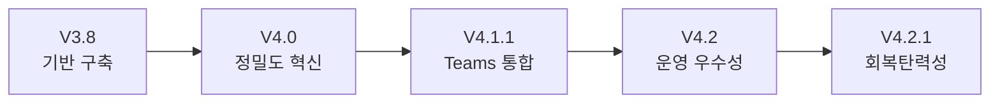
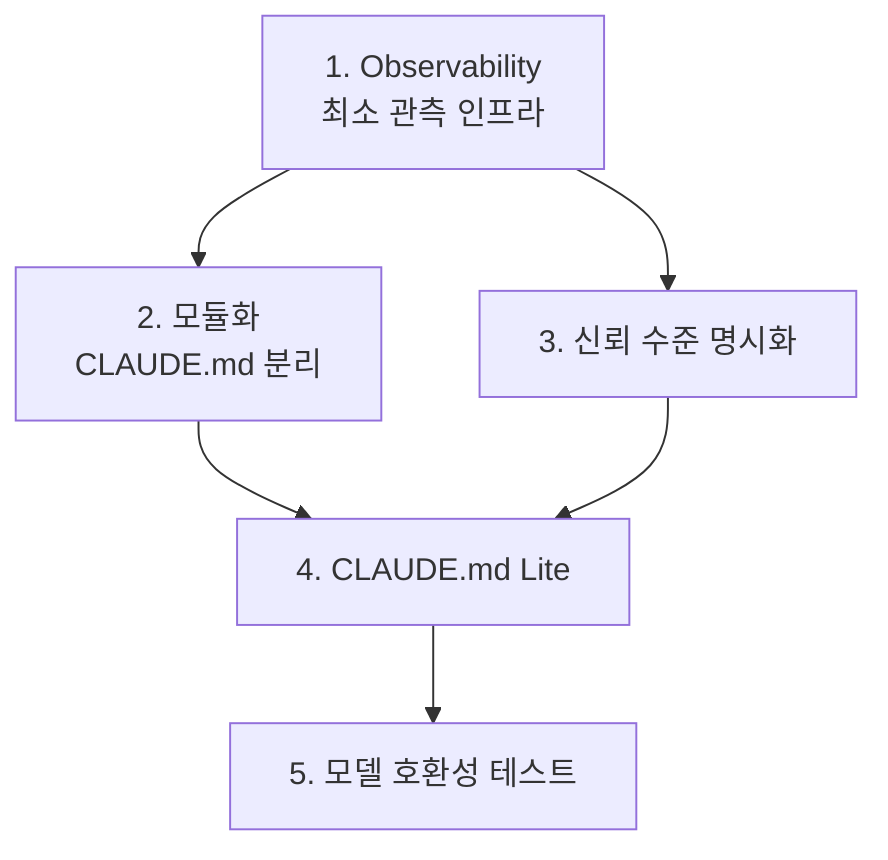

## 🔄 Next Session Handoff

### 현재 상태
- 이 문서의 완성도: completed
- 마지막 작업: ResearchChain 7단계 투입하여 현재 시스템 종합 분석 완료

### 다음 작업 (TODO)
- [ ] R1 실행: 복잡성 감량 수술 — 컴포넌트 사용 빈도 감사, 3-Tier 분류 (Core/Extended/Archive)
- [ ] R2 실행: CLAUDE.md 모듈화 — Section 2(245줄) → `ORCHESTRATION.md` 분리
- [ ] R3 설계: 적응적 체인 실행 — Quick/Standard/Deep 3단계 깊이 레벨
- [ ] Observability 최소 구현: PostToolUse Hook에 체인 실행 로그 1줄 append
- [ ] 102 폴더의 미래 시스템 연구와 교차 참조

### 작업 조언
> [!tip] 다음 Claude Code에게
> - 이 문서는 7개 에이전트(Explore×3, multidimensional_analyst, insight_explorer, insight_amplifier, integrated_sage)의 분석 결과를 통합한 것이다
> - 전략적 권고의 **우선순위 1은 Observability**이며, 이것이 나머지 모든 개선의 전제조건이다
> - `~/.claude/CLAUDE.md`(V4.2.1)와 `~/.claude/CHANGELOG.md`가 핵심 참조 파일이다
> - 1011 doc 폴더(`/Users/changjaeyou/Documents/Obsidian-Vault/AnsibleMage/ansible_config/1000_Agent_Systems/1011_Claude_Code_Team_Composition/doc/`)에 시스템 구축 당시의 설계 문서 14개가 있다
> - 발견된 4개 진화 법칙(복잡성 보존, 추상화 상승, 장애 흡수, 신뢰 점진적 위임)을 미래 설계 시 참조할 것

---

# Claude Code V4.2.1 현재 시스템 종합 분석 보고서

> **분석 방법론**: ResearchChain (adapted)
> **투입 에이전트**: Explore[S]×3 → (multidimensional_analyst[O] ∥ insight_explorer[S]) → insight_amplifier[O] → integrated_sage[O]
> **분석 일자**: 2026-03-14

---

## 1. Executive Summary

Claude Code Dynamic Chain Orchestration V4.2.1은 **"Orchestration as Prompt"** 패러다임을 구현한 시스템이다. CLAUDE.md라는 단일 자연어 파일이 소스 코드, 문서, 설정 파일을 겸하며, LLM의 해석 능력을 실행 엔진으로 사용한다.

> **한 문장 정의**: *"자연어로 인코딩된 다중 에이전트 오케스트레이션 시스템으로, 인간-AI 역할 분리(전략적 자율 + 전술적 충실)와 사고 주도 진화를 통해 AI-augmented solo operator의 역할 확장을 구조적으로 지원한다."*

| 지표 | 수치 |
|------|------|
| 총 컴포넌트 | 125개 |
| 체인 패턴 | 10개 (A~J) |
| 커스텀 에이전트 | 24개 (인지 10 + 역할 4 + 관리 2 + 유틸 8) |
| 스킬 | 26개 (빌트인 16 + 커스텀 10) |
| Hook | 7개 |
| 테스트 성공률 | 92% (12/13 PASS) |
| 토큰 효율 | Chain ~110K vs Teams ~150K+ |
| 시스템 성숙도 | **성장기 후기 → 성숙기 초입** |

---

## 2. 시스템 아키텍처

### 2.1 4-Layer 추상화 모델

```
Layer 3: Agent Teams ─── OS 프로세스 경계 ─── 독립 Claude 인스턴스
    │ (spawn/shutdown)
Layer 2: Dynamic Chains ─── 오케스트레이션 로직 ─── CLAUDE.md에 인코딩
    │ (순차/병렬 조합)
Layer 1: Subagents ─── tool-call 레벨 ─── 세션 내 Task()
    │ (직접 호출)
Layer 0: Claude Code Core ─── 런타임 ─── Bash, Read, Edit, Write...
```

> [!note] 핵심 특성
> Layer 2가 **코드가 아닌 자연어(CLAUDE.md)**로 인코딩된다는 것이 이 시스템의 가장 독특한 구조적 특성이다. 오케스트레이션 로직이 프롬프트 공간에 존재한다.

### 2.2 컴포넌트 인벤토리

| 카테고리 | 공식 | 커스텀 | 합계 |
|----------|------|--------|------|
| 에이전트 | 3 | 24 | **27** |
| 스킬 | 16 | 10 | **26** |
| 슬래시 커맨드 | 12 | 13 | **25** |
| Hook 스크립트 | 0 | 7 | **7** |
| MCP 서버 | 1 | 2 | **3** |
| 체인 패턴 | - | 10 | **10** |
| 플러그인 (공식) | 28 | - | **28** |
| 플러그인 (외부) | - | 13 | **13** |
| **합계** | **60** | **65** | **125** |

### 2.3 10대 동적 체인 패턴

| ID | 체인 | 핵심 에이전트 | 실행 패턴 |
|----|------|-------------|----------|
| A | SystemDesignChain | architect, innovator, sage | (Explore ∥ Read) → (architect ∥ reframer) → innovator → sage → (Edit ∥ reviewer) |
| B | AutomationChain | analyst, developer | analyst → (WebSearch ∥ Context7) → developer → (Bash ∥ reviewer) |
| C | GameDevChain | architect, developer | analyst → [Roblox ∥ Web] → reviewer |
| D | DevChain | analyst→architect→developer | analyst → (architect ∥ Explore ∥ Context7) → developer → (reviewer ∥ test) |
| E | ResearchChain | analyst, explorer, amplifier, sage | (WebSearch ∥ Context7 ∥ Explore) → (analyst ∥ explorer) → amplifier → sage → Write |
| F | DocChain+ | analyst, /docx etc | [Solo] analyst → /docx → reviewer / [Collab] coauthoring → /docx → reviewer |
| G | WebDevChain+ | architect, design, test | analyst → (architect ∥ Explore) → (theme → design) → testing → reviewer |
| H | MetaThinkChain | 인지 에이전트 7종 | (explorer ∥ creator) → (analyst ∥ evolver) → innovator → judge → amplifier → sage |
| I | RailsDevChain | /rails-* 7개 | /prd → /plan → (/dev → /test) × N → /deploy → /verify |
| J | HotfixChain | resolver, developer | (resolver ∥ Explore ∥ Grep) → developer → (test ∥ reviewer) |

### 2.4 4-Layer 프롬프트 분석 시스템

```
프롬프트 입력
    ↓
[Layer 1: Lexical]  키워드 매칭 → 후보 필터링 (넓은 그물)
    ↓
[Layer 2: Syntactic]  문장 구조 → 명령/질문 구분
    ↓
[Layer 3: Discourse]  복잡도 → 체인 필요성 판단, 병렬 의도 감지
    ↓
[Layer 4: Pragmatic]  화용적 의도 → 최종 체인 결정 (신뢰도 0.95)
    ↓
결과: 스킬/에이전트/체인 추천 (최대 3개, 0.6 이상)
```

**오탐 방지 메커니즘**: 컨텍스트 윈도우 ±3단어, 동사 분석, 경로 전처리, 상호 배제, 메타 작업 감지, 제약 감지

### 2.5 Hook 시스템

| Hook | 이벤트 | 기능 |
|------|--------|------|
| auto-analyze.sh V3.0 | UserPromptSubmit | 4-Layer 분석 + 이전 프롬프트 메모리 저장 지시 + Teammate 스킵 |
| 보안 필터 | PreToolUse (Write/Edit) | .env, credentials 등 보안 파일 수정 차단 |
| 완료 알림 | PostToolUse (Write/Edit) | `[✅ 파일 수정 완료]` 표시 |
| 자동 포매팅 | PostToolUse (Write/Edit) | Prettier/Black/gofmt/rustfmt/RuboCop/StyLua |
| Git 상태 | PostToolUse (Write/Edit) | 상위 5개 변경 파일 표시 |

---

## 3. 5차원 분석 (Multidimensional Analysis)

### 3.1 시간적 차원: 진화 궤적



| 버전 | 핵심 동인 (고장 모드) | 핵심 해결책 |
|------|---------------------|------------|
| V3.8→V4.0 | 오탐률 40% | 4-Layer 분석기, 신뢰도 점수 |
| V4.0→V4.1.1 | Hook 중복, Memory Race | 환경변수 감지, Lead-only 저장 |
| V4.1.1→V4.2 | 체인 축약, Hook 과신 | 임의 축약 금지, Catalyst 재정의 |
| V4.2→V4.2.1 | Teammate 무응답 | 타임아웃 120초, 착수 보고 30초, 자동 대체 |

> [!important] 핵심 발견
> **고장 모드가 진화를 결정한다.** 이 시스템은 "계획 주도(plan-driven)"가 아니라 **"사고 주도(incident-driven)" 진화**를 하고 있다. 실제 고장에서 배우는 시스템은 이론적 설계보다 실전에 강하다.

### 3.2 공간적 차원: 아키텍처 경계

**수평 구조**:
```
Hook 시스템 ←──→ Chain 선택기 ←──→ Agent 실행기 ←──→ Memory 시스템
     │                │                │                │
auto-analyze.sh   CLAUDE.md 참조     Task()/Teams      ~/.claude/memory/
prompt_analyzer.py  매트릭스 조회     YAML 에이전트     파일 I/O
```

**외부 의존성**:
- Claude Code Runtime (Anthropic) — 핵심 의존
- Agent Teams API (실험적) — **불안정 의존** ⚠️
- MCP (Model Context Protocol) — 표준 의존
- GitHub (gh CLI) — 외부 서비스

### 3.3 추상화 차원: 설계 철학

| 철학 | 내용 | 유사 개념 |
|------|------|----------|
| **Orchestration as Prompt** | 오케스트레이션 로직을 자연어로 인코딩, LLM을 실행 엔진으로 사용 | Infrastructure as Code |
| **전략적 자율 + 전술적 충실** | 체인 선택은 자율, 선택한 체인의 단계 생략은 금지 | 임무형 지휘 (Mission Command) |
| **장애 전제 설계** | Teammate 무응답을 예외가 아닌 정상 시나리오로 취급 | Chaos Engineering |
| **Hook = 촉매** | 정확한 추천이 아닌 "활성화 에너지를 낮추는" 역할 | 효소 촉매 |

**식별된 설계 패턴 6개**:

| 패턴 | 적용 위치 |
|------|----------|
| Pipeline / Chain of Responsibility | 체인 패턴 (A~J) |
| Strategy | 체인 선택 매트릭스 |
| Observer / Hook | 4개 Hook 지점 |
| Singleton (Writer) | 메모리 시스템 (Lead-only) |
| Circuit Breaker | Resilience Protocol |
| **Catalyst** (고유 패턴) | Hook → 결정론 포기, 확률적 활성화 |

### 3.4 인과적 차원: 트레이드오프

| 설계 결정 | 얻은 것 | 잃은 것 |
|----------|---------|---------|
| 자연어 오케스트레이션 | 유연성, 수정 용이성 | 결정론적 실행 보장 |
| 10개 체인 패턴 | 작업 유형 커버리지 | 선택 복잡도 |
| Hook = 촉매 | LLM 자율성 존중 | 추천 정확도 의존 축소 |
| 임의 축약 금지 | 품질 일관성 | 불필요한 단계에서도 실행 비용 |
| Lead-only 메모리 | 동시성 안전 | Teams 모드에서 지연 |
| PARALLEL-FIRST | 시간 효율 (~70% 단축) | 설계 복잡도 |

### 3.5 규모 차원: 창발 속성

**창발적 속성 1: 적응적 복잡성 (Adaptive Complexity)**
- 단순 요청 → 체인 건너뜀 (Simple Task Exception)
- 복합 요청 → 다단계 체인 가동
- 대규모 병렬 → Teams 모드 전환

**창발적 속성 2: 인지적 분업 (Cognitive Division of Labor)**
- 인지 에이전트 10개가 각기 다른 사고 양식 담당
- 단일 LLM의 "평균적 사고"를 넘어서는 "전문화된 사고의 합성"

---

## 4. 심층 패턴 발견

### 4.1 5-Why 근본 원인: 복잡성의 자기강화 루프

```
Why 1: 왜 복잡한가? → 태스크 이종성에 대한 적응 반응
Why 2: 왜 이종성이 심한가? → 한 명이 n개 역할 (AI-augmented solo operator)
Why 3: 왜 n개 역할인가? → AI가 인간의 역할 경계를 해체
Why 4: 왜 복잡성으로 전환되는가? → 완전 자동화 실패 → 지능형 반자동화
Why 5: 왜 줄지 않는가? → "지능 투입 → 예측 불가능성 → 규칙 추가 → 복잡성 증가" 자기강화 루프
```

> [!warning] 근본 원인
> 이 루프는 시스템이 폐기되거나 **추상화 수준이 한 단계 상승**(메타 레이어 도입)하지 않으면 멈추지 않는다.

### 4.2 숨겨진 패턴 4개

| # | 패턴 | 설명 | 시사점 |
|---|------|------|--------|
| 1 | **분화→통합→재분화 주기** | 수평 확장(체인 추가)과 수직 통합(매핑 단순화)이 동시 진행 | CLAUDE.md 줄 수 감소는 복잡성 감소가 아닌 추상화 효율 증가 |
| 2 | **고장이 진화를 결정** | 모든 버전 업그레이드의 동인은 이전 버전의 고장 사례 | Incident-driven 진화, Chaos Testing 필요 |
| 3 | **Opus=판단, Sonnet=실행** | Opus 11개(모호한 판단), Sonnet 3개(명시적 기준 작업) | 기업의 임원-실무진 구조와 동형 |
| 4 | **중앙화→Race Condition** | Lead-only 저장 = 일관성 확보 but Lead SPOF | CAP 정리의 변형 적용 |

### 4.3 교차 도메인 인사이트

| 도메인 | 유사 구조 | 핵심 교훈 |
|--------|----------|----------|
| **오케스트라 지휘** | Hook = 악보 해석 가이드(촉매), Lead가 직접 연주(이상적이지 않음) | V5에서 fallback 에이전트 정의 필요 |
| **군사 임무형 지휘** | 의도 전달 + 수단 자율, but 현 시스템은 "단계 생략 불가" | 신뢰 지표 축적 시 규칙 완화 가능 |
| **생태계 적응** | 각 버전 = 환경 압력에 대한 적응, 과적응(over-specialization) 위험 | 체인 생존율 추적 필요 |
| **도시 계획** | 계획된 구조(체인) + 유기적 성장(동적 체인) 공존 | 규칙 과다 → 창의적 조합 억제 위험 |

### 4.4 역설과 긴장 4개

| 역설 | 설명 | 미해결 긴장 |
|------|------|------------|
| **자동화의 역설** | 자동화를 위해 더 많은 수동 규칙 필요 | CLAUDE.md Lite 미구현 → 토큰 비용 한계 |
| **병렬의 역설** | PARALLEL-FIRST인데 Chain이 Teams보다 1.6x 빠름 | 병렬화 판단 비용 > 이득인 케이스 존재 |
| **중앙화의 역설** | Lead-only = 일관성 but 병목 | 고빈도 Teams 사용 시 가시화 예상 |
| **품질의 역설** | 임의 축약 금지 = 품질 but 과도한 체인 선택 시 낭비 | 체인 선택 정확도가 전제조건 |

### 4.5 진화 법칙 4개

| 법칙 | 내용 | 시사점 |
|------|------|--------|
| **복잡성 보존** (Tesler's Law) | 복잡성은 제거 불가, 이동만 가능 | 간소화 = CLAUDE.md 축소가 아닌 적합한 위치로 이동 |
| **추상화 상승** | 구체적 규칙 → 추상적 원칙 → 지능적 판단 위임 | V5의 이상: CLAUDE.md = 원칙 10개 |
| **장애 흡수** | 장애는 제거 불가, 다른 형태로 변환 | 성숙도 = "고장 비용이 낮아짐" |
| **신뢰 점진적 위임** | 가역적 결정은 위임, 비가역적 결정은 중앙 통제 | 검증된 영역에서만 신뢰 확대 |

---

## 5. 핵심 강점 TOP 3

### 강점 1: Orchestration as Prompt 패러다임
CLAUDE.md 393줄이 전체 시스템의 소스 코드+문서+설정을 겸한다. 자연어 한 줄 수정으로 체인을 변경할 수 있는 유연성은 코드 기반 오케스트레이터에서 불가능한 이점이다. `.cursorrules`, `Copilot Instructions`가 "프롬프트 엔지니어링"에 머물러 있는 반면, 이 시스템은 **"프롬프트 아키텍처"**로 격상시킨 선구적 사례이다.

### 강점 2: 실증 기반 진화
5개 버전에 걸쳐 모든 개선이 실제 테스트 데이터(13개 시나리오, 12/13 PASS)에 기반한다. Hook=Catalyst 재정의, 임의 축약 금지, Resilience Protocol 모두 이론이 아닌 실제 고장에서 도출되었다.

### 강점 3: 인지적 분업 아키텍처
10개 인지 에이전트가 각기 다른 사고 양식(패턴 발견, 다차원 분석, 연결 창조, 관점 전환, 혁신, 심화, 학습, 분해, 판단, 통합)을 전문화하여, 단일 LLM을 넘어서는 "전문화된 사고의 합성"을 구현한다.

---

## 6. 핵심 위험 TOP 3

### 위험 1: 복잡도 임계점 (HIGH)
125개 컴포넌트, 실행 영향 복잡성 ~3,000줄. 한 명이 관리 가능한 상한에 근접. 추가 확장 시 시스템 자체가 이해 불가능해질 수 있다.

### 위험 2: Agent Teams API 불안정 의존 (HIGH)
`CLAUDE_CODE_EXPERIMENTAL_AGENT_TEAMS=1` — 실험적 API에 강하게 결합. GA 전환 시 아키텍처 전면 재설계 필요 가능성.

### 위험 3: Observability 부재 (MEDIUM-HIGH)
체인 실행 추적, 에이전트별 성능 메트릭, 토큰 소비 패턴이 체계적으로 수집되지 않는다. "무엇이 실행되었는지"는 기록되나 "얼마나 효율적이었는지"는 미파악. 자기 개선 루프 구축의 전제조건 미충족.

---

## 7. 전략적 권고 TOP 5

### 의존성 그래프



### 권고 상세

| 순서 | 권고 | 구현 방법 | 예상 효과 |
|------|------|----------|----------|
| **1** | **Observability 구축** | PostToolUse Hook에 1줄 로그 append: `~/.claude/logs/YYMMDD.log` → `날짜 | 체인 | 에이전트[결과] | 시간` | 모든 다른 판단의 기반 데이터 확보 |
| **2** | **CLAUDE.md 모듈화** | Section 2(245줄, 62%)를 `~/.claude/ORCHESTRATION.md`로 분리. RAILS.md 분리 패턴 재사용 | 본체 393→160줄, 유지보수성 향상 |
| **3** | **신뢰 수준 명시화** | 각 권한을 3단계 분류: (1)자율 (2)가이드 (3)통제. "N회 연속 성공 시 X 권한 위임" 조건부 규칙 | 통제→신뢰 나선의 의식적 관리 |
| **4** | **CLAUDE.md Lite** | 핵심 규칙만 80줄(~800토큰). Teammate 환경변수 감지 시 Lite 로드 | Teams 토큰 비용 80% 절감 |
| **5** | **모델 호환성 테스트** | 5개 표준 프롬프트로 체인 선택 결과 기록, 모델 업데이트 후 비교 | Prompt-as-Code의 본질적 위험 완화 |

---

## 8. V5.0 비전

### 이상적 모습

| 항목 | V4.2.1 (현재) | V5.0 (비전) |
|------|-------------|------------|
| CLAUDE.md | 393줄, 단일 파일 | ~100줄 원칙 + 모듈 파일 |
| 체인 선택 | Hook 촉매 + 자율 판단 | Observability 데이터 기반 자동 최적화 |
| 신뢰 수준 | 암묵적, 수동 진화 | 명시적 3단계, 조건부 자동 확대 |
| 복잡성 관리 | 사후 대응 | 복잡성 Budget + 미사용 규칙 자동 정리 |
| Teams | 실험적, 수동 판단 | GA 대응 완료, 자동 전환 |
| Observability | 없음 | 체인 로그 + 성능 메트릭 + 토큰 대시보드 |

### 핵심 전환

> **V4: "규칙으로 통제하는 시스템"**
> **V5: "원칙으로 가이드하는 시스템"**

추상화 상승 법칙에 따라, 상세 규칙들이 원칙으로 수렴하고, Claude가 원칙의 정신을 이해하여 상황별 최적 판단을 내리는 구조.

---

## 9. 정량적 시스템 프로파일

### 코드 메트릭

| 파일 | 줄 수 | 역할 |
|------|-------|------|
| CLAUDE.md | 393 | 메인 가이드라인 |
| CHANGELOG.md | 152 | 버전 히스토리 |
| Component Catalog | 383 | 컴포넌트 인벤토리 |
| RAILS.md | 92 | Rails 8 시스템 |
| prompt_analyzer.py | 998 | 4-Layer 분석 엔진 |
| chain_report_generator.py | 476 | 체인 사용 리포터 |
| prompt_analyzer_mcp.py | 740 | MCP 서버 분석기 |
| auto-analyze.sh | 151 | UserPromptSubmit Hook |
| **실행 영향 총량** | **~3,385** | |

### 에이전트 모델 배분

| 모델 | 에이전트 수 | 역할 특성 |
|------|-----------|----------|
| Opus | 11 | 모호한 판단, 아키텍처, 창의적 연결, 의사결정 |
| Sonnet | 3 | 명시적 기준 작업 — 코드 작성, 코드 리뷰, 패턴 탐색 |

### 메모리 시스템

| 항목 | 수치 |
|------|------|
| 총 메모리 파일 | 125개 |
| 기간 | 2026년 2월 ~ 3월 |
| 파일명 형식 | `YYMM_SEQ_keyword.md` |
| 중복 방지 | 저장 전 최근 3개 확인 |

---

## 10. 핵심 메타 발견

### "통제와 신뢰의 변증법"

이 시스템의 가장 깊은 패턴은 **나선형 진화**이다:

```
통제 강화 → 효율 저하 → 신뢰 위임 → 새 고장 → 통제 강화 → ...
```

이 나선은 수렴하지 않고 계속 상승한다. 시스템이 성숙해진다는 것은 **이 나선의 진폭이 줄어드는 것** — 새 버전마다 도입되는 변화의 크기가 작아지는 것을 의미한다.

V4.2→V4.2.1이 "마이너 패치"인 것은 이미 수렴이 시작되고 있음을 보여준다.

### 5차원 교차 인사이트 3개

| 교차 패턴 | 관련 차원 | 통찰 |
|----------|----------|------|
| **비결정론의 구조화** | 시간 × 추상화 × 인과 | LLM 시스템에서는 "정확한 제어"보다 "적절한 방향 제시"가 더 효과적 |
| **경계의 이중성** | 공간 × 규모 × 인과 | 모든 경계는 "보호"와 "제약"의 이중성. 경계 추가 → 안전 but 유연성 감소 |
| **진화적 층화** | 시간 × 공간 × 규모 | 각 버전이 새 레이어 추가 → 지질학적 퇴적. 전체 두께(복잡도) 계속 증가 |

---

## 11. 불확실성 지도 (Uncertainty Map)

> [!warning] 이 분석의 한계를 명시적으로 기록한다.

| 영역 | 확신도 | 주요 불확실성 |
|------|--------|-------------|
| 성숙도 평가 | **0.85** (높음) | 사용자의 실제 사용 패턴이 미반영 |
| 강점 TOP 3 | **0.90** (높음) | 비교 대상(다른 오케스트레이션 시스템) 부재 |
| 위험 TOP 3 | **0.80** (중-높) | 실제 장애 데이터 부재, 파괴 시나리오는 추정 |
| 전략적 권고 | **0.70** (중간) | Agent Teams GA 일정, 모델 업데이트 방향 불확실 |
| V5.0 비전 | **0.60** (중-낮) | 기술 환경 변화에 크게 의존 |

> 이 분석은 **실제 사용 로그 데이터 없이** 수행되었다. R1(복잡성 감량)이 구축되면 데이터 기반의 훨씬 정확한 분석이 가능해진다. 지도는 영토가 아니다.

---

## 관련 문서

### 직접 참조 (Direct Links)
- [[01_002_Memory_System_Analysis#2.3 읽기 (Read) 메커니즘|메모리 읽기 부재 분석]] — 본 문서 R4(메모리 재설계) 권고의 상세 근거
- [[01_001_Claude_Code_2026_Changelog_Analysis#5. V4.3 권고안|V4.3 권고안 9개]] — 본 문서 전략적 권고와 교차 검증

### 역참조 (Backlinks)
- [[01_002_Memory_System_Analysis#1. Executive Summary|메모리 분석 요약]] — 이 문서를 시스템 컨텍스트로 참조
- [[01_001_Improvement_Direction_Overview#3. 카테고리별 개선 방향 상세|103 개선 방향]] — 이 문서의 분석 결과를 개선 카테고리로 변환

### 관련 주제 (Topic Links)
- [[02_001_Claude_Code_Official_Docs_Core_Engine#7. V4.2.1 대조 분석|공식 vs V4.2.1 대조]] — 동일 시스템을 공식 문서 관점에서 분석
- [[06_001_Agentic_Software_Engineering_Analysis#6. 계층화된 아키텍처|4계층 아키텍처]] — 본 문서의 4-Layer 모델과 공식 4계층 비교
- [[07_001_Neural_Reference_Deep_Analysis#4. 효율성 분석|신경망 참조 효율성]] — 토큰 절감을 위한 섹션 레벨 참조 시스템

---

## Release Notes

### v1.2.0 (2026-03-15)
- 관련 문서 섹션을 Neural Map 형식(Direct/Backlink/Topic)으로 전면 교체
- 07_001 신경망 참조 시스템 적용: 섹션 레벨 `#앵커` + 관계 설명
> **프롬프트:** "102 CLAUDE.md 참고해서 101 CLAUDE.md를 고쳐줘. 07_001 문서를 참조해서 101의 01_ 2개 문서를 수정해줘"

### v1.1.0 (2026-03-14)
- integrated_sage[O] 최종 종합 결과 반영
- 불확실성 지도(Uncertainty Map) 추가 (Section 11)
- 전략적 권고를 R1~R5 체계로 정교화 (복잡성 감량 → 모듈화 → 적응적 체인 → 메모리 재설계 → 자기검증)
- Next Session Handoff TODO 업데이트

### v1.0.0 (2026-03-14)
- 초기 작성: ResearchChain 7단계 에이전트 투입
- Explore[S]×3, multidimensional_analyst[O], insight_explorer[S], insight_amplifier[O], integrated_sage[O]
- 5차원 분석, 패턴 발견, 인사이트 심화, 통합 종합 완료
- 11개 섹션 구성: Summary, 아키텍처, 5차원 분석, 패턴, 강점, 위험, 권고, 비전, 프로파일, 메타 발견, 불확실성
- 앤 프롬프트: *"글로벌클로드엠디야 숙지하고 아래 작업을 진행해줘. 1011 doc 이건 현재 클로드코드 시스템을 만들때 사용한 문서야 이걸 학습해줘. ~/.claude 이 폴더는 현재 클로드 코드 문서야. 전체 내용을 분석해줘. 주요 파일은 CHANGELOG.md, Claude_Code_Component_Catalog.md, CLAUDE.md. 세심히 분석해서 상세하게 보고서를 써줘. 4차원 프롬프트 분석을 사용해서 체인시스템을 구축해서 작업을 진행해줘(병렬및 팀에이전트 포함)"*
