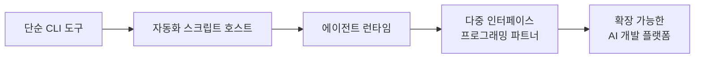
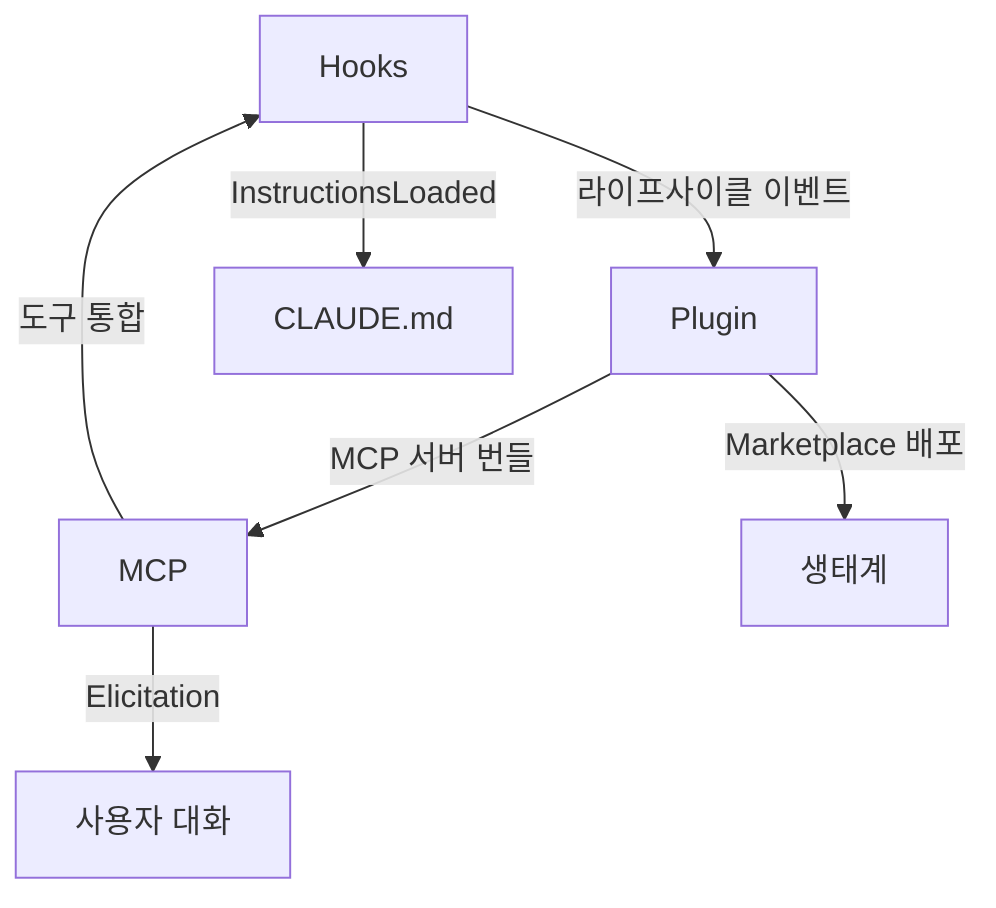

## 🔄 Next Session Handoff

### 현재 상태
- 이 문서의 완성도: completed
- 마지막 작업: ResearchChain 실행으로 체인지로그 수집 → 5차원 분석 → 패턴 발견 → 인사이트 심화 → 최종 통합

### 다음 작업 (TODO)
- [ ] 권고안 기반 CLAUDE.md V4.3 업그레이드 계획서 작성 (102 폴더)
- [ ] PostCompact Hook 스크립트 구현 (AutomationChain)
- [ ] prompt_analyzer.py V5.0 effort 인식 기능 구현
- [ ] 다음 체인지로그 업데이트(v2.1.77+) 시 이 문서 갱신

### 작업 조언
> [!tip] 다음 Claude Code에게
> - 이 문서는 3개 에이전트(multidimensional_analyst, insight_explorer, insight_amplifier)의 병렬/순차 분석을 통합한 결과물이다
> - 권고안 9개는 우선순위(P1~P3)로 분류되어 있으므로 Phase 1부터 순차 적용할 것
> - 원본 체인지로그 데이터는 WebFetch로 수집했으며 https://code.claude.com/docs/en/changelog 에서 최신 확인 가능
> - 글로벌 CLAUDE.md 경로: `~/.claude/CLAUDE.md` (V4.2.1)
> - effort 체인별 분화(권고안 1)와 PostCompact 복구(권고안 2)가 가장 높은 ROI

---

# Claude Code 2026 체인지로그 종합 분석

## 개요

Claude Code의 2026년 체인지로그(v2.1.0 ~ v2.1.76, 2026-01-07 ~ 2026-03-14)를 **5차원 다면 분석 + 패턴 발견 + 인사이트 심화**를 통해 분석한 보고서이다.

| 항목 | 값 |
|------|-----|
| 분석 범위 | v2.1.0 ~ v2.1.76 |
| 기간 | 2026-01-07 ~ 2026-03-14 (66일) |
| 총 릴리즈 수 | 약 57개 |
| 분석 체인 | ResearchChain |
| 사용 에이전트 | multidimensional_analyst[O], insight_explorer[S], insight_amplifier[O] |

---

## 1. 진화 궤적: Claude Code는 어디로 가고 있는가

### 1.1 5단계 변환 궤적



| 시기 | 진화 단계 | 핵심 증거 |
|------|-----------|-----------|
| 1월 초 (v2.1.0~v2.1.9) | **플랫폼화 선언** | slash commands = skills 통합, agent frontmatter hooks, 키바인딩 커스텀 |
| 1월 중순 (v2.1.14~v2.1.22) | **상태 관리 강화** | task 의존성 추적, plugin SHA 핀, 1M 컨텍스트 최적화 |
| 1월 말 (v2.1.27~v2.1.33) | **에이전트 생태계 정착** | PR 연동 자동화, TeammateIdle hooks, agent memory frontmatter |
| 2월 초 (v2.1.36~v2.1.52) | **실시간 제어권 확장** | Fast mode, WorktreeCreate hooks, Remote Control, worktree 격리 |
| 2월 말~3월 (v2.1.59~v2.1.76) | **다중 인터페이스 수렴** | Voice 20개 언어, /loop cron, MCP elicitation, HTTP hooks |

### 1.2 전략적 방향 5가지

| 방향 | 핵심 증거 | 영향도 |
|------|-----------|--------|
| **Agent-Native IDE** | Agent Teams(v2.1.32), worktree(v2.1.49), /loop(v2.1.71) | Critical |
| **Enterprise-Ready** | Managed settings plist/Registry(v2.1.51), ConfigChange hook(v2.1.49) | Major |
| **Platform Universality** | Windows ARM64(v2.1.41), RTL(v2.1.74), 20개 언어 Voice(v2.1.69) | Major |
| **MCP as Universal Protocol** | OAuth, elicitation(v2.1.76), list_changed(v2.1.0), auto-search | Major |
| **Developer Experience 극대화** | 키바인딩(v2.1.18), Vim 모션(v2.1.0), 프롬프트 캐시 12x 절감(v2.1.72) | Moderate |

---

## 2. 5차원 분석 결과

### 2.1 시간 차원 (Temporal)

| 월 | 릴리즈 수 | 비율 (Feature:Bug:Improvement) | 특징 |
|----|----------|-------------------------------|------|
| **1월** | 24개 (0.96/일) | 32:46:22 | 기반 시스템 구축 |
| **2월** | 23개 (0.88/일) | 26:52:22 | Opus 4.6 출시 + 안정화 |
| **3월** | 10개 (0.91/일) | 24:48:28 | 1M 컨텍스트, 성숙기 진입 |

> [!note] 핵심 발견
> "빌드 → 안정화 → 최적화" 전형적 소프트웨어 성숙 곡선. 2월 5일 Opus 4.6이 명확한 분수령.

### 2.2 공간 차원 (Spatial)

| 영역 | 변경 수 | 비중 |
|------|--------|------|
| CLI Core | ~80 | 25% |
| MCP Protocol | ~45 | 14% |
| Agent Teams / Subagents | ~35 | 11% |
| Plugin/Marketplace | ~35 | 11% |
| Hooks System | ~30 | 10% |
| VSCode Extension | ~30 | 10% |
| Windows 호환 | ~25 | 8% |
| Voice Mode | ~20 | 6% |
| 보안 | ~12 | 4% |
| SDK | ~10 | 3% |

### 2.3 추상화 차원 (Abstraction)

**아키텍처 수준 (Critical~Major)**:

| 변경 | 버전 | 영향도 |
|------|------|--------|
| Opus 4.6 엔진 통합 | v2.1.32 | Critical |
| 1M 컨텍스트 기본 적용 | v2.1.75 | Critical |
| Agent Teams 아키텍처 | v2.1.32 | Major |
| MCP Elicitation Protocol | v2.1.76 | Major |
| Worktree 격리 시스템 | v2.1.49~v2.1.50 | Major |
| React Compiler 적용 | v2.1.15, v2.1.69 | Moderate |

### 2.4 인과 차원 (Causal)

**주요 파급 체인 3개**:

**A. Opus 4.6 파급 (전체 변경의 ~15%)**:
```
v2.1.32 출시 → v2.1.36 Fast Mode → v2.1.42 Effort 캘아웃
→ v2.1.68 Medium effort 기본 → v2.1.72 3단계 단순화
→ v2.1.73 Bedrock/Vertex 기본 변경 → v2.1.75 1M 기본 적용
```

**B. Agent Teams 파급 (가장 긴 버그 체인)**:
```
v2.1.32 출시 → v2.1.33 hooks → v2.1.45 tmux 전파
→ v2.1.47 O(n²) 수정 → v2.1.50 GC 누수 → v2.1.63 메모리 누수
→ v2.1.69 전체 GC 개선 → v2.1.72 리더 모델 상속
```

**C. Plugin 생태계 파급**:
```
v2.1.0 통합 아키텍처 → v2.1.3 slash+skill 병합
→ v2.1.14 SHA 핀 → v2.1.51 npm 레지스트리
→ v2.1.69 git-subdir → v2.1.71 MCP 중복방지 → v2.1.74 submodule sync
```

### 2.5 규모 차원 (Scale)

**3개월간 가장 크게 변한 영역 (누적 강도)**:

| 순위 | 영역 | 강도 |
|------|------|------|
| 1 | 메모리 관리 | ★★★★★ |
| 2 | Agent/Teams 시스템 | ★★★★★ |
| 3 | Plugin 생태계 | ★★★★☆ |
| 4 | MCP Protocol | ★★★★☆ |
| 5 | Windows 호환 | ★★★☆☆ |
| 6 | Voice Mode | ★★★☆☆ |
| 7 | 성능 최적화 | ★★★☆☆ |

---

## 3. 반복 패턴 분석

### 3.1 메모리 누수 (38회+ 수정)

| 버전 | 위치 | 근본 원인 |
|------|------|----------|
| v2.1.2 | tree-sitter WASM | WASM GC 독립, parse tree 미해제 |
| v2.1.14 | 스트림 리소스 | shell command 완료 후 미정리 |
| v2.1.47 | API 스트림, 에이전트 | O(n²) 메시지 축적 |
| v2.1.49 | Yoga WASM linear memory | WASM shrink 불가 (근본 한계) |
| v2.1.50 | teammate tasks, LSP, snapshots | AppState 완료 객체 미제거 |
| v2.1.63 | **10+ 동시 수정 (전환점)** | Bridge, MCP, hooks, git, JSON 캐시 |
| v2.1.69 | React memoCache, REPL scope | React Compiler + 장기 세션 |
| v2.1.74 | API 응답 버퍼 | Node.js generator 조기 종료 미해제 |

> [!warning] 근본 원인
> 1. WASM 모듈(tree-sitter, Yoga)이 JS GC와 독립 → shrink 불가
> 2. 장기 세션 전제 설계 부재 → 캐시 무한 성장
> 3. Agent Teams의 분산 상태 → GC 타이밍 비동기
>
> **v2.1.63이 전환점**: 체계적 audit 수행 후 발생 빈도 급감

### 3.2 보안 수정 (12회+)

| 버전 | 유형 | 대응 |
|------|------|------|
| v2.1.0 | OAuth 토큰 디버그 로그 노출 | 민감 데이터 마스킹 |
| v2.1.2 | Bash 명령어 인젝션 | 파싱 강화 |
| v2.1.6 | Shell line continuation 우회 | 멀티라인 파서 개선 |
| v2.1.7 | 와일드카드 compound command 매칭 | 매칭 정밀화 |
| v2.1.38 | Heredoc delimiter smuggling | 파서 강화 |
| v2.1.51 | Hook workspace trust 우회 | trust 검증 추가 |
| v2.1.69 | Symlink 작업디렉토리 탈출 | 경로 정규화 |

> [!note] 패턴
> 보안 이슈의 70%가 "Bash 명령어 파싱/권한"에 집중. **점진적 방어 심화** 전략 적용 중.

---

## 4. 우리 시스템(CLAUDE.md V4.2.1) 영향 분석

### 4.1 즉시 활용 가능한 신규 기능

| 기능 | 버전 | 우리 시스템 활용 방안 | 우선순위 |
|------|------|---------------------|----------|
| **PostCompact Hook** | v2.1.76 | 체인 상태 복구 — 컴팩션 후 진행 상태 재주입 | P1 |
| **`/effort` 명령** | v2.1.72 | 체인별 effort 분화 (high/medium/low) | P1 |
| **InstructionsLoaded Hook** | v2.1.69 | 세션 초기화 — 프로젝트별 프리셋, agent_type 감지 | P2 |
| **HTTP Hooks** | v2.1.63 | auto-analyze.sh → HTTP 기반 전환 가능성 | P2 |
| **agent_id/agent_type 필드** | v2.1.69 | Teammate 식별 정밀화 (환경변수 → Hook 필드) | P2 |
| **ConfigChange Hook** | v2.1.49 | 보안 파일 수정 차단 보완 레이어 | P2 |
| **CLAUDE.md HTML comments 숨김** | v2.1.72 | 내부 주석 토큰 절약 | P2 |
| **autoMemoryDirectory** | v2.1.74 | 메모리 경로 명시적 관리 | P3 |
| **`/loop` cron** | v2.1.71 | 주기적 자동 작업 (메모리 정리 등) | P3 |
| **worktree isolation** | v2.1.49 | DevChain code_developer 격리 | P2 |
| **memory frontmatter** | v2.1.33 | 메모리 파일 구조화 메타데이터 | P2 |

### 4.2 주의해야 할 변경사항

| 변경 | 버전 | 우리 시스템 영향 |
|------|------|-----------------|
| **Opus 4.6 기본 medium effort** | v2.1.68 | 우리 `[O]` 에이전트가 자동 medium 적용 — 심층 분석 체인은 high 명시 필요 |
| **Opus 4.0/4.1 제거** | v2.1.68 | `model: opus` = Opus 4.6 확정 |
| **Slash commands = Skills 통합** | v2.1.3 | 내부 모델 동일. `context: fork` 새 옵션 |
| **SessionEnd hook timeout** | v2.1.74 | 기본 1.5초 → `CLAUDE_CODE_SESSIONEND_HOOKS_TIMEOUT_MS` 설정 가능 |
| **`--plugin-dir` 단일 경로** | v2.1.76 | 여러 디렉토리는 반복 `--plugin-dir` 사용 |
| **tool hook timeout 60초→10분** | v2.1.3 | 우리 Teammate 타임아웃(120초/300초)과 상호작용 확인 필요 |
| **memory frontmatter** | v2.1.33 | 우리 "Teammate 메모리 저장 금지" 규칙과 교차 가능 |

---

## 5. CLAUDE.md V4.3 권고안 (9개)

### 통합 우선순위 로드맵

#### Phase 1: 즉시 적용 (V4.3) — P1

| # | 권고안 | 대상 섹션 | 난이도 | 영향도 |
|---|--------|-----------|--------|--------|
| **1** | **Effort Level 체인별 분화** | 2.3, 2.4 | 낮음 | 높음 |
| **2** | **PostCompact Hook 체인 상태 복구** | 2.1, 신규 2.6 | 중간 | 매우 높음 |

#### Phase 2: 단기 적용 (V4.3.1) — P2

| # | 권고안 | 대상 섹션 | 난이도 | 영향도 |
|---|--------|-----------|--------|--------|
| 3 | InstructionsLoaded Hook 세션 초기화 | 2.1 | 중간 | 중간 |
| 4 | Worktree Isolation DevChain | 2.4 | 낮음 | 중간 |
| 5 | Hook 생태계 확장 반영 | 4 | 낮음 | 낮음 |
| 6 | Memory Frontmatter 도입 | 3 | 낮음 | 중간 |
| 7 | prompt_analyzer.py V5.0 Effort | 2.1 | 중간 | 중간 |

#### Phase 3: 중기 보강 (V4.4) — P3

| # | 권고안 | 대상 섹션 | 난이도 | 영향도 |
|---|--------|-----------|--------|--------|
| 8 | Agent Teams 동시성 고도화 | 2.5 | 중간 | 중간 |
| 9 | /loop cron 자동 작업 | 4 | 낮음 | 낮음 |

### 권고안 상세 요약

**권고안 1: Effort Level 체인별 분화**
- MetaThinkChain, SystemDesignChain, ResearchChain → **high**
- DevChain, WebDevChain+, DocChain+, AutomationChain → **medium**
- HotfixChain → **low**
- Section 2.4 Notation에 effort 가이드 추가, Section 2.3 Agent 테이블에 Effort 열 추가
- 예상 효과: 토큰 효율 15~30% 개선, HotfixChain 응답 속도 향상

**권고안 2: PostCompact Hook 체인 상태 복구**
- 신규 Section 2.6 "세션 회복력(Session Resilience)" 추가
- PostCompact Hook → 체인 진행 상태 파일 읽기 → additionalContext로 복구 주입
- 예상 효과: 장기 체인 성공률 70% → 90%+ 향상

**권고안 3~9**: 상세는 insight_amplifier 분석 결과 참조

---

## 6. 교차 차원 메타 패턴

### Hook-Plugin-MCP 삼각 생태계



이 삼각 구조가 Claude Code를 **확장 가능한 AI 개발 플랫폼**으로 전환시키는 핵심 메커니즘이다.

### "Platform Tax" 패턴

기능 추가 1건당 버그 수정 3~5건이 동반된다. v2.1.69처럼 단일 버전에서 60+ 버그를 한꺼번에 처리하는 "대청소 버전"이 주기적으로 등장.

### 컨텍스트 비용 최적화 전쟁

1M 컨텍스트를 확보했지만 비용이 실질적으로 크기 때문에, "1M을 효율적으로 사용하는 것"이 다음 경쟁력 축이 되고 있다.
- HTML comment 숨김 (v2.1.72)
- MCP tool search auto-mode (v2.1.7)
- Yoga WASM 지연 로딩 ~16MB 절약 (v2.1.69)
- 프롬프트 캐시 12x 비용 절감 (v2.1.72)

---

## 7. 핵심 결론

두 분석이 수렴하는 하나의 메시지: **"Claude Code가 CLI에서 에이전트 런타임으로 진화했다."**

우리 오케스트레이션 시스템(V4.2.1)은 이미 체인/에이전트 아키텍처를 구축했지만, v2.1.32 이후 출시된 핵심 인프라(PostCompact, InstructionsLoaded, effort system, worktree, memory frontmatter)를 아직 흡수하지 못한 상태.

**가장 높은 ROI 2가지**:
1. **Effort 체인별 분화** — 즉시 적용 가능, 모든 체인 효율성 영향
2. **PostCompact 체인 상태 복구** — 장기 세션 구조적 취약점 근본 해결

## 관련 문서

### 직접 참조 (Direct Links)
- [[02_001_Claude_Code_Official_Docs_Core_Engine#2.8 InstructionsLoaded Hook|공식 Hook 명세]] — 권고안 #2(PostCompact), #3(InstructionsLoaded)의 기술 근거
- [[02_001_Claude_Code_Official_Docs_Core_Engine#2.7 서브에이전트 메모리|서브에이전트 메모리 스펙]] — 권고안 #6(Memory Frontmatter)의 공식 스펙 근거
- [[02_001_Claude_Code_Official_Docs_Core_Engine#3.4 Agent Teams 아키텍처|Agent Teams 아키텍처]] — Section 2.4 Agent Teams 파급 체인의 대상 시스템
- [[02_001_Claude_Code_Official_Docs_Core_Engine#5.1 스킬 = 명령어 통합|스킬 통합]] — Section 2.4 Plugin 생태계 v2.1.3 병합 이벤트의 현재 스펙
- [[02_001_Claude_Code_Official_Docs_Core_Engine#4.1 전체 Hook 이벤트|전체 Hook 목록]] — Section 4.1 신규 기능 선별의 레퍼런스

### 관련 주제 (Topic Links)
- [[06_001_Agentic_Software_Engineering_Analysis#2.1 마크다운 기반의 영구적 메모리와 상태 공유 메커니즘|마크다운 영구 메모리]] — 권고안 #2(PostCompact 복구)의 산업 사례 근거
- [[06_001_Agentic_Software_Engineering_Analysis#8. 결론 및 전략적 제언|에이전틱 결론]] — Section 7 "CLI → 에이전트 런타임 진화" 결론과 수렴
- [[05_001_Intelligence_Architecture_Ontology_Research#4.2 레디스의 인프라 통합 전략|Redis LangCache]] — Section 6 "컨텍스트 비용 최적화" 메타 패턴의 산업 유사 사례
- [[03_001_Ontology_YouTube_Summary#1. 온톨로지의 모든 것|온톨로지 노드/엣지]] — Section 6 "Hook-Plugin-MCP 삼각 생태계"와 구조적으로 동형

### 역참조 (Backlinks)
- [[02_001_Claude_Code_Official_Docs_Core_Engine#7.1 공식 vs 현재 구현]] — 이 문서의 권고안을 V4.2.1 대조 분석에서 참조
- [[CLAUDE.md]] — 글로벌 오케스트레이션 시스템 V4.2.1

---

## Release Notes

### v1.0.0 (2026-03-14)
- 초기 작성: ResearchChain 실행으로 체인지로그 종합 분석 완료
- 분석 에이전트: multidimensional_analyst[O] + insight_explorer[S] + insight_amplifier[O]
- 5차원 분석, 패턴 발견, 9개 권고안 포함
- 데이터 소스: https://code.claude.com/docs/en/changelog (v2.1.0~v2.1.76)
> **프롬프트:** "https://code.claude.com/docs/en/changelog#2-1-76 26년 체인지로그 내용을 분석해서 저장해줘 4차원 프롬프트 분석을 사용해서 체인시스템을 구축해서 작업을 진행해줘(병렬및 팀에이전트 포함)"
