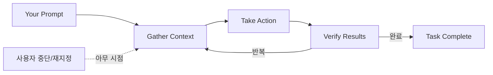

## 🔄 Next Session Handoff

### 현재 상태
- 이 문서의 완성도: completed
- 마지막 작업: 공식 문서 8종 수집 → multidimensional_analyst[O] 통합 정리

### 다음 작업 (TODO)
- [ ] CLAUDE.md V5.0 분리 리팩토링 (393줄 → 200줄 + rules/ 분리)
- [ ] 에이전트 14개 공식 `~/.claude/agents/` 파일 마이그레이션
- [ ] 커스텀 명령 16개를 `.claude/skills/` 구조로 전환
- [ ] Auto Memory + 수동 메모리 하이브리드 설계
- [ ] prompt/agent Hook 타입 도입 검토

### 작업 조언
> [!tip] 다음 Claude Code에게
> - 이 문서는 공식 문서 8종의 **핵심 엔진** 부분만 추출한 것이다 (플랫폼/배포/설정 제외)
> - Section 7 "V4.2.1 대조 분석"이 가장 실행 가능한 인사이트를 담고 있다
> - CLAUDE.md 200줄 제한은 공식 권장사항이므로 V5.0에서 반드시 달성할 것
> - 메모리 시스템 차이(7.2)는 아키텍처적 결정이 필요한 가장 중요한 이슈
> - [[01_001_Claude_Code_2026_Changelog_Analysis]]의 권고안 9개와 교차 참조할 것
> - 원본 문서 URL이 각 섹션 출처에 기재되어 있으므로 최신 내용은 직접 WebFetch 가능

---

# Claude Code 핵심 엔진 통합 레퍼런스

> 공식 문서 8종을 분석하여 "핵심 엔진" 중심으로 정리한 통합 레퍼런스.

| 항목 | 값 |
|------|-----|
| 분석 대상 | 공식 문서 8종 (code.claude.com/docs) |
| 분석 날짜 | 2026-03-14 |
| 분석 체인 | ResearchChain |
| 사용 에이전트 | multidimensional_analyst[O] |
| 제외 영역 | 플랫폼 통합, 배포 관리, 설정 상세, 참고 리소스 |

---

## 1. 핵심 엔진 아키텍처

> 출처: [How Claude Code Works](https://code.claude.com/docs/en/how-claude-code-works)

### 1.1 Agentic Loop



핵심 속성:
- **자가 교정**: 각 도구 사용이 다음 단계의 정보를 제공
- **사용자 개입 가능**: 언제든 중단하고 방향 재설정 가능
- **적응형**: 질문은 수집만, 버그 수정은 전 단계 반복

### 1.2 도구 카테고리

| 카테고리 | 기능 |
|---------|------|
| **File operations** | Read, Edit, Write, Create, Rename |
| **Search** | Glob(파일 패턴), Grep(내용 정규식), 코드베이스 탐색 |
| **Execution** | Bash(셸 명령), 서버 실행, 테스트, Git |
| **Web** | WebSearch, WebFetch, 오류 조회 |
| **Code intelligence** | 타입 에러/경고, 정의로 이동, 참조 찾기 (플러그인 필요) |
| **Orchestration** | Agent(서브에이전트), AskUserQuestion, Skill |

### 1.3 Context Window 관리

**자동 컴팩션 프로세스**:
1. 오래된 도구 출력 먼저 제거
2. 필요시 대화 요약
3. 요청과 핵심 코드 스니펫 보존
4. 초기 대화 지시사항은 유실될 수 있음

> [!important] CLAUDE.md는 컴팩션 후 디스크에서 재읽기하여 완전히 재주입된다
> 대화 중 지시만 유실 가능. 영구 규칙은 반드시 CLAUDE.md에 기재.

**관리 명령**:
- `/context` — 공간 사용량 확인
- `/compact [focus]` — 수동 컴팩션 (초점 지정 가능)
- `/mcp` — MCP 서버별 컨텍스트 비용 확인

### 1.4 모델과 세션

| 모델 | 특성 |
|------|------|
| **Sonnet** | 대부분 코딩 작업, 빠름 (기본) |
| **Opus** | 강한 추론, 복잡한 아키텍처 결정 |
| **Haiku** | 빠르고 저렴, Explore 서브에이전트 기본 |

| 세션 기능 | 명령 |
|----------|------|
| 최근 세션 계속 | `claude --continue` |
| 세션 선택/이름 | `claude --resume [name]` |
| 세션 분기 | `--fork-session` |
| PR 기반 재개 | `--from-pr 123` |

**체크포인트**: 모든 파일 편집 전 스냅샷. `Esc` 두 번으로 되감기. 원격(DB/API/배포) 작업은 체크포인트 불가.

---

## 2. 메모리 시스템 심층 분석

> 출처: [Memory](https://code.claude.com/docs/en/memory)

### 2.1 두 가지 메모리 시스템

| | CLAUDE.md | Auto Memory |
|---|---|---|
| **작성자** | 사용자 | Claude 자체 |
| **내용** | 지시사항, 규칙 | 학습 내용, 패턴 |
| **범위** | Project / User / Org | Working tree별 |
| **로딩** | 매 세션 **전체** 로딩 | MEMORY.md **첫 200줄만** |
| **용도** | 코딩 표준, 워크플로우, 아키텍처 | 빌드 명령, 디버깅 인사이트, 선호도 |

### 2.2 CLAUDE.md 계층 구조

| 범위 | 위치 | 공유 대상 |
|------|------|----------|
| **Managed policy** | `/Library/Application Support/ClaudeCode/CLAUDE.md` (macOS) | 조직 전체 |
| **Project** | `./CLAUDE.md` 또는 `./.claude/CLAUDE.md` | 팀 (소스 컨트롤) |
| **User** | `~/.claude/CLAUDE.md` | 본인만 (전 프로젝트) |

> 작업 디렉토리에서 **위로 올라가며** 모든 CLAUDE.md 로딩. 하위 디렉토리는 해당 파일 접근 시 on-demand 로딩.

**효과적 작성 가이드**:
- **200줄 이하** 권장 (초과 시 컨텍스트 소비 증가, 준수율 하락)
- 마크다운 헤더/불릿으로 구조화
- 구체적이고 검증 가능한 지시
- 상충 규칙 없도록 정기 리뷰

### 2.3 .claude/rules/ 조건부 규칙

```
.claude/
  CLAUDE.md              # 메인 (무조건 로딩)
  rules/
    code-style.md        # 무조건 로딩 (paths 없음)
    api-design.md        # 조건부 (paths 있음)
```

**paths frontmatter**:
```yaml
---
paths:
  - "src/api/**/*.ts"
  - "src/**/*.{ts,tsx}"
---
```

> paths 없는 규칙은 무조건 로딩. path-scoped 규칙은 매칭 파일 접근 시만 트리거.

심링크 지원. User-level rules: `~/.claude/rules/`

### 2.4 Auto Memory 동작 원리

**저장 위치**: `~/.claude/projects/<project>/memory/`
- `<project>`는 git repo 기반 (같은 repo의 모든 worktree가 공유)

**구조**:
```
~/.claude/projects/<project>/memory/
  MEMORY.md              # 인덱스 (매 세션 첫 200줄 로딩)
  debugging.md           # 토픽 파일 (on-demand)
  api-conventions.md     # 토픽 파일
```

**핵심 메커니즘**:
1. MEMORY.md **첫 200줄만** 세션 시작 시 로딩
2. Claude가 상세 내용을 별도 토픽 파일로 이동시켜 인덱스를 간결하게 유지
3. 토픽 파일은 필요할 때 파일 도구로 on-demand 접근
4. 머신 로컬 (기기 간 공유 안 됨)

**설정**:
- `autoMemoryEnabled: false` / `CLAUDE_CODE_DISABLE_AUTO_MEMORY=1`
- `autoMemoryDirectory: "~/custom-dir"` (user/local/policy만, project 설정 불가)

### 2.5 Import 시스템

```markdown
See @README for overview and @package.json for npm commands.
@~/.claude/my-project-instructions.md   # 개인 파일
```

- 상대 경로: 포함하는 파일 기준
- 재귀 임포트: **최대 5단계**
- 첫 외부 임포트 시 승인 다이얼로그

### 2.6 대규모 팀 관리

`claudeMdExcludes` (settings):
```json
{ "claudeMdExcludes": ["**/monorepo/CLAUDE.md", "/path/other-team/.claude/rules/**"] }
```

> Managed policy CLAUDE.md는 제외 불가

### 2.7 서브에이전트 메모리

`memory` frontmatter 필드:

| 범위 | 위치 |
|------|------|
| `user` | `~/.claude/agent-memory/<name>/` |
| `project` | `.claude/agent-memory/<name>/` |
| `local` | `.claude/agent-memory-local/<name>/` |

활성화 시: 시스템 프롬프트에 읽기/쓰기 지시 포함, MEMORY.md 첫 200줄 주입, Read/Write/Edit 자동 활성화

### 2.8 InstructionsLoaded Hook

```json
{
  "file_path": "/path/to/file",
  "memory_type": "User|Project|Local|Managed",
  "load_reason": "session_start|nested_traversal|path_glob_match|include"
}
```

> 감사 전용 (차단 불가). 어떤 지시 파일이 언제, 왜 로딩되었는지 추적용.

### 2.9 트러블슈팅

| 문제 | 해결 |
|------|------|
| CLAUDE.md 안 따름 | `/memory`로 로딩 확인, 더 구체적 지시, 상충 규칙 점검 |
| Auto Memory 내용 불명 | `/memory` → auto memory 폴더 브라우징 |
| CLAUDE.md 너무 큼 | 200줄 이하, @import 또는 rules/ 분리 |
| /compact 후 지시 유실 | CLAUDE.md는 완전 재주입됨; 대화 중 지시만 유실 가능 |

---

## 3. 병렬 시스템 심층 분석

> 출처: [Agent Teams](https://code.claude.com/docs/ko/agent-teams), [Sub-agents](https://code.claude.com/docs/en/sub-agents)

### 3.1 Subagents vs Agent Teams

| | Subagents | Agent Teams |
|---|---|---|
| **컨텍스트** | 자체 윈도우; 결과 반환 | 자체 윈도우; 완전 독립 |
| **통신** | 메인에게만 보고 | 팀원 간 직접 메시지 |
| **조율** | 메인이 관리 | 공유 작업 목록 + 자체 조율 |
| **최적 용도** | 결과만 중요한 집중 작업 | 논의/협업 필요한 복잡 작업 |
| **토큰 비용** | 낮음 | 높음 (각 팀원 별도 인스턴스) |
| **세션 재개** | 가능 (agent ID) | 불가 (in-process) |
| **중첩** | 불가 | 불가 |

### 3.2 내장 서브에이전트

| 에이전트 | 모델 | 도구 | 용도 |
|---------|------|------|------|
| **Explore** | Haiku | Read-only | 코드 검색, 탐색 (quick/medium/thorough) |
| **Plan** | 상속 | Read-only | Plan mode 코드베이스 조사 |
| **general-purpose** | 상속 | 전체 | 복잡 다단계 작업 |

### 3.3 커스텀 서브에이전트 전체 필드

| 필드 | 필수 | 설명 |
|------|------|------|
| `name` | Yes | 소문자+하이픈 식별자 |
| `description` | Yes | Claude 위임 결정에 사용 |
| `tools` | No | 허용 도구 (생략시 전체 상속) |
| `disallowedTools` | No | 차단 도구 |
| `model` | No | sonnet/opus/haiku/inherit/풀ID |
| `permissionMode` | No | default/acceptEdits/dontAsk/bypassPermissions/plan |
| `maxTurns` | No | 최대 에이전틱 턴 수 |
| `skills` | No | 시작 시 주입할 스킬 |
| `mcpServers` | No | MCP 서버 (인라인 또는 참조) |
| `hooks` | No | 전용 생명주기 훅 |
| `memory` | No | user/project/local |
| `background` | No | 백그라운드 실행 (기본 false) |
| `isolation` | No | worktree (git worktree 격리) |

**위치 우선순위**: `--agents` CLI(1) > `.claude/agents/`(2) > `~/.claude/agents/`(3) > Plugin(4)

### 3.4 Agent Teams 아키텍처

| 구성 요소 | 역할 |
|----------|------|
| **Team Leader** | 메인 세션. 팀 생성, 작업 조율 |
| **Teammates** | 독립 Claude Code 인스턴스 |
| **Task List** | 공유 작업 (대기/진행/완료 + 종속성) |
| **Mailbox** | 에이전트 간 메시징 (message, broadcast) |

**표시 모드**: in-process (Shift+Down 순환) / split pane (tmux/iTerm2) / auto

**작업 할당**: 리더 할당 or 자체 요청 (파일 잠금으로 경합 방지)

**계획 승인**: 팀원이 Plan mode → 계획 완성 → 리더 승인/거부 → 구현 시작

### 3.5 Agent Teams 제한사항

- In-process 팀원 세션 재개 불가
- 세션당 1팀, 중첩 불가, 리더 고정
- 생성 시 권한 일괄 적용
- Split pane은 VS Code Terminal/Windows Terminal/Ghostty 미지원
- 종료가 느릴 수 있음

---

## 4. Hook 시스템 심층 분석

> 출처: [Hooks](https://code.claude.com/docs/en/hooks)

### 4.1 전체 Hook 이벤트

| 이벤트 | 발생 시점 | 제어 가능 | 주요 용도 |
|--------|----------|----------|----------|
| `SessionStart` | 세션 시작/재개 | No | 환경변수 설정, 초기화 |
| `UserPromptSubmit` | 프롬프트 제출 후 | **Yes** | 프롬프트 분석/차단/컨텍스트 주입 |
| `PreToolUse` | 도구 실행 전 | **Yes** | 도구 허용/차단/입력 수정 |
| `PermissionRequest` | 권한 다이얼로그 시 | **Yes** | 자동 허용/거부 |
| `PostToolUse` | 도구 성공 후 | **Yes** | 포매팅, 검증 |
| `Stop` | Claude 응답 완료 | **Yes** | 계속 작업하게 |
| `PostCompact` | 컴팩션 완료 후 | No | 상태 복구 |
| `InstructionsLoaded` | CLAUDE.md 로딩 시 | No | 감사 로깅 |
| `TeammateIdle` | 팀원 유휴 직전 | **Yes** | 피드백 전달 |
| `TaskCompleted` | 작업 완료 표시 시 | **Yes** | 완료 방지 |
| `ConfigChange` | 설정 변경 시 | **Yes** | 차단 (policy 제외) |
| `Elicitation` | MCP 입력 요청 | **Yes** | 자동 응답/거부 |

### 4.2 Hook 타입 4가지

| 타입 | 설명 |
|------|------|
| **command** | 셸 명령 실행 (JSON stdin) |
| **http** | HTTP POST 요청 |
| **prompt** | LLM 단일 턴 평가 |
| **agent** | 서브에이전트로 검증 (도구 접근 가능) |

### 4.3 Exit Code 2 동작

| 이벤트 | 효과 |
|--------|------|
| PreToolUse, UserPromptSubmit | **차단** |
| Stop, SubagentStop, TeammateIdle | **정지 방지** (계속 작업) |
| TaskCompleted | **완료 방지** |
| ConfigChange | **변경 차단** |
| PostToolUse, Notification 등 | stderr만 표시 |

---

## 5. 스킬 시스템

> 출처: [Skills](https://code.claude.com/docs/en/skills)

### 5.1 스킬 = 명령어 통합

> "Custom commands have been merged into skills." `.claude/commands/`는 계속 작동하나 동일 이름이면 skill 우선.

### 5.2 핵심 Frontmatter 필드

| 필드 | 설명 |
|------|------|
| `name` | 표시 이름 (소문자+하이픈) |
| `description` | Claude 자동 호출 결정에 사용 |
| `disable-model-invocation` | `true`: 수동 호출만 |
| `user-invocable` | `false`: / 메뉴 숨김 |
| `allowed-tools` | 권한 없이 사용 가능한 도구 |
| `context` | `fork`: forked 서브에이전트에서 실행 |
| `agent` | context:fork 시 에이전트 타입 |

### 5.3 번들 스킬

| 스킬 | 기능 |
|------|------|
| `/batch` | 대규모 병렬 변경 (5~30개 워커, worktree별 PR) |
| `/claude-api` | Claude API 레퍼런스 로딩 |
| `/debug` | 세션 디버그 로그 분석 |
| `/loop` | 프롬프트 반복 실행 |
| `/simplify` | 최근 변경 코드 품질 리뷰 (3개 병렬 에이전트) |

### 5.4 동적 컨텍스트 주입

```yaml
- PR diff: !`gh pr diff`        # 셸 명령 먼저 실행, 출력이 대체
```

변수: `$ARGUMENTS`, `$ARGUMENTS[N]`, `$N`, `${CLAUDE_SESSION_ID}`, `${CLAUDE_SKILL_DIR}`

---

## 6. 워크플로우 패턴

> 출처: [Common Workflows](https://code.claude.com/docs/ko/common-workflows)

### 6.1 핵심 패턴 요약

| 패턴 | 접근 방식 |
|------|----------|
| **코드베이스 탐색** | 광범위 질문 → 특정 영역 → 실행 흐름 추적 |
| **버그 수정** | 오류 공유 → 수정 권장 → 적용 → 검증 |
| **Plan Mode** | `Shift+Tab` 두 번 / `--permission-mode plan` |
| **테스트 작성** | 미테스트 식별 → 스캐폴딩 → 엣지 케이스 → 실행 |
| **PR 생성** | `create a pr` → 자동 연결 → `--from-pr` 재개 |

### 6.2 병렬 세션 (Git Worktree)

```bash
claude --worktree feature-auth     # .claude/worktrees/feature-auth/
claude --worktree                   # 랜덤 이름
```

서브에이전트: `isolation: worktree` frontmatter

### 6.3 확장된 사고

| 설정 | 방법 |
|------|------|
| 노력 수준 | `/model` 또는 `CLAUDE_CODE_EFFORT_LEVEL` (low/medium/high) |
| ultrathink | 프롬프트에 "ultrathink" 포함 (해당 턴만 high) |
| 토글 | `Option+T` / `Alt+T` |
| 토큰 제한 | `MAX_THINKING_TOKENS=10000` |

> Opus 4.6: 적응형 추론 (effort에 따라 동적 할당)

### 6.4 Unix 파이프라인

```bash
cat build-error.txt | claude -p 'explain root cause' > output.txt
--output-format text|json|stream-json
```

---

## 7. V4.2.1 대조 분석

### 7.1 공식 vs 현재 구현

| 영역 | 공식 권장 | V4.2.1 | 평가 |
|------|----------|--------|------|
| **CLAUDE.md 크기** | 200줄 이하 | ~393줄 | **초과** — rules/ 분리 필요 |
| **규칙 분리** | `.claude/rules/` | 단일 파일 | **개선 기회** |
| **스킬** | `.claude/skills/` SKILL.md | `/commands/` | **마이그레이션 권장** |
| **서브에이전트** | `.claude/agents/` frontmatter | CLAUDE.md 내 테이블 | **마이그레이션 기회** |
| **Hook 타입** | command/http/prompt/agent | command만 | **prompt/agent 도입 가능** |
| **Agent Teams** | 3~5명, 자연어 조율 | 자체 Resilience Protocol | **선행적** |

### 7.2 메모리 시스템: 가장 큰 차이

| | 공식 Auto Memory | 우리 수동 시스템 |
|---|---|---|
| **위치** | `~/.claude/projects/<project>/memory/` | `~/.claude/memory/` |
| **격리** | git repo별 자동 분리 | 단일 디렉토리 |
| **저장 판단** | Claude 자율 | 규칙 기반 강제 |
| **파일명** | Claude 결정 | `YYMM_SEQ_keyword.md` |
| **에이전트** | `memory` frontmatter | "Lead만 저장" 규칙 |

> [!warning] 핵심 차이
> 공식: **프로젝트별 자동 격리** + **Claude 자율 판단**
> 우리: **단일 디렉토리** + **규칙 기반 강제 저장**
> 하이브리드 설계로 양쪽 장점 통합 가능

### 7.3 즉시 적용 가능한 개선

1. **CLAUDE.md 분리**: 체인 정의, 에이전트 매핑, 메모리 프로토콜을 `.claude/rules/`로
2. **에이전트 마이그레이션**: 14개 → `~/.claude/agents/` 공식 파일
3. **commands → skills**: 16개 커스텀 명령 → `.claude/skills/`
4. **Auto Memory 병행**: 공식 auto memory + 수동 "의도적 기록" 병행
5. **Hook 고도화**: prompt/agent Hook 타입 도입

## 관련 문서

### 직접 참조 (Direct Links)
- [[01_001_Claude_Code_2026_Changelog_Analysis#5. CLAUDE.md V4.3 권고안|V4.3 권고안 9개]] — 이 문서의 공식 스펙을 근거로 도출된 권고안
- [[01_001_Claude_Code_2026_Changelog_Analysis#3.1 메모리 누수|메모리 누수 38회 패턴]] — Section 2.4 Auto Memory 경량화 설계 이유의 반증
- [[01_001_Claude_Code_2026_Changelog_Analysis#2.4 인과 차원|Agent Teams 파급 체인]] — Section 3.4 Agent Teams 아키텍처가 겪은 진화 과정

### 관련 주제 (Topic Links)
- [[06_001_Agentic_Software_Engineering_Analysis#4.2 계층화된 아키텍처|4계층 아키텍처]] — Section 2.1(CLAUDE.md=Layer1), Section 5(Skills=Layer2), Section 4(Hooks=Layer3), Section 3(Agents=Layer4)와 대응
- [[06_001_Agentic_Software_Engineering_Analysis#2.1 마크다운 기반의 영구적 메모리와 상태 공유 메커니즘|마크다운 영구 메모리]] — Section 1.3 컴팩션 후 지시 유실 문제의 실전적 해법
- [[05_001_Intelligence_Architecture_Ontology_Research#4.1 벡터 데이터베이스 vs. 그래프 메모리|벡터/그래프 하이브리드]] — Section 7.2 메모리 설계 갭에 대한 산업적 해법
- [[05_001_Intelligence_Architecture_Ontology_Research#1.2 데이터 정제 및 온톨로지 구축 파이프라인|온톨로지 파이프라인]] — Section 2.4 Auto Memory 패턴과 구조적 유사 (비정형→구조화→선택적 접근)
- [[04_001_Claude_Code_YouTube_Summary#2. 클로드 코드 리뷰 기능|코드 리뷰 에이전트 팀]] — Section 3.4 Agent Teams의 실전 활용 사례
- [[03_001_Ontology_YouTube_Summary#1. 온톨로지의 모든 것|온톨로지 노드/엣지]] — Section 2.4 토픽 파일 on-demand 접근과 그래프 구조 유사성

### 역참조 (Backlinks)
- [[01_001_Claude_Code_2026_Changelog_Analysis#4.1 즉시 활용 가능한 신규 기능]] — 이 문서의 Hook/스킬 스펙을 권고안 도출에 참조
- [[CLAUDE.md]] — 글로벌 오케스트레이션 시스템 V4.2.1

---

## Release Notes

### v1.0.0 (2026-03-14)
- 초기 작성: 공식 문서 8종 핵심 엔진 통합 레퍼런스
- 7개 섹션: 아키텍처, 메모리, 병렬시스템, Hook, 스킬, 워크플로우, V4.2.1 대조
- 분석 체인: ResearchChain (WebFetch[∥] → multidimensional_analyst[O] → Write[-])
> **프롬프트:** "클로드코드 공식 문서를 전체 읽고 내용을 숙지하고 정리해줘 신규파일로 만들어줘. 특히 메모리 시스템에 대해 자세히 고찰해서 정리해줘. 특히 병렬시스템에 대해 자세히 고찰해서 정리해줘. 특히 워크플로우에 대해 자세히 고찰해서 정리해줘. 플렛폼 및 통합, 배포 관리, 설정, 참고 리소스는 정리하지 않아도되. 난 핵심엔진이 중요해. 강조한 3개 이외에도 숙지하고 이를 정리해줘야해."
