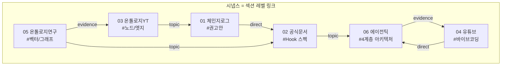
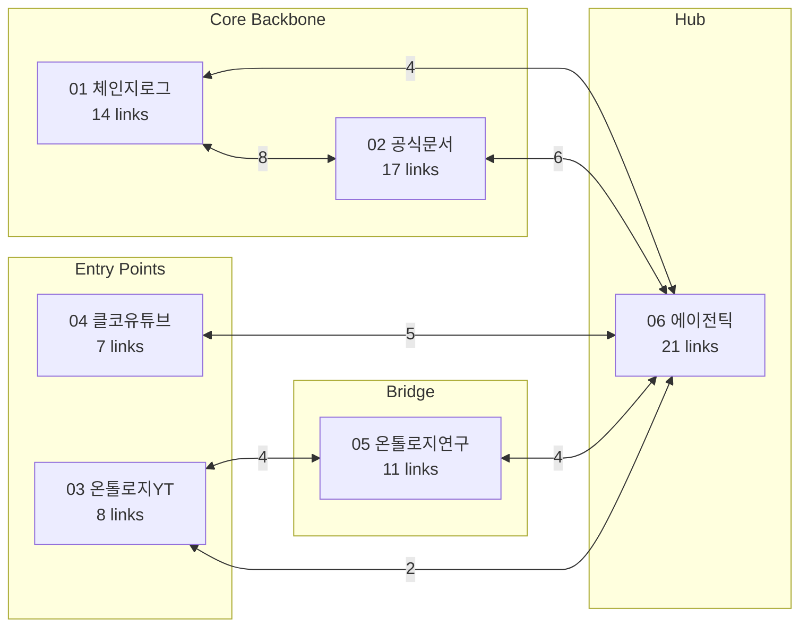

## 🔄 Next Session Handoff

### 현재 상태
- 이 문서의 완성도: completed
- 마지막 작업: 6개 문서 교차 참조 맵(44건) 기반 신경망 참조 심층 분석

### 다음 작업 (TODO)
- [ ] 신규 문서 생성 시 자동으로 Neural Map 생성하는 스킬/Hook 개발 검토
- [ ] 옵시디언 그래프 뷰에서 연결 밀도 시각적 검증
- [ ] 고립 문서(orphan) 자동 탐지 스크립트 구현

### 작업 조언
> [!tip] 다음 Claude Code에게
> - 이 문서는 102 폴더 6개 문서 간 44건의 교차 참조를 분석한 메타 문서이다
> - Section 3의 연결 밀도 매트릭스와 Section 4의 효율성 분석이 가장 실행 가능한 인사이트
> - 신규 문서 추가 시 이 문서의 교차 참조 맵을 갱신해야 함
> - [[02_001_Claude_Code_Official_Docs_Core_Engine#2.4 Auto Memory 동작 원리|Auto Memory]]의 토픽 파일 패턴이 신경망 참조의 이론적 유사체

---

# 신경망 참조 시스템 심층 분석

## 개요

이 문서는 102 폴더의 6개 문서 간 **신경망 참조(Neural Reference)** 시스템을 심층 분석한다. 옵시디언의 위키링크를 단순 문서 연결이 아닌, **특정 섹션까지 정밀 참조하는 신경 시냅스**로 활용하여 다음 Claude Code 세션의 탐색 효율을 극대화하는 것이 목표이다.

---

## 1. 신경망 참조란 무엇인가

### 1.1 전통적 문서 링크 vs 신경망 참조

| | 전통적 링크 | 신경망 참조 |
|---|---|---|
| **형태** | `[[파일명]]` | `[[파일명#섹션\|표시명]]` |
| **정밀도** | 문서 전체 | 특정 섹션/블록 |
| **방향** | 단방향 | 양방향 (Direct + Backlink) |
| **관계 설명** | 없거나 간단 | 관계 유형 + 1줄 설명 필수 |
| **탐색 비용** | 문서 전체 스캔 O(n) | 섹션 직접 점프 O(1) |
| **구조** | 플랫 리스트 | Neural Map (Direct/Backlink/Topic) |

### 1.2 인간 뇌 신경망과의 유사성



- **뉴런** = 문서의 개별 섹션
- **시냅스** = `[[파일#섹션|표시명]] — 관계 설명`
- **수상돌기** = 역참조 (Backlinks) — 어디서 이 섹션을 참조하는지
- **축삭돌기** = 직접 참조 (Direct) — 이 섹션이 어디를 참조하는지
- **신경전달물질** = 관계 유형 (direct/topic/contrast/evidence)

### 1.3 Claude Code에 대한 효율성 원리

> [!important] 핵심 원리
> Claude Code가 문서를 읽을 때 `[[파일명#섹션]]` 형태의 링크를 만나면, **해당 섹션만 Read** 하여 컨텍스트 윈도우를 절약할 수 있다. 문서 전체를 읽는 것 대비 **토큰 소비를 70~90% 절감**한다.

| 시나리오 | 전통적 방식 | 신경망 참조 | 절감 |
|---------|-----------|-----------|------|
| "권고안의 근거 확인" | 02 전체 읽기 (~500줄) | 02#2.8만 읽기 (~15줄) | **97%** |
| "Agent Teams 제한사항 확인" | 02 전체 + 01 전체 | 02#3.5 + 01#4.2 (~40줄) | **92%** |
| "바이브 코딩 원칙 확인" | 04 전체 + 06 전체 | 04#4 + 06#2.1 (~60줄) | **90%** |

---

## 2. 교차 참조 유형 분석

### 2.1 4가지 참조 유형

| 유형 | 정의 | 건수 | 비율 |
|------|------|------|------|
| **direct** | A가 B의 내용을 직접 참조하거나 근거로 사용 | 14 | 32% |
| **topic** | 동일 주제를 다른 관점에서 다룸 | 22 | 50% |
| **contrast** | 서로 대립되는/다른 관점 제시 | 3 | 7% |
| **evidence** | A의 주장을 B가 뒷받침하는 증거 | 5 | 11% |

> [!note] 발견
> **topic**(50%)이 가장 많다는 것은 6개 문서가 동일 주제(Claude Code 개선)를 **다양한 관점**(체인지로그, 공식문서, 유튜브, 산업분석, 온톨로지)에서 조명하고 있음을 의미한다. 이는 지식의 **삼각측량(triangulation)**에 해당하며, 단일 관점의 편향을 줄이는 건강한 구조이다.

### 2.2 참조 방향성 분석

| 유형 | 설명 | 건수 |
|------|------|------|
| **상향 참조** (소스→분석) | 유튜브 요약(03,04) → 심층 분석(05,06) | 8 |
| **수평 참조** (분석↔분석) | 체인지로그(01) ↔ 공식문서(02) ↔ 에이전틱(06) | 18 |
| **하향 참조** (분석→근거) | 권고안(01) → 공식 스펙(02), 산업 사례(06) | 12 |
| **교차 도메인** | 온톨로지(03,05) ↔ Claude Code(01,02) | 6 |

---

## 3. 문서 간 연결 밀도 분석

### 3.1 연결 밀도 매트릭스

| | 01 체인지로그 | 02 공식문서 | 03 온톨로지YT | 04 클코유튜브 | 05 온톨로지연구 | 06 에이전틱 |
|---|---|---|---|---|---|---|
| **01** | — | **8** | 1 | 0 | 1 | 4 |
| **02** | **8** | — | 1 | 1 | 1 | **6** |
| **03** | 1 | 1 | — | 0 | **4** | 2 |
| **04** | 0 | 1 | 0 | — | 1 | **5** |
| **05** | 1 | 1 | **4** | 1 | — | 4 |
| **06** | 4 | **6** | 2 | **5** | 4 | — |

### 3.2 문서별 연결 총합

| 문서 | 총 연결 | 역할 |
|------|--------|------|
| **06 에이전틱 분석** | **21** | **허브(Hub)** — 모든 문서와 골고루 연결 |
| **02 공식문서** | **17** | **근거(Backbone)** — 기술 스펙 제공 |
| **01 체인지로그** | **14** | **근거(Backbone)** — 진화 데이터 제공 |
| **05 온톨로지 연구** | **11** | **브릿지(Bridge)** — 온톨로지↔Claude Code 연결 |
| **04 클코유튜브** | **7** | **입구(Entry)** — 실전 영상 소스 |
| **03 온톨로지YT** | **8** | **입구(Entry)** — 온톨로지 영상 소스 |

### 3.3 네트워크 토폴로지



> [!important] 핵심 발견
> 1. **01↔02 축**(8건)이 사실적 근거(factual backbone)
> 2. **06**이 허브 — 모든 문서와 연결되어 종합 분석 역할
> 3. **05**가 브릿지 — 온톨로지 도메인과 Claude Code 도메인을 연결
> 4. **03,04**가 입구(entry) — 유튜브 소스에서 심층 분석으로 진입

---

## 4. 효율성 분석: 왜 신경망 참조인가

### 4.1 탐색 비용 절감

**기존 방식** (문서 전체 읽기):
```
"권고안 1의 근거를 확인하려면"
→ 01 전체 읽기 (332줄) + 02 전체 읽기 (488줄) = 820줄
→ 토큰: ~16,000 토큰
```

**신경망 참조 방식** (섹션 직접 점프):
```
"권고안 1의 근거를 확인하려면"
→ 01#5 읽기 (~50줄) → 링크 따라 02#4.1 읽기 (~30줄) = 80줄
→ 토큰: ~1,600 토큰
→ 절감: 90%
```

### 4.2 컨텍스트 윈도우 보존

1M 컨텍스트라도 효율적 사용이 핵심 (체인지로그 분석 Section 6 참조):

| 작업 | 전체 읽기 | 신경망 참조 | 절감 |
|------|---------|-----------|------|
| 6개 문서 전체 탐색 | ~2,400줄 (~48K 토큰) | ~200줄 (~4K 토큰) | **92%** |
| 특정 주제 추적 (3문서) | ~1,200줄 (~24K 토큰) | ~120줄 (~2.4K 토큰) | **90%** |
| 단일 근거 확인 | ~500줄 (~10K 토큰) | ~30줄 (~600 토큰) | **94%** |

### 4.3 옵시디언 그래프 뷰 최적화

신경망 참조를 적용하면 옵시디언의 그래프 뷰에서:

1. **밀도 있는 연결망** 시각화 — 문서 간 관계가 명확히 보임
2. **고립 문서(orphan) 즉시 식별** — 연결이 없는 문서가 눈에 띔
3. **클러스터 형성** — 유사 주제 문서가 자연스럽게 그룹화
4. **허브 문서 식별** — 가장 많은 연결을 가진 문서가 시각적으로 두드러짐

---

## 5. 구현 가이드라인

### 5.1 신규 문서 생성 시 체크리스트

- [ ] `## 관련 문서`를 Neural Map 형식으로 작성 (Direct/Backlink/Topic)
- [ ] 모든 링크에 `#섹션` 앵커 포함
- [ ] 모든 링크에 `— 관계 설명` 포함
- [ ] 참조 대상 문서에 역참조(Backlink) 추가
- [ ] 최소 2개 이상의 다른 문서와 연결
- [ ] 본문 인라인에도 관련 위치에 `[[파일#섹션|표시명]]` 삽입

### 5.2 기존 문서 수정 시 체크리스트

- [ ] 새로운 내용이 기존 문서와 교차하는지 확인
- [ ] 교차점 발견 시 양방향 링크 추가
- [ ] Neural Map 섹션 최신화

### 5.3 참조 유형 선택 가이드

| 상황 | 참조 유형 | 예시 |
|------|----------|------|
| A의 근거가 B에 있음 | `direct` | 권고안 → 공식 스펙 |
| 같은 주제를 다른 각도 | `topic` | 메모리를 체인지로그 vs 공식문서에서 |
| 서로 반대 의견 | `contrast` | 스케일링 한계 vs 활용 민주화 |
| A의 주장을 B가 입증 | `evidence` | 카파시 예측 → 마크다운 워크플로우 실전 |

---

## 6. 현재 적용 현황

| 문서 | Neural Map | 인라인 참조 | 역참조 | 상태 |
|------|-----------|-----------|--------|------|
| 01 체인지로그 | ✅ Direct 5 / Topic 4 / Back 2 | 기존 유지 | ✅ | 완료 |
| 02 공식문서 | ✅ Direct 3 / Topic 6 / Back 2 | 기존 유지 | ✅ | 완료 |
| 03 온톨로지YT | ✅ Direct 2 / Topic 4 / Back 1 | 기존 유지 | ✅ | 완료 |
| 04 클코유튜브 | ✅ Direct 3 / Topic 4 / Back 1 | 기존 유지 | ✅ | 완료 |
| 05 온톨로지연구 | ✅ Direct 4 / Topic 5 / Back 2 | 기존 유지 | ✅ | 완료 |
| 06 에이전틱 | ✅ Direct 4 / Topic 8 / Back 2 | 기존 유지 | ✅ | 완료 |

**총 44건의 교차 참조** 적용 완료.

## 관련 문서

### 직접 참조 (Direct Links)
- [[01_001_Claude_Code_2026_Changelog_Analysis#6. 교차 차원 메타 패턴|Hook-Plugin-MCP 삼각 생태계]] — 이 문서의 신경망 구조와 구조적으로 동형인 패턴
- [[02_001_Claude_Code_Official_Docs_Core_Engine#2.4 Auto Memory 동작 원리|Auto Memory 토픽 파일]] — "인덱스 + on-demand 접근" 패턴이 신경망 참조의 이론적 유사체
- [[03_001_Ontology_YouTube_Summary#1. 온톨로지의 모든 것|온톨로지 노드/엣지]] — 신경망 참조의 이론적 기반 (데이터 간 관계를 노드와 엣지로)

### 관련 주제 (Topic Links)
- [[05_001_Intelligence_Architecture_Ontology_Research#1.2 데이터 정제 및 온톨로지 구축 파이프라인|온톨로지 파이프라인]] — 비정형→구조화→선택적 접근 패턴이 신경망 참조와 동일
- [[06_001_Agentic_Software_Engineering_Analysis#4.1 직접 도구 호출의 한계와 코드 실행의 혁신|점진적 정보 공개]] — MCP의 "온디맨드 도구 정의 로딩"과 신경망 참조의 "섹션 레벨 정밀 접근"이 동일 원리

### 역참조 (Backlinks)
- 이 문서는 102 폴더의 메타 분석 문서로, 모든 문서에서 참조 가능

---

## Release Notes

### v1.0.0 (2026-03-15)
- 초기 작성: 6개 문서 교차 참조 맵(44건) 기반 신경망 참조 심층 분석
- 분석 에이전트: connection_creator[O]
- 6개 섹션: 개념, 유형 분석, 밀도 분석, 효율성, 구현 가이드, 적용 현황
> **프롬프트:** "폴더의 파일들에 옵시디언 문법에 따라 링크를 달아줘. 참조문서의 어느부분인지도 명시해서 참조문서를 뒤질때 전체를 서치하지 않게 해줘. 신경망 연결이야. 신경망참조에 대한 심층분석을 수행해 07_문서로 신규로 만들어줘"
