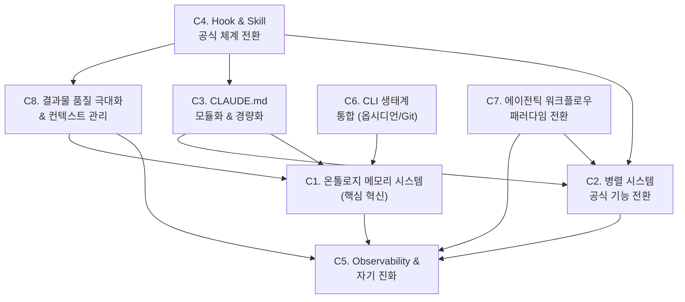

## 🔄 Next Session Handoff

### 현재 상태
- 이 문서의 완성도: completed
- 마지막 작업: C1~C8 심층 설계 문서 8개 모두 완성 (02_001~02_008)

### 다음 작업 (TODO)
- [x] C1(온톨로지 메모리) 심층 설계 → `02_001_C1_Ontology_Memory_Deep_Design.md`
- [x] C2(병렬 시스템) 심층 설계 → `02_002_C2_Parallel_System_Official_Migration.md`
- [x] C3(CLAUDE.md 모듈화) 심층 설계 → `02_003_C3_CLAUDE_MD_Modularization.md`
- [x] C4(Hook & Skill 전환) 심층 설계 → `02_004_C4_Hook_Skill_Official_Migration.md`
- [x] C5(Observability) 심층 설계 → `02_005_C5_Observability_Self_Evolution.md`
- [x] C6(CLI 생태계 통합) 심층 설계 → `02_006_C6_CLI_Ecosystem_Integration.md`
- [x] C7(에이전틱 워크플로우) 심층 설계 → `02_007_C7_Agentic_Workflow_Paradigm.md`
- [x] C8(결과물 품질 & 컨텍스트) 심층 설계 → `02_008_C8_Quality_Context_Management.md`
- [ ] 각 카테고리별 TODO 분해 및 실행 계획 수립

### 작업 조언
> [!tip] 다음 Claude Code에게
> - **C1~C8 심층 설계 문서가 모두 완성됨** — 02_001~02_008 참조
> - 이 문서는 **방향 총괄**이며, 각 카테고리 상세는 심층 설계 문서(02_00x)에 있다
> - 다음 단계: 각 카테고리별 TODO를 분해하여 **실행 계획** 수립
> - 앤의 핵심 관심: (1) 온톨로지 메모리, (2) 공식 기능 전환, (3) CLI 생태계(옵시디언, Git)
> - 카테고리 간 의존성 그래프 참조 필수 (C1이 기반, C5가 최종)

---

# Claude Code V5.0 개선 방향 총괄 — 카테고리별 로드맵

> **근거 문서**: 101 분석 3종 + 102 연구 6종 = 총 9개 문서 교차 분석
> **분석 일자**: 2026-03-14

---

## 1. Executive Summary

현재 Claude Code V4.2.1 시스템은 **성장기 후기 → 성숙기 초입**의 변곡점에 있다. 125개 컴포넌트가 관리 상한에 근접하고, 메모리 시스템은 "쓰기 편향"으로 읽기 메커니즘이 부재하며, 커스텀 체인/에이전트가 공식 기능과 괴리되어 있다.

동시에 102 연구에서 확인된 **온톨로지 기반 지식 관리**, **공식 Agent Teams/Hook 확장**, **에이전틱 엔지니어링 패러다임**은 V5.0으로의 도약을 위한 구체적 청사진을 제공한다.

> **V5.0 한 문장 비전**: *"규칙으로 통제하는 시스템(V4)"에서 "원칙으로 가이드하고, 온톨로지로 기억하며, 공식 기능으로 실행하는 시스템(V5)"으로의 전환*

---

## 1.5 개선 대전제 (MANDATORY)

> [!important] 3대 원칙: 공식 우선 → 공식 강화 → 자체 개발
>
> 모든 개선은 아래 우선순위를 따른다:
>
> | 우선순위 | 원칙 | 설명 | 예시 |
> |---------|------|------|------|
> | **1순위** | **공식 기능 사용** | Claude Code가 제공하는 기능이 있으면 그것을 먼저 사용한다 | Auto Memory, Agent Teams, `.claude/rules/`, Hook 12종 |
> | **2순위** | **공식 기능 강화** | 공식 기능이 부족하면 그 위에 확장/업그레이드한다 | prompt_analyzer.py(공식 Hook 위 확장), 체인 정의(공식 Skills 위 구현) |
> | **3순위** | **자체 개발** | 공식에 없는 기능만 자체 개발한다 | 온톨로지 메모리(벡터 DB + MCP), 체인 메타-학습 |
>
> **금지**: 공식 기능이 존재하는데 커스텀으로 재구현하는 것
> **허용**: 공식 기능을 래핑(wrapping)하여 추가 가치를 제공하는 것

---

## 2. 7대 개선 카테고리

### 카테고리 의존성 그래프



### 카테고리 총괄 매트릭스

| ID | 카테고리 | 혁신도 | 긴급도 | 난이도 | 앤 관심도 |
|----|---------|--------|--------|--------|----------|
| **C1** | 온톨로지 메모리 시스템 | ⭐⭐⭐⭐⭐ | HIGH | HIGH | **최고** |
| **C2** | 병렬 시스템 공식 전환 | ⭐⭐⭐⭐ | HIGH | MEDIUM | **높음** |
| **C3** | CLAUDE.md 모듈화 & 경량화 | ⭐⭐⭐ | HIGH | LOW | 중간 |
| **C4** | Hook & Skill 공식 체계 전환 | ⭐⭐⭐ | MEDIUM | MEDIUM | 중간 |
| **C5** | Observability & 자기 진화 | ⭐⭐⭐⭐ | MEDIUM | MEDIUM | 중간 |
| **C6** | CLI 생태계 통합 | ⭐⭐⭐ | LOW | LOW | **높음** |
| **C7** | 에이전틱 워크플로우 전환 | ⭐⭐⭐⭐ | LOW | HIGH | 중간 |
| **C8** | 결과물 품질 극대화 & 컨텍스트 관리 | ⭐⭐⭐⭐⭐ | HIGH | MEDIUM | **최고** |

---

## 3. 카테고리별 개선 방향 상세

---

### C1. 온톨로지 메모리 시스템 (핵심 혁신) ⭐⭐⭐⭐⭐

> **현재**: 쓰기 편향 파일 시스템 (YYMM_SEQ.md → MEMORY.md 인덱스 → 읽기 부재)
> **목표**: 프롬프트 의미 분석 → 벡터 검색 → 관련 메모리 자동 로드 (인간의 자연 연상)

#### 현재 문제 (101 근거)

| 문제 | 근거 문서 | 심각도 |
|------|----------|--------|
| 읽기 메커니즘 부재 | 01_002 GAP 1 | Critical |
| 의미 기반 검색 없음 | 01_002 GAP 2 | High |
| 세션 간 연속성 부재 | 01_002 GAP 3 | High |
| SessionStart Hook 비활성 | 01_002 Section 2.5 | Critical |
| 침묵하는 고장 | 01_002 Section 5 | High |

#### 미래 해결책 (102 근거)

| 해결책 | 근거 문서 | 적용 가능성 |
|--------|----------|------------|
| 액티브 온톨로지 (노드-엣지 동적 지식 구조) | 03_001, 05_001 제1장 | 높음 |
| 벡터화 → 임베딩 → 그래프 RAG 파이프라인 | 05_001 제4장 | 높음 |
| Mem0, Zep (벡터-그래프 하이브리드) | 05_001 제4장 | 높음 |
| Redis LangCache (의미적 캐싱) | 05_001 제4장 | 중간 |
| Strategic Vault 패턴 (필요시만 호출) | 03_001 영상 2 | 높음 |
| Palantir 4중 온톨로지 모델 | 06_001 섹션 7 | 참고 |

#### 개선 방향

```
[사용자 프롬프트]
    ↓
[prompt_analyzer.py V5.0] — 4-Layer + 의미 벡터 추출
    ↓
[벡터 DB 검색] — 프롬프트 벡터 ↔ 메모리 벡터 유사도 매칭
    ↓                          ↓ (선택적)
[관련 메모리 TOP-K 로드]    [그래프 탐색] — 연결된 메모리 추가 로드
    ↓
[SessionStart / UserPromptSubmit Hook으로 주입]
    ↓
[Claude가 관련 컨텍스트를 가진 상태에서 작업 시작]
```

**핵심 설계 원칙**:
1. **자연 연상**: 프롬프트의 의미를 분석하여 관련 메모리를 자동 연상 (인간 뇌의 연상 기억과 유사)
2. **온디맨드 로드**: 모든 메모리를 로드하지 않고, 관련된 것만 TOP-K 선별
3. **노드-엣지 구조**: 메모리 간 관계(선행/후속/관련/반박)를 그래프로 관리
4. **컴퓨팅 비용 최소화**: Redis LangCache로 반복 검색 캐싱 (70% 비용 절감)
5. **MCP 서버 구현**: 메모리 검색/저장을 MCP 도구로 제공 → Claude Code 네이티브 통합

**벡터 DB 후보**:

| DB | 특성 | 적합도 |
|----|------|--------|
| **Milvus** | 오픈소스, GPU 가속, 대규모 | 높음 (로컬 설치 가능) |
| **Qdrant** | Rust 기반, 경량, 필터링 강력 | 높음 (개인 사용 최적) |
| **Pinecone** | 관리형, 서버리스 | 중간 (클라우드 의존) |
| **Redis 8** | 벡터+캐싱+세션 통합 | 높음 (다목적) |

**데이터 정제 파이프라인** (102 05_001 근거):

```
메모리 파일 → 파싱 & 청킹 → 벡터화 & 임베딩
→ 그래프 RAG (노드-엣지) → 메타 온톨로지 정의 → 검색 인덱스
```

---

### C2. 병렬 시스템 — 공식 기능 전환 ⭐⭐⭐⭐

> **현재**: 커스텀 Dynamic Chain + 부분적 Agent Teams (환경변수 기반, 실험적)
> **목표**: 공식 Agent Teams/Subagents로 전면 전환, 커스텀 체인을 공식 구조 위에 재구현

#### 현재 문제 (101 근거)

| 문제 | 근거 | 심각도 |
|------|------|--------|
| Agent Teams API 불안정 의존 | 01_001 위험 2 | High |
| Chain 1.6x > Teams 속도 (순차 의존 시) | 01_001 Section 3.4 | Medium |
| 커스텀 체인이 공식 구조와 괴리 | 01_001 Section 3.3 | Medium |
| CLAUDE.md에 체인 정의 인코딩 (자연어) | 01_001 추상화 차원 | Medium |

#### 미래 해결책 (102 근거)

| 해결책 | 근거 | 적용 가능성 |
|--------|------|------------|
| 공식 Subagent 14개 필드 (memory, hooks, isolation 포함) | 02_001 섹션 3 | 높음 |
| Agent Teams 공유 작업 목록 + 자체 조율 | 02_001 섹션 3 | 높음 |
| Worktree Isolation (DevChain에 적용) | 01_001 V4.3 권고 4 | 높음 |
| prompt/agent Hook 타입 | 02_001 섹션 4 | 높음 |
| TeammateIdle Hook (Teammate 관리) | 02_001 섹션 4 | 높음 |

#### 개선 방향

**1단계: 에이전트 마이그레이션**
- 14개 커스텀 에이전트 YAML → `~/.claude/agents/` 공식 위치로 이전
- 각 에이전트에 `memory: true` frontmatter 추가 (공식 서브에이전트 메모리)
- `isolation: worktree` 적용 (DevChain, HotfixChain)

**2단계: 체인 패턴 → 공식 구조 재현**
- CLAUDE.md의 체인 정의 → Skills + Agent Teams 조합으로 재구현
- 각 체인을 `.claude/skills/chains/` 하위에 스킬로 정의
- `→` (순차)는 Subagent 순차 호출, `∥` (병렬)은 Agent Teams

**3단계: 커스텀 Resilience → 공식 Hook 대체**
- Teammate 무응답 감지 → `TeammateIdle` Hook (공식)
- 착수 보고 의무 → `TaskCompleted` Hook (공식)
- Lead 직접 수행 → Agent Teams 자체 조율 기능

---

### C3. CLAUDE.md 모듈화 & 경량화 ⭐⭐⭐

> **현재**: 393줄 단일 파일 (공식 권장 200줄 초과)
> **목표**: 핵심 원칙 100줄 + `.claude/rules/` 모듈 + 지연 로딩

#### 현재 문제 (101 근거)

| 문제 | 근거 | 심각도 |
|------|------|--------|
| 393줄 > 공식 권장 200줄 | 02_001 섹션 7 대조 분석 | High |
| Section 2(오케스트레이션)이 62% 차지 | 01_001 insight_amplifier | High |
| 복잡성 보존 법칙 — 줄여도 어딘가에 존재 | 01_001 진화 법칙 1 | Medium |
| 추상화 상승 법칙 — 구체적 규칙→원칙 | 01_001 진화 법칙 2 | Medium |

#### 미래 해결책 (102 근거)

| 해결책 | 근거 | 적용 가능성 |
|--------|------|------------|
| `.claude/rules/` 디렉토리 분리 (path-specific) | 02_001 섹션 2 | 높음 |
| `@path/to/import` 문법으로 외부 파일 참조 | 02_001 섹션 2 | 높음 |
| CLAUDE.md Lite (Teammate용 80줄) | 01_001 R4 | 높음 |
| 지연 로딩 (서브디렉토리 CLAUDE.md는 필요 시 로드) | 02_001 섹션 2 | 높음 |

#### 개선 방향

```
~/.claude/
├── CLAUDE.md              ← 핵심 원칙 100줄 (Identity, CLEAR, 핵심 규칙)
├── rules/
│   ├── orchestration.md   ← Section 2 (체인/에이전트 매핑)
│   ├── memory-protocol.md ← Section 3 (메모리 규칙)
│   ├── review-system.md   ← Section 5 (리뷰 시스템)
│   └── rails.md           ← Rails 전용 (기존 RAILS.md 흡수)
├── agents/                ← 14개 에이전트 (공식 위치)
├── skills/                ← 체인 패턴 스킬화
└── hooks/                 ← auto-analyze.sh + 신규 Hook
```

---

### C4. Hook & Skill 공식 체계 전환 ⭐⭐⭐

> **현재**: Hook은 command 타입만 사용, Skill은 commands/ 기반
> **목표**: 12개 공식 Hook 이벤트 + 4개 Hook 타입 + skills/ 마이그레이션

#### 개선 방향

**Hook 확장** (현재 사용 3/12 → 목표 8/12):

| Hook | 현재 | 목표 용도 |
|------|------|----------|
| SessionStart | ❌ 비활성 | ✅ **메모리 자동 로드** (C1 핵심) |
| UserPromptSubmit | ✅ auto-analyze | ✅ 유지 + 메모리 매칭 추가 |
| PreToolUse | ✅ 보안 필터 | ✅ 유지 |
| PostToolUse | ✅ 포매팅+Git | ✅ 유지 + **Observability 로그** |
| PostCompact | ❌ 미사용 | ✅ **체인 상태 복구** (V4.3 권고 2) |
| InstructionsLoaded | ❌ 미사용 | ✅ **로드된 규칙 로깅** (디버그) |
| TeammateIdle | ❌ 미사용 | ✅ **Teammate 관리** (C2 연계) |
| Stop | ❌ 미사용 | ✅ **응답 완료 프로토콜 자동화** |

**Hook 타입 확장** (현재 command만 → 4가지):

| 타입 | 용도 | 적용 |
|------|------|------|
| command | 셸 스크립트 | 기존 auto-analyze.sh |
| **prompt** | LLM 단일 턴 | 메모리 요약 생성 |
| **agent** | 서브에이전트 | 메모리 검색 에이전트 |
| **http** | HTTP POST | 외부 서비스 연동 (향후) |

**Skill 마이그레이션**: `commands/` → `skills/` (공식 구조)

---

### C5. Observability & 자기 진화 ⭐⭐⭐⭐

> **현재**: 실행 추적 없음, 성능 메트릭 없음
> **목표**: 체인 실행 로그 + 토큰 대시보드 + 자기 진단 루프

#### 개선 방향

**최소 Observability** (즉시 구현 가능):
```
PostToolUse Hook → 1줄 로그 append
형식: YYYY-MM-DD HH:MM | Chain | Agent[Result] | Tokens | Duration
위치: ~/.claude/logs/YYMMDD.log
```

**자기 진단 루프** (중기):
```
월간 로그 분석 → 미사용 체인 식별 → 체인 생존율 리포트
                → 오탐 패턴 분석 → prompt_analyzer 자동 개선
                → 토큰 소비 패턴 → Effort Level 최적화
```

**체인 메타-학습** (장기):
- 실행 데이터 기반 체인 패턴 자동 최적화
- "이 유형의 작업에서 MetaThinkChain보다 ResearchChain이 2x 효율적" → 자동 전환

---

### C6. CLI 생태계 통합 (옵시디언/Git/외부 도구) ⭐⭐⭐

> **현재**: 기본 Git + gh CLI 사용, 문서 간 링크가 단순 `[[파일명]]`
> **목표**: 옵시디언 통합 + **신경망 참조** + Git 워크플로우 + MCP 연동

#### 현재 문제 (101+102 근거)

| 문제 | 근거 | 심각도 |
|------|------|--------|
| 문서 참조 시 전체 읽기 (O(n) 탐색) | 07_001 Section 1.1 | High |
| 문서 간 관계 유형 미분류 | 07_001 Section 2.1 | Medium |
| 고립 문서(orphan) 감지 없음 | 07_001 Section 5.1 | Medium |
| 옵시디언 그래프 뷰 미활용 | 07_001 Section 4.3 | Low |

#### 미래 해결책 (102 근거)

| 해결책 | 근거 | 적용 가능성 |
|--------|------|------------|
| **신경망 참조** — `[[파일#섹션\|표시명]]` 정밀 참조 | 07_001 전체 | **매우 높음** |
| 4가지 참조 유형 (direct/topic/contrast/evidence) | 07_001 Section 2.1 | 높음 |
| Neural Map (Direct/Backlink/Topic 구분) | 07_001 Section 1.1 | 높음 |
| 연결 밀도 매트릭스로 허브/브릿지/입구 식별 | 07_001 Section 3 | 높음 |

#### 개선 방향

**A. 신경망 참조 시스템** (07_001 근거):

```
전통적: [[파일명]] → 문서 전체 읽기 (~500줄, ~10K 토큰)
신경망:  [[파일#섹션|표시명]] → 섹션만 읽기 (~30줄, ~600 토큰) = 94% 절감
```

| 시나리오 | 전체 읽기 | 신경망 참조 | 절감 |
|---------|----------|-----------|------|
| 6개 문서 전체 탐색 | ~48K 토큰 | ~4K 토큰 | **92%** |
| 특정 주제 3문서 추적 | ~24K 토큰 | ~2.4K 토큰 | **90%** |
| 단일 근거 확인 | ~10K 토큰 | ~600 토큰 | **94%** |

- `## 관련 문서`를 Neural Map 형식으로 전환 (Direct/Backlink/Topic)
- 모든 링크에 `#섹션` 앵커 + 관계 유형 + 1줄 설명 포함
- 신규 문서 생성 시 최소 2개 이상 다른 문서와 연결 필수
- **C1(온톨로지 메모리)의 노드-엣지 구조와 동형** — 옵시디언 링크 = 온톨로지 엣지

**B. 옵시디언 통합**:
- Obsidian Vault를 메모리 저장소로 활용 (현재 1012_ 폴더가 이미 Vault 내)
- 그래프 뷰 = 온톨로지 시각화 (허브/브릿지/입구 식별)
- Obsidian MCP 서버 → Claude Code에서 노트 검색/생성
- 고립 문서 자동 탐지 스크립트

**C. Git 워크플로우**:
- Worktree 기반 개발 (`claude --worktree feature-name`)
- PR 자동 리뷰 (공식 Code Review 기능)
- `/loop` 기반 CI 모니터링

**D. 외부 도구 MCP**:
- Figma MCP → 디자인 토큰 자동 추출
- Supabase CLI → 데이터베이스 직접 조작
- Playwright → E2E 테스트 자동화

---

### C7. 에이전틱 워크플로우 패러다임 전환 ⭐⭐⭐⭐

> **현재**: 프롬프트 → 체인 자동 선택 → 실행
> **목표**: research.md → plan.md → 구현의 3단계 워크플로우 (인간 통제 강화)

#### 개선 방향 (102 06_001 근거)

**마크다운 기반 3단계 워크플로우**:

| 단계 | 산출물 | 주체 | 목적 |
|------|--------|------|------|
| **심층 연구** | `research.md` | 에이전트 (Explore, WebSearch) | 기존 코드베이스 + 외부 자료 심층 분석 |
| **상세 계획** | `plan.md` | **인간 개입** | 아키텍처 통제권 유지, 승인 게이트 |
| **기계적 구현** | 소스 코드 | 에이전트 (code_developer) | 인지 부하 최소화 |

**다중 에이전트 코드 리뷰**:
- 논리/보안/엣지케이스 전문 에이전트 병렬 검토
- 심각도 분류 (Critical/Warning/Info)
- 공식 Claude Code Review 기능 활용

**평가 루프 (Skill Creator 패턴)**:
- Grader → Comparator → Analyzer 3중 평가
- 구 버전 vs 신 버전 블라인드 테스트
- 벤치마크 자동 추적

---

### C8. 결과물 품질 극대화 & 컨텍스트 관리 ⭐⭐⭐⭐⭐

> **현재**: 토큰/시간 절약 우선, 작업 중 컨텍스트 소진 시 중단 발생, 수동 /compact
> **목표**: 품질 최우선 (시간/토큰 무제한) + 작업 완료 후 자동 컨텍스트 정리 + 메모리 자동 저장

#### 현재 문제

| 문제 | 원인 | 영향 |
|------|------|------|
| 작업 중 임의 중단 | 컨텍스트 윈도우 소진 시 /compact 필요 | 작업 맥락 손실, 재시작 비용 |
| 품질보다 효율 우선 | Effort Level 미분화, 체인 축약 유혹 | 분석 깊이 부족 |
| 정리 시점 부적절 | 작업 **중**에 컨텍스트 정리 발생 | 진행 중인 사고 흐름 단절 |
| 정리 후 메모리 미저장 | /compact 시 작업 내용 소실 | 세션 간 연속성 파괴 |

#### 개선 방향

**원칙 1: 품질 최우선 (Quality-First)**

```
시간 < 토큰 < 품질
```

- 결과물의 품질만 높으면 시간과 토큰은 얼마가 들든 상관없다
- 체인 실행 시 모든 에이전트를 생략 없이 완전 실행
- Effort Level을 체인 특성에 따라 분화:
  - `high`: MetaThinkChain, SystemDesignChain, ResearchChain (분석/설계)
  - `medium`: DevChain, WebDevChain, DocChain (구현/문서)
  - `low`: HotfixChain (긴급 수정만)

**원칙 2: 작업 완료 후 정리 (Post-Task Cleanup)**

> [!important] 핵심 규칙
> 컨텍스트 정리는 **작업이 끝난 후**에만 수행한다. 작업 **중**에는 절대 정리하지 않는다.

```
작업 시작 → 작업 진행 (중단 없음) → 작업 완료
    → [Stop Hook 트리거]
    → 컨텍스트 사용량 체크
    → 80% 이상이면:
        ├── 메모리에 작업 내용 상세 저장
        ├── 다음 작업 TODO 기록
        └── 자동 /compact 실행
    → 80% 미만이면:
        └── 정리 없이 다음 작업 대기
```

**원칙 3: 작업 계획 시 컨텍스트 Budget 고려**

```
1M 토큰 컨텍스트 = ~750,000 단어
├── 시스템 프롬프트 + CLAUDE.md: ~5,000 토큰 (0.5%)
├── 메모리 로드: ~3,000 토큰 (0.3%)
├── 작업 가용 영역: ~992,000 토큰 (99.2%)
└── 안전 마진 (20%): 실질 가용 ~800,000 토큰
```

- 작업 계획 시 예상 토큰 소비를 사전 추정
- 대규모 작업(에이전트 7+)은 단계별 분할하되 **각 단계는 중단 없이** 완료
- 단계 사이에 컨텍스트 정리 지점 설계

#### Hook 구현 설계

**Stop Hook (작업 완료 시 자동 실행)**:

```bash
# ~/.claude/hooks/post-task-cleanup.sh
# Stop Hook: 작업 완료 시 트리거

# 1. 컨텍스트 사용량 체크 (Stop Hook의 additionalContext로)
CONTEXT_USAGE=$(/* Claude Code 내부 API 또는 추정 */)

if [ "$CONTEXT_USAGE" -ge 80 ]; then
    # 2. 메모리 저장 지시
    CLEANUP_MSG="
⚠️ [AUTO-CLEANUP] 컨텍스트 사용량 ${CONTEXT_USAGE}% — 자동 정리 필요
━━━━━━━━━━━━━━━━━━━━━━━━━━━━━━━━━━
📌 아래 순서대로 실행:
1. 현재 작업 내용을 메모리에 상세 저장 (YYMM_SEQ_keyword.md)
2. 다음 작업 TODO를 메모리에 기록
3. /compact 실행하여 컨텍스트 정리
━━━━━━━━━━━━━━━━━━━━━━━━━━━━━━━━━━
"
    echo "$CLEANUP_MSG"
fi
```

**대안: PostCompact Hook (정리 후 자동 복구)**:

```
PostCompact Hook 트리거 시:
1. 최근 저장된 메모리 파일에서 TODO 로드
2. 작업 연속성 컨텍스트 재주입
3. "이전 작업에서 이어서 진행합니다" 안내
```

**트리거 기반 예약 작업 패턴**:

| 트리거 | Hook | 동작 |
|--------|------|------|
| 작업 완료 (Stop) | `Stop` Hook | 컨텍스트 80%+ → 메모리 저장 + /compact |
| /compact 실행 후 | `PostCompact` Hook | 작업 상태 복원 + TODO 재로드 |
| 세션 시작 | `SessionStart` Hook | 최근 메모리 3개 + TODO 로드 |
| 에이전트 유휴 | `TeammateIdle` Hook | Teammate 정리 or 재할당 |
| `/loop` 예약 | `/loop 30m` | 주기적 상태 체크 + 메모리 동기화 |

#### 품질 보장 체크리스트

```markdown
작업 완료 전 자가 검증:
- [ ] 모든 에이전트가 생략 없이 실행되었는가?
- [ ] 분석 깊이가 충분한가? (표면 수준이 아닌 근본 원인까지)
- [ ] 구조화된 출력인가? (테이블, 다이어그램, 매트릭스)
- [ ] 다음 세션이 이어받을 수 있도록 Handoff 섹션이 갱신되었는가?
- [ ] 메모리에 작업 내용이 저장되었는가?
```

---

## 4. 카테고리 간 교차 시너지

### 핵심 시너지 3개

**시너지 1: C1(온톨로지) × C6(옵시디언)**
- 옵시디언 Vault 내 메모리 파일 → 벡터 DB에 임베딩
- 옵시디언 그래프 뷰 = 온톨로지 시각화
- 옵시디언 백링크 = 메모리 간 노드-엣지 관계
- **결론**: 옵시디언이 온톨로지의 프론트엔드가 될 수 있다

**시너지 2: C2(병렬) × C5(Observability)**
- Agent Teams 실행 로그 → Observability 데이터
- 데이터 기반으로 Chain vs Teams 자동 선택
- TeammateIdle Hook → Resilience 자동화

**시너지 3: C3(모듈화) × C4(Hook/Skill 전환)**
- CLAUDE.md 분리 → rules/ 파일이 path-specific으로 작동
- commands/ → skills/ 마이그레이션과 동시 진행
- 결과: 200줄 이하 + 모듈식 + 공식 구조 정합

**시너지 4: C8(품질/컨텍스트) × C1(메모리) × C4(Hook)**
- Stop Hook(C8) → 메모리 자동 저장(C1) → PostCompact Hook(C4) → 메모리 자동 복원(C1)
- 컨텍스트 정리 전 메모리 저장 → 정리 후 메모리 복원 = **끊김 없는 연속성**
- Observability 로그(C5)로 컨텍스트 사용 패턴 추적 → 최적 정리 시점 학습

---

## 5. 실행 순서 권고 (Phase 분류)

### Phase 0: 기반 정비 (즉시, 1~2세션)

| 작업 | 카테고리 | 효과 |
|------|---------|------|
| CLAUDE.md → rules/ 분리 (393→100줄) | C3 | 공식 구조 정합, 토큰 절감 |
| SessionStart Hook 활성화 + 최근 3개 메모리 로드 | C1/C4 | 읽기 부재 즉시 해결 |
| PostToolUse Hook에 1줄 로그 추가 | C5 | Observability 첫 걸음 |
| Stop Hook 구현 (80%+ → 메모리 저장 + /compact) | C8 | 작업 중단 방지, 자동 정리 |
| Effort Level 체인별 분화 (high/medium/low) | C8 | 품질 최우선 보장 |

### Phase 1: 공식 전환 (단기, 3~5세션)

| 작업 | 카테고리 | 효과 |
|------|---------|------|
| 에이전트 14개 → `~/.claude/agents/` 마이그레이션 | C2 | 공식 위치 정합 |
| commands/ → skills/ 마이그레이션 | C4 | 스킬 시스템 통합 |
| PostCompact Hook 구현 (정리 후 작업 상태 복원) | C4/C8 | 장기 세션 안정성 + 연속성 |

### Phase 2: 메모리 혁신 (중기, 5~10세션)

| 작업 | 카테고리 | 효과 |
|------|---------|------|
| 벡터 DB 선정 + 설치 (Qdrant or Milvus) | C1 | 의미 검색 기반 구축 |
| 메모리 임베딩 파이프라인 구현 | C1 | 기존 메모리 벡터화 |
| MCP 서버로 메모리 검색 도구 제공 | C1 | Claude Code 네이티브 통합 |
| 옵시디언 MCP 연동 | C6 | 지식 그래프 프론트엔드 |

### Phase 3: 패러다임 전환 (장기)

| 작업 | 카테고리 | 효과 |
|------|---------|------|
| research→plan→implement 워크플로우 정착 | C7 | 아키텍처 통제 강화 |
| 다중 에이전트 코드 리뷰 도입 | C7 | 품질 보증 자동화 |
| 체인 메타-학습 시스템 | C5 | 자기 개선 루프 완성 |
| 온톨로지 그래프 RAG 고도화 | C1 | 다단계 추론 지원 |

---

## 6. 카테고리별 심층 문서 계획

| 문서 번호 | 카테고리 | 제목 (예정) |
|----------|---------|------------|
| `02_001` | C1 | 온톨로지 메모리 시스템 심층 설계 |
| `02_002` | C2 | 공식 Agent Teams 마이그레이션 설계 |
| `02_003` | C3 | CLAUDE.md 모듈화 상세 계획 |
| `02_004` | C4 | Hook & Skill 공식 체계 전환 설계 |
| `02_005` | C5 | Observability & 자기 진화 설계 |
| `02_006` | C6 | CLI 생태계 통합 (옵시디언/Git) 설계 |
| `02_007` | C7 | 에이전틱 워크플로우 패러다임 설계 |
| `02_008` | C8 | 결과물 품질 극대화 & 컨텍스트 관리 심층 설계 |

---

## 관련 문서

### 101 (현재 분석)
- [[01_001_Current_System_Analysis]] — V4.2.1 시스템 종합 분석 (5차원 + 패턴 + 진화 법칙)
- [[01_002_Memory_System_Analysis]] — 메모리 시스템 쓰기 편향 문제 분석

### 102 (미래 연구)
- [[01_001_Claude_Code_2026_Changelog_Analysis]] — v2.1.0~v2.1.76 체인지로그 + V4.3 권고 9개
- [[02_001_Claude_Code_Official_Docs_Core_Engine]] — 공식 문서 8종 핵심 엔진 + V4.2.1 대조
- [[03_001_Ontology_YouTube_Summary]] — 액티브 온톨로지 + Strategic Vault 패턴
- [[05_001_Intelligence_Architecture_Ontology_Research]] — 벡터 DB + 온톨로지 + 기업 전략
- [[06_001_Agentic_Software_Engineering_Analysis]] — 에이전틱 엔지니어링 + 4계층 아키텍처
- [[07_001_Neural_Reference_Deep_Analysis]] — 신경망 참조 시스템 (44건 교차 참조 분석, 토큰 90%+ 절감)

---

## Release Notes

### v1.3.0 (2026-03-15)
- **C6 대폭 확장**: 102 폴더 `07_001_Neural_Reference_Deep_Analysis.md` 반영
- 신경망 참조(Neural Reference) 시스템 통합 — `[[파일#섹션|표시명]]` 정밀 참조로 토큰 90%+ 절감
- 4가지 참조 유형 (direct/topic/contrast/evidence) 도입
- 연결 밀도 매트릭스, 허브/브릿지/입구 역할 분류
- C1(온톨로지)×C6(옵시디언) 시너지 강화: 옵시디언 링크 = 온톨로지 엣지
- 관련 문서에 07_001 추가
> **프롬프트:** "102 폴더의 07문서가 신규로 생성되었어 해당 내용을 103 01_001 파일에 반영해줘 릴리즈노트 잘 써주고 내 프롬프트도 잘 써줘"

### v1.2.0 (2026-03-15)
- **C8 카테고리 추가**: 결과물 품질 극대화 & 컨텍스트 관리
- 품질 최우선 원칙 (시간/토큰 < 품질), 작업 중단 방지
- Stop Hook 설계: 80%+ 컨텍스트 시 메모리 저장 + 자동 /compact
- PostCompact Hook 설계: 정리 후 작업 상태 자동 복원
- 트리거 기반 예약 작업 패턴 5종 정의
- 의존성 그래프, 매트릭스, Phase 0, 시너지 4, Section 6에 C8 반영
> **프롬프트:** "결과물 품질 상승방향이야. 시간과 토큰은 얼마가 들든 상관없어. 결과물의 품질만 높으면 되. 그리고 작업이 임의 중단되면 안되, 계획을 세울때 콘텍스트 1만 토큰을 적용해서 중단 없이 되도록이면 작업이 끝나고 콘텍스트가 정리되게 해줘 작업중에 정리되는게 아니라. 이를 위해 훅을 만드는것도 좋을것 같아. 예약작업을 트리거 기반으로 걸 수 있게지. 훅이든 뭐든 가령 작업이 끝났을때 80이상 콘텐스트가 차면 자동으로 정리한다 이때 메모리에 작업 내용을 자세히 정리한다로 해줘. 이것을 해당 문서에 적용해서 6번 카테고리별 심층분석에서 내용이 담기게 해줘"

### v1.1.0 (2026-03-14)
- **개선 대전제 추가** (Section 1.5): "공식 우선 → 공식 강화 → 자체 개발" 3대 원칙
> **프롬프트:** "수정의 대전제 방향이 클로드코드의 제공기능을 사용하고 모자른거 자체 개발하고, 없는건 자체 개발하는 방향이야. 그러니까 효율적이고 가능하다면 자체 기능을 쓰는거지 아니면 자체 기능을 업그레이드 하던가."

### v1.0.0 (2026-03-14)
- 초기 작성: 101(3문서) + 102(6문서) = 9개 문서 교차 분석
- 7대 개선 카테고리 도출 (C1~C7)
- 카테고리 의존성 그래프 + 실행 Phase 0~3 제시
- 카테고리별 심층 문서 7개 계획 수립
- 앤 핵심 관심사 반영: 온톨로지 메모리(C1), 공식 병렬 전환(C2), CLI 생태계(C6)
