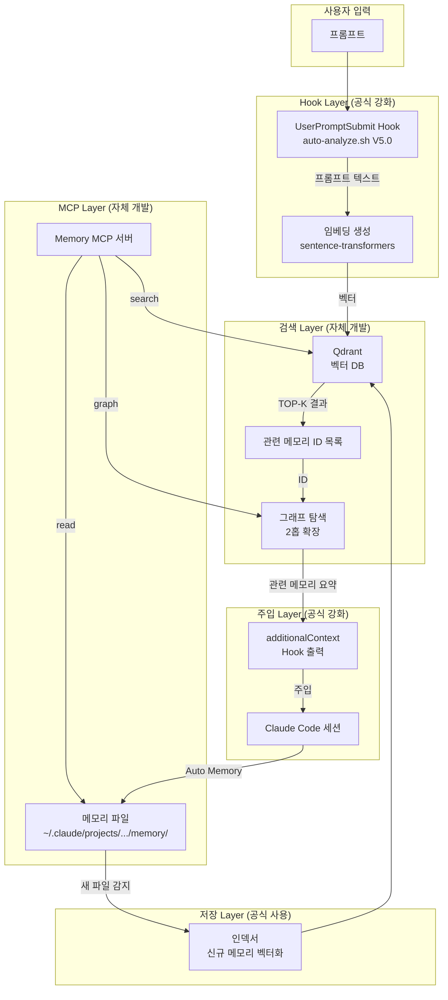

## 🔄 Next Session Handoff

### 현재 상태
- 이 문서의 완성도: completed
- 마지막 작업: C1 온톨로지 메모리 시스템 심층 설계 — 아키텍처, 벡터DB 선정, MCP 서버, 파이프라인, 구현 단계

### 다음 작업 (TODO)
- [ ] Phase 1 구현: Qdrant 로컬 설치 + 기존 메모리 벡터화 스크립트
- [ ] Phase 1 구현: MCP 서버 프로토타입 (`memory-search` 도구)
- [ ] Phase 1 구현: UserPromptSubmit Hook에 벡터 검색 연동
- [ ] Phase 2 구현: 그래프 레이어 (메모리 간 관계 엣지)
- [ ] Phase 3 구현: 옵시디언 연동 + 시각화

### 작업 조언
> [!tip] 다음 Claude Code에게
> - 이 문서는 [[01_001_Improvement_Direction_Overview#C1. 온톨로지 메모리 시스템|C1 개선 방향]]의 심층 설계이다
> - **대전제**: 공식 기능 우선 → 공식 강화 → 자체 개발 (Section 1.5 참조)
> - 공식 Auto Memory(MEMORY.md + 토픽 파일)를 **기반**으로 하고, 벡터 검색을 **확장**으로 얹는 구조
> - 벡터 DB는 **Qdrant**를 1차 후보로 선정 (Rust 기반, 경량, 로컬 최적)
> - MCP 서버로 구현하면 Claude Code 네이티브 통합 가능 — `/mcp-builder` 스킬 활용
> - [[05_001_Intelligence_Architecture_Ontology_Research#1.2 데이터 정제 및 온톨로지 구축 파이프라인|온톨로지 파이프라인]]이 기술적 청사진
> - [[01_002_Memory_System_Analysis#5. 근본 원인 분석|침묵하는 고장]]이 이 설계의 근본 동기

---

# C1. 온톨로지 메모리 시스템 심층 설계

> **상위 문서**: [[01_001_Improvement_Direction_Overview#C1. 온톨로지 메모리 시스템|C1 개선 방향]]
> **대전제**: [[01_001_Improvement_Direction_Overview#1.5 개선 대전제|공식 우선 → 공식 강화 → 자체 개발]]

---

## 1. 설계 목표

### 1.1 한 문장 목표

> **프롬프트를 입력하면 관련 과거 기억이 자연스럽게 연상되는 시스템** — 인간 뇌의 연상 기억과 동일한 원리를 소프트웨어로 구현한다.

### 1.2 구체적 목표

| 목표 | 현재 상태 | 목표 상태 | 측정 기준 |
|------|----------|----------|----------|
| **메모리 읽기** | ❌ 부재 (MEMORY.md 인덱스만) | ✅ 프롬프트 기반 자동 로드 | 세션 시작 시 관련 메모리 TOP-3 자동 표시 |
| **의미 검색** | ❌ 없음 (파일명/날짜만) | ✅ 벡터 유사도 기반 | 유사도 0.7+ 메모리를 1초 이내 검색 |
| **세션 연속성** | ❌ 매번 새로 시작 | ✅ 이전 작업 컨텍스트 자동 복원 | "어제 뭐 했지?" 불필요 |
| **관계 추적** | ❌ 없음 | ✅ 메모리 간 노드-엣지 그래프 | 관련 메모리 2홉 이내 탐색 |
| **공식 호환** | ⚠️ 커스텀만 | ✅ 공식 Auto Memory 위에 확장 | MEMORY.md 구조 유지 |

### 1.3 대전제 적용

| 계층 | 원칙 | 구현 |
|------|------|------|
| **1순위: 공식 사용** | Auto Memory (MEMORY.md + 토픽 파일) | 그대로 유지, 저장 구조 변경 없음 |
| **2순위: 공식 강화** | UserPromptSubmit Hook 확장 | 기존 auto-analyze.sh에 벡터 검색 추가 |
| **3순위: 자체 개발** | 벡터 DB + MCP 서버 | Qdrant + 커스텀 MCP (공식에 없는 기능) |

---

## 2. 아키텍처 설계

### 2.1 전체 아키텍처



### 2.2 계층별 책임

| 계층 | 기술 | 대전제 | 역할 |
|------|------|--------|------|
| **저장** | 공식 Auto Memory | 1순위 (공식 사용) | MEMORY.md + 토픽 파일 그대로 유지 |
| **Hook** | auto-analyze.sh 확장 | 2순위 (공식 강화) | 프롬프트 수신 → 벡터 검색 트리거 → 결과 주입 |
| **검색** | Qdrant + MCP 서버 | 3순위 (자체 개발) | 벡터 유사도 검색 + 그래프 탐색 |
| **인덱싱** | Python 스크립트 | 3순위 (자체 개발) | 새 메모리 파일 감지 → 벡터화 → DB 저장 |

### 2.3 데이터 흐름 (읽기)

```
1. 사용자 프롬프트 입력
2. UserPromptSubmit Hook 실행 (auto-analyze.sh V5.0)
3. Hook → MCP 서버에 검색 요청 (프롬프트 텍스트 전달)
4. MCP 서버:
   a. 프롬프트를 임베딩 벡터로 변환
   b. Qdrant에서 유사도 TOP-5 검색
   c. 그래프에서 연결된 메모리 1홉 확장
   d. 결과 메모리 파일의 핵심 요약 생성
5. Hook → additionalContext로 요약 주입
6. Claude가 관련 컨텍스트를 가진 상태에서 응답 시작
```

### 2.4 데이터 흐름 (쓰기) — 비동기 처리

```
1. Claude가 Auto Memory로 메모리 파일 저장 (기존 방식 유지)
   → 앤은 저장 완료 후 바로 다음 작업 가능 (여기까지 동기)
2. 파일 시스템 감시자(fswatch)가 새 파일 감지 (백그라운드)
3. 인덱서 실행 (별도 프로세스, Claude Code 세션과 분리):
   a. 새 파일 파싱 → 섹션별 청킹
   b. 각 청크를 임베딩 벡터로 변환
   c. Qdrant에 벡터 + 메타데이터 저장
   d. 기존 메모리와의 관계(엣지) 추론 → 그래프 업데이트
4. 완료 (비동기, 세션 방해 없음)
```

> [!important] 비동기 처리 — 앤의 작업을 차단하지 않음
> 현재 메모리 저장은 Claude Code 메인 세션이 직접 수행하므로 저장 중 앤이 대기해야 한다. 그러나 **임베딩은 별도 프로세스**(Docker Qdrant + Python 인덱서)에서 실행되므로 앤의 작업 흐름을 방해하지 않는다.
>
> | 작업 | 실행 주체 | 앤 대기 필요? |
> |------|----------|-------------|
> | 메모리 .md 파일 저장 | Claude Code (메인) | ✅ 몇 초 대기 (기존과 동일) |
> | 임베딩 벡터화 + DB 저장 | fswatch + 인덱서 (별도) | **❌ 대기 불필요** |
>
> **예외**: 최초 세팅 시 기존 메모리 전체 일괄 벡터화는 수 분 소요. 이후 파일 1개당 1~2초 (백그라운드).

---

## 3. 기술 선정

### 3.1 벡터 DB: Qdrant 선정

| 후보 | 장점 | 단점 | 최종 판단 |
|------|------|------|----------|
| **Qdrant** | Rust 기반 고성능, 경량(Docker 1컨테이너), 필터링 강력, 로컬 최적 | 클러스터 확장 시 복잡 | **✅ 선정** |
| Milvus | GPU 가속, 대규모 | 무거움 (다수 컴포넌트), 개인용 과도 | ❌ 과도 |
| Pinecone | 관리형, 서버리스 | 클라우드 의존, 비용 | ❌ 로컬 불가 |
| Redis 8 | 다목적 통합 | 벡터 검색 전문성 부족, 설정 복잡 | ❌ 차순위 |

**Qdrant 선정 근거**:
- [[05_001_Intelligence_Architecture_Ontology_Research#4.1 벡터 데이터베이스 vs. 그래프 메모리|벡터 vs 그래프 분석]]에서 "오픈소스 벡터 DB: Milvus, Qdrant — Rust 기반 고성능 필터링"
- 개인 사용 규모 (메모리 수백~수천 개) → 경량 DB가 최적
- Docker 단일 컨테이너로 실행 → 설치/관리 부담 최소
- REST API 제공 → MCP 서버에서 직접 호출 가능

**비용**: 모든 도구가 **완전 무료** (오픈소스/로컬)

| 도구 | 라이선스 | 비용 |
|------|---------|------|
| Qdrant | Apache 2.0 (오픈소스) | 무료 (로컬 Docker, 용량/API 무제한) |
| multilingual-e5-large | MIT (HuggingFace 공개) | 무료 (다운로드 후 로컬 실행) |
| FastMCP | MIT (오픈소스) | 무료 |
| Docker | 무료 (개인 사용) | 무료 |

> Qdrant Cloud(클라우드 호스팅)는 유료 옵션이 있지만, 로컬 Docker로 실행하므로 비용 0원

```bash
# Qdrant 설치 (Docker)
docker pull qdrant/qdrant
docker run -p 6333:6333 -v ~/.claude/qdrant_data:/qdrant/storage qdrant/qdrant
```

### 3.2 임베딩 모델

| 후보 | 크기 | 성능 | 로컬 실행 | 판단 |
|------|------|------|----------|------|
| **all-MiniLM-L6-v2** | 80MB | 한국어 약함 | ✅ 가능 | 1차 프로토타입 |
| **multilingual-e5-large** | 1.1GB | 한국어 강함 | ✅ 가능 | **✅ 최종 선정** |
| OpenAI text-embedding-3 | API | 최고 | ❌ API 의존 | ❌ 로컬 우선 |

**선정**: `multilingual-e5-large` — 한국어+영어 혼합 메모리에 최적, 로컬 실행으로 API 비용 없음

```python
# 임베딩 생성 예시
from sentence_transformers import SentenceTransformer
model = SentenceTransformer('intfloat/multilingual-e5-large')
embedding = model.encode("메모리 시스템 쓰기 편향 분석")  # → 1024차원 벡터
```

### 3.3 MCP 서버 프레임워크

| 방식 | 대전제 적용 | 선정 |
|------|------------|------|
| **FastMCP (Python)** | `/mcp-builder` 스킬의 Python 레퍼런스 활용 | **✅ 선정** |
| Node MCP SDK | TypeScript 기반 | ❌ Python 생태계와 불일치 |

**선정 근거**: [[02_001_Claude_Code_Official_Docs_Core_Engine#5. 스킬 시스템|공식 스킬]]에서 `/mcp-builder`가 Python FastMCP를 지원, 기존 `prompt_analyzer.py`도 Python

---

## 4. 상세 설계

### 4.1 메모리 데이터 모델

```python
# Qdrant에 저장되는 메모리 벡터 구조
{
    "id": "2603_006_v421_system_analysis",  # 메모리 파일명 (ID)
    "vector": [0.012, -0.034, ...],          # 1024차원 임베딩
    "payload": {
        # 메타데이터 (필터링용)
        "file_path": "~/.claude/projects/.../memory/2603_006_v421_system_analysis.md",
        "created": "2026-03-14",
        "tags": ["claude-code", "system-analysis", "v4.2.1"],
        "summary": "V4.2.1 시스템 종합 분석 - Observability 최우선 권고",
        "word_count": 1200,

        # 그래프 관계 (엣지)
        "related_to": [
            {"id": "2603_005_...", "relation": "precedes", "weight": 0.9},
            {"id": "2603_007_...", "relation": "topic", "weight": 0.8}
        ],

        # 청크 정보 (섹션별 분할 시)
        "chunk_index": 0,
        "chunk_section": "Executive Summary",
        "parent_id": null  # 청크의 원본 문서 ID
    }
}
```

### 4.2 MCP 서버 도구 설계

```python
# memory-ontology MCP 서버 도구 목록
tools = {
    "memory_search": {
        # 프롬프트 텍스트로 관련 메모리 검색
        "params": {"query": str, "top_k": int, "min_score": float},
        "returns": [{"id": str, "score": float, "summary": str, "file_path": str}]
    },
    "memory_read": {
        # 특정 메모리 파일의 특정 섹션 읽기 (신경망 참조)
        "params": {"memory_id": str, "section": str | None},
        "returns": {"content": str, "related": list}
    },
    "memory_graph": {
        # 메모리 간 관계 그래프 탐색
        "params": {"memory_id": str, "hops": int},
        "returns": {"nodes": list, "edges": list}
    },
    "memory_index": {
        # 새 메모리 파일을 벡터 DB에 인덱싱
        "params": {"file_path": str},
        "returns": {"id": str, "vector_count": int}
    },
    "memory_stats": {
        # 메모리 시스템 통계
        "params": {},
        "returns": {"total": int, "by_month": dict, "top_tags": list}
    }
}
```

### 4.3 Hook 통합 설계

```bash
# auto-analyze.sh V5.0 — 메모리 검색 추가 부분
# (기존 4-Layer 분석 + 이전 프롬프트 저장 지시는 유지)

# === 신규: 벡터 기반 메모리 검색 ===
if [ ${#PROMPT} -ge 10 ]; then
    # MCP 서버에 검색 요청 (curl로 REST API 호출)
    MEMORY_RESULTS=$(curl -s "http://localhost:8765/memory_search" \
        -d "{\"query\": \"${PROMPT}\", \"top_k\": 3, \"min_score\": 0.7}")

    if [ -n "$MEMORY_RESULTS" ]; then
        MEMORY_CONTEXT="
🧠 [MEMORY-RECALL] 관련 메모리 자동 로드
━━━━━━━━━━━━━━━━━━━━━━━━━━━━━━━━━━
${MEMORY_RESULTS}
━━━━━━━━━━━━━━━━━━━━━━━━━━━━━━━━━━
"
    fi
fi

# 최종 출력: 메모리 리콜 + 이전 프롬프트 저장 + 4-Layer 분석
ADDITIONAL_CONTEXT="${MEMORY_CONTEXT}${MEMORY_INSTRUCTION}${ANALYSIS_RESULT}"
```

### 4.4 인덱싱 파이프라인


**파싱 규칙** ([[05_001_Intelligence_Architecture_Ontology_Research#1.2 데이터 정제 및 온톨로지 구축 파이프라인|온톨로지 파이프라인]] 적용):

| 단계 | 입력 | 출력 | 도구 |
|------|------|------|------|
| **파싱** | `YYMM_SEQ_keyword.md` | frontmatter + 섹션 목록 | Python markdown parser |
| **청킹** | 섹션 목록 | 섹션별 텍스트 청크 (200~500자) | 헤딩 기반 분할 |
| **벡터화** | 텍스트 청크 | 1024차원 벡터 | `multilingual-e5-large` |
| **인덱싱** | 벡터 + 메타데이터 | Qdrant 포인트 | Qdrant REST API |
| **관계 추론** | 새 벡터 ↔ 기존 벡터 | 유사도 0.8+ 엣지 | 코사인 유사도 |

### 4.5 그래프 레이어

```python
# 메모리 간 관계 유형 (07_001 Neural Reference 참조)
RELATION_TYPES = {
    "precedes": "시간적 선행 (이전 작업)",
    "follows": "시간적 후속 (이후 작업)",
    "topic": "동일 주제 다른 관점",
    "evidence": "근거/증거 제공",
    "contrast": "대립/대비 관점",
    "refines": "발전/개선 관계"
}

# 자동 관계 추론 로직
def infer_relations(new_memory, existing_memories):
    relations = []
    for mem in existing_memories:
        similarity = cosine_similarity(new_memory.vector, mem.vector)
        if similarity > 0.85:
            relations.append({
                "target": mem.id,
                "relation": "topic",  # 높은 유사도 → 동일 주제
                "weight": similarity
            })
        # 시간적 관계: 같은 키워드, 날짜 차이
        if same_keyword(new_memory, mem) and date_diff(new_memory, mem) < 7:
            relations.append({
                "target": mem.id,
                "relation": "follows" if new_memory.date > mem.date else "precedes",
                "weight": 0.9
            })
    return relations
```

### 4.6 임베딩 범위 & 확장 전략

> [!note] 핵심 원칙: 인간의 뇌도 모든 것을 기억하지 않는다
> 중요한 것만 장기 기억으로 전환하고, 나머지는 잊는다. 모든 것을 저장하면 검색 정확도가 떨어진다 — "메모리 개선해줘"라고 했을 때 관련 없는 잡담이 같이 떠오르는 것.

**5단계 확장 전략** (Level 1로 시작, 효과 확인 후 확장):

| Level | 임베딩 대상 | 파일 수 | 효과 | 노이즈 위험 |
|-------|-----------|--------|------|-----------|
| **1** (현재 설계) | `memory/*.md`만 | ~15개 | 핵심 인사이트 연상 | 낮음 |
| **2** | + 1012_ 프로젝트 문서 | +20개 | 분석/설계 문서도 연상 | 낮음 |
| **3** | + 옵시디언 Vault 전체 | +수백 개 | 모든 노트에서 연상 | 중간 |
| **4** | + 코드 + 대화 요약 | +수천 개 | 거의 모든 작업 기억 | 높음 |
| **5** | + 모든 로그/대화 원문 | +수만 개 | 전수 기억 | 매우 높음 |

확장은 `memory_indexer.py`에서 스캔 경로만 추가하면 됨 — 아키텍처 변경 불필요.

> [!warning] Claude의 사고 과정(thinking)은 임베딩 불가
> Claude 내부의 사고 과정은 외부에 노출되지 않으므로 접근 자체가 불가능하다.

### 4.7 저장 용량 추정

**벡터 1개 크기**:
```
1024차원 × 4바이트(float32) = 4,096바이트 ≈ 4KB (벡터)
+ 메타데이터(태그, 요약, 관계) ≈ 1~2KB
= 벡터 1개 ≈ 약 6KB
```

**파일→벡터 변환 비율**:
```
평균 메모리 파일 (~3~5KB 텍스트) → 3~5개 청크 → 약 24KB 벡터
```

**용량 추정 테이블**:

| 원본 MD 용량 | 벡터 DB 용량 | 배율 | 파일 수 | 사용 기간 (월 30개) |
|-------------|-------------|------|--------|-------------------|
| 현재 (~100KB) | ~360KB | 3.6x | ~15개 | 현재 |
| 1MB | ~5MB | 5x | ~150개 | ~5개월 |
| 10MB | ~50MB | 5x | ~1,500개 | ~4년 |
| 100MB | ~500MB~1GB | 5~10x | ~4,000개 | ~12년 |

**결론**: 용량 걱정은 사실상 없음. 10년치 메모리도 1GB 미만으로 유지 가능.

> [!note] 원본 텍스트 vs 임베딩 벡터 용량
> 텍스트는 압축률이 높지만, 벡터(float32 숫자 배열)는 압축이 잘 되지 않아 원본의 **5~10배** 용량이 예상된다. 다만 절대 용량 자체가 작으므로 문제 없음.

---

## 5. 자연 연상 메커니즘

### 5.0 쉬운 설명 (비전공자용)

**임베딩이란?**: 글자를 1024개의 숫자 배열로 변환하는 것. "메모리 개선"이라는 말과 "메모리 분석"이라는 말은 **의미가 비슷**하므로, 숫자로 변환하면 **숫자도 비슷**해진다. 이 비슷한 정도를 비교하여 관련 기억을 찾는 것이 벡터 검색이다.

**비유**: 서류를 캐비닛에 날짜순으로 넣어두면 제목만 보고 찾아야 한다(현재). 서류마다 **내용 요약 태그**를 붙이면 "이 주제랑 비슷한 서류"를 자동으로 찾아준다(V5.0).

**동작 원리 (4단계)**:
```
① 프롬프트를 1024개 숫자로 변환
  "메모리 개선" → [0.23, -0.15, 0.87, ...]

② Qdrant에서 "숫자가 비슷한" 메모리 검색
  "메모리 분석 보고서" [0.25, -0.12, 0.85, ...] → 유사도 94% ✅
  "디자인 토큰 생성"  [0.55, 0.30, -0.40, ...] → 유사도 12% ❌

③ 유사도 70% 이상만 골라서 Claude에게 전달

④ Claude가 과거 맥락을 알고 있는 상태에서 답변
```

> **한줄 요약**: 인간이 "아, 그거!" 하고 떠올리는 연상 기억을 소프트웨어로 구현한 것.

### 5.1 인간 뇌와의 매핑

| 뇌 구조 | 시스템 구현 | 역할 |
|---------|-----------|------|
| **해마(Hippocampus)** | Qdrant 벡터 DB | 기억 저장/검색의 중추 |
| **전두엽(Prefrontal)** | prompt_analyzer + Hook | 현재 맥락 분석 → 관련 기억 활성화 |
| **시냅스(Synapse)** | 그래프 엣지 | 기억 간 연결 — 강화/약화 가능 |
| **장기 기억(LTM)** | 메모리 파일 (.md) | 영구 저장소 |
| **작업 기억(WM)** | additionalContext | 현재 세션에 로드된 관련 기억 |

### 5.2 연상 시나리오 예시

```
앤: "메모리 시스템 개선해줘"

[자연 연상 프로세스]
1. Hook 수신: "메모리 시스템 개선"
2. 벡터 생성: embed("메모리 시스템 개선") → [0.23, -0.15, ...]
3. Qdrant 검색 (TOP-3):
   ├── 2603_007 "메모리 시스템 쓰기 편향 분석" (0.94)
   ├── 2603_006 "V4.2.1 시스템 종합 분석" (0.82)
   └── 2603_010 "V5.0 개선 방향 7대 카테고리" (0.79)
4. 그래프 1홉 확장:
   └── 2603_005 "1012 CLAUDE.md 설정" (2603_007과 follows 관계)
5. 요약 생성 → additionalContext 주입:
   "🧠 관련 메모리: 메모리 읽기 부재 문제 확인됨(GAP 1~3),
    SessionStart Hook 비활성, C1 온톨로지 방향 수립됨"
6. Claude: 관련 컨텍스트를 가진 상태에서 즉시 작업 시작
```

### 5.3 Strategic Vault 패턴 적용

[[03_001_Ontology_YouTube_Summary#2. 온톨로지에 고전전략서를 RAG했다|Strategic Vault]]의 핵심: 특정 지식이 AI 전체를 지배하지 않도록 **필요할 때만 호출**

```
메모리 전체가 컨텍스트를 지배하지 않도록:
├── TOP-3만 요약 주입 (전체 로드 X)
├── 상세 내용은 Claude가 필요 시 MCP 도구로 읽기
└── "전략 조언 렌즈"처럼 메모리를 참조 자료로 활용
```

---

## 6. 구현 단계 (Phase)

### Phase 1: MVP — 벡터 검색 기반 메모리 리콜 (2~3세션)

| 단계 | 작업 | 산출물 |
|------|------|--------|
| 1-1 | Qdrant Docker 설치 + 데이터 볼륨 마운트 | `~/.claude/qdrant_data/` |
| 1-2 | 인덱서 스크립트 (`memory_indexer.py`) | 기존 메모리 전체 벡터화 |
| 1-3 | MCP 서버 (`memory_mcp.py`) — `memory_search`, `memory_read` | `~/.claude/scripts/memory_mcp.py` |
| 1-4 | `settings.json`에 MCP 서버 등록 | MCP 도구 사용 가능 |
| 1-5 | `auto-analyze.sh` V5.0 — 벡터 검색 연동 | 프롬프트마다 관련 메모리 리콜 |
| 1-6 | 검증: 3개 프롬프트로 리콜 정확도 테스트 | 정확도 80%+ |

**MVP 완료 기준**: 프롬프트 입력 시 관련 메모리 TOP-3이 자동으로 표시

### Phase 2: 그래프 확장 — 메모리 간 관계 (2세션)

| 단계 | 작업 | 산출물 |
|------|------|--------|
| 2-1 | 관계 추론 로직 구현 | 자동 엣지 생성 |
| 2-2 | MCP 도구 `memory_graph` 구현 | 2홉 탐색 가능 |
| 2-3 | 신규 메모리 저장 시 자동 인덱싱 (파일 감시) | `fswatch` 또는 PostToolUse Hook |
| 2-4 | 검증: 그래프 탐색으로 연관 메모리 발견율 테스트 | 발견율 70%+ |

### Phase 3: 옵시디언 통합 (1~2세션)

| 단계 | 작업 | 산출물 |
|------|------|--------|
| 3-1 | 옵시디언 Vault 내 메모리 → 벡터 DB 동기화 | Obsidian 노트도 검색 가능 |
| 3-2 | MCP 도구 `memory_stats` — 그래프 시각화 데이터 | 옵시디언 그래프 뷰 연동 |
| 3-3 | `[[위키링크#섹션]]` 자동 생성 | 신경망 참조 자동화 |

---

## 7. 파일/디렉토리 구조

```
~/.claude/
├── scripts/
│   ├── memory_mcp.py          ← MCP 서버 (FastMCP)
│   ├── memory_indexer.py      ← 인덱싱 스크립트
│   ├── memory_embedder.py     ← 임베딩 모듈
│   └── prompt_analyzer.py     ← 기존 (유지)
├── hooks/
│   └── auto-analyze.sh        ← V5.0 (벡터 검색 추가)
├── qdrant_data/               ← Qdrant 데이터 볼륨
├── projects/<project>/memory/ ← 기존 메모리 파일 (변경 없음)
│   ├── MEMORY.md
│   ├── 2603_006_v421_system_analysis.md
│   └── ...
└── settings.json              ← MCP 서버 등록 추가
```

---

## 8. 리스크 및 완화

| 리스크 | 확률 | 영향 | 완화 |
|--------|------|------|------|
| Qdrant Docker 불안정 | Low | High | 데이터 볼륨 마운트로 데이터 보존, 자동 재시작 |
| 임베딩 모델 메모리 과다 | Medium | Medium | GPU 없으면 CPU 모드, 배치 처리 |
| Hook 실행 지연 (검색 시간) | Medium | High | 타임아웃 2초, 실패 시 검색 없이 진행 |
| 오탐 (관련 없는 메모리 리콜) | Medium | Low | 최소 유사도 0.7 필터, 사용자 피드백 반영 |
| 기존 Auto Memory와 충돌 | Low | High | 공식 저장 구조 변경 없음, 벡터 DB는 별도 레이어 |

---

## 9. 성공 측정

| 지표 | 현재 | Phase 1 목표 | Phase 3 목표 |
|------|------|------------|------------|
| 세션 시작 시 컨텍스트 복원 | 0% | 80% | 95% |
| 관련 메모리 리콜 정확도 | 0% | 80% | 90% |
| 검색 응답 시간 | N/A | < 2초 | < 1초 |
| "어제 뭐 했지?" 질문 빈도 | 높음 | 30% 감소 | 80% 감소 |
| 메모리 간 연결 발견율 | 0% | N/A | 70% |

---

## 관련 문서

### 직접 참조 (Direct Links)
- [[01_001_Improvement_Direction_Overview#C1. 온톨로지 메모리 시스템|C1 개선 방향]] — 이 문서의 상위 방향 문서
- [[01_002_Memory_System_Analysis#2.3 읽기 (Read) 메커니즘|메모리 읽기 부재]] — 이 설계의 근본 동기 (GAP 1~3)
- [[01_002_Memory_System_Analysis#6. 개선 전략|4단계 로드맵]] — Phase 1~4 원안

### 역참조 (Backlinks)
- [[01_001_Improvement_Direction_Overview#6. 카테고리별 심층 문서 계획|심층 문서 계획]] — 이 문서를 `02_001`로 계획

### 관련 주제 (Topic Links)
- [[05_001_Intelligence_Architecture_Ontology_Research#1.2 데이터 정제 및 온톨로지 구축 파이프라인|온톨로지 파이프라인]] — 기술적 청사진 (파싱→청킹→벡터화→그래프)
- [[05_001_Intelligence_Architecture_Ontology_Research#4.1 벡터 데이터베이스 vs. 그래프 메모리|벡터 vs 그래프]] — Qdrant/Milvus/Mem0 기술 비교
- [[03_001_Ontology_YouTube_Summary#2. 온톨로지에 고전전략서를 RAG했다|Strategic Vault 패턴]] — 필요시만 호출하는 지식 접근 패턴
- [[07_001_Neural_Reference_Deep_Analysis#4. 효율성 분석|신경망 참조 효율성]] — 섹션 레벨 참조로 토큰 90%+ 절감
- [[02_001_Claude_Code_Official_Docs_Core_Engine#2.4 Auto Memory 동작 원리|공식 Auto Memory]] — 공식 메모리 구조 (이 설계의 기반)

---

## Release Notes

### v1.1.0 (2026-03-15)
- 대화 내용 반영: 앤과의 Q&A에서 도출된 실용적 정보 각 섹션에 통합
- Section 3.1: Qdrant/임베딩/FastMCP/Docker **전체 무료** 비용 테이블 추가
- Section 2.4: **비동기 처리 상세** — 임베딩은 별도 프로세스, 앤 대기 불필요 명시
- Section 4.6 (신규): **임베딩 범위 5단계 확장 전략** (Level 1~5), 노이즈 vs 연상 범위 트레이드오프
- Section 4.7 (신규): **저장 용량 추정** — 벡터 1개 6KB, 100MB MD → 500MB~1GB 벡터, 12년치 1GB 미만
- Section 5.0 (신규): **비전공자용 쉬운 설명** — 임베딩/벡터 검색의 비유적 설명, 4단계 동작 원리
> **프롬프트:** "오늘 너와 지금까지 나눈 온톨로지 관련된 대화를 02_001에 적절히 녹여서 내용에 넣어줘 여러가지가 나왔으니 해당 섹션에 맞는 부분에 정확히 넣어줘"

### v1.0.0 (2026-03-15)
- 초기 작성: C1 온톨로지 메모리 시스템 심층 설계
- 아키텍처: 4계층 (저장/Hook/검색/인덱싱) + 대전제 적용
- 기술 선정: Qdrant (벡터DB) + multilingual-e5-large (임베딩) + FastMCP (서버)
- MCP 서버 도구 5종 설계 (search, read, graph, index, stats)
- Hook 통합: auto-analyze.sh V5.0 설계
- 데이터 모델, 인덱싱 파이프라인, 그래프 레이어 상세
- 자연 연상 메커니즘: 뇌 구조 매핑 + 시나리오 + Strategic Vault
- 3단계 구현 Phase + 리스크 5개 + 성공 측정 5개
> **프롬프트:** "01_001 파일에서 6. 카테고리별 심층 문서 계획의 c1을 심층 설계해줘 신규 문서로 만들어줘 그리고 문서번호는 02_01로 시작해줘 01_001과는 계층이 달라. 01_002로 생성되는 경우는 계층이 같을때야. c1만 작업해줘 다른건 하면 안되."
