## 🔄 Next Session Handoff

### 현재 상태
- 이 문서의 완성도: completed
- 마지막 작업: C3 CLAUDE.md 모듈화 & 경량화 심층 설계 — 393줄→~95줄 축소, rules/ 디렉토리 구조, path-specific 설계, 마이그레이션 Phase, 검증 계획

### 다음 작업 (TODO)
- [ ] Phase 1 실행: `~/.claude/rules/` 디렉토리 생성 + 4개 규칙 파일 작성
- [ ] Phase 2 실행: CLAUDE.md V5.0 축소본 작성 (~95줄)
- [ ] Phase 3 실행: path-specific 규칙 2개 (`rails.md`, `security.md`) 생성
- [ ] Phase 4 검증: T-1~T-6 시나리오 실행 + 동작 비교
- [ ] C2 연계: `skills/chains/` 스킬화 완료 후 CLAUDE.md Section 2.4 교체 재검증

### 작업 조언
> [!tip] 다음 Claude Code에게
> - **대전제**: 공식 기능 우선 — `.claude/rules/`는 공식 기능이므로 1순위
> - 공식 `rules/` 는 frontmatter 없는 파일은 **자동 로드**, `globs:` 있는 파일은 **조건 로드** — 이 메커니즘이 핵심
> - `@import` 문법은 **존재하지 않음** — 실제로는 rules/ 디렉토리의 자동 로드와 지연 로드가 대체
> - path-specific 규칙의 `globs:` frontmatter에 주의 — YAML 예약문자(`{`, `*`)를 따옴표로 감싸야 함 (GitHub Issue #13905, #17204 참조)
> - 104 폴더의 `CLAUDE.md`가 V4.2.1 원본 — 마이그레이션 전후 비교 기준
> - [[02_002_C2_Parallel_System_Official_Migration#4.4 CLAUDE.md 체인 정의 대체|C2 체인 스킬화]]와 동시 진행하면 ~70줄 추가 절감 가능
> - 복잡성 보존 법칙 명심: 줄 수는 줄어도 정보는 보존되어야 함 — rules/ 파일이 정보를 계승

---

# C3. CLAUDE.md 모듈화 & 경량화 심층 설계

> **상위 문서**: [[01_001_Improvement_Direction_Overview#C3. CLAUDE.md 모듈화 & 경량화|C3 개선 방향]]
> **대전제**: [[01_001_Improvement_Direction_Overview#1.5 개선 대전제|공식 우선 → 공식 강화 → 자체 개발]]
> **V4.2.1 원본**: [[104_current_system/CLAUDE.md]] (비교 기준)

---

## 1. 설계 목표

### 1.1 한 문장 목표

> **393줄 단일 CLAUDE.md를 ~95줄 핵심 원칙 파일로 축소하고, 나머지를 `.claude/rules/` 디렉토리에 공식 모듈로 분리하여, 공식 권장(200줄 이하)을 충족하면서 정보 손실 없이 구조적 경량화를 달성한다.**

### 1.2 구체적 목표

| 항목 | 현재 (V4.2.1) | 목표 (V5.0) | 대전제 |
|------|-------------|------------|--------|
| **CLAUDE.md 줄 수** | 393줄 | ~95줄 | 1순위 (공식 권장 200줄 이하 충족) |
| **정보 분산** | 단일 파일 | CLAUDE.md + rules/ 4~6개 | 1순위 (공식 rules/ 디렉토리 사용) |
| **로딩 방식** | 전체 항상 로드 | 핵심 항상 + 조건 로드 | 1순위 (공식 globs 지연 로딩) |
| **정보 손실** | — | 0% (전체 보존) | 복잡성 보존 법칙 준수 |
| **토큰 소비** | ~8,000 토큰/세션 | ~3,000 토큰/세션 (핵심만) | 62% 절감 |

### 1.3 하지 않는 것

| 하지 않는 것 | 이유 |
|-------------|------|
| 규칙/원칙 내용 변경 | 모듈화만 수행, 의미론적 변경은 C2/C4에서 |
| `@import` 문법 사용 | **공식 기능에 존재하지 않음** — rules/ 자동 로드가 대체 |
| 에이전트/스킬 파일 변경 | C2의 범위, 이 문서에서는 CLAUDE.md와 rules/만 다룸 |
| RAILS.md 내용 수정 | rails.md로 경로만 변경, 내용은 유지 |

---

## 2. 현재 구조 정밀 분석

### 2.1 섹션별 줄 수 분석

현재 CLAUDE.md (393줄)의 섹션별 점유율을 정밀 측정한 결과:

| 섹션 | 시작줄 | 종료줄 | 줄 수 | 비율 | 분류 |
|------|--------|--------|-------|------|------|
| **Header + Frontmatter** | 1 | 7 | 7 | 2% | 핵심 유지 |
| **1. Identity & Principles** | 9 | 39 | 31 | 8% | 핵심 유지 |
| **2.1 Hook 분석 흐름** | 41 | 69 | 29 | 7% | 분리 대상 |
| **2.2 Chain Selection** | 71 | 91 | 21 | 5% | 분리 대상 |
| **2.3 통합 매핑 테이블** | 92 | 143 | 52 | 13% | 분리 대상 |
| **2.4 Dynamic Chain Patterns** | 144 | 244 | 101 | 26% | **최대** — 분리 대상 |
| **2.5 Agent Teams 통합** | 246 | 287 | 42 | 11% | 분리 대상 |
| **Section 2 소계** | 41 | 287 | **245** | **62%** | **핵심 병목** |
| **3. Memory & Protocol** | 290 | 333 | 44 | 11% | 분리 대상 |
| **4. Settings Reference** | 336 | 349 | 14 | 4% | 핵심 유지 (이미 간결) |
| **5. Repository & Review** | 353 | 370 | 18 | 5% | 핵심 유지 |
| **6. Change History** | 373 | 393 | 21 | 5% | 분리 대상 |

### 2.2 핵심 통찰

```
┌─────────────────────────────────────────────────────┐
│        CLAUDE.md 393줄 점유율 분석                     │
├─────────────────────────────────────────────────────┤
│ ████████████████████████████████████████░░░░░░░░░░  │
│ ←───── Section 2: 62% ──────→←── 나머지: 38% ──→   │
│                                                      │
│ Section 2 내부 분해:                                   │
│ ████████████████████████████████████████             │
│ 2.1(7%) 2.2(5%) 2.3(13%) 2.4(26%) 2.5(11%)         │
│                        ↑                              │
│                    최대 병목                            │
│              체인 패턴 10개 정의                         │
└─────────────────────────────────────────────────────┘
```

**핵심 판단**:
- Section 2.4 (Dynamic Chain Patterns)가 **101줄**로 단일 최대 병목 — 이것만 분리해도 26% 절감
- Section 2.3 (매핑 테이블) + 2.4 (체인 패턴) + 2.5 (Teams) = **195줄** — Section 2 내부 80%
- Section 3 (Memory) = 44줄 — 독립적이므로 분리 적합
- Section 1, 4, 5는 이미 간결하여 CLAUDE.md에 유지 (합계 70줄)

### 2.3 두 가지 법칙의 적용

[[01_001_Current_System_Analysis#진화 법칙|V4.2.1 진화 법칙]]에서 도출된 두 법칙을 설계에 반영:

| 법칙 | 의미 | 이 설계에서의 적용 |
|------|------|-----------------|
| **복잡성 보존 법칙** | 줄여도 복잡성은 사라지지 않고 어딘가에 존재 | rules/ 파일이 복잡성을 계승 — CLAUDE.md에서 줄인 줄 수 = rules/에 이동한 줄 수 |
| **추상화 상승 법칙** | 구체적 규칙을 원칙으로 추상화하면 줄어듦 | CLAUDE.md에는 원칙만, rules/에는 구체적 규칙 — 계층적 추상화 |

---

## 3. 공식 메커니즘 분석

### 3.1 `.claude/rules/` 공식 동작 원리

| 속성 | 동작 |
|------|------|
| **검색 범위** | `.claude/rules/` 하위의 모든 `.md` 파일 (재귀적 탐색) |
| **자동 로드** | frontmatter에 `globs:` 없는 파일 → **세션 시작 시 무조건 로드** |
| **조건 로드** | frontmatter에 `globs:` 있는 파일 → **매칭 파일 작업 시만 로드** |
| **우선순위** | CLAUDE.md와 동일 우선순위 (system-reminder로 주입) |
| **서브디렉토리** | 허용 — `rules/frontend/`, `rules/backend/` 등 정리 가능 |

### 3.2 frontmatter 문법 (공식)

```yaml
---
globs: "*.rb"          # 단일 패턴
---
```

```yaml
---
globs: "{*.ts,*.tsx}"  # 복수 패턴 (따옴표 필수 — YAML 예약문자)
---
```

> [!warning] 알려진 이슈
> - `globs:` 패턴의 `{`, `*`는 YAML 예약문자이므로 **반드시 따옴표로 감싸야 함** ([GitHub Issue #13905](https://github.com/anthropics/claude-code/issues/13905))
> - path-specific 규칙은 **Read 시에만 트리거** — Write/Edit 시에는 로드되지 않을 수 있음 ([GitHub Issue #23478](https://github.com/anthropics/claude-code/issues/23478))
> - 이 제약은 향후 공식 수정 예정이나, 현재는 **중요 규칙은 무조건 로드(globs 없음)로 설정하는 것이 안전**

### 3.3 `@import` 문법 — 존재하지 않음

> [!important] 공식 확인
> 2026년 3월 기준, Claude Code에 `@import` 또는 `@path/to/import` 문법은 **존재하지 않는다**.
> [[01_001_Improvement_Direction_Overview#C3. CLAUDE.md 모듈화 & 경량화|C3 개선 방향]]에서 언급된 `@path/to/import`는 [[02_001_Claude_Code_Official_Docs_Core_Engine#2. 지식 시스템 핵심 분석|공식 문서]]의 `@파일명` 문법(Haiku 요약 기능)과 혼동된 것으로 판단.
>
> **실제 대체 메커니즘**:
> - `rules/` 자동 로드 = 글로벌 규칙 분리
> - `globs:` 조건 로드 = path-specific 분리
> - 서브디렉토리 CLAUDE.md = 지연 로드 (해당 디렉토리 작업 시)

### 3.4 로딩 메커니즘 비교

| 메커니즘 | 로딩 시점 | 용도 | 토큰 비용 |
|---------|----------|------|----------|
| `~/.claude/CLAUDE.md` | 항상 (최고 우선순위) | 핵심 원칙, Identity | 항상 발생 |
| `rules/*.md` (globs 없음) | 항상 (CLAUDE.md와 동급) | 글로벌 규칙 | 항상 발생 |
| `rules/*.md` (globs 있음) | 매칭 파일 작업 시 | path-specific 규칙 | 조건부 |
| 프로젝트 `CLAUDE.md` | 해당 프로젝트 진입 시 | 프로젝트 규칙 | 프로젝트별 |
| 하위 폴더 `CLAUDE.md` | 해당 폴더 파일 작업 시 | 서브 컨텍스트 | 조건부 |
| `RAILS.md` (커스텀) | 수동 참조 | Rails 전용 | 수동 |

---

## 4. 분리 계획 상세

### 4.1 분리 원칙

```
판단 기준:
├── 모든 세션에 필요한가?
│   ├── YES → CLAUDE.md에 유지 (핵심 원칙)
│   └── NO  → rules/로 분리
│       ├── 모든 작업에 적용되는가?
│       │   ├── YES → rules/ (globs 없음, 자동 로드)
│       │   └── NO  → rules/ (globs 있음, 조건 로드)
│       └── 특정 도메인에만 해당하는가?
│           ├── YES → rules/ (globs로 도메인 지정)
│           └── NO  → rules/ (글로벌)
```

### 4.2 분리 매핑 테이블 (Single Source of Truth)

| 현재 섹션 | 줄 수 | 목적지 | 로딩 | 이유 |
|----------|-------|--------|------|------|
| **Header + Version** | 7 | CLAUDE.md | 항상 | 파일 식별 |
| **1. Identity & Principles** | 31 | CLAUDE.md | 항상 | 모든 세션의 기반 |
| **2.1 Hook 분석 흐름** | 29 | `rules/orchestration.md` | 항상 | 모든 프롬프트에 적용 |
| **2.2 Chain Selection** | 21 | `rules/orchestration.md` | 항상 | 체인 선택은 항상 필요 |
| **2.3 통합 매핑 테이블** | 52 | `rules/orchestration.md` | 항상 | 에이전트/스킬 매핑 참조 |
| **2.4 Dynamic Chain Patterns** | 101 | `rules/orchestration.md` | 항상 | 체인 실행에 필수 |
| **2.5 Agent Teams 통합** | 42 | `rules/orchestration.md` | 항상 | Teams 모드 판단에 필요 |
| **3. Memory & Protocol** | 44 | `rules/memory-protocol.md` | 항상 | 메모리 저장 모든 세션 |
| **4. Settings Reference** | 14 | CLAUDE.md | 항상 | 이미 간결, 참조용 |
| **5. Repository & Review** | 18 | CLAUDE.md | 항상 | 프로젝트 기본 정보 |
| **6. Change History** | 21 | `CHANGELOG.md` | 수동 | 이력은 아카이브 (이미 분리됨) |
| **(신규) Rails 전용** | 93 (RAILS.md) | `rules/rails.md` | 조건 | Rails 작업 시만 필요 |
| **(신규) 보안 규칙** | ~10 (settings.json) | `rules/security.md` | 조건 | 보안 파일 작업 시만 |

### 4.3 줄 수 계산

**CLAUDE.md V5.0 예상 줄 수**:

| 구성 요소 | 줄 수 |
|----------|-------|
| Header + Version | 7 |
| 1. Identity & Principles | 31 |
| 2. Orchestration (요약 참조만) | 15 |
| 4. Settings Reference | 14 |
| 5. Repository & Review | 18 |
| 6. Change History (최근 2개만) | 10 |
| **합계** | **~95줄** |

**절감 상세**:

| 항목 | V4.2.1 | V5.0 | 절감 |
|------|--------|------|------|
| CLAUDE.md 총 줄 수 | 393줄 | ~95줄 | **-298줄 (-76%)** |
| 항상 로드 토큰 | ~8,000 | ~3,000 | **-5,000 (-62%)** |
| Section 2 in CLAUDE.md | 245줄 (62%) | 15줄 (16%) | **-230줄 (-94%)** |

---

## 5. 디렉토리 구조 설계

### 5.1 목표 구조

```
~/.claude/
├── CLAUDE.md                      ← V5.0 핵심 원칙 (~95줄)
├── CHANGELOG.md                   ← 기존 유지 (아카이브)
├── rules/                         ← 신규 생성 (공식 구조)
│   ├── orchestration.md           ← Section 2 전체 (globs 없음, 항상 로드)
│   ├── memory-protocol.md         ← Section 3 (globs 없음, 항상 로드)
│   ├── rails.md                   ← RAILS.md 이전 (globs 있음, 조건 로드)
│   └── security.md                ← 보안 규칙 (globs 있음, 조건 로드)
├── agents/                        ← 기존 유지 (14개)
├── hooks/                         ← 기존 유지
├── scripts/                       ← 기존 유지
└── settings.json                  ← 기존 유지
```

### 5.2 각 파일 상세 설계

#### A. `rules/orchestration.md` — 오케스트레이션 규칙 (항상 로드)

```markdown
# Orchestration System Rules

> 출처: CLAUDE.md V4.2.1 Section 2 전체
> 이 파일은 rules/ 자동 로드로 모든 세션에 적용된다.

## 1. Hook 분석 흐름
[기존 Section 2.1 내용 그대로]

## 2. Chain Selection
[기존 Section 2.2 내용 그대로]

## 3. 통합 매핑 테이블
[기존 Section 2.3 내용 그대로]

## 4. Dynamic Chain Patterns V2.0 (A~J)
[기존 Section 2.4 내용 그대로]
→ C2 완료 후: 이 섹션을 skills/chains/ 참조로 교체 (70줄 추가 절감)

## 5. Agent Teams 통합
[기존 Section 2.5 내용 그대로]
```

**frontmatter**: 없음 (globs 없음 = **항상 로드**)

**줄 수**: ~245줄 (Section 2 전체 이동)

**근거**: 오케스트레이션은 모든 프롬프트에서 체인 선택에 필요하므로 항상 로드가 적합. CLAUDE.md에서 분리하되, 정보 손실 없이 전체 이동.

> [!note] C2 연계 절감
> [[02_002_C2_Parallel_System_Official_Migration#4.4 CLAUDE.md 체인 정의 대체|C2 체인→스킬 전환]] 완료 후, Section 4(체인 패턴 101줄)를 스킬 참조 테이블(~15줄)로 교체 가능 → orchestration.md가 245줄 → ~160줄로 추가 경량화

#### B. `rules/memory-protocol.md` — 메모리 프로토콜 (항상 로드)

```markdown
# Memory & Protocol Rules

> 출처: CLAUDE.md V4.2.1 Section 3 전체
> 이 파일은 rules/ 자동 로드로 모든 세션에 적용된다.

## 1. 응답 완료 프로토콜 (MANDATORY)
[기존 Section 3 응답 완료 프로토콜 내용]

## 2. 에이전트/Teammate 메모리 격리 규칙 (MANDATORY)
[기존 격리 규칙 내용]

## 3. Memory System
[기존 Memory System 내용 — 파일명 규칙, 중복 방지, 문서 구조]
```

**frontmatter**: 없음 (항상 로드)

**줄 수**: ~44줄

**근거**: 메모리 프로토콜은 모든 세션 종료 시 실행되는 MANDATORY 규칙이므로 항상 로드 필수.

#### C. `rules/rails.md` — Rails 전용 (조건 로드)

```yaml
---
globs: "{*.rb,*.erb,*.rake,Gemfile,Rakefile,*.yml}"
---
```

```markdown
# Rails 8 Development Rules

> 출처: ~/.claude/RAILS.md (기존 파일 흡수)
> Rails 관련 파일 작업 시에만 자동 로드된다.

[기존 RAILS.md 내용 전체]
```

**줄 수**: ~93줄

**근거**: Rails 규칙은 Rails 프로젝트에서만 필요. 비-Rails 세션에서는 로드할 필요 없음 → globs로 조건 로드.

**마이그레이션**: 기존 `~/.claude/RAILS.md`의 내용을 `rules/rails.md`로 이동. RAILS.md는 삭제하거나 `rules/rails.md`로의 리다이렉트 메모만 남김.

#### D. `rules/security.md` — 보안 규칙 (조건 로드)

```yaml
---
globs: "{.env*,.secret*,credentials*,*password*,*token*,*.pem,*.key}"
---
```

```markdown
# Security Rules

> 보안 관련 파일 접근 시 자동 로드.
> settings.json의 PreToolUse Hook과 연동.

## 금지 사항
- `.env`, `.secret`, `credentials`, `password` 관련 파일 수정 금지
- 비밀키/토큰을 코드에 하드코딩 금지
- Git에 보안 파일 커밋 금지

## 대응
- 보안 파일 수정 시도 → PreToolUse Hook이 자동 차단
- 커밋 시 .gitignore 확인 필수
```

**줄 수**: ~15줄

**근거**: 보안 규칙은 보안 파일을 다룰 때만 필요. 현재 settings.json의 PreToolUse Hook에 인라인 명령으로 구현된 규칙을 정리하여 가독성 향상.

### 5.3 CLAUDE.md V5.0 설계

CLAUDE.md에 남기는 내용 — ~95줄의 핵심 원칙:

```markdown
# CLAUDE.md - Claude Code Integrated Guidelines V5.0

> Version: 5.0.0 | Updated: YYYY-MM-DD
> Changelog: `~/.claude/CHANGELOG.md`

---

## 1. Identity & Principles

[V4.2.1 Section 1 그대로 유지 — 31줄]
- Identity 테이블 (아리/앤)
- Session Start/End 인사
- PARALLEL-FIRST Principle
- CLEAR Framework
- Thinking Process
- Language 규칙

---

## 2. Orchestration System

> **상세 규칙**: `~/.claude/rules/orchestration.md` (자동 로드)

오케스트레이션 시스템의 핵심 원칙만 기술한다. 구체적 체인 정의, 매핑 테이블,
Teams 통합 규칙은 `rules/orchestration.md`에서 자동 로드된다.

**핵심 원칙**:
1. 모든 프롬프트는 Hook(auto-analyze.sh)이 분석하여 체인을 추천한다
2. 아리는 Hook 추천을 촉매로 활용하되, 최종 판단은 자율적으로 한다
3. 체인 선택 후 임의 축약 금지 — 모든 에이전트를 순서대로 실행
4. 단순 작업(Q&A, 한 줄 수정)은 체인 생략

---

## 3. Memory & Protocol

> **상세 규칙**: `~/.claude/rules/memory-protocol.md` (자동 로드)

---

## 4. Settings Reference

> **상세**: `~/.claude/settings.json` (직접 참조)

| 항목 | 요약 |
|------|------|
| **허용 명령어** | 54개 (Git, Package, Language, File, DevOps, Network, Utility) |
| **차단 명령어** | 12개 (rm -rf, chmod 777, mkfs, dd, fork bomb, shutdown 등) |
| **PostToolUse** | 완료 알림, 자동 포매팅, Git 상태 |
| **PreToolUse** | 보안 파일 수정 차단 |
| **UserPromptSubmit** | `auto-analyze.sh` V3.0 |
| **MCP** | `prompt-analyzer` (analyze_prompt) |
| **Slash Commands** | 6개 (/commit-push, /pr-review 등) |
| **Agent Teams** | `CLAUDE_CODE_EXPERIMENTAL_AGENT_TEAMS=1` |

---

## 5. Repository & Review

[V4.2.1 Section 5 그대로 유지 — 18줄]

---

## 6. Change History

> **V4.2 이전**: `~/.claude/CHANGELOG.md`

### V5.0.0 (YYYY-MM-DD)
- CLAUDE.md 모듈화: 393줄 → ~95줄 (-76%)
- Section 2 → `rules/orchestration.md` 분리
- Section 3 → `rules/memory-protocol.md` 분리
- RAILS.md → `rules/rails.md` (조건 로드) 전환
- 보안 규칙 → `rules/security.md` (조건 로드) 신규

---

*Claude Code Integrated Guidelines V5.0 — Modular Architecture*
```

---

## 6. path-specific 규칙 설계

### 6.1 현재 적용 가능한 path-specific 패턴

| 규칙 파일 | globs 패턴 | 트리거 조건 | 적용 규칙 |
|----------|-----------|------------|----------|
| `rails.md` | `"{*.rb,*.erb,*.rake,Gemfile,Rakefile,*.yml}"` | Rails 파일 읽기/편집 시 | Rails 8 개발 규칙 |
| `security.md` | `"{.env*,.secret*,credentials*,*password*,*token*,*.pem,*.key}"` | 보안 파일 접근 시 | 수정 금지, 대응 규칙 |

### 6.2 향후 확장 가능한 path-specific 패턴

| 규칙 파일 (향후) | globs 패턴 | 용도 | 대전제 적용 |
|----------------|-----------|------|-----------|
| `rules/testing.md` | `"{*_test.*,*_spec.*,*.test.*}"` | 테스트 작성 규칙 | C4에서 추가 |
| `rules/frontend.md` | `"{*.tsx,*.jsx,*.css,*.scss}"` | 프론트엔드 규칙 | C4에서 추가 |
| `rules/roblox.md` | `"{*.lua,*.luau}"` | Roblox 개발 규칙 | 게임 프로젝트 시 |

### 6.3 path-specific 규칙의 제약과 대응

| 제약 | 영향 | 대응 |
|------|------|------|
| Write 시 미트리거 ([#23478](https://github.com/anthropics/claude-code/issues/23478)) | 신규 파일 생성 시 규칙 미적용 | 중요 규칙은 **항상 로드**로 설정 |
| YAML 예약문자 ([#13905](https://github.com/anthropics/claude-code/issues/13905)) | `{`, `*` 파싱 오류 | 패턴을 **따옴표로 감싸기** |
| 글로벌 rules와 충돌 | 규칙 중복 적용 | 글로벌과 path-specific에 동일 규칙 배치 금지 |

---

## 7. 마이그레이션 단계 (Phase)

### Phase 1: rules/ 디렉토리 생성 + 규칙 파일 작성 (1세션 전반)

| 단계 | 작업 | 산출물 | 리스크 |
|------|------|--------|--------|
| 1-1 | `~/.claude/rules/` 디렉토리 생성 | 빈 디렉토리 | 없음 |
| 1-2 | `orchestration.md` 작성 — CLAUDE.md Section 2 전체 복사 | rules/orchestration.md (~245줄) | 복사 정확성 |
| 1-3 | `memory-protocol.md` 작성 — CLAUDE.md Section 3 전체 복사 | rules/memory-protocol.md (~44줄) | 복사 정확성 |
| 1-4 | `rails.md` 작성 — RAILS.md 내용 이동 + globs frontmatter | rules/rails.md (~93줄) | globs 문법 |
| 1-5 | `security.md` 작성 — 보안 규칙 정리 + globs frontmatter | rules/security.md (~15줄) | globs 문법 |

**Phase 1 완료 기준**: 4개 rules/ 파일이 존재하고, 내용이 원본과 동일

### Phase 2: CLAUDE.md 축소 (1세션 후반)

| 단계 | 작업 | 산출물 | 리스크 |
|------|------|--------|--------|
| 2-1 | CLAUDE.md V4.2.1 백업 (이미 104에 존재, 추가 백업) | `~/.claude/backups/CLAUDE_V421.md` | 없음 |
| 2-2 | Section 2를 핵심 원칙 4줄로 축소 + rules/ 참조 | CLAUDE.md Section 2 (~15줄) | 참조 누락 |
| 2-3 | Section 3를 rules/ 참조로 교체 | CLAUDE.md Section 3 (~3줄) | 없음 |
| 2-4 | Section 6 Change History 최근 2개만 유지 | CLAUDE.md Section 6 (~10줄) | 이력 손실 (CHANGELOG에 보존) |
| 2-5 | 버전을 V5.0.0으로 업데이트 | CLAUDE.md 헤더 | 없음 |

**Phase 2 완료 기준**: CLAUDE.md가 ~95줄, 공식 권장 200줄 이하 충족

### Phase 3: RAILS.md 정리 (Phase 2 이후)

| 단계 | 작업 | 산출물 | 리스크 |
|------|------|--------|--------|
| 3-1 | `~/.claude/RAILS.md` → 리다이렉트 메모로 교체 | 1줄: "→ rules/rails.md로 이동됨" | 기존 참조 깨짐 |
| 3-2 | CLAUDE.md에서 RAILS.md 참조 제거 | CLAUDE.md 업데이트 | 없음 |

### Phase 4: 검증 (필수)

| 단계 | 검증 항목 | 산출물 |
|------|----------|--------|
| 4-1 | T-1~T-6 시나리오 실행 (아래 Section 8) | 검증 리포트 |
| 4-2 | rules/ 자동 로드 확인 — 세션 시작 후 체인 선택 테스트 | 동작 확인 |
| 4-3 | globs 조건 로드 확인 — Rails 파일 작업 시 rails.md 로드 | 동작 확인 |
| 4-4 | 이전/이후 동작 비교 — 동일 프롬프트로 V4.2.1 vs V5.0 비교 | 비교 리포트 |

### Phase 타임라인

```mermaid
gantt
    title C3 마이그레이션 타임라인
    dateFormat  X
    axisFormat  Phase %s

    section Phase 1
    rules/ 디렉토리 생성          :p1a, 0, 1
    orchestration.md 작성        :p1b, 1, 3
    memory-protocol.md 작성      :p1c, 1, 2
    rails.md 작성                :p1d, 1, 2
    security.md 작성             :p1e, 1, 2

    section Phase 2
    CLAUDE.md 백업               :p2a, 3, 4
    Section 2 축소               :p2b, 4, 5
    Section 3 교체               :p2c, 4, 5
    Section 6 정리               :p2d, 4, 5
    버전 V5.0 업데이트            :p2e, 5, 6

    section Phase 3
    RAILS.md 리다이렉트           :p3a, 6, 7

    section Phase 4
    T-1~T-6 검증                 :p4a, 7, 9
    동작 비교                     :p4b, 9, 10
```



---

## 8. 검증 계획

### 8.1 검증 시나리오

| # | 시나리오 | 검증 대상 | 기대 결과 |
|---|---------|----------|----------|
| **T-1** | 세션 시작 후 "시스템 설계해줘" | orchestration.md 자동 로드 | SystemDesignChain 선택, 5단계 실행 |
| **T-2** | "메모리에 작업 내용 저장해줘" | memory-protocol.md 자동 로드 | YYMM_SEQ_keyword.md 규칙대로 저장 |
| **T-3** | Rails 프로젝트에서 `app/models/user.rb` 편집 | rails.md 조건 로드 | Rails 8 규칙 적용 (TDD, RSpec) |
| **T-4** | `.env` 파일 수정 시도 | security.md 조건 로드 + PreToolUse 차단 | 수정 차단 메시지 |
| **T-5** | "번역해줘" (단순 작업) | CLAUDE.md 핵심 원칙 | 체인 생략, 직접 실행 |
| **T-6** | 비-Rails Python 프로젝트 작업 | rails.md 미로드 확인 | rails.md가 컨텍스트에 없음 |

### 8.2 동작 비교 매트릭스

| 비교 항목 | V4.2.1 (before) | V5.0 (after) | 판정 기준 |
|----------|-----------------|--------------|----------|
| 체인 선택 정확도 | 기준선 | >= 기준선 | 동일 프롬프트 5개 테스트 |
| Identity 인사 | "안녕, 앤!" | "안녕, 앤!" | 동일해야 함 |
| 메모리 저장 규칙 | YYMM_SEQ_keyword.md | 동일 | 파일명 형식 일치 |
| Teams 모드 전환 | 가능 | 가능 | 동일 프롬프트로 확인 |
| Rails 규칙 적용 | 항상 로드 | 조건 로드 | Rails 프로젝트에서만 적용 |

### 8.3 롤백 계획

| 문제 | 감지 방법 | 롤백 |
|------|----------|------|
| rules/ 자동 로드 실패 | T-1 체인 선택 안 됨 | `104_current_system/CLAUDE.md`를 복원 |
| globs 문법 오류 | T-3 Rails 규칙 미적용 | globs frontmatter 수정 or 글로벌로 변경 |
| 정보 누락 | T-2 메모리 규칙 미적용 | rules/ 파일 내용 보완 |
| 전체 실패 | 복수 시나리오 실패 | `~/.claude/backups/CLAUDE_V421.md` 복원 |

---

## 9. C2/C4 연계 시너지

### 9.1 C2 연계: 체인 스킬화 → 추가 경량화

[[02_002_C2_Parallel_System_Official_Migration#4.4 CLAUDE.md 체인 정의 대체|C2 체인→스킬 전환]] 완료 시:

```
orchestration.md 변경:
├── Section 4 (체인 패턴 101줄) → 스킬 참조 테이블 (~15줄)
└── 결과: orchestration.md 245줄 → ~160줄 (-85줄, -35%)
```

### 9.2 C4 연계: Hook/Skill 공식 전환

[[01_001_Improvement_Direction_Overview#C4. Hook & Skill 공식 체계 전환|C4]] 완료 시:

```
추가 path-specific rules 가능:
├── rules/testing.md (globs: "*_test.*") — 테스트 작성 규칙
├── rules/frontend.md (globs: "*.tsx") — 프론트엔드 규칙
└── commands/ → skills/ 마이그레이션 (별도)
```

### 9.3 C8 연계: 품질 & 컨텍스트 관리

[[01_001_Improvement_Direction_Overview#C8. 결과물 품질 극대화|C8]]의 컨텍스트 관리 원칙과의 시너지:

```
CLAUDE.md 경량화 효과:
├── 세션당 토큰 소비: 8,000 → 3,000 (-62%)
├── 가용 컨텍스트 증가: +5,000 토큰
└── 작업 중단 위험 감소: 컨텍스트 소진 시점 연기
```

### 9.4 통합 절감 예측

| 단계 | CLAUDE.md | orchestration.md | 총 항상 로드 | 절감률 |
|------|----------|-------------------|------------|--------|
| **현재 V4.2.1** | 393줄 | — | 393줄 | — |
| **C3 완료** | ~95줄 | ~245줄 | ~340줄 | -13% (구조적 분리) |
| **C3 + C2** | ~95줄 | ~160줄 | ~255줄 | -35% |
| **C3 + C2 + 조건 로드** | ~95줄 | ~160줄 | ~255줄 (비-Rails 시) | -35% + Rails ~93줄 절감 |

> [!note] "항상 로드" 총량 주의
> C3 단독으로는 CLAUDE.md를 95줄로 줄이지만, orchestration.md(245줄)와 memory-protocol.md(44줄)가 항상 로드되므로 총 항상 로드는 ~384줄. **구조적 분리**의 가치는 줄 수 절감이 아닌:
> 1. **관심사 분리** — 각 파일이 단일 책임
> 2. **독립 수정** — orchestration만 변경 시 CLAUDE.md 터치 불필요
> 3. **조건 로드 기반** — rails.md, security.md가 비관련 세션에서 절감
> 4. **C2 연계 시 실질 절감** — 체인 스킬화 후 85줄 추가 감소

---

## 10. 리스크 및 완화

| 리스크 | 확률 | 영향 | 완화 |
|--------|------|------|------|
| rules/ 자동 로드가 CLAUDE.md보다 낮은 우선순위 | Low | High | 공식 문서 확인: 동일 우선순위로 system-reminder 주입 |
| globs frontmatter YAML 파싱 오류 | Medium | Medium | 따옴표 감싸기, 사전 테스트 |
| orchestration.md가 너무 길어 LLM이 무시 | Low | High | C2 완료 후 160줄로 감소, 핵심 규칙 상단 배치 |
| RAILS.md 참조가 깨지는 기존 프로젝트 | Medium | Low | 리다이렉트 메모 남김, 프로젝트 CLAUDE.md에서 참조 갱신 |
| 팀원 혼란 (파일 위치 변경) | Low | Low | 개인 사용 → 팀 영향 없음 |

---

## 11. `@import` 대안 분석

### 11.1 요구사항 vs 현실

[[01_001_Improvement_Direction_Overview#C3. CLAUDE.md 모듈화 & 경량화|C3 개선 방향]]에서 `@path/to/import` 문법이 언급되었으나, 2026년 3월 기준 공식 기능에 존재하지 않는다.

| 요구사항 | `@import` (미존재) | `rules/` (공식) | 판정 |
|---------|-------------------|----------------|------|
| 외부 파일 참조 | `@rules/orchestration.md` | 자동 검색/로드 | rules/ 우월 (자동) |
| 조건부 로드 | 지원 불명 | `globs:` frontmatter | rules/ 우월 |
| 수동 참조 | 명시적 import | 암시적 auto-load | 동등 (trade-off) |
| 네스팅 | import of import | 불가 (flat) | @import 우월 (이론적) |

### 11.2 결론

**`rules/` 디렉토리가 `@import`의 상위 호환**이다. `@import`가 향후 추가되더라도, `rules/`와 병용 가능하므로 현 설계에 영향 없음. 대전제 1순위(공식 기능 사용) 원칙에 따라 `rules/`를 채택한다.

---

## 관련 문서

### 직접 참조 (Direct Links)
- [[01_001_Improvement_Direction_Overview#C3. CLAUDE.md 모듈화|C3 개선 방향]] — 상위 방향 문서
- [[02_001_C1_Ontology_Memory_Deep_Design|C1 메모리 설계]] — 메모리 프로토콜 분리 대상

### 역참조 (Backlinks)
- [[01_001_Improvement_Direction_Overview#6. 카테고리별 심층 문서 계획|심층 문서 계획]]

### 관련 주제 (Topic Links)
- [[02_002_C2_Parallel_System_Official_Migration#3. 에이전트 마이그레이션 설계|C2 에이전트 마이그레이션]] — agents/ 분리와 연계
- [[02_004_C4_Hook_Skill_Official_Migration#5. Skill 마이그레이션 설계|C4 스킬 마이그레이션]] — skills/ 분리와 연계
- [[02_008_C8_Quality_Context_Management#4. 작업 중단 방지|C8 컨텍스트 관리]] — 200줄 경량화가 컨텍스트 절약에 기여

---

## Release Notes

### v1.0.0 (2026-03-15)
- 초기 작성: C3 CLAUDE.md 모듈화 & 경량화 심층 설계
- 현재 구조 정밀 분석: 6개 섹션별 줄 수 측정, Section 2가 62%(245줄) 병목 확인
- 공식 메커니즘 분석: rules/ 자동 로드, globs 조건 로드, `@import` 미존재 확인
- 분리 계획: CLAUDE.md 393줄 → ~95줄 (-76%), rules/ 4개 파일 설계
- CLAUDE.md V5.0 설계안 (~95줄 전문)
- path-specific 규칙: rails.md (globs), security.md (globs) + 향후 확장 3개
- 4단계 마이그레이션 Phase + Gantt 타임라인
- 검증 계획: 6개 시나리오 + 동작 비교 매트릭스 + 롤백 계획
- C2/C4/C8 연계 시너지 분석 + 통합 절감 예측
- 리스크 5개 식별 + `@import` 대안 분석
> **프롬프트:** "c3 ~ 5 까지 팀에이전트를 사용해서 작업을 진행해줘"
