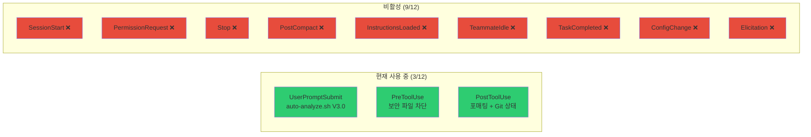
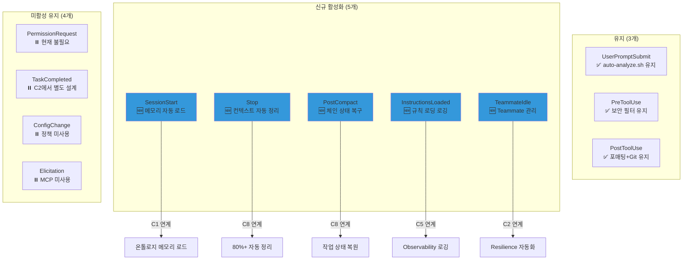
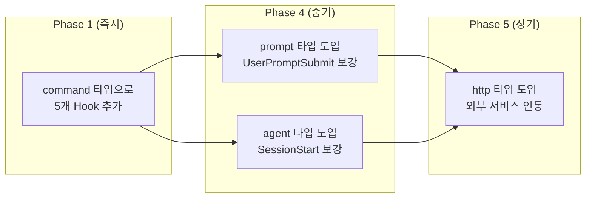
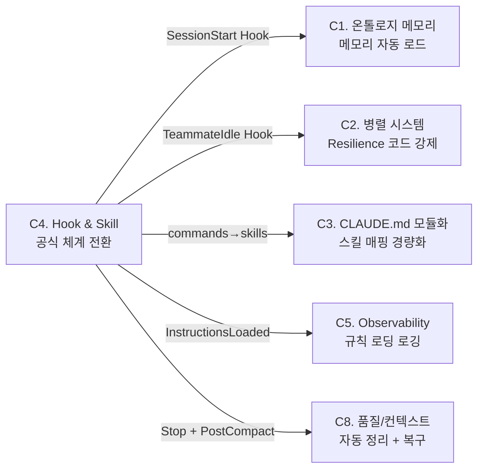

## 🔄 Next Session Handoff

### 현재 상태
- 이 문서의 완성도: completed
- 마지막 작업: C4 Hook & Skill 공식 체계 전환 심층 설계 — Hook 확장 5개, Hook 타입 도입, commands/ → skills/ 마이그레이션 13개, Phase별 구현 단계

### 다음 작업 (TODO)
- [ ] Phase 1 실행: SessionStart Hook 구현 (`session-start.sh`) — C1 메모리 자동 로드 연계
- [ ] Phase 1 실행: PostCompact Hook 구현 (`post-compact.sh`) — 체인 상태 복구
- [ ] Phase 1 실행: Stop Hook 구현 (`stop-cleanup.sh`) — 80%+ 컨텍스트 자동 정리 (C8 연계)
- [ ] Phase 2 실행: InstructionsLoaded, TeammateIdle Hook 구현 + settings.json 등록
- [ ] Phase 3 실행: commands/ 13개 → skills/ 마이그레이션 (commit-push 프로토타입 먼저)
- [ ] Phase 4 실행: prompt/agent Hook 타입 도입 (메모리 요약 생성, 메모리 검색 에이전트)
- [ ] 전체 검증: T-1 ~ T-10 시나리오 실행

### 작업 조언
> [!tip] 다음 Claude Code에게
> - **대전제**: 공식 우선 → 공식 강화 → 자체 개발. 현재 command 타입만 사용 중인 것을 4가지 타입으로 확장
> - Hook은 `settings.json`의 `hooks` 섹션에 등록 — 이벤트별 배열 구조
> - skills/는 이미 `~/.claude/skills/`에 14개 공식 스킬이 존재 — 여기에 commands/ 13개를 추가 마이그레이션
> - [[02_001_Claude_Code_Official_Docs_Core_Engine#4. Hook 시스템 심층 분석|공식 Hook 12종]]이 기술 레퍼런스
> - [[02_001_Claude_Code_Official_Docs_Core_Engine#5. 스킬 시스템|공식 스킬 시스템]]이 마이그레이션 레퍼런스
> - C1(온톨로지 메모리), C2(병렬 시스템), C8(품질/컨텍스트)과 교차 의존성이 높음
> - Phase 1(핵심 Hook 3개)이 가장 높은 ROI — 즉시 시스템 안정성 개선
> - Stop Hook의 컨텍스트 사용량 체크는 공식 API 미제공 → 추정 기반 (토큰 카운트 스크립트)

---

# C4. Hook & Skill 공식 체계 전환 심층 설계

> **상위 문서**: [[01_001_Improvement_Direction_Overview#C4. Hook & Skill 공식 체계 전환|C4 개선 방향]]
> **대전제**: [[01_001_Improvement_Direction_Overview#1.5 개선 대전제|공식 우선 → 공식 강화 → 자체 개발]]
> **공식 레퍼런스**: [[02_001_Claude_Code_Official_Docs_Core_Engine#4. Hook 시스템 심층 분석|Hook 12종]] / [[02_001_Claude_Code_Official_Docs_Core_Engine#5. 스킬 시스템|Skill 시스템]]

---

## 1. 설계 목표

### 1.1 한 문장 목표

> **Hook 이벤트 12개 중 8개를 활성화하고, 4가지 Hook 타입을 모두 도입하며, commands/ 13개를 공식 skills/로 마이그레이션하여 Claude Code 공식 체계와 완전히 정합되는 시스템을 구축한다.**

### 1.2 구체적 목표

| 항목 | 현재 (V4.2.1) | 목표 (V5.0) | 대전제 |
|------|-------------|------------|--------|
| **Hook 이벤트** | 3/12 사용 | 8/12 사용 | 1순위 (공식 사용) |
| **Hook 타입** | command만 | command + prompt + agent (+ http 예비) | 1순위 (공식 사용) |
| **Skill 위치** | `~/.claude/commands/` 13개 | `~/.claude/skills/` 통합 | 1순위 (공식 사용) |
| **Skill 형식** | 단순 마크다운 | SKILL.md + frontmatter | 2순위 (공식 강화) |
| **Hook-Skill 연계** | 없음 | Hook이 Skill 트리거, Skill이 Hook 활용 | 2순위 (공식 강화) |

### 1.3 **하지 않는 것**

| 하지 않는 것 | 이유 |
|-------------|------|
| 기존 skills/ 14개 수정 | 이미 공식 구조로 잘 동작 중 |
| HTTP Hook 즉시 도입 | 외부 서비스 연동이 아직 불필요 |
| Hook에서 직접 LLM 호출 | prompt/agent 타입이 공식 지원 |
| auto-analyze.sh 재작성 | V3.0이 안정적, V5.0에서 점진 확장 |

---

## 2. 현재 상태 분석

### 2.1 Hook 현황



**현재 `settings.json` Hook 구조**:

```json
{
  "hooks": {
    "UserPromptSubmit": [{
      "hooks": [{
        "type": "command",
        "command": "/Users/changjaeyou/.claude/hooks/auto-analyze.sh"
      }]
    }],
    "PreToolUse": [{
      "matcher": "Write|Edit",
      "hooks": [{
        "type": "command",
        "command": "if echo $CLAUDE_TOOL_INPUT | grep -qE '\\.env|\\.secret|credentials|password'; then echo '... 차단' && exit 1; fi"
      }]
    }],
    "PostToolUse": [{
      "matcher": "Write|Edit",
      "hooks": [
        { "type": "command", "command": "echo '[파일 수정 완료]'" },
        { "type": "command", "command": "/* 포매팅 스크립트 */" },
        { "type": "command", "command": "if [ -d .git ]; then git status -s 2>/dev/null | head -5; fi" }
      ]
    }],
    "SessionStart": []
  }
}
```

> [!warning] 핵심 문제
> - `SessionStart`가 빈 배열 — 메모리 자동 로드 부재 ([[02_001_C1_Ontology_Memory_Deep_Design#1.2 구체적 목표|C1 GAP]])
> - Stop/PostCompact 미등록 — 작업 중단 시 컨텍스트 유실 ([[01_001_Improvement_Direction_Overview#C8. 결과물 품질 극대화|C8 GAP]])
> - TeammateIdle 미등록 — Resilience 규칙이 자연어 강제력 없음 ([[02_002_C2_Parallel_System_Official_Migration#5.1 현재 Resilience 규칙|C2 GAP]])
> - Hook 타입이 command만 — prompt/agent 타입의 LLM 활용 미사용

### 2.2 Commands 현황

**`~/.claude/commands/` — 13개 커맨드 파일**:

| # | 커맨드 | 파일명 | 복잡도 | 설명 |
|---|--------|--------|--------|------|
| 1 | `/commit-push` | `commit-push.md` | 낮음 | Git 커밋+푸시 |
| 2 | `/pr-review` | `pr-review.md` | 중간 | PR diff 리뷰 |
| 3 | `/readme-gen` | `readme-gen.md` | 중간 | README 자동 생성 |
| 4 | `/analyze` | `analyze.md` | 높음 | 프롬프트 4-Layer 분석 |
| 5 | `/memory-save` | `memory-save.md` | 높음 | 메모리 수동 저장 |
| 6 | `/project-review` | `project-review.md` | 높음 | 프로젝트 전체 리뷰 |
| 7 | `/rails-init` | `rails-init.md` | 높음 | Rails 프로젝트 초기화 |
| 8 | `/rails-prd` | `rails-prd.md` | 높음 | PRD 자동 생성 |
| 9 | `/rails-plan` | `rails-plan.md` | 높음 | 작업계획서 생성 |
| 10 | `/rails-dev` | `rails-dev.md` | 높음 | TDD 기반 개발 |
| 11 | `/rails-test` | `rails-test.md` | 중간 | 테스트 실행/검증 |
| 12 | `/rails-deploy` | `rails-deploy.md` | 높음 | Kamal 2 배포 |
| 13 | `/rails-verify` | `rails-verify.md` | 중간 | 프로덕션 검증 |

### 2.3 기존 Skills 현황

**`~/.claude/skills/` — 이미 14개 공식 스킬 존재**:

| # | 스킬 | 디렉토리 | 출처 |
|---|------|---------|------|
| 1 | translation-specialist | `translation-specialist/` | 커스텀 |
| 2 | theme-factory | `theme-factory/` | 커스텀 |
| 3 | doc-coauthoring | `doc-coauthoring/` | 커스텀 |
| 4 | xlsx | `xlsx/` | 커스텀 |
| 5 | pdf | `pdf/` | 커스텀 |
| 6 | algorithmic-art | `algorithmic-art/` | 커스텀 |
| 7 | internal-comms | `internal-comms/` | 번들 |
| 8 | skill-creator | `skill-creator/` | 번들 |
| 9 | canvas-design | `canvas-design/` | 커스텀 |
| 10 | pptx | `pptx/` | 커스텀 |
| 11 | slack-gif-creator | `slack-gif-creator/` | 커스텀 |
| 12 | webapp-testing | `webapp-testing/` | 커스텀 |
| 13 | frontend-design | `frontend-design/` | 커스텀 |
| 14 | mcp-builder | `mcp-builder/` | 번들 |
| 15 | brand-guidelines | `brand-guidelines/` | 커스텀 |
| 16 | docx | `docx/` | 커스텀 |
| 17 | web-artifacts-builder | `web-artifacts-builder/` | 커스텀 |
| 18 | claude-strategy | `claude-strategy/` | 번들 |
| 19 | vibe-dev | `vibe-dev/` | 번들 |

> [!note] 핵심 발견
> `commands/` 13개와 `skills/` 19개가 **별도로 공존**하고 있다. 공식 문서에 의하면 "Custom commands have been merged into skills. `.claude/commands/` 는 계속 작동하나 동일 이름이면 skill 우선." 따라서 commands/를 skills/로 마이그레이션하는 것이 공식 방향과 일치한다.

---

## 3. Hook 확장 설계 (3/12 → 8/12)

### 3.1 확장 대상 선정



### 3.2 Hook별 상세 설계

---

#### 3.2.1 SessionStart Hook — 메모리 자동 로드

> **연계**: [[02_001_C1_Ontology_Memory_Deep_Design#4.3 Hook 통합 설계|C1 Hook 통합]]

**목적**: 세션 시작 시 최근 메모리와 이전 작업 컨텍스트를 자동 로드하여 "어제 뭐 했지?" 문제를 해결

**공식 스펙** ([[02_001_Claude_Code_Official_Docs_Core_Engine#4.1 전체 Hook 이벤트|Hook 12종]]):
- 발생 시점: 세션 시작/재개
- 제어 가능: No (차단 불가, 컨텍스트 주입만)
- stdin: `{"sessionId": "...", "isResume": true/false}`

**구현: `~/.claude/hooks/session-start.sh`**

```bash
#!/bin/bash
# SessionStart Hook: 세션 시작 시 메모리 자동 로드
# V1.0 (2026-03-15)
#
# 기능:
# 1. 최근 메모리 3개의 요약 로드
# 2. 이전 세션의 TODO/Handoff 정보 로드
# 3. (Phase 2) 벡터 DB 기반 관련 메모리 검색

# stdin에서 JSON 입력 받기
INPUT=$(cat)
SESSION_ID=$(echo "$INPUT" | jq -r '.sessionId // empty')
IS_RESUME=$(echo "$INPUT" | jq -r '.isResume // false')

# === Teammate 세션 감지 → 스킵 ===
if [ "$CLAUDE_CODE_AGENT_TEAM_ROLE" = "teammate" ]; then
    exit 0
fi

# === 메모리 디렉토리 확인 ===
MEMORY_DIR="$HOME/.claude/memory"
if [ ! -d "$MEMORY_DIR" ]; then
    exit 0
fi

# === 최근 메모리 3개 로드 ===
RECENT_MEMORIES=""
MEMORY_FILES=$(ls -t "$MEMORY_DIR"/*.md 2>/dev/null | head -3)

if [ -n "$MEMORY_FILES" ]; then
    RECENT_MEMORIES="
## 최근 메모리 (자동 로드)
"
    for FILE in $MEMORY_FILES; do
        FILENAME=$(basename "$FILE")
        # frontmatter에서 제목 추출 시도, 없으면 파일명 사용
        TITLE=$(head -10 "$FILE" | grep -E '^# ' | head -1 | sed 's/^# //')
        if [ -z "$TITLE" ]; then
            TITLE="$FILENAME"
        fi
        # 요약 (메타 정보의 요약 필드 또는 첫 100자)
        SUMMARY=$(grep -A1 '요약' "$FILE" 2>/dev/null | tail -1 | head -c 100)
        if [ -z "$SUMMARY" ]; then
            SUMMARY=$(grep -v '^#\|^-\|^>\|^$\|^---' "$FILE" | head -2 | tr '\n' ' ' | head -c 100)
        fi
        RECENT_MEMORIES="$RECENT_MEMORIES- **$TITLE** ($FILENAME): $SUMMARY
"
    done
fi

# === 이전 세션 TODO 로드 (resume 시) ===
TODO_CONTEXT=""
if [ "$IS_RESUME" = "true" ]; then
    # 가장 최근 메모리에서 TODO 항목 추출
    LATEST_FILE=$(ls -t "$MEMORY_DIR"/*.md 2>/dev/null | head -1)
    if [ -n "$LATEST_FILE" ]; then
        TODOS=$(grep -E '^\- \[ \]' "$LATEST_FILE" 2>/dev/null | head -5)
        if [ -n "$TODOS" ]; then
            TODO_CONTEXT="
## 이전 세션 미완료 TODO
$TODOS
"
        fi
    fi
fi

# === 최종 출력 ===
if [ -n "$RECENT_MEMORIES" ] || [ -n "$TODO_CONTEXT" ]; then
    CONTEXT="$RECENT_MEMORIES$TODO_CONTEXT"
    jq -n --arg ctx "$CONTEXT" '{
        "hookSpecificOutput": {
            "hookEventName": "SessionStart",
            "additionalContext": $ctx
        }
    }'
fi

exit 0
```

**settings.json 등록**:

```json
"SessionStart": [{
  "hooks": [{
    "type": "command",
    "command": "/Users/changjaeyou/.claude/hooks/session-start.sh"
  }]
}]
```

---

#### 3.2.2 PostCompact Hook — 체인 상태 복구 + 메모리 저장

> **연계**: [[01_001_Improvement_Direction_Overview#C8. 결과물 품질 극대화|C8 PostCompact 설계]]

**목적**: /compact 실행 후 작업 컨텍스트를 자동 복원하여 "컴팩션 후 맥락 유실" 문제를 해결

**공식 스펙**:
- 발생 시점: 컴팩션 완료 후
- 제어 가능: No
- stdin: `{"sessionId": "...", "compactReason": "auto|manual", "summaryLength": 1234}`

**구현: `~/.claude/hooks/post-compact.sh`**

```bash
#!/bin/bash
# PostCompact Hook: 컴팩션 후 작업 상태 복구
# V1.0 (2026-03-15)
#
# 기능:
# 1. 컴팩션 발생 로깅 (C5 Observability)
# 2. 최근 메모리에서 작업 컨텍스트 재주입
# 3. 진행 중이던 체인/작업 정보 복원

INPUT=$(cat)
SESSION_ID=$(echo "$INPUT" | jq -r '.sessionId // empty')
COMPACT_REASON=$(echo "$INPUT" | jq -r '.compactReason // "unknown"')

# === Teammate 감지 → 스킵 ===
if [ "$CLAUDE_CODE_AGENT_TEAM_ROLE" = "teammate" ]; then
    exit 0
fi

# === 로깅 (C5 Observability) ===
LOG_DIR="$HOME/.claude/logs"
mkdir -p "$LOG_DIR"
echo "[$(date +%Y-%m-%d\ %H:%M)] PostCompact | reason=$COMPACT_REASON | session=$SESSION_ID" \
    >> "$LOG_DIR/$(date +%Y%m%d).log"

# === 작업 상태 복원 ===
# 컴팩션 전 저장된 상태 파일 확인
STATE_FILE="/tmp/claude_chain_state_${SESSION_ID}.json"
RESTORE_CONTEXT=""

if [ -f "$STATE_FILE" ]; then
    CHAIN_NAME=$(jq -r '.chain // empty' "$STATE_FILE" 2>/dev/null)
    CURRENT_STEP=$(jq -r '.step // empty' "$STATE_FILE" 2>/dev/null)
    TASK_SUMMARY=$(jq -r '.summary // empty' "$STATE_FILE" 2>/dev/null)

    if [ -n "$CHAIN_NAME" ]; then
        RESTORE_CONTEXT="
## 작업 상태 복원 (PostCompact)
- **진행 중 체인**: $CHAIN_NAME
- **현재 단계**: $CURRENT_STEP
- **작업 요약**: $TASK_SUMMARY

> [!important] 컴팩션 발생 ($COMPACT_REASON). 위 작업을 이어서 진행하세요.
"
    fi
fi

# === 최근 메모리 요약 재주입 ===
MEMORY_DIR="$HOME/.claude/memory"
LATEST_FILE=$(ls -t "$MEMORY_DIR"/*.md 2>/dev/null | head -1)

if [ -n "$LATEST_FILE" ] && [ -z "$RESTORE_CONTEXT" ]; then
    TITLE=$(head -10 "$LATEST_FILE" | grep -E '^# ' | head -1 | sed 's/^# //')
    TODOS=$(grep -E '^\- \[ \]' "$LATEST_FILE" 2>/dev/null | head -5)

    RESTORE_CONTEXT="
## 작업 상태 복원 (PostCompact)
- **최근 작업**: $TITLE
- **미완료 TODO**:
$TODOS

> [!important] 컴팩션 발생 ($COMPACT_REASON). 이전 작업 컨텍스트를 참조하여 진행하세요.
"
fi

# === 출력 ===
if [ -n "$RESTORE_CONTEXT" ]; then
    jq -n --arg ctx "$RESTORE_CONTEXT" '{
        "hookSpecificOutput": {
            "hookEventName": "PostCompact",
            "additionalContext": $ctx
        }
    }'
fi

exit 0
```

---

#### 3.2.3 Stop Hook — 컨텍스트 자동 정리

> **연계**: [[01_001_Improvement_Direction_Overview#C8. 결과물 품질 극대화|C8 Stop Hook 설계]]

**목적**: Claude 응답 완료 시 컨텍스트 사용량을 체크하고, 80% 이상이면 메모리 저장 + 자동 /compact 지시

**공식 스펙** ([[02_001_Claude_Code_Official_Docs_Core_Engine#4.3 Exit Code 2 동작|Exit Code 2]]):
- 발생 시점: Claude 응답 완료
- 제어 가능: **Yes** (exit code 2 = 정지 방지, 계속 작업)
- stdin: `{"sessionId": "...", "stopReason": "end_turn|max_tokens"}`

**구현: `~/.claude/hooks/stop-cleanup.sh`**

```bash
#!/bin/bash
# Stop Hook: 응답 완료 시 컨텍스트 자동 관리
# V1.0 (2026-03-15)
#
# 기능:
# 1. 응답 완료 로깅 (C5 Observability)
# 2. 컨텍스트 사용량 추정 (토큰 기반)
# 3. 80%+ 시 메모리 저장 + /compact 지시 (exit code 2로 계속)

INPUT=$(cat)
SESSION_ID=$(echo "$INPUT" | jq -r '.sessionId // empty')
STOP_REASON=$(echo "$INPUT" | jq -r '.stopReason // "end_turn"')

# === Teammate 감지 → 스킵 ===
if [ "$CLAUDE_CODE_AGENT_TEAM_ROLE" = "teammate" ]; then
    exit 0
fi

# === 로깅 ===
LOG_DIR="$HOME/.claude/logs"
mkdir -p "$LOG_DIR"
echo "[$(date +%Y-%m-%d\ %H:%M)] Stop | reason=$STOP_REASON | session=$SESSION_ID" \
    >> "$LOG_DIR/$(date +%Y%m%d).log"

# === 컨텍스트 사용량 추정 ===
# 방법: 현재 세션의 대화 길이를 기반으로 추정
# 공식 API 미제공 → 대화 턴 수 + 도구 호출 수 기반 휴리스틱
STATE_FILE="/tmp/claude_context_tracker_${SESSION_ID}.json"

if [ -f "$STATE_FILE" ]; then
    TURN_COUNT=$(jq -r '.turns // 0' "$STATE_FILE" 2>/dev/null)
    TOOL_CALLS=$(jq -r '.toolCalls // 0' "$STATE_FILE" 2>/dev/null)

    # 휴리스틱: 턴당 ~5K 토큰, 도구 호출당 ~2K 토큰 추정
    # 1M 컨텍스트 기준 80% = 800K 토큰
    ESTIMATED_TOKENS=$(( (TURN_COUNT * 5000) + (TOOL_CALLS * 2000) ))
    USAGE_PERCENT=$(( (ESTIMATED_TOKENS * 100) / 1000000 ))

    if [ "$USAGE_PERCENT" -ge 80 ]; then
        CLEANUP_MSG="
## 컨텍스트 자동 정리 필요 (추정 ${USAGE_PERCENT}%)

> [!warning] 컨텍스트 사용량이 80%를 초과했습니다.
> 아래 순서대로 실행하세요:

1. **현재 작업 내용을 메모리에 저장** (\`/memory-save\`)
   - 작업 제목, 진행 상태, TODO 포함
   - 다음 세션이 이어받을 수 있도록 상세히 기록
2. **체인 상태 저장** (진행 중인 체인이 있으면)
3. **\`/compact\` 실행**하여 컨텍스트 정리
"
        jq -n --arg ctx "$CLEANUP_MSG" '{
            "hookSpecificOutput": {
                "hookEventName": "Stop",
                "additionalContext": $ctx
            }
        }'
        exit 2  # 정지 방지 — Claude가 정리 작업을 수행하도록 계속
    fi
else
    # 상태 파일 없으면 초기화
    jq -n '{"turns": 1, "toolCalls": 0}' > "$STATE_FILE"
fi

exit 0
```

**컨텍스트 추적 보조 스크립트** (PostToolUse에 추가):

```bash
# PostToolUse에 추가할 컨텍스트 추적 코드
STATE_FILE="/tmp/claude_context_tracker_${CLAUDE_SESSION_ID}.json"
if [ -f "$STATE_FILE" ]; then
    TOOL_CALLS=$(jq -r '.toolCalls // 0' "$STATE_FILE")
    jq --argjson tc $((TOOL_CALLS + 1)) '.toolCalls = $tc' "$STATE_FILE" > "${STATE_FILE}.tmp" \
        && mv "${STATE_FILE}.tmp" "$STATE_FILE"
fi
```

---

#### 3.2.4 InstructionsLoaded Hook — 규칙 로딩 로깅

> **연계**: C5 Observability

**목적**: 어떤 CLAUDE.md/rules 파일이 언제, 왜 로딩되었는지 감사(audit) 로깅. 디버깅과 규칙 충돌 추적에 활용.

**공식 스펙** ([[02_001_Claude_Code_Official_Docs_Core_Engine#2.8 InstructionsLoaded Hook|InstructionsLoaded]]):
- 발생 시점: CLAUDE.md 또는 rules 파일 로딩 시
- 제어 가능: No (감사 전용, 차단 불가)
- stdin: `{"file_path": "...", "memory_type": "User|Project|Local|Managed", "load_reason": "session_start|nested_traversal|path_glob_match|include"}`

**구현: `~/.claude/hooks/instructions-loaded.sh`**

```bash
#!/bin/bash
# InstructionsLoaded Hook: 규칙 파일 로딩 감사 로그
# V1.0 (2026-03-15)

INPUT=$(cat)
FILE_PATH=$(echo "$INPUT" | jq -r '.file_path // empty')
MEMORY_TYPE=$(echo "$INPUT" | jq -r '.memory_type // empty')
LOAD_REASON=$(echo "$INPUT" | jq -r '.load_reason // empty')

# 로깅
LOG_DIR="$HOME/.claude/logs"
mkdir -p "$LOG_DIR"
echo "[$(date +%Y-%m-%d\ %H:%M)] InstructionsLoaded | file=$FILE_PATH | type=$MEMORY_TYPE | reason=$LOAD_REASON" \
    >> "$LOG_DIR/$(date +%Y%m%d).log"

exit 0
```

---

#### 3.2.5 TeammateIdle Hook — Teammate 관리

> **연계**: [[02_002_C2_Parallel_System_Official_Migration#5.3 TeammateIdle Hook 설계|C2 Resilience]]

**목적**: Teammate가 유휴 상태일 때 자동으로 재활성화하거나 종료하여 Resilience를 코드로 강제

**공식 스펙** ([[02_001_Claude_Code_Official_Docs_Core_Engine#4.3 Exit Code 2 동작|Exit Code 2]]):
- 발생 시점: 팀원 유휴 직전
- 제어 가능: **Yes** (exit code 2 = 정지 방지)
- stdin: `{"teammateId": "...", "idleDuration": 120, "lastActivity": "..."}`

**구현: `~/.claude/hooks/teammate-idle.sh`**

```bash
#!/bin/bash
# TeammateIdle Hook: Teammate 유휴 관리
# V1.0 (2026-03-15)
#
# V4.2.1 CLAUDE.md의 자연어 규칙을 코드로 강제 실행:
# - 120초 무응답 → 재활성화 시도 (exit code 2)
# - 300초 정체 → 종료 허용 (exit code 0)

INPUT=$(cat)
TEAMMATE_ID=$(echo "$INPUT" | jq -r '.teammateId // empty')
IDLE_DURATION=$(echo "$INPUT" | jq -r '.idleDuration // 0')
LAST_ACTIVITY=$(echo "$INPUT" | jq -r '.lastActivity // empty')

# === 로깅 ===
LOG_DIR="$HOME/.claude/logs"
mkdir -p "$LOG_DIR"
echo "[$(date +%Y-%m-%d\ %H:%M)] TeammateIdle | id=$TEAMMATE_ID | idle=${IDLE_DURATION}s | last=$LAST_ACTIVITY" \
    >> "$LOG_DIR/$(date +%Y%m%d).log"

# === 유휴 시간 기반 판단 ===
if [ "$IDLE_DURATION" -ge 300 ]; then
    # 300초 이상 정체 → 종료 허용
    jq -n '{
        "hookSpecificOutput": {
            "hookEventName": "TeammateIdle",
            "additionalContext": "Teammate 300초 이상 정체 — 자동 종료 허용. Lead가 직접 수행하거나 재할당하세요."
        }
    }'
    exit 0  # 종료 허용
elif [ "$IDLE_DURATION" -ge 120 ]; then
    # 120초 이상 무응답 → 재활성화 시도
    jq -n '{
        "hookSpecificOutput": {
            "hookEventName": "TeammateIdle",
            "additionalContext": "Teammate 120초 무응답 — 재활성화 시도. 할당된 작업을 계속 진행하세요."
        }
    }'
    exit 2  # 정지 방지 — Teammate 유지하고 재활성화
fi

# 120초 미만 → 정상 유휴, 아무 조치 없음
exit 0
```

---

### 3.3 Hook 확장 전후 비교

| Hook 이벤트 | V4.2.1 | V5.0 | 타입 | 연계 |
|------------|--------|------|------|------|
| SessionStart | ❌ 빈 배열 | ✅ 메모리 자동 로드 | command | C1 |
| UserPromptSubmit | ✅ auto-analyze.sh | ✅ 유지 (V5.0에서 벡터 검색 추가) | command | C1 |
| PreToolUse | ✅ 보안 필터 | ✅ 유지 | command | - |
| PermissionRequest | ❌ | ❌ (현재 불필요) | - | - |
| PostToolUse | ✅ 포매팅+Git | ✅ 유지 + 컨텍스트 추적 추가 | command | C5 |
| **Stop** | ❌ | ✅ **80%+ 자동 정리** | command | **C8** |
| **PostCompact** | ❌ | ✅ **체인 상태 복구** | command | **C8** |
| **InstructionsLoaded** | ❌ | ✅ **규칙 로딩 로깅** | command | **C5** |
| **TeammateIdle** | ❌ | ✅ **Teammate 관리** | command | **C2** |
| TaskCompleted | ❌ | ⏸️ C2에서 별도 설계 완료 | - | C2 |
| ConfigChange | ❌ | ⏸️ | - | - |
| Elicitation | ❌ | ⏸️ | - | - |

**결과**: 3/12 → **8/12** (활성화율 25% → 67%)

---

## 4. Hook 타입 확장 설계

### 4.1 현재 vs 목표

| 타입 | 현재 | V5.0 목표 | 용도 |
|------|------|----------|------|
| **command** | ✅ 유일하게 사용 | ✅ 유지 (메인) | 셸 스크립트, 빠른 처리 |
| **prompt** | ❌ 미사용 | ✅ **도입** | LLM 단일 턴 평가/요약 생성 |
| **agent** | ❌ 미사용 | ✅ **도입** | 서브에이전트로 검증 (도구 접근) |
| **http** | ❌ 미사용 | ⏸️ 예비 | 외부 서비스 연동 (향후) |

### 4.2 prompt 타입 도입 방안

**적용 대상**: UserPromptSubmit Hook에 추가 — 메모리 요약 생성

**현재 방식 (command)**:
```
프롬프트 → auto-analyze.sh (셸) → prompt_analyzer.py (Python) → 결과 주입
```

**향후 방식 (command + prompt)**:
```
프롬프트 → auto-analyze.sh (command, 4-Layer 분석)
        → 메모리 요약 생성 (prompt, LLM 단일 턴)
        → 결과 통합 주입
```

**설정 예시**:

```json
"UserPromptSubmit": [{
  "hooks": [
    {
      "type": "command",
      "command": "/Users/changjaeyou/.claude/hooks/auto-analyze.sh"
    },
    {
      "type": "prompt",
      "prompt": "다음 프롬프트와 관련된 이전 작업 맥락을 30단어 이내로 요약하세요. 프롬프트: {{prompt}}"
    }
  ]
}]
```

> [!note] prompt 타입의 장점
> - 셸 스크립트로는 불가능한 **의미 분석**을 LLM이 직접 수행
> - 별도 Python 스크립트 없이 LLM 평가 가능
> - 컨텍스트 내 정보를 기반으로 동적 판단

### 4.3 agent 타입 도입 방안

**적용 대상**: SessionStart Hook — 메모리 검색 에이전트

**현재 방식**: 없음 (세션 시작 시 빈 배열)

**향후 방식 (command + agent)**:

```json
"SessionStart": [{
  "hooks": [
    {
      "type": "command",
      "command": "/Users/changjaeyou/.claude/hooks/session-start.sh"
    },
    {
      "type": "agent",
      "agent": {
        "name": "memory-loader",
        "description": "세션 시작 시 관련 메모리를 검색하고 요약하는 에이전트",
        "model": "haiku",
        "tools": ["Read", "Glob", "Grep"],
        "maxTurns": 3,
        "prompt": "~/.claude/memory/ 폴더에서 최근 3개 메모리 파일을 읽고, 핵심 내용을 요약하여 additionalContext로 반환하세요."
      }
    }
  ]
}]
```

> [!note] agent 타입의 장점
> - 파일 시스템 접근이 가능 (Read, Glob, Grep 도구)
> - 복잡한 메모리 검색 로직을 에이전트가 수행
> - Haiku 모델로 비용 최소화
> - C1 온톨로지 메모리 MCP 서버 구축 전 **중간 단계** 솔루션

### 4.4 Hook 타입 전환 로드맵



---

## 5. commands/ → skills/ 마이그레이션 설계

### 5.1 마이그레이션 원칙

**공식 근거** ([[02_001_Claude_Code_Official_Docs_Core_Engine#5.1 스킬 = 명령어 통합|스킬 시스템]]):
> "Custom commands have been merged into skills. `.claude/commands/` 는 계속 작동하나 동일 이름이면 skill 우선."

| 원칙 | 설명 |
|------|------|
| **1:1 대응** | 각 command → 동일 이름의 skill 디렉토리 |
| **기능 보존** | 기존 동작 100% 유지 |
| **frontmatter 추가** | name, description, user-invocable, allowed-tools |
| **점진적 전환** | 한 번에 전체가 아닌 그룹별 전환 |
| **commands/ 보존** | 전환 후에도 commands/ 폴더는 삭제하지 않음 (호환성) |

### 5.2 마이그레이션 매핑

| # | 커맨드 | 스킬 디렉토리 | frontmatter 키 필드 | 그룹 |
|---|--------|-------------|-------------------|------|
| 1 | `/commit-push` | `skills/commit-push/SKILL.md` | `allowed-tools: [Bash]` | A: Git |
| 2 | `/pr-review` | `skills/pr-review/SKILL.md` | `allowed-tools: [Bash, Read, Grep]` | A: Git |
| 3 | `/readme-gen` | `skills/readme-gen/SKILL.md` | `allowed-tools: [Read, Write, Glob]` | B: 유틸 |
| 4 | `/analyze` | `skills/analyze/SKILL.md` | `allowed-tools: [Bash]` | B: 유틸 |
| 5 | `/memory-save` | `skills/memory-save/SKILL.md` | `allowed-tools: [Read, Write, Glob]` | B: 유틸 |
| 6 | `/project-review` | `skills/project-review/SKILL.md` | `allowed-tools: [Read, Write, Glob, Grep]` | A: Git |
| 7 | `/rails-init` | `skills/rails-init/SKILL.md` | `allowed-tools: [Bash, Write, Edit]` | C: Rails |
| 8 | `/rails-prd` | `skills/rails-prd/SKILL.md` | `allowed-tools: [Read, Write]` | C: Rails |
| 9 | `/rails-plan` | `skills/rails-plan/SKILL.md` | `allowed-tools: [Read, Write]` | C: Rails |
| 10 | `/rails-dev` | `skills/rails-dev/SKILL.md` | `allowed-tools: [Bash, Read, Write, Edit]` | C: Rails |
| 11 | `/rails-test` | `skills/rails-test/SKILL.md` | `allowed-tools: [Bash, Read]` | C: Rails |
| 12 | `/rails-deploy` | `skills/rails-deploy/SKILL.md` | `allowed-tools: [Bash, Read]` | C: Rails |
| 13 | `/rails-verify` | `skills/rails-verify/SKILL.md` | `allowed-tools: [Bash, Read]` | C: Rails |

### 5.3 Skill 변환 예시 — `/commit-push`

**현재 (`commands/commit-push.md`)**:

```markdown
---
description: 변경사항을 커밋하고 푸시합니다
---

현재 변경사항을 확인하고 커밋 후 푸시해주세요.

1. `git status`로 변경사항 확인
2. 변경된 파일들을 스테이징 (`git add`)
3. Conventional Commit 형식으로 커밋 메시지 작성
4. `git push origin [현재브랜치]`로 푸시
5. 결과 보고

커밋 메시지 형식:
- feat: 새 기능
- fix: 버그 수정
...

Co-Authored-By: Claude Opus 4.5 <noreply@anthropic.com> 포함
```

**목표 (`skills/commit-push/SKILL.md`)**:

```markdown
---
name: commit-push
description: 현재 변경사항을 Conventional Commit 형식으로 커밋하고 원격에 푸시합니다. Git 작업을 자동화합니다.
user-invocable: true
allowed-tools: [Bash]
---

# Commit & Push

변경사항을 Conventional Commit 형식으로 커밋하고 푸시하는 스킬입니다.

## 실행 단계

### 1. 변경사항 확인

```bash
git status
git diff --stat
```

### 2. 스테이징

변경된 파일 중 의미 있는 파일만 선별적으로 스테이징:

```bash
git add [선별된 파일]
```

> [!warning] `.env`, `credentials`, `*.secret` 파일은 절대 스테이징하지 않는다.

### 3. 커밋 메시지 작성

Conventional Commit 형식:

| 접두사 | 용도 |
|--------|------|
| `feat:` | 새 기능 |
| `fix:` | 버그 수정 |
| `docs:` | 문서 변경 |
| `refactor:` | 리팩토링 |
| `chore:` | 기타 변경 |
| `test:` | 테스트 추가/수정 |
| `style:` | 서식 변경 |

```bash
git commit -m "type: 설명

- 변경사항 1
- 변경사항 2

Co-Authored-By: Claude Opus 4.6 (1M context) <noreply@anthropic.com>"
```

### 4. 푸시

```bash
git push origin $(git branch --show-current)
```

### 5. 결과 보고

커밋 해시, 브랜치명, 변경 파일 수를 보고합니다.
```

### 5.4 Skill 변환 예시 — `/memory-save`

**목표 (`skills/memory-save/SKILL.md`)**:

```markdown
---
name: memory-save
description: 현재 세션의 작업 내용을 메모리에 저장합니다. 최근 3개 메모리를 확인하여 중복을 방지하고, YYMM_SEQ_keyword.md 형식으로 저장합니다.
user-invocable: true
allowed-tools: [Read, Write, Glob, Grep]
---

# Memory Save

현재 세션의 작업 내용을 `~/.claude/memory/` 폴더에 기록하는 스킬입니다.

## 저장 내용
$ARGUMENTS (저장할 내용 요약 또는 키워드)

## 실행 단계

### 1. 메모리 디렉토리 확인
`~/.claude/memory/` 폴더 존재 확인 (없으면 생성)

### 2. 중복 방지 — 최근 메모리 3개 확인
- 최근 파일 목록 확인
- 각 파일의 제목/요약 확인
- 현재 작업과 중복 여부 판단

### 3. 저장 판단
- **중복 시**: 기존 파일에 "## 추가 내용" 섹션으로 업데이트
- **새 내용 시**: 다음 순번으로 새 파일 생성

### 4. 문서 형식

```
# [작업 제목]

## 사용자 프롬프트
> [원본 요청]

## 메타 정보
- **작성일**: YYYY-MM-DD
- **요약**: [1-2문장]
- **시사점**: [핵심 인사이트]

## 사용된 도구
### Chain / Agents / Skills / Tools

## 내용
[상세 작업 내용]

## 관련 메모리
[연관 이전 메모리]
```

### 5. 파일명 규칙
- **형식**: `YYMM_SEQ_keyword.md`
- **YYMM**: 연월, **SEQ**: 월별 시퀀스 001~999
- **keyword**: 작업 키워드 (snake_case)

### 6. 완료 보고
저장 완료 표시
```

### 5.5 Rails 스킬 그룹 — 디렉토리 구조

Rails 7개 커맨드는 하나의 상위 구조로 관리:

```
~/.claude/skills/
├── rails-init/
│   └── SKILL.md
├── rails-prd/
│   └── SKILL.md
├── rails-plan/
│   └── SKILL.md
├── rails-dev/
│   └── SKILL.md
├── rails-test/
│   └── SKILL.md
├── rails-deploy/
│   └── SKILL.md
└── rails-verify/
    └── SKILL.md
```

> [!note] 각 Rails 스킬은 독립 디렉토리이지만, `description`에 RailsDevChain 내 순서를 명시하여 체인 흐름을 유지한다.

### 5.6 마이그레이션 전후 비교

| 항목 | commands/ (현재) | skills/ (목표) |
|------|----------------|---------------|
| **파일 형식** | 단일 .md | SKILL.md + 보조 파일 |
| **frontmatter** | `description`만 | `name`, `description`, `user-invocable`, `allowed-tools` 등 |
| **호출 방식** | `/커맨드명` | `/스킬명` (동일) |
| **자동 호출** | 불가 | `description` 기반 Claude 자동 선택 가능 |
| **도구 제한** | 없음 (전체 허용) | `allowed-tools`로 정밀 제어 |
| **컨텍스트** | 없음 | `context: fork` 옵션 (격리 실행) |
| **에이전트 연계** | 없음 | `agent` 필드로 전용 에이전트 지정 |
| **동적 컨텍스트** | `$ARGUMENTS`만 | `$ARGUMENTS` + `!셸명령` + `${CLAUDE_SESSION_ID}` |

---

## 6. settings.json 최종 설계

### 6.1 Hook 섹션 전체 설계

```json
{
  "hooks": {
    "SessionStart": [{
      "hooks": [{
        "type": "command",
        "command": "/Users/changjaeyou/.claude/hooks/session-start.sh"
      }]
    }],

    "UserPromptSubmit": [{
      "hooks": [{
        "type": "command",
        "command": "/Users/changjaeyou/.claude/hooks/auto-analyze.sh"
      }]
    }],

    "PreToolUse": [{
      "matcher": "Write|Edit",
      "hooks": [{
        "type": "command",
        "command": "if echo $CLAUDE_TOOL_INPUT | grep -qE '\\.env|\\.secret|credentials|password'; then echo 'BLOCKED: 보안 파일 수정 차단' && exit 1; fi"
      }]
    }],

    "PostToolUse": [{
      "matcher": "Write|Edit",
      "hooks": [
        {
          "type": "command",
          "command": "echo '[파일 수정 완료]'"
        },
        {
          "type": "command",
          "command": "FILE=\"$CLAUDE_FILE_PATH\"; EXT=\"${FILE##*.}\"; case \"$EXT\" in js|jsx|ts|tsx|json|css|scss|html) if command -v prettier &> /dev/null; then prettier --write \"$FILE\" 2>/dev/null && echo 'Prettier 포매팅 완료' || true; fi ;; py) if command -v black &> /dev/null; then black -q \"$FILE\" 2>/dev/null && echo 'Black 포매팅 완료' || true; fi ;; go) if command -v gofmt &> /dev/null; then gofmt -w \"$FILE\" 2>/dev/null && echo 'Go 포매팅 완료' || true; fi ;; rs) if command -v rustfmt &> /dev/null; then rustfmt \"$FILE\" 2>/dev/null && echo 'Rust 포매팅 완료' || true; fi ;; rb) if command -v rubocop &> /dev/null; then rubocop -A \"$FILE\" 2>/dev/null && echo 'RuboCop 포매팅 완료' || true; fi ;; lua|luau) if command -v stylua &> /dev/null; then stylua \"$FILE\" 2>/dev/null && echo 'StyLua 포매팅 완료' || true; fi ;; esac"
        },
        {
          "type": "command",
          "command": "if [ -d .git ]; then git status -s 2>/dev/null | head -5; fi"
        }
      ]
    }],

    "Stop": [{
      "hooks": [{
        "type": "command",
        "command": "/Users/changjaeyou/.claude/hooks/stop-cleanup.sh"
      }]
    }],

    "PostCompact": [{
      "hooks": [{
        "type": "command",
        "command": "/Users/changjaeyou/.claude/hooks/post-compact.sh"
      }]
    }],

    "InstructionsLoaded": [{
      "hooks": [{
        "type": "command",
        "command": "/Users/changjaeyou/.claude/hooks/instructions-loaded.sh"
      }]
    }],

    "TeammateIdle": [{
      "hooks": [{
        "type": "command",
        "command": "/Users/changjaeyou/.claude/hooks/teammate-idle.sh"
      }]
    }]
  }
}
```

### 6.2 현재 → 목표 diff

| 변경 항목 | 현재 | 목표 |
|----------|------|------|
| SessionStart | `[]` (빈 배열) | `session-start.sh` 등록 |
| Stop | (미등록) | `stop-cleanup.sh` 등록 |
| PostCompact | (미등록) | `post-compact.sh` 등록 |
| InstructionsLoaded | (미등록) | `instructions-loaded.sh` 등록 |
| TeammateIdle | (미등록) | `teammate-idle.sh` 등록 |
| UserPromptSubmit | 유지 | Phase 4에서 prompt 타입 추가 |
| PreToolUse | 유지 | 변경 없음 |
| PostToolUse | 유지 | 컨텍스트 추적 코드 추가 (Phase 2) |

---

## 7. 파일 구조 (최종)

```
~/.claude/
├── hooks/                              ← Hook 스크립트
│   ├── auto-analyze.sh                 ← 유지 (UserPromptSubmit)
│   ├── session-start.sh                ← 🆕 Phase 1 (SessionStart)
│   ├── stop-cleanup.sh                 ← 🆕 Phase 1 (Stop)
│   ├── post-compact.sh                 ← 🆕 Phase 1 (PostCompact)
│   ├── instructions-loaded.sh          ← 🆕 Phase 2 (InstructionsLoaded)
│   └── teammate-idle.sh                ← 🆕 Phase 2 (TeammateIdle)
│
├── commands/                           ← 유지 (하위 호환성)
│   ├── commit-push.md                  ← Phase 3에서 skills/로 복제
│   ├── pr-review.md
│   ├── readme-gen.md
│   ├── analyze.md
│   ├── memory-save.md
│   ├── project-review.md
│   ├── rails-init.md
│   ├── rails-prd.md
│   ├── rails-plan.md
│   ├── rails-dev.md
│   ├── rails-test.md
│   ├── rails-deploy.md
│   └── rails-verify.md
│
├── skills/                             ← 기존 19개 + 신규 13개
│   ├── (기존 19개 스킬 유지)
│   │
│   ├── commit-push/                    ← 🆕 Phase 3 - 그룹 A: Git
│   │   └── SKILL.md
│   ├── pr-review/                      ← 🆕
│   │   └── SKILL.md
│   ├── project-review/                 ← 🆕
│   │   └── SKILL.md
│   │
│   ├── readme-gen/                     ← 🆕 Phase 3 - 그룹 B: 유틸
│   │   └── SKILL.md
│   ├── analyze/                        ← 🆕
│   │   └── SKILL.md
│   ├── memory-save/                    ← 🆕
│   │   └── SKILL.md
│   │
│   ├── rails-init/                     ← 🆕 Phase 3 - 그룹 C: Rails
│   │   └── SKILL.md
│   ├── rails-prd/                      ← 🆕
│   │   └── SKILL.md
│   ├── rails-plan/                     ← 🆕
│   │   └── SKILL.md
│   ├── rails-dev/                      ← 🆕
│   │   └── SKILL.md
│   ├── rails-test/                     ← 🆕
│   │   └── SKILL.md
│   ├── rails-deploy/                   ← 🆕
│   │   └── SKILL.md
│   └── rails-verify/                   ← 🆕
│       └── SKILL.md
│
├── logs/                               ← 🆕 Observability 로그 (C5 연계)
│   └── YYMMDD.log
│
├── scripts/                            ← 유지
│   ├── prompt_analyzer.py
│   ├── prompt_analyzer_mcp.py
│   └── chain_report_generator.py
│
├── agents/                             ← 유지 (C2에서 마이그레이션)
│   ├── 101~114 에이전트 14개
│   └── archive/
│
└── settings.json                       ← Hook 이벤트 5개 추가
```

---

## 8. 구현 단계 (Phase)

### Phase 1: 핵심 Hook 3개 (즉시, 1세션)

> **ROI 최고** — 메모리 자동 로드, 컨텍스트 자동 정리, 상태 복구

| 단계 | 작업 | 산출물 | 검증 |
|------|------|--------|------|
| 1-1 | `session-start.sh` 작성 | `~/.claude/hooks/session-start.sh` | T-1 |
| 1-2 | `stop-cleanup.sh` 작성 | `~/.claude/hooks/stop-cleanup.sh` | T-2 |
| 1-3 | `post-compact.sh` 작성 | `~/.claude/hooks/post-compact.sh` | T-3 |
| 1-4 | `~/.claude/logs/` 디렉토리 생성 | 로그 저장소 | - |
| 1-5 | `settings.json`에 SessionStart, Stop, PostCompact 등록 | 설정 업데이트 | T-4 |
| 1-6 | 세션 재시작하여 SessionStart 동작 확인 | 메모리 자동 로드 확인 | T-1 |

### Phase 2: 보조 Hook 2개 (단기, 1세션)

| 단계 | 작업 | 산출물 | 검증 |
|------|------|--------|------|
| 2-1 | `instructions-loaded.sh` 작성 | `~/.claude/hooks/instructions-loaded.sh` | T-5 |
| 2-2 | `teammate-idle.sh` 작성 | `~/.claude/hooks/teammate-idle.sh` | T-6 |
| 2-3 | `settings.json`에 InstructionsLoaded, TeammateIdle 등록 | 설정 업데이트 | - |
| 2-4 | PostToolUse에 컨텍스트 추적 코드 추가 | 컨텍스트 사용량 추적 | T-7 |

### Phase 3: commands/ → skills/ 마이그레이션 (단기, 2~3세션)

| 단계 | 작업 | 산출물 | 검증 |
|------|------|--------|------|
| 3-1 | 그룹 A (Git): commit-push, pr-review, project-review 변환 | 3개 스킬 | T-8 |
| 3-2 | 검증: `/commit-push` 기존 동작과 비교 | 동작 일치 확인 | T-8 |
| 3-3 | 그룹 B (유틸): readme-gen, analyze, memory-save 변환 | 3개 스킬 | T-8 |
| 3-4 | 그룹 C (Rails): rails-init~verify 7개 변환 | 7개 스킬 | T-9 |
| 3-5 | 전체 13개 스킬 동작 확인 | `/스킬명` 호출 테스트 | T-8, T-9 |
| 3-6 | CLAUDE.md Section 2.3 스킬 매핑 테이블 업데이트 | 신규 스킬 반영 | - |

### Phase 4: Hook 타입 확장 (중기, 1~2세션)

| 단계 | 작업 | 산출물 | 검증 |
|------|------|--------|------|
| 4-1 | prompt 타입 프로토타입: UserPromptSubmit에 메모리 요약 추가 | settings.json 업데이트 | T-10 |
| 4-2 | agent 타입 프로토타입: SessionStart에 메모리 검색 에이전트 추가 | settings.json 업데이트 | T-10 |
| 4-3 | 기존 command 타입과 신규 타입 병행 테스트 | 동작 비교 | T-10 |
| 4-4 | 비용/성능 평가: prompt vs command, agent vs command | 평가 보고서 | - |

---

## 9. 검증 계획

### 9.1 검증 시나리오

| # | 시나리오 | 대상 Hook/Skill | 검증 항목 |
|---|---------|----------------|----------|
| **T-1** | 새 세션 시작 | SessionStart | 최근 메모리 3개 자동 표시 |
| **T-2** | 장시간 작업 후 응답 완료 | Stop | 80%+ 추정 시 정리 지시 발생, exit code 2 |
| **T-3** | `/compact` 수동 실행 후 | PostCompact | 이전 작업 컨텍스트 재주입 확인 |
| **T-4** | settings.json 저장 후 세션 재시작 | 전체 | 8개 Hook 모두 정상 로딩 |
| **T-5** | CLAUDE.md가 있는 프로젝트 진입 | InstructionsLoaded | 로그 파일에 로딩 이벤트 기록 |
| **T-6** | Agent Teams에서 Teammate 120초 유휴 | TeammateIdle | exit code 2 → 정지 방지 |
| **T-7** | 10회 도구 호출 후 | PostToolUse | 컨텍스트 추적 파일 업데이트 확인 |
| **T-8** | `/commit-push` 스킬 호출 | Skill 마이그레이션 | 기존 command와 동일 동작 |
| **T-9** | `/rails-dev` 스킬 호출 | Skill 마이그레이션 | TDD 사이클 정상 실행 |
| **T-10** | prompt/agent 타입 Hook 동작 | Hook 타입 확장 | LLM 기반 요약/검색 동작 |

### 9.2 롤백 계획

| 문제 | 감지 방법 | 롤백 |
|------|----------|------|
| SessionStart Hook 오류 | 세션 시작 실패/지연 | settings.json에서 SessionStart 항목 제거 |
| Stop Hook 무한 루프 | exit code 2 반복 | settings.json에서 Stop 항목 제거 |
| TeammateIdle 오탐 | 정상 Teammate 종료 | 임계값 120→300초로 조정 |
| skills/ 마이그레이션 실패 | 스킬 호출 불가 | commands/ 원본으로 자동 fallback (공식 동작) |
| prompt/agent 타입 비용 과다 | 토큰 소비 급증 | command 타입으로 롤백 |

---

## 10. 카테고리 교차 의존성

### 10.1 C4 → 다른 카테고리 기여



### 10.2 다른 카테고리 → C4 의존

| 카테고리 | C4에 의존하는 이유 |
|---------|------------------|
| **C1** | SessionStart Hook이 벡터 검색 결과를 주입하는 채널 |
| **C2** | TeammateIdle Hook이 Resilience 자연어 규칙을 대체 |
| **C3** | skills/ 마이그레이션이 CLAUDE.md 스킬 매핑 테이블 축소에 기여 |
| **C5** | InstructionsLoaded, PostToolUse 로깅이 Observability 데이터 소스 |
| **C8** | Stop/PostCompact Hook이 품질/컨텍스트 관리의 핵심 실행 채널 |

---

## 11. 리스크 및 완화

| 리스크 | 확률 | 영향 | 완화 |
|--------|------|------|------|
| Hook 실행 지연 (세션 시작 느림) | Medium | High | 각 Hook에 2초 타임아웃 설정, 실패 시 조용히 continue |
| Stop Hook exit code 2 무한 루프 | Low | Critical | 최대 재시도 횟수 제한 (3회), 3회 초과 시 정상 종료 |
| TeammateIdle 정상 사고를 유휴로 오탐 | Medium | Medium | 120초 임계값 충분히 관대, 로그로 사후 분석 |
| skills/ 동일 이름 충돌 (commands/ vs skills/) | Low | Low | 공식 동작: skill 우선, commands/ fallback |
| prompt/agent 타입 비용 증가 | Medium | Medium | Phase 4에서 비용 벤치마크 후 결정 |
| 로그 파일 무한 증가 | Low | Low | 월별 자동 정리 스크립트 (cron) |
| 컨텍스트 사용량 추정 부정확 | High | Medium | 휴리스틱 → 실측 데이터 기반 보정 (C5 데이터) |

---

## 관련 문서

### 직접 참조 (Direct Links)
- [[01_001_Improvement_Direction_Overview#C4. Hook & Skill 공식 체계 전환|C4 개선 방향]] — 상위 방향 문서

### 역참조 (Backlinks)
- [[01_001_Improvement_Direction_Overview#6. 카테고리별 심층 문서 계획|심층 문서 계획]]

### 관련 주제 (Topic Links)
- [[02_002_C2_Parallel_System_Official_Migration#5. Resilience 공식 전환|C2 Resilience]] — TeammateIdle Hook이 C2와 교차
- [[02_003_C3_CLAUDE_MD_Modularization#5. 디렉토리 구조 설계|C3 디렉토리]] — hooks/, skills/ 구조가 C3 분리와 연계
- [[02_005_C5_Observability_Self_Evolution#4. 최소 Observability 설계|C5 로깅]] — PostToolUse Hook 확장이 C5 로깅 채널
- [[02_008_C8_Quality_Context_Management#3. Quality-First 원칙|C8 품질 원칙]] — Stop Hook이 C8 응답 완료 자동화

---

## Release Notes

### v1.0.0 (2026-03-15)
- 초기 작성: C4 Hook & Skill 공식 체계 전환 심층 설계
- Hook 확장 설계: 3/12 → 8/12 (SessionStart, Stop, PostCompact, InstructionsLoaded, TeammateIdle)
- Hook별 셸 스크립트 전문 5개 (session-start, stop-cleanup, post-compact, instructions-loaded, teammate-idle)
- Hook 타입 확장 설계: command만 → command + prompt + agent (http 예비)
- commands/ → skills/ 마이그레이션 설계: 13개 커맨드, 3개 그룹 (Git/유틸/Rails)
- 스킬 변환 예시 2개 (commit-push, memory-save) + frontmatter 상세
- settings.json 최종 Hook 구조 전문
- 파일 구조 (hooks/ 5개 신규, skills/ 13개 신규, logs/ 신규)
- 4단계 Phase + 검증 시나리오 10개 + 롤백 계획 5개
- 카테고리 교차 의존성 분석 (C1/C2/C3/C5/C8)
- 리스크 7개 식별 + 완화 전략
> **프롬프트:** "c3 ~ 5 까지 팀에이전트를 사용해서 작업을 진행해줘"
