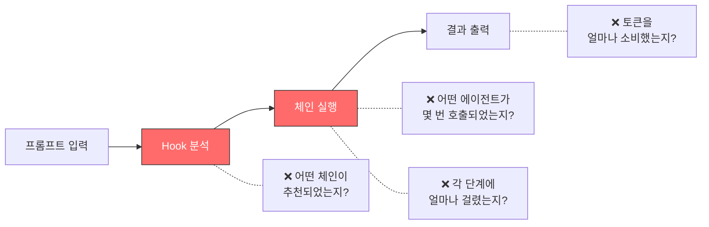
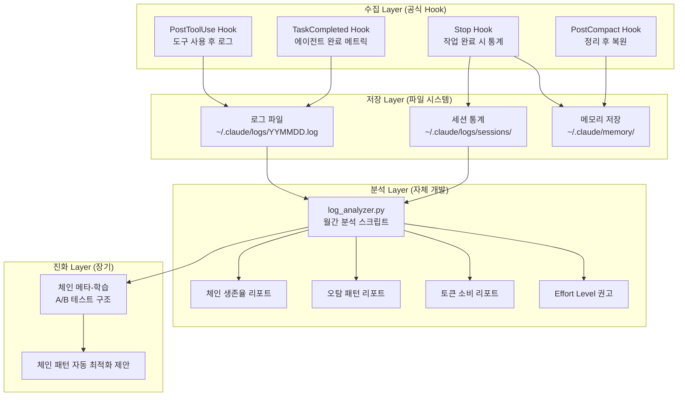
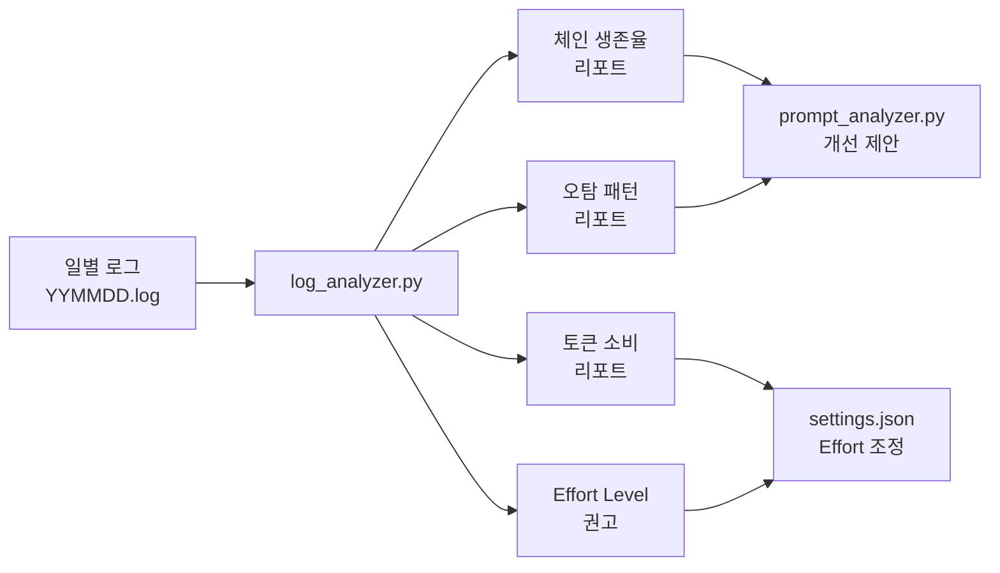
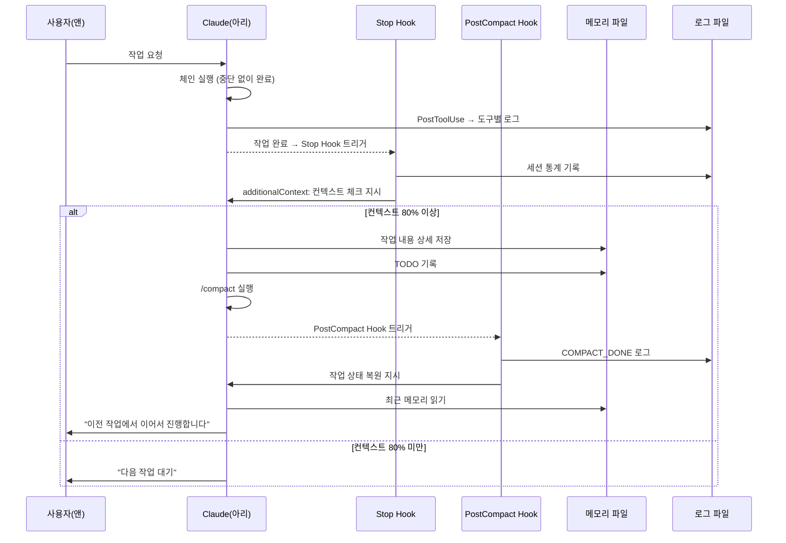

## 🔄 Next Session Handoff

### 현재 상태
- 이 문서의 완성도: completed
- 마지막 작업: C5 Observability & 자기 진화 심층 설계 — 로그 체계, Effort Level 분화, 자기 진단 루프, 체인 메타-학습, 컨텍스트 관리, 로그 분석 스크립트

### 다음 작업 (TODO)
- [ ] Phase 1 구현: PostToolUse Hook에 1줄 로그 append (`observability-logger.sh`)
- [ ] Phase 1 구현: Stop Hook 구현 (`post-task-cleanup.sh`) — 컨텍스트 80%+ 시 메모리 저장 + /compact
- [ ] Phase 1 구현: Effort Level 체인별 분화 적용 (settings.json 구조 또는 스킬 내부)
- [ ] Phase 2 구현: 월간 로그 분석 스크립트 (`log_analyzer.py`) — 생존율 리포트
- [ ] Phase 2 구현: PostCompact Hook 구현 (`post-compact-restore.sh`) — 작업 상태 복원
- [ ] Phase 3 구현: 체인 메타-학습 프로토타입 — A/B 테스트 구조

### 작업 조언
> [!tip] 다음 Claude Code에게
> - 이 문서는 [[01_001_Improvement_Direction_Overview#C5. Observability & 자기 진화|C5 개선 방향]]의 심층 설계이다
> - **대전제**: 공식 기능 우선 → 공식 강화 → 자체 개발 (Section 1.5 참조)
> - PostToolUse Hook(공식)을 **기반**으로 로그를 쌓고, 자체 개발 분석 스크립트로 **확장**하는 구조
> - C8(결과물 품질/컨텍스트 관리)과 밀접 — Stop Hook, PostCompact Hook은 C5와 C8이 공유
> - C1(온톨로지 메모리)의 벡터 DB와 연계 가능 — 로그 데이터도 검색 대상
> - C2(병렬 시스템)의 Agent Teams 실행 데이터가 Observability의 핵심 입력
> - [[02_001_Claude_Code_Official_Docs_Core_Engine#4. Hook 시스템|공식 Hook 12종]]이 구현의 기술적 기반
> - 현재 PostToolUse Hook에는 포매팅/Git 상태만 있음 — 로그 append 추가가 Phase 1 핵심

---

# C5. Observability & 자기 진화 심층 설계

> **상위 문서**: [[01_001_Improvement_Direction_Overview#C5. Observability & 자기 진화|C5 개선 방향]]
> **대전제**: [[01_001_Improvement_Direction_Overview#1.5 개선 대전제|공식 우선 → 공식 강화 → 자체 개발]]
> **연계 카테고리**: C8(품질/컨텍스트), C1(메모리), C2(병렬 시스템)

---

## 1. 설계 목표

### 1.1 한 문장 목표

> **체인 실행을 측정하고, 측정 데이터로 스스로 개선하는 시스템** — "측정할 수 없으면 개선할 수 없다(What you can't measure, you can't improve)"를 Claude Code 오케스트레이션에 적용한다.

### 1.2 구체적 목표

| 목표 | 현재 상태 | 목표 상태 | 측정 기준 |
|------|----------|----------|----------|
| **체인 실행 추적** | 없음 (어떤 체인이 실행되었는지 기록 없음) | PostToolUse Hook으로 1줄 로그 자동 기록 | 모든 도구 호출이 로그에 기록됨 |
| **에이전트별 성능** | 없음 (에이전트 실행 결과 미추적) | 에이전트별 호출 횟수, 성공/실패, 소요 시간 | 월간 에이전트 성능 리포트 생성 가능 |
| **토큰 소비 패턴** | 없음 (세션별 소비량 미파악) | 체인별/에이전트별 토큰 소비 추정치 | Effort Level 최적화 근거 확보 |
| **체인 선택 정확도** | 불가 (Hook 추천 vs 실제 사용 비교 불가) | Hook 추천 체인 vs 실제 실행 체인 대조 | 월간 체인 선택 정확도 % 산출 |
| **자기 개선 루프** | 없음 | 월간 자동 분석 → 개선 제안 → 적용 | 분기별 체인 생존율/효율성 리포트 |
| **컨텍스트 관리** | 수동 /compact | 자동 감지 → 메모리 저장 → /compact | 작업 중단율 0%에 수렴 |

### 1.3 대전제 적용

| 계층 | 원칙 | 구현 |
|------|------|------|
| **1순위: 공식 사용** | PostToolUse Hook, Stop Hook, PostCompact Hook | 공식 Hook 이벤트로 로그 수집 + 컨텍스트 관리 |
| **2순위: 공식 강화** | Hook 출력에 구조화된 로그 포맷 추가 | 기존 PostToolUse에 1줄 로그 append 추가 |
| **3순위: 자체 개발** | 로그 분석 스크립트, 자기 진단 루프, 메타-학습 | Python 스크립트로 월간 분석 자동화 |

### 1.4 **하지 않는 것**

| 하지 않는 것 | 이유 |
|-------------|------|
| 실시간 대시보드 구축 | 개인 사용 규모에서 과도, 월간 리포트로 충분 |
| 외부 모니터링 서비스 연동 (Datadog, Grafana 등) | 비용 대비 효과 부족, 로컬 로그 파일로 시작 |
| 토큰 정확한 계량 | Claude Code API가 토큰 수를 직접 제공하지 않음, 추정치 사용 |
| 에이전트 자동 교체/삭제 | 데이터 기반 **제안**만, 최종 결정은 앤 |

---

## 2. 현재 문제 상세 분석

### 2.1 블랙박스 상태



### 2.2 문제 근거

| 문제 | 근거 | 영향 |
|------|------|------|
| 체인 실행 추적 없음 | [[01_001_Current_System_Analysis#3.3 추상화 차원\|추상화 차원 분석]] — 체인이 자연어로만 정의됨 | 어떤 체인이 실제로 많이/적게 사용되는지 불명 |
| 에이전트 성능 미측정 | [[01_001_Current_System_Analysis#2.3 에이전트 층\|에이전트 층 분석]] — 14개 에이전트 존재 | 각 에이전트의 기여도/효율성 평가 불가 |
| Hook 추천 정확도 미검증 | [[01_001_Improvement_Direction_Overview#C5. Observability & 자기 진화\|C5 방향]] — 체인 선택 정확도 검증 불가 | prompt_analyzer.py 개선 근거 부재 |
| Effort Level 미분화 | 현재 settings.json: `"effortLevel": "high"` 전역 설정 | 모든 작업에 동일 수준 → HotfixChain에도 high 적용 (과도) |
| 컨텍스트 소진 무감지 | [[01_001_Improvement_Direction_Overview#C8. 결과물 품질 극대화\|C8 방향]] — 작업 중 /compact 필요 | 작업 중단, 맥락 손실 |

### 2.3 공식 Hook 활용 현황

현재 settings.json ([[104_current_system/settings.json]]) 기준:

| Hook 이벤트 | 현재 사용 | 목표 | C5 관련 |
|------------|----------|------|---------|
| UserPromptSubmit | auto-analyze.sh (4-Layer 분석) | 유지 + 체인 추천 로깅 | 체인 선택 정확도 |
| PreToolUse | 보안 파일 차단 | 유지 | - |
| **PostToolUse** | **포매팅 + Git 상태** | **+ 1줄 로그 append** | **핵심 로깅 지점** |
| SessionStart | 비활성 (`[]`) | 메모리 자동 로드 (C1) | 세션 시작 로그 |
| **Stop** | **미사용** | **컨텍스트 관리 + 세션 통계** | **C8 연계 핵심** |
| **PostCompact** | **미사용** | **작업 상태 복원** | **C8 연계** |
| TaskCompleted | 미사용 | 에이전트 완료 메트릭 (C2) | 에이전트 성능 |
| TeammateIdle | 미사용 | Teammate 관리 (C2) | Teams 로깅 |
| InstructionsLoaded | 미사용 | 로드된 규칙 로깅 | 디버그 |

---

## 3. 아키텍처 설계

### 3.1 전체 아키텍처



### 3.2 계층별 책임

| 계층 | 기술 | 대전제 | 역할 |
|------|------|--------|------|
| **수집** | 공식 Hook 4종 (PostToolUse, Stop, TaskCompleted, PostCompact) | 1순위 (공식 사용) | 이벤트 발생 시 자동으로 데이터 수집 |
| **저장** | 로컬 파일 시스템 (`~/.claude/logs/`) | 2순위 (공식 강화) | 구조화된 로그 파일로 일별 저장 |
| **분석** | Python 스크립트 (`log_analyzer.py`) | 3순위 (자체 개발) | 월간 로그 집계 → 리포트 + 개선 제안 |
| **진화** | Python 스크립트 (`chain_meta_learner.py`) | 3순위 (자체 개발) | 실행 데이터 기반 체인 패턴 최적화 제안 |

### 3.3 데이터 흐름

```
[도구 호출]
    ↓
[PostToolUse Hook] → YYMMDD.log에 1줄 append
    ↓
[작업 완료]
    ↓
[Stop Hook] → 세션 통계 저장 + 컨텍스트 80%+ 시 메모리 저장 + /compact 지시
    ↓
[/compact 실행]
    ↓
[PostCompact Hook] → 메모리에서 TODO 로드 + 작업 연속성 복원
    ↓
[월간]
    ↓
[log_analyzer.py] → 생존율/오탐/토큰/Effort 리포트 생성
    ↓
[분기별]
    ↓
[chain_meta_learner.py] → 체인 패턴 최적화 제안
```

---

## 4. 최소 Observability 상세 설계 (Phase 1 — 즉시 구현)

### 4.1 로그 포맷

```
YYYY-MM-DD HH:MM | Chain | Agent/Tool[Result] | Duration
```

**필드 정의**:

| 필드 | 설명 | 예시 |
|------|------|------|
| `YYYY-MM-DD HH:MM` | 타임스탬프 (분 단위) | `2026-03-15 14:32` |
| `Chain` | 현재 실행 중인 체인 (없으면 `-`) | `SystemDesign`, `Hotfix`, `-` |
| `Agent/Tool` | 호출된 에이전트 또는 도구명 | `system_architect`, `Edit`, `Bash` |
| `[Result]` | 실행 결과 (`OK`, `ERR`, `SKIP`) | `[OK]`, `[ERR]`, `[SKIP]` |
| `Duration` | 소요 시간 (초 단위, 추정) | `12s`, `3s`, `-` |

**로그 예시**:

```
2026-03-15 14:32 | SystemDesign | Explore[OK] | 5s
2026-03-15 14:32 | SystemDesign | Read[OK] | 2s
2026-03-15 14:33 | SystemDesign | system_architect[OK] | 45s
2026-03-15 14:33 | SystemDesign | problem_reframer[OK] | 38s
2026-03-15 14:35 | SystemDesign | solution_innovator[OK] | 52s
2026-03-15 14:37 | SystemDesign | integrated_sage[OK] | 48s
2026-03-15 14:38 | SystemDesign | Edit[OK] | 3s
2026-03-15 14:38 | SystemDesign | quality_reviewer[OK] | 35s
2026-03-15 14:40 | - | SESSION_END | total=480s tools=8 agents=5
```

### 4.2 PostToolUse Hook 확장 설계

현재 PostToolUse Hook ([[104_current_system/settings.json]] 참조):

```json
"PostToolUse": [
  {
    "matcher": "Write|Edit",
    "hooks": [
      { "type": "command", "command": "echo '[✅ 파일 수정 완료]'" },
      { "type": "command", "command": "... 포매팅 ..." },
      { "type": "command", "command": "... Git 상태 ..." }
    ]
  }
]
```

**추가할 Hook** (새로운 matcher 블록):

```json
{
  "matcher": "*",
  "hooks": [
    {
      "type": "command",
      "command": "/Users/changjaeyou/.claude/hooks/observability-logger.sh"
    }
  ]
}
```

### 4.3 observability-logger.sh

```bash
#!/bin/bash
# ~/.claude/hooks/observability-logger.sh
# PostToolUse Hook: 모든 도구 사용 후 1줄 로그 append
# C5 Observability — Phase 1 (최소 구현)

# 로그 디렉토리 보장
LOG_DIR="$HOME/.claude/logs"
mkdir -p "$LOG_DIR"

# 일별 로그 파일
LOG_FILE="$LOG_DIR/$(date +%Y%m%d).log"

# stdin에서 Hook 입력 받기
INPUT=$(cat)

# 도구 정보 추출 (PostToolUse Hook은 tool_name, tool_input을 제공)
TOOL_NAME=$(echo "$INPUT" | jq -r '.toolName // "unknown"' 2>/dev/null)
TOOL_RESULT=$(echo "$INPUT" | jq -r '.toolResult // "OK"' 2>/dev/null)

# 결과 상태 판단
if echo "$TOOL_RESULT" | grep -qi "error\|fail\|exception"; then
    STATUS="ERR"
else
    STATUS="OK"
fi

# 체인 정보 (환경변수 또는 상태 파일에서 — 향후 확장)
# Phase 1에서는 상태 파일 기반, 없으면 "-"
CHAIN_STATE_FILE="/tmp/claude_current_chain.txt"
if [ -f "$CHAIN_STATE_FILE" ]; then
    CHAIN=$(cat "$CHAIN_STATE_FILE")
else
    CHAIN="-"
fi

# 에이전트/도구 구분
# Agent 도구로 서브에이전트를 호출한 경우 에이전트명 추출
AGENT_NAME="$TOOL_NAME"
if [ "$TOOL_NAME" = "Agent" ]; then
    # Agent 도구의 입력에서 에이전트 타입 추출
    SUBAGENT=$(echo "$INPUT" | jq -r '.toolInput.subagent_type // .toolInput.agent // "agent"' 2>/dev/null)
    if [ -n "$SUBAGENT" ] && [ "$SUBAGENT" != "null" ]; then
        AGENT_NAME="$SUBAGENT"
    fi
fi

# 타임스탬프
TIMESTAMP=$(date "+%Y-%m-%d %H:%M")

# 1줄 로그 append
echo "$TIMESTAMP | $CHAIN | ${AGENT_NAME}[${STATUS}] | -" >> "$LOG_FILE"

# 정상 종료 (Hook 출력은 최소화 — 사용자 경험 방해 금지)
exit 0
```

### 4.4 체인 상태 추적 방법

PostToolUse Hook만으로는 "현재 어떤 체인이 실행 중인지"를 알 수 없다. 체인 상태를 추적하기 위한 3가지 접근:

| 접근 | 방식 | 대전제 | 적용 시점 |
|------|------|--------|----------|
| **A. 상태 파일** | 체인 시작 시 `/tmp/claude_current_chain.txt`에 체인명 기록 | 2순위 (강화) | Phase 1 |
| **B. 스킬 내부 기록** | 체인 스킬(C2) 실행 시 자체적으로 로그에 체인명 기록 | 2순위 (강화) | Phase 2 (C2 완료 후) |
| **C. Hook 입력 분석** | PostToolUse Hook 입력에서 호출 컨텍스트 추출 | 1순위 (공식) | 공식 API 지원 시 |

**Phase 1 구현 (접근 A)**:
- 아리(Claude)가 체인을 선택할 때 "Pre-execution Declaration"을 출력하는 시점에서 상태 파일에 기록
- 이를 위해 CLAUDE.md에 규칙 추가: "체인 선택 시 `/tmp/claude_current_chain.txt`에 체인명 기록"
- 또는 auto-analyze.sh에서 추천 체인을 상태 파일에 기록

```bash
# auto-analyze.sh V5.0 — 체인 추천 시 상태 파일 기록 추가
if [ -n "$RECOMMENDED_CHAIN" ]; then
    echo "$RECOMMENDED_CHAIN" > /tmp/claude_current_chain.txt
    echo "$TIMESTAMP | HOOK_RECOMMEND | $RECOMMENDED_CHAIN" >> "$LOG_FILE"
fi
```

### 4.5 로그 저장 위치 및 로테이션

```
~/.claude/logs/
├── 20260315.log          ← 일별 로그 (최소 Observability)
├── 20260316.log
├── sessions/
│   ├── 20260315_sess1.json  ← 세션별 통계 (Phase 1+)
│   └── 20260315_sess2.json
└── reports/
    ├── 202603_monthly.md    ← 월간 리포트 (Phase 2)
    └── 2026Q1_quarterly.md  ← 분기 리포트 (Phase 3)
```

**로테이션 정책**:

| 구분 | 보존 기간 | 크기 제한 | 처리 |
|------|----------|----------|------|
| 일별 로그 | 90일 | 10MB/일 | 90일 초과 시 자동 삭제 |
| 세션 통계 | 180일 | 1MB/세션 | 180일 초과 시 월간 집계 후 삭제 |
| 월간 리포트 | 무기한 | 100KB/월 | 영구 보존 (메모리로도 저장) |
| 분기 리포트 | 무기한 | 200KB/분기 | 영구 보존 |

```bash
# 로그 로테이션 스크립트 (cron 또는 /loop 기반)
find ~/.claude/logs/ -name "*.log" -mtime +90 -delete
find ~/.claude/logs/sessions/ -name "*.json" -mtime +180 -delete
```

---

## 5. Effort Level 체인별 분화 설계

### 5.1 현재 문제

현재 settings.json:
```json
"effortLevel": "high"
```

모든 작업에 `high`가 적용된다. HotfixChain(긴급 수정)에도 high, MetaThinkChain(심층 사고)에도 high. 체인의 특성에 따라 Effort Level을 분화해야 한다.

### 5.2 Effort Level 분화 매트릭스

| Effort Level | 대상 체인 | 근거 | 특성 |
|-------------|----------|------|------|
| **high** | MetaThinkChain (H), SystemDesignChain (A), ResearchChain (E) | 분석/설계 체인 — 깊이가 품질을 결정 | 깊은 사고, 다차원 분석, 완전 탐색 |
| **medium** | DevChain (D), WebDevChain+ (G), DocChain+ (F), AutomationChain (B), GameDevChain (C), RailsDevChain (I) | 구현/문서 체인 — 실용적 완성도 중심 | 코드 생성, 문서 작성, 실질적 산출물 |
| **low** | HotfixChain (J) | 긴급 수정 — 속도가 핵심 | 빠른 진단, 최소 변경, 즉시 배포 |

### 5.3 구현 방식

**Claude Code는 세션 단위로 effortLevel을 설정한다.** 체인별 동적 변경은 현재 공식 API로 불가능하므로, 다음 접근을 사용한다.

**접근 1: 스킬 내부 가이드 (Phase 1 — 즉시 가능)**

C2에서 체인을 스킬화할 때([[02_002_C2_Parallel_System_Official_Migration#4. 체인 → 스킬 전환 설계|체인 스킬화]]), 각 스킬 내부에 Effort Level 가이드를 포함한다:

```markdown
# SystemDesignChain (A) — Effort: HIGH
## 실행 가이드
- 이 체인은 **HIGH effort**로 실행한다
- 모든 에이전트는 깊이 있는 분석을 수행한다
- 탐색 범위를 임의로 제한하지 않는다
```

```markdown
# HotfixChain (J) — Effort: LOW
## 실행 가이드
- 이 체인은 **LOW effort**로 실행한다
- 최소한의 탐색으로 문제를 진단한다
- 불필요한 분석을 생략하고 즉시 수정에 집중한다
```

**접근 2: 세션 설정 동적 변경 (Phase 2 — 공식 지원 시)**

향후 Claude Code가 세션 중 effortLevel 변경을 지원하면:

```bash
# Stop Hook에서 다음 체인의 Effort Level을 설정
NEXT_CHAIN=$(cat /tmp/claude_current_chain.txt)
case "$NEXT_CHAIN" in
    MetaThink|SystemDesign|Research) EFFORT="high" ;;
    Dev|WebDev|Doc|Automation|GameDev|RailsDev) EFFORT="medium" ;;
    Hotfix) EFFORT="low" ;;
    *) EFFORT="high" ;;  # 기본값
esac
```

### 5.4 Effort Level 효과 예측

| 시나리오 | 현재 (all high) | 분화 후 | 예상 절감 |
|---------|----------------|---------|----------|
| HotfixChain 10회/월 | high x 10 | low x 10 | 토큰 ~40% 절감/체인 |
| DevChain 20회/월 | high x 20 | medium x 20 | 토큰 ~20% 절감/체인 |
| MetaThinkChain 5회/월 | high x 5 | high x 5 | 변경 없음 (유지) |
| **월간 총합** | 모두 high | 분화 적용 | **총 토큰 ~25% 절감 추정** |

---

## 6. 자기 진단 루프 설계 (Phase 2 — 중기)

### 6.1 월간 분석 파이프라인



### 6.2 체인 생존율 리포트

**목적**: 월간 기간 동안 각 체인이 실제로 사용된 빈도를 측정하여, 미사용 체인을 식별한다.

```python
# log_analyzer.py — 체인 생존율 분석 모듈
def analyze_chain_survival(log_dir: str, month: str) -> dict:
    """
    월간 체인 생존율 분석

    Returns:
        {
            "period": "2026-03",
            "total_sessions": 45,
            "chain_usage": {
                "SystemDesign": {"count": 8, "ratio": 0.178, "status": "active"},
                "MetaThink": {"count": 12, "ratio": 0.267, "status": "active"},
                "Hotfix": {"count": 15, "ratio": 0.333, "status": "active"},
                "DevChain": {"count": 6, "ratio": 0.133, "status": "active"},
                "Research": {"count": 3, "ratio": 0.067, "status": "low_usage"},
                "GameDev": {"count": 0, "ratio": 0.0, "status": "dormant"},
                "WebDev": {"count": 1, "ratio": 0.022, "status": "low_usage"},
                "Doc": {"count": 0, "ratio": 0.0, "status": "dormant"},
                "Automation": {"count": 0, "ratio": 0.0, "status": "dormant"},
                "RailsDev": {"count": 0, "ratio": 0.0, "status": "dormant"},
            },
            "recommendations": [
                "GameDev: 3개월 연속 dormant — 체인 아카이브 검토 권고",
                "Research: low_usage — 트리거 키워드 확장 검토"
            ]
        }
    """
```

**생존율 기준**:

| 상태 | 기준 | 대응 |
|------|------|------|
| `active` | 월간 5회 이상 사용 | 유지 |
| `low_usage` | 월간 1~4회 사용 | 트리거 키워드 검토 |
| `dormant` | 월간 0회 사용 | 3개월 연속 시 아카이브 후보 (앤 승인 필요) |

### 6.3 오탐 패턴 분석

**목적**: Hook 추천 체인 vs 실제 실행 체인을 대조하여, prompt_analyzer.py의 오탐 패턴을 식별한다.

```python
def analyze_false_positives(log_dir: str, month: str) -> dict:
    """
    Hook 추천 vs 실제 실행 대조

    로그 형식에서 추출:
    - HOOK_RECOMMEND 로그: Hook이 추천한 체인
    - 실제 체인 실행 로그: 아리가 선택한 체인

    Returns:
        {
            "period": "2026-03",
            "total_recommendations": 40,
            "match_count": 32,
            "mismatch_count": 8,
            "accuracy": 0.80,
            "mismatch_patterns": [
                {
                    "recommended": "DevChain",
                    "actual": "HotfixChain",
                    "count": 3,
                    "typical_prompt": "이 버그 수정해줘"
                },
                {
                    "recommended": "ResearchChain",
                    "actual": "MetaThinkChain",
                    "count": 2,
                    "typical_prompt": "이 문제에 대해 깊이 분석해줘"
                }
            ],
            "improvement_suggestions": [
                "prompt_analyzer.py: '버그 수정' 키워드에 HotfixChain 우선순위 상향",
                "prompt_analyzer.py: '깊이 분석' → MetaThinkChain 매핑 추가"
            ]
        }
    """
```

### 6.4 토큰 소비 패턴 추정

**토큰 직접 계량이 불가하므로 프록시 지표를 사용한다**:

| 프록시 지표 | 추정 방식 | 정확도 |
|-----------|----------|--------|
| **도구 호출 횟수** | 1회 호출 ~= 200~500 토큰 (입출력 평균) | 낮음 |
| **에이전트 호출 횟수** | 1회 에이전트 ~= 2,000~10,000 토큰 | 중간 |
| **세션 소요 시간** | 긴 세션 = 높은 토큰 소비 상관관계 | 중간 |
| **로그 줄 수** | 도구+에이전트 호출 총합의 프록시 | 중간 |

```python
def estimate_token_consumption(log_dir: str, month: str) -> dict:
    """
    체인별 토큰 소비 추정

    추정 공식:
    토큰 ~= (에이전트_호출 * 5000) + (도구_호출 * 300) + (세션_분 * 100)

    Returns:
        {
            "period": "2026-03",
            "estimated_total_tokens": 2_500_000,
            "by_chain": {
                "MetaThink": {"tokens": 800_000, "ratio": 0.32},
                "SystemDesign": {"tokens": 500_000, "ratio": 0.20},
                ...
            },
            "effort_recommendations": [
                "HotfixChain: 현재 high → low 전환 시 ~120K 토큰 절감 예상",
                "DevChain: 현재 high → medium 전환 시 ~200K 토큰 절감 예상"
            ]
        }
    """
```

### 6.5 리포트 출력 형식

월간 리포트는 Obsidian 마크다운으로 생성하여 `~/.claude/logs/reports/`에 저장한다:

```markdown
---
title: "Observability 월간 리포트 — 2026년 3월"
created: "2026-04-01"
tags: [observability, report, monthly]
---

# Observability 월간 리포트 — 2026년 3월

## 요약
- 총 세션: 45회
- 총 도구 호출: 1,234회
- 총 에이전트 호출: 156회
- 추정 토큰 소비: ~2.5M

## 체인 생존율
| 체인 | 사용 횟수 | 비율 | 상태 |
|------|----------|------|------|
| MetaThink | 12 | 26.7% | active |
| Hotfix | 15 | 33.3% | active |
| ... | ... | ... | ... |

## Hook 추천 정확도
- 정확도: 80% (32/40)
- 주요 오탐: DevChain→HotfixChain (3건)

## 개선 제안
1. prompt_analyzer.py: '버그' 키워드 → HotfixChain 가중치 상향
2. GameDev: 3개월 연속 미사용 — 아카이브 검토

## Effort Level 권고
- HotfixChain: high → low (월 ~120K 토큰 절감)
```

---

## 7. 컨텍스트 관리 설계 (C8 연계)

> 이 섹션은 [[01_001_Improvement_Direction_Overview#C8. 결과물 품질 극대화|C8 개선 방향]]과 직접 연계된다.
> C5가 **수집/분석** 측면을, C8이 **품질/정책** 측면을 담당한다.

### 7.1 Stop Hook 설계

```bash
#!/bin/bash
# ~/.claude/hooks/post-task-cleanup.sh
# Stop Hook: 작업 완료 시 자동 트리거
# C5 Observability + C8 컨텍스트 관리

# === 1. 세션 통계 기록 (C5) ===
LOG_DIR="$HOME/.claude/logs"
SESSION_DIR="$LOG_DIR/sessions"
mkdir -p "$SESSION_DIR"

DAILY_LOG="$LOG_DIR/$(date +%Y%m%d).log"
SESSION_FILE="$SESSION_DIR/$(date +%Y%m%d)_$(date +%H%M%S).json"

# 오늘 로그에서 통계 집계
if [ -f "$DAILY_LOG" ]; then
    TOOL_COUNT=$(grep -c "\[OK\]\|\[ERR\]" "$DAILY_LOG" 2>/dev/null || echo 0)
    AGENT_COUNT=$(grep -c "system_architect\|problem_reframer\|solution_innovator\|integrated_sage\|insight_explorer\|multidimensional_analyst\|connection_creator\|insight_amplifier\|learning_evolver\|complexity_resolver\|balanced_judge\|requirements_analyst\|code_developer\|quality_reviewer" "$DAILY_LOG" 2>/dev/null || echo 0)
    ERR_COUNT=$(grep -c "\[ERR\]" "$DAILY_LOG" 2>/dev/null || echo 0)
else
    TOOL_COUNT=0
    AGENT_COUNT=0
    ERR_COUNT=0
fi

# 세션 통계 JSON 저장
jq -n \
    --arg ts "$(date -u +%Y-%m-%dT%H:%M:%SZ)" \
    --argjson tools "$TOOL_COUNT" \
    --argjson agents "$AGENT_COUNT" \
    --argjson errors "$ERR_COUNT" \
    '{
        "timestamp": $ts,
        "tool_calls": $tools,
        "agent_calls": $agents,
        "error_count": $errors
    }' > "$SESSION_FILE"

# 로그에 세션 종료 마커
echo "$(date '+%Y-%m-%d %H:%M') | - | SESSION_END | tools=$TOOL_COUNT agents=$AGENT_COUNT errors=$ERR_COUNT" >> "$DAILY_LOG"

# === 2. 컨텍스트 관리 지시 (C8) ===
# Stop Hook은 additionalContext로 Claude에게 지시를 내릴 수 있다
# 컨텍스트 사용량은 Claude 내부에서 판단 (Hook에서 직접 측정 불가)

CLEANUP_MSG="
📊 [OBSERVABILITY] 세션 통계 기록 완료
━━━━━━━━━━━━━━━━━━━━━━━━━━━━━━━━━━
도구 호출: ${TOOL_COUNT}회 | 에이전트: ${AGENT_COUNT}회 | 오류: ${ERR_COUNT}회

📌 [AUTO-CLEANUP] 컨텍스트 관리 체크:
→ 현재 컨텍스트 사용량이 80% 이상이면:
  1. 작업 내용을 메모리에 상세 저장 (YYMM_SEQ_keyword.md)
  2. 다음 작업 TODO를 메모리에 기록
  3. /compact 실행하여 컨텍스트 정리
→ 80% 미만이면: 정리 없이 다음 작업 대기
━━━━━━━━━━━━━━━━━━━━━━━━━━━━━━━━━━
"

# Hook 출력 (additionalContext로 주입)
jq -n \
    --arg ctx "$CLEANUP_MSG" \
    '{
        "hookSpecificOutput": {
            "hookEventName": "Stop",
            "additionalContext": $ctx
        }
    }'

# 체인 상태 초기화
rm -f /tmp/claude_current_chain.txt

exit 0
```

### 7.2 PostCompact Hook 설계

```bash
#!/bin/bash
# ~/.claude/hooks/post-compact-restore.sh
# PostCompact Hook: /compact 실행 후 작업 상태 복원
# C5 Observability + C8 컨텍스트 관리

# === 1. 복원 로그 (C5) ===
LOG_DIR="$HOME/.claude/logs"
LOG_FILE="$LOG_DIR/$(date +%Y%m%d).log"
echo "$(date '+%Y-%m-%d %H:%M') | - | COMPACT_DONE | context_cleared" >> "$LOG_FILE"

# === 2. 작업 상태 복원 지시 (C8) ===
RESTORE_MSG="
🔄 [POST-COMPACT] 컨텍스트 정리 완료 — 작업 상태 복원
━━━━━━━━━━━━━━━━━━━━━━━━━━━━━━━━━━
📌 아래 순서대로 작업을 복원하세요:
1. 직전에 저장한 메모리 파일 읽기 (가장 최근 YYMM_SEQ_keyword.md)
2. TODO 항목에서 다음 작업 확인
3. '이전 작업에서 이어서 진행합니다' 안내 후 재개
━━━━━━━━━━━━━━━━━━━━━━━━━━━━━━━━━━
"

jq -n \
    --arg ctx "$RESTORE_MSG" \
    '{
        "hookSpecificOutput": {
            "hookEventName": "PostCompact",
            "additionalContext": $ctx
        }
    }'

exit 0
```

### 7.3 컨텍스트 관리 흐름 (전체)



---

## 8. 체인 메타-학습 설계 (Phase 3 — 장기)

### 8.1 개념

**메타-학습**: 체인 실행 데이터를 축적하여, 특정 유형의 프롬프트에 어떤 체인이 더 효과적인지를 학습하고 자동 제안하는 시스템.

```
[3개월 로그 데이터]
    ↓
[패턴 추출]
    ↓
"이 유형의 프롬프트(키워드: '분석', '비교')에서
 MetaThinkChain보다 ResearchChain이 2x 빠르고 결과 동등"
    ↓
[체인 선택 가중치 조정 제안]
    ↓
앤 승인 → prompt_analyzer.py 가중치 업데이트
```

### 8.2 A/B 테스트 구조

| 항목 | 설명 |
|------|------|
| **가설** | "분석 요청 프롬프트에서 ResearchChain이 MetaThinkChain보다 효율적" |
| **Control** | 기존 체인 선택 (MetaThinkChain) |
| **Treatment** | 대안 체인 (ResearchChain) |
| **측정** | 도구 호출 수, 세션 소요 시간, 에이전트 호출 수 |
| **기간** | 2주 (최소 5회 각 체인 실행) |
| **판정** | Treatment가 Control 대비 20%+ 효율적이면 전환 제안 |

```python
def suggest_chain_optimization(log_dir: str, quarter: str) -> list:
    """
    분기별 체인 최적화 제안

    분석 과정:
    1. 유사한 프롬프트 유형을 클러스터링 (키워드 기반)
    2. 같은 유형에서 다른 체인이 선택된 경우 비교
    3. 효율성 차이가 20% 이상이면 전환 제안

    Returns:
        [
            {
                "prompt_type": "분석/비교 요청",
                "current_chain": "MetaThinkChain",
                "suggested_chain": "ResearchChain",
                "efficiency_gain": "32%",
                "evidence": "같은 유형 7회 중 Research 4회가 평균 25% 적은 도구 호출",
                "confidence": "medium",
                "action": "앤 승인 시 prompt_analyzer.py에 가중치 조정"
            }
        ]
    """
```

### 8.3 메타-학습의 한계와 안전장치

| 한계 | 안전장치 |
|------|---------|
| 토큰 정확 계량 불가 | 프록시 지표(도구/에이전트 호출 수, 시간) 사용 |
| 작업 품질 자동 판정 불가 | 효율성만 제안, 품질 판단은 앤 |
| 체인 자동 변경 위험 | 제안만, 최종 결정은 앤 승인 |
| 데이터 부족 (월 50회 미만) | 최소 5회 이상 데이터가 있는 체인만 분석 |
| 과적합 (특정 시기에 편향) | 분기 단위 분석으로 시간 편향 완화 |

---

## 9. 로그 분석 스크립트 설계

### 9.1 log_analyzer.py 전체 구조

```python
#!/usr/bin/env python3
"""
Claude Code Observability — 월간 로그 분석기
위치: ~/.claude/scripts/log_analyzer.py
실행: python3 ~/.claude/scripts/log_analyzer.py --month 2026-03
"""

import argparse
import json
import os
import re
from collections import Counter, defaultdict
from datetime import datetime
from pathlib import Path

# === 상수 ===
LOG_DIR = Path.home() / ".claude" / "logs"
REPORT_DIR = LOG_DIR / "reports"
AGENT_NAMES = [
    "system_architect", "problem_reframer", "solution_innovator",
    "integrated_sage", "insight_explorer", "multidimensional_analyst",
    "connection_creator", "insight_amplifier", "learning_evolver",
    "complexity_resolver", "balanced_judge", "requirements_analyst",
    "code_developer", "quality_reviewer"
]
CHAIN_NAMES = [
    "SystemDesign", "Automation", "GameDev", "Dev",
    "Research", "Doc", "WebDev", "MetaThink", "RailsDev", "Hotfix"
]

# === 로그 파서 ===
LOG_PATTERN = re.compile(
    r"(\d{4}-\d{2}-\d{2} \d{2}:\d{2}) \| "  # timestamp
    r"([^\|]+) \| "                            # chain
    r"([^\[]+)\[([^\]]+)\] \| "                # agent/tool[result]
    r"(.+)"                                    # duration
)

def parse_log_line(line: str) -> dict | None:
    """1줄 로그를 파싱하여 구조화된 딕셔너리로 반환"""
    match = LOG_PATTERN.match(line.strip())
    if not match:
        return None
    return {
        "timestamp": match.group(1).strip(),
        "chain": match.group(2).strip(),
        "agent_or_tool": match.group(3).strip(),
        "result": match.group(4).strip(),
        "duration": match.group(5).strip()
    }

def load_month_logs(month: str) -> list[dict]:
    """지정 월의 모든 로그를 로드하여 파싱"""
    # month: "2026-03" → 파일 패턴: "202603*.log"
    prefix = month.replace("-", "")
    entries = []
    for log_file in sorted(LOG_DIR.glob(f"{prefix}*.log")):
        with open(log_file) as f:
            for line in f:
                parsed = parse_log_line(line)
                if parsed:
                    entries.append(parsed)
    return entries

# === 분석 모듈 ===
def analyze_chain_survival(entries: list[dict]) -> dict:
    """체인 생존율 분석"""
    chain_counter = Counter()
    for e in entries:
        if e["chain"] != "-" and e["agent_or_tool"] != "SESSION_END":
            chain_counter[e["chain"]] += 1

    total = sum(chain_counter.values()) or 1
    result = {}
    for chain in CHAIN_NAMES:
        count = chain_counter.get(chain, 0)
        ratio = count / total
        if count >= 5:
            status = "active"
        elif count >= 1:
            status = "low_usage"
        else:
            status = "dormant"
        result[chain] = {"count": count, "ratio": round(ratio, 3), "status": status}

    return result

def analyze_hook_accuracy(entries: list[dict]) -> dict:
    """Hook 추천 vs 실제 실행 정확도"""
    recommendations = [e for e in entries if e["agent_or_tool"] == "HOOK_RECOMMEND"]
    # 추천 직후의 첫 체인 실행과 대조
    match_count = 0
    mismatch_count = 0
    mismatches = []

    for i, rec in enumerate(recommendations):
        recommended = rec["chain"]
        # 이후 로그에서 실제 체인 찾기
        for j in range(entries.index(rec) + 1, min(entries.index(rec) + 20, len(entries))):
            actual_entry = entries[j]
            if actual_entry["chain"] != "-":
                if actual_entry["chain"] == recommended:
                    match_count += 1
                else:
                    mismatch_count += 1
                    mismatches.append({
                        "recommended": recommended,
                        "actual": actual_entry["chain"]
                    })
                break

    total = match_count + mismatch_count or 1
    return {
        "total_recommendations": match_count + mismatch_count,
        "match_count": match_count,
        "mismatch_count": mismatch_count,
        "accuracy": round(match_count / total, 2),
        "mismatch_patterns": Counter(
            f"{m['recommended']}→{m['actual']}" for m in mismatches
        ).most_common(5)
    }

def analyze_agent_performance(entries: list[dict]) -> dict:
    """에이전트별 성능 분석"""
    agent_stats = defaultdict(lambda: {"calls": 0, "ok": 0, "err": 0})
    for e in entries:
        name = e["agent_or_tool"]
        if name in AGENT_NAMES:
            agent_stats[name]["calls"] += 1
            if e["result"] == "OK":
                agent_stats[name]["ok"] += 1
            elif e["result"] == "ERR":
                agent_stats[name]["err"] += 1
    return dict(agent_stats)

def estimate_tokens(entries: list[dict]) -> dict:
    """토큰 소비 추정"""
    chain_tokens = defaultdict(int)
    for e in entries:
        chain = e["chain"] if e["chain"] != "-" else "uncategorized"
        if e["agent_or_tool"] in AGENT_NAMES:
            chain_tokens[chain] += 5000  # 에이전트 1회 ~5000 토큰
        elif e["agent_or_tool"] not in ("SESSION_END", "HOOK_RECOMMEND", "COMPACT_DONE"):
            chain_tokens[chain] += 300   # 도구 1회 ~300 토큰

    total = sum(chain_tokens.values()) or 1
    return {
        chain: {"tokens": tokens, "ratio": round(tokens / total, 3)}
        for chain, tokens in sorted(chain_tokens.items(), key=lambda x: -x[1])
    }

# === 리포트 생성 ===
def generate_report(month: str) -> str:
    """월간 리포트 마크다운 생성"""
    entries = load_month_logs(month)
    if not entries:
        return f"# {month} — 로그 데이터 없음"

    survival = analyze_chain_survival(entries)
    accuracy = analyze_hook_accuracy(entries)
    agents = analyze_agent_performance(entries)
    tokens = estimate_tokens(entries)

    total_tools = len([e for e in entries if e["agent_or_tool"] not in ("SESSION_END", "HOOK_RECOMMEND", "COMPACT_DONE")])
    total_agents = len([e for e in entries if e["agent_or_tool"] in AGENT_NAMES])
    total_sessions = len([e for e in entries if e["agent_or_tool"] == "SESSION_END"])

    report = f"""---
title: "Observability 월간 리포트 — {month}"
created: "{datetime.now().strftime('%Y-%m-%d')}"
tags: [observability, report, monthly]
---

# Observability 월간 리포트 — {month}

## 요약
- 총 세션: {total_sessions}회
- 총 도구 호출: {total_tools}회
- 총 에이전트 호출: {total_agents}회
- 추정 토큰 소비: ~{sum(t['tokens'] for t in tokens.values()):,}

## 체인 생존율

| 체인 | 사용 횟수 | 비율 | 상태 |
|------|----------|------|------|
"""
    for chain, data in survival.items():
        report += f"| {chain} | {data['count']} | {data['ratio']:.1%} | {data['status']} |\n"

    report += f"""
## Hook 추천 정확도
- 정확도: {accuracy['accuracy']:.0%} ({accuracy['match_count']}/{accuracy['total_recommendations']})
"""
    if accuracy['mismatch_patterns']:
        report += "- 주요 오탐:\n"
        for pattern, count in accuracy['mismatch_patterns']:
            report += f"  - {pattern}: {count}건\n"

    report += """
## 에이전트 성능

| 에이전트 | 호출 | 성공 | 오류 | 성공률 |
|---------|------|------|------|--------|
"""
    for name, data in sorted(agents.items(), key=lambda x: -x[1]['calls']):
        success_rate = data['ok'] / data['calls'] if data['calls'] > 0 else 0
        report += f"| {name} | {data['calls']} | {data['ok']} | {data['err']} | {success_rate:.0%} |\n"

    report += """
## 토큰 소비 추정

| 체인 | 추정 토큰 | 비율 |
|------|----------|------|
"""
    for chain, data in tokens.items():
        report += f"| {chain} | {data['tokens']:,} | {data['ratio']:.1%} |\n"

    # 개선 제안
    report += "\n## 개선 제안\n"
    suggestion_num = 1
    for chain, data in survival.items():
        if data['status'] == 'dormant':
            report += f"{suggestion_num}. {chain}: dormant — 트리거 키워드 검토 또는 아카이브 후보\n"
            suggestion_num += 1
        elif data['status'] == 'low_usage':
            report += f"{suggestion_num}. {chain}: low_usage — 트리거 키워드 확장 검토\n"
            suggestion_num += 1

    if accuracy['accuracy'] < 0.8:
        report += f"{suggestion_num}. Hook 정확도 {accuracy['accuracy']:.0%} < 80% — prompt_analyzer.py 개선 필요\n"
        suggestion_num += 1

    return report

# === 메인 ===
if __name__ == "__main__":
    parser = argparse.ArgumentParser(description="Claude Code Observability 월간 분석")
    parser.add_argument("--month", required=True, help="분석 대상 월 (YYYY-MM)")
    parser.add_argument("--output", default=None, help="리포트 저장 경로")
    args = parser.parse_args()

    report = generate_report(args.month)

    if args.output:
        output_path = Path(args.output)
    else:
        REPORT_DIR.mkdir(parents=True, exist_ok=True)
        output_path = REPORT_DIR / f"{args.month.replace('-', '')}_monthly.md"

    with open(output_path, "w") as f:
        f.write(report)

    print(f"리포트 저장: {output_path}")
```

### 9.2 실행 방법

```bash
# 월간 리포트 생성
python3 ~/.claude/scripts/log_analyzer.py --month 2026-03

# 특정 경로에 저장
python3 ~/.claude/scripts/log_analyzer.py --month 2026-03 --output ~/reports/march.md

# /loop 기반 자동 실행 (매월 1일)
# 또는 cron: 0 0 1 * * python3 ~/.claude/scripts/log_analyzer.py --month $(date -v-1m +%Y-%m)
```

### 9.3 로그 로테이션 스크립트

```bash
#!/bin/bash
# ~/.claude/scripts/log_rotate.sh
# 로그 로테이션 — 90일 초과 일별 로그, 180일 초과 세션 통계 삭제

LOG_DIR="$HOME/.claude/logs"

# 90일 초과 일별 로그 삭제
find "$LOG_DIR" -maxdepth 1 -name "*.log" -mtime +90 -delete 2>/dev/null

# 180일 초과 세션 통계 삭제
find "$LOG_DIR/sessions" -name "*.json" -mtime +180 -delete 2>/dev/null

# 삭제 결과 로그
echo "$(date '+%Y-%m-%d %H:%M') | - | LOG_ROTATE[OK] | -" >> "$LOG_DIR/$(date +%Y%m%d).log"
```

---

## 10. settings.json 변경 계획

### 10.1 Phase 1 추가 사항

현재 settings.json의 `hooks` 섹션에 다음을 추가한다:

```json
{
  "hooks": {
    "PostToolUse": [
      {
        "matcher": "Write|Edit",
        "hooks": [
          { "type": "command", "command": "echo '[✅ 파일 수정 완료]'" },
          { "type": "command", "command": "... 포매팅 (기존 유지) ..." },
          { "type": "command", "command": "... Git 상태 (기존 유지) ..." }
        ]
      },
      {
        "matcher": "*",
        "hooks": [
          {
            "type": "command",
            "command": "/Users/changjaeyou/.claude/hooks/observability-logger.sh"
          }
        ]
      }
    ],
    "Stop": [
      {
        "hooks": [
          {
            "type": "command",
            "command": "/Users/changjaeyou/.claude/hooks/post-task-cleanup.sh"
          }
        ]
      }
    ],
    "PostCompact": [
      {
        "hooks": [
          {
            "type": "command",
            "command": "/Users/changjaeyou/.claude/hooks/post-compact-restore.sh"
          }
        ]
      }
    ]
  }
}
```

### 10.2 Phase 2 추가 사항 (C2 연계)

```json
{
  "hooks": {
    "TaskCompleted": [
      {
        "hooks": [
          {
            "type": "command",
            "command": "/Users/changjaeyou/.claude/hooks/task-completed-logger.sh"
          }
        ]
      }
    ]
  }
}
```

---

## 11. 구현 단계 (Phase)

### Phase 1: 최소 Observability + 컨텍스트 관리 (즉시, 1~2세션)

| 단계 | 작업 | 산출물 | 검증 |
|------|------|--------|------|
| 1-1 | `~/.claude/logs/` 디렉토리 생성 | 디렉토리 구조 | `ls -la` |
| 1-2 | `observability-logger.sh` 작성 | PostToolUse Hook 스크립트 | 도구 사용 후 로그 확인 |
| 1-3 | `post-task-cleanup.sh` 작성 | Stop Hook 스크립트 | 작업 완료 시 통계+컨텍스트 지시 |
| 1-4 | `post-compact-restore.sh` 작성 | PostCompact Hook 스크립트 | /compact 후 복원 메시지 |
| 1-5 | `settings.json`에 3개 Hook 등록 | Hook 이벤트 매핑 | 실제 동작 테스트 |
| 1-6 | Effort Level 체인별 가이드 작성 | 스킬 내부 또는 CLAUDE.md | 체인 선택 시 적용 확인 |
| 1-7 | 체인 상태 추적 (상태 파일 방식) | auto-analyze.sh 수정 or CLAUDE.md 규칙 | 로그에 체인명 기록 확인 |
| **1-V** | **검증: 3개 프롬프트로 로그 기록 확인** | YYMMDD.log 내용 검증 | 포맷 정합성 |

**Phase 1 완료 기준**:
- 모든 도구 사용이 `~/.claude/logs/YYMMDD.log`에 1줄로 기록됨
- 작업 완료 시 세션 통계가 자동 기록됨
- 컨텍스트 80%+ 시 메모리 저장 + /compact 지시가 자동 전달됨

### Phase 2: 자기 진단 루프 (중기, 2~3세션)

| 단계 | 작업 | 산출물 | 검증 |
|------|------|--------|------|
| 2-1 | `log_analyzer.py` 작성 | 월간 분석 스크립트 | 테스트 데이터로 리포트 생성 |
| 2-2 | 체인 생존율 분석 모듈 | `analyze_chain_survival()` | 생존율 테이블 정합성 |
| 2-3 | 오탐 패턴 분석 모듈 | `analyze_hook_accuracy()` | Hook 추천 vs 실제 대조 |
| 2-4 | 토큰 소비 추정 모듈 | `estimate_tokens()` | 추정치 합리성 검토 |
| 2-5 | `log_rotate.sh` 작성 | 로그 로테이션 스크립트 | 90일 초과 로그 삭제 확인 |
| 2-6 | 월간 리포트 자동 생성 설정 | cron 또는 /loop | 매월 1일 리포트 생성 |
| **2-V** | **검증: 1개월 로그로 리포트 생성** | 월간 리포트 .md | 내용 완전성 |

**Phase 2 완료 기준**:
- 월간 리포트가 자동 생성되어 `~/.claude/logs/reports/`에 저장됨
- 체인 생존율, Hook 정확도, 토큰 소비가 수치로 표시됨
- 개선 제안이 자동 생성됨

### Phase 3: 체인 메타-학습 (장기, 3~5세션)

| 단계 | 작업 | 산출물 | 검증 |
|------|------|--------|------|
| 3-1 | `chain_meta_learner.py` 설계 | 분기별 분석 스크립트 프로토타입 | 설계 문서 |
| 3-2 | 프롬프트 유형 클러스터링 | 키워드 기반 분류 | 클러스터 품질 |
| 3-3 | A/B 테스트 프레임워크 | 가설→측정→판정 구조 | 테스트 시나리오 |
| 3-4 | 체인 최적화 제안 생성 | `suggest_chain_optimization()` | 제안 합리성 검토 (앤) |
| 3-5 | prompt_analyzer.py 가중치 자동 조정 인터페이스 | 제안 → 승인 → 적용 | 가중치 변경 반영 확인 |
| **3-V** | **검증: 분기 데이터로 최적화 제안 생성** | 분기 리포트 | 앤 피드백 |

**Phase 3 완료 기준**:
- 분기별 체인 최적화 제안이 자동 생성됨
- A/B 테스트 구조로 체인 효율성 비교 가능
- 앤 승인 프로세스를 통한 안전한 체인 조정

---

## 12. 파일/디렉토리 구조 (최종)

```
~/.claude/
├── hooks/
│   ├── auto-analyze.sh                ← 기존 (유지, 체인 추천 로깅 추가)
│   ├── observability-logger.sh        ← 신규 Phase 1 (PostToolUse)
│   ├── post-task-cleanup.sh           ← 신규 Phase 1 (Stop)
│   └── post-compact-restore.sh        ← 신규 Phase 1 (PostCompact)
├── scripts/
│   ├── prompt_analyzer.py             ← 기존 (유지)
│   ├── log_analyzer.py                ← 신규 Phase 2 (월간 분석)
│   ├── log_rotate.sh                  ← 신규 Phase 2 (로그 로테이션)
│   └── chain_meta_learner.py          ← 신규 Phase 3 (메타-학습)
├── logs/                              ← 신규 Phase 1
│   ├── 20260315.log                   ← 일별 로그
│   ├── 20260316.log
│   ├── sessions/
│   │   ├── 20260315_143200.json       ← 세션별 통계
│   │   └── ...
│   └── reports/
│       ├── 202603_monthly.md          ← 월간 리포트
│       └── 2026Q1_quarterly.md        ← 분기 리포트
└── settings.json                      ← Hook 이벤트 등록 추가
```

---

## 13. 리스크 및 완화

| 리스크 | 확률 | 영향 | 완화 |
|--------|------|------|------|
| PostToolUse Hook 실행 지연 | Low | Medium | 스크립트 최소화 (1줄 append만), 타임아웃 2초 |
| 로그 파일 비대화 | Medium | Low | 일별 분리 + 90일 로테이션 (10MB/일 미만) |
| 체인 상태 추적 부정확 (상태 파일 방식) | Medium | Medium | Phase 2에서 스킬 내부 기록으로 전환 |
| 토큰 추정치 부정확 | High | Low | 프록시 지표임을 명시, 상대 비교에만 사용 |
| Stop Hook에서 컨텍스트 판단 불가 | Medium | High | Claude에게 판단을 위임 (Hook은 지시만) |
| 메타-학습 과적합 | Low | Medium | 분기 단위 분석 + 앤 승인 필수 |
| Hook 실행 순서 충돌 | Low | Medium | matcher 패턴으로 분리, `*` matcher는 마지막 |

---

## 14. 성공 측정

| 지표 | 현재 | Phase 1 목표 | Phase 2 목표 | Phase 3 목표 |
|------|------|------------|------------|------------|
| 체인 실행 추적률 | 0% | 90%+ (대부분 도구 호출 기록) | 95%+ (체인명 포함) | 99% |
| Hook 추천 정확도 측정 | 불가 | 측정 가능 (로그 대조) | 월간 리포트에 포함 | 자동 개선 제안 |
| 세션 통계 기록 | 없음 | 매 세션 자동 기록 | 월간 집계 | 트렌드 분석 |
| 컨텍스트 관리 자동화 | 수동 /compact | 80%+ 시 자동 지시 | 작업 상태 자동 복원 | 최적 타이밍 학습 |
| 체인 생존율 파악 | 불가 | - | 월간 리포트 포함 | 자동 아카이브 제안 |
| Effort Level 최적화 | 전역 high | 체인별 가이드 | 토큰 데이터 기반 권고 | 자동 조정 제안 |
| 작업 중단율 | 미측정 | 측정 가능 | 50% 감소 | 0% 목표 |

---

## 15. 카테고리 간 시너지 상세

### 15.1 C5 x C8 (품질/컨텍스트)

| C5 기여 | C8 기여 | 시너지 |
|---------|---------|--------|
| Stop Hook으로 세션 통계 수집 | Stop Hook으로 컨텍스트 체크 지시 | **동일 Hook에서 Observability + 품질 관리** |
| PostCompact Hook으로 정리 로그 | PostCompact Hook으로 작업 상태 복원 | **동일 Hook에서 추적 + 연속성** |
| 토큰 소비 추정 데이터 | Effort Level 체인별 분화 | **데이터 기반 품질-효율 균형** |

### 15.2 C5 x C1 (메모리)

| C5 기여 | C1 기여 | 시너지 |
|---------|---------|--------|
| 로그 데이터 축적 | 벡터 DB에 로그 요약 저장 | 과거 체인 실행 이력도 검색 가능 |
| 월간 리포트 생성 | 리포트를 메모리로 저장 | "지난달 뭘 많이 했지?" 자동 리콜 |

### 15.3 C5 x C2 (병렬 시스템)

| C5 기여 | C2 기여 | 시너지 |
|---------|---------|--------|
| Agent Teams 실행 데이터 수집 | TaskCompleted Hook으로 메트릭 전달 | Chain vs Teams 효율 데이터 기반 비교 |
| 에이전트별 성능 분석 | 에이전트 frontmatter 업그레이드 | 성능 낮은 에이전트 maxTurns 조정 근거 |

### 15.4 C5 x C4 (Hook/Skill)

| C5 기여 | C4 기여 | 시너지 |
|---------|---------|--------|
| 4개 Hook 신규 활용 (PostToolUse 확장, Stop, PostCompact, TaskCompleted) | 공식 Hook 체계 전환 | C5가 Hook 활용률을 3/12 → 7/12로 끌어올림 |
| 체인 스킬화 시 로그 포인트 삽입 | 스킬 내부에 Effort Level 가이드 | 스킬이 Observability의 데이터 소스 |

---

## 관련 문서

### 직접 참조 (Direct Links)
- [[01_001_Improvement_Direction_Overview#C5. Observability & 자기 진화|C5 개선 방향]] — 상위 방향 문서

### 역참조 (Backlinks)
- [[01_001_Improvement_Direction_Overview#6. 카테고리별 심층 문서 계획|심층 문서 계획]]
- [[02_002_C2_Parallel_System_Official_Migration|C2]] — C5가 C2의 하류
- [[02_007_C7_Agentic_Workflow_Paradigm|C7]] — C5가 C7의 하류

### 관련 주제 (Topic Links)
- [[02_001_C1_Ontology_Memory_Deep_Design#4. MCP 서버 설계|C1 MCP]] — 메모리 stats 도구와 C5 메트릭 연계
- [[02_004_C4_Hook_Skill_Official_Migration#3.2 Hook별 상세 설계|C4 Hook 설계]] — PostToolUse 확장이 C5 로깅 채널
- [[02_008_C8_Quality_Context_Management#5. 컨텍스트 자동 관리|C8 컨텍스트]] — 컨텍스트 사용량 추적이 C5 데이터 소스

---

## Release Notes

### v1.0.0 (2026-03-15)
- 초기 작성: C5 Observability & 자기 진화 심층 설계
- 아키텍처: 4계층 (수집/저장/분석/진화) + 대전제 적용
- 최소 Observability: PostToolUse Hook 1줄 로그 + 로그 포맷 정의 + `observability-logger.sh`
- Effort Level 체인별 분화: high (분석/설계) / medium (구현/문서) / low (긴급)
- 자기 진단 루프: 체인 생존율, 오탐 패턴, 토큰 소비 추정, Effort Level 권고
- 체인 메타-학습: A/B 테스트 구조, 최적화 제안 프로세스
- 컨텍스트 관리 (C8 연계): Stop Hook + PostCompact Hook + 80%+ 자동 정리 시퀀스
- 로그 분석 스크립트: `log_analyzer.py` 전체 설계 + `log_rotate.sh`
- settings.json 변경 계획: Hook 3개 신규 등록
- 3단계 Phase + 검증 계획 + 리스크 7개 + 성공 측정 7개
- 카테고리 간 시너지 4개 상세 (C8, C1, C2, C4)
> **프롬프트:** "c3 ~ 5 까지 팀에이전트를 사용해서 작업을 진행해줘"
