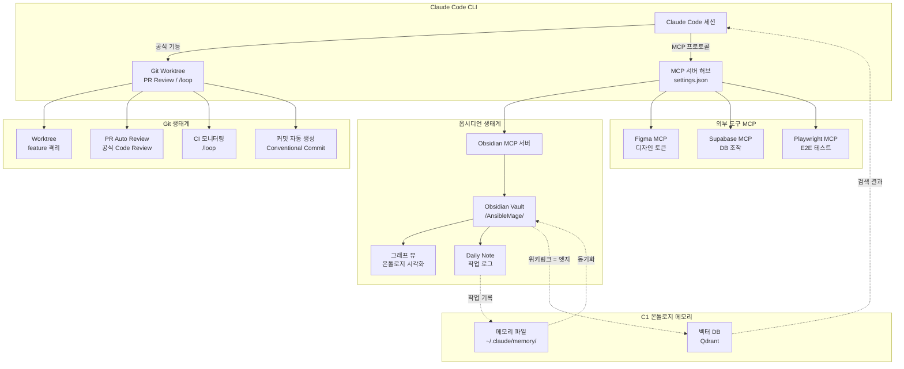
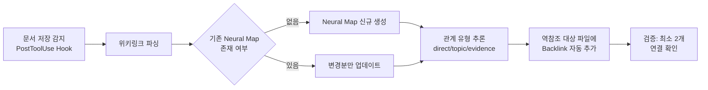
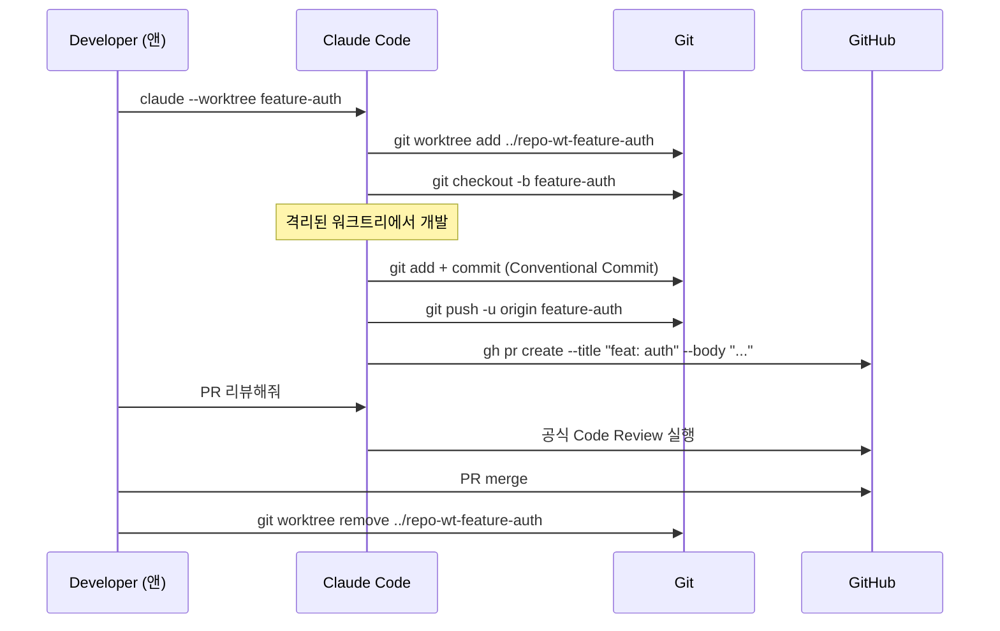
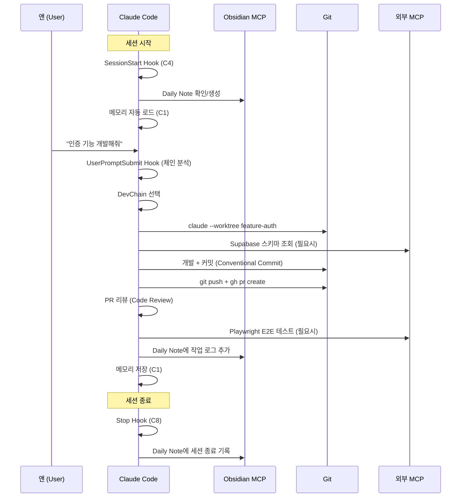
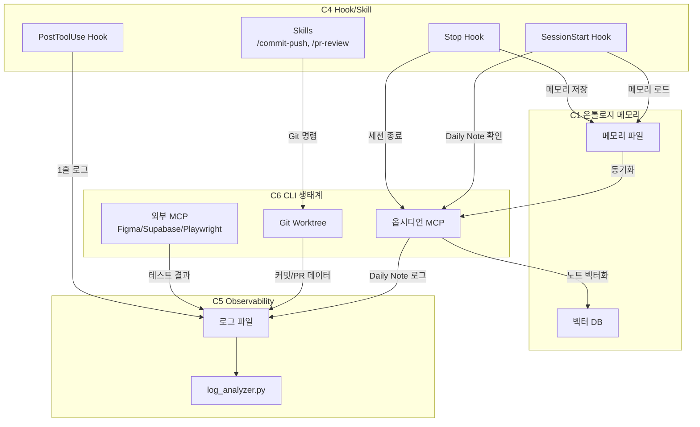
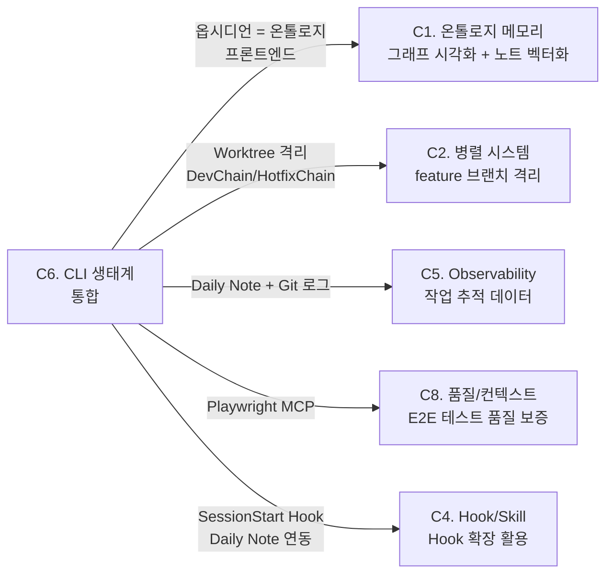

## 🔄 Next Session Handoff

### 현재 상태
- 이 문서의 완성도: completed
- 마지막 작업: C6 CLI 생태계 통합 심층 설계 — 옵시디언 통합(MCP/그래프/Daily Note/orphan 탐지/Neural Map 자동화), Git 워크플로우(Worktree/PR 리뷰/CI/커밋), 외부 도구 MCP(Figma/Supabase/Playwright), Phase별 구현 + 검증 계획

### 다음 작업 (TODO)
- [ ] Phase 1 구현: Obsidian MCP 서버 설치 + settings.json 등록
- [ ] Phase 1 구현: `obsidian-orphan-detector.sh` 스크립트 작성 + 동작 확인
- [ ] Phase 1 구현: Worktree 기반 개발 워크플로우 검증 (feature 브랜치 1건)
- [ ] Phase 2 구현: Neural Map 자동 생성 스크립트 (`neural-map-generator.py`)
- [ ] Phase 2 구현: Daily Note 연동 Hook (`session-daily-note.sh`)
- [ ] Phase 3 구현: Figma MCP → 디자인 토큰 추출 파이프라인 검증
- [ ] Phase 3 구현: Supabase CLI MCP 연동 + Playwright MCP E2E 테스트
- [ ] Phase 4 구현: 온톨로지 프론트엔드 통합 (C1 벡터 DB ↔ 옵시디언 그래프 뷰)

### 작업 조언
> [!tip] 다음 Claude Code에게
> - 이 문서는 [[01_001_Improvement_Direction_Overview#C6. CLI 생태계 통합|C6 개선 방향]]의 심층 설계이다
> - **대전제**: 공식 기능 우선 → 공식 강화 → 자체 개발 (Section 1.5 참조)
> - **핵심 시너지**: C1(온톨로지 메모리) + C6(옵시디언) — 옵시디언이 온톨로지의 프론트엔드
> - 옵시디언 Vault 경로: `/Users/changjaeyou/Documents/Obsidian-Vault/AnsibleMage/`
> - 1012_ 프로젝트가 이미 Vault 내에 위치하므로 옵시디언 연동은 자연스러움
> - [[07_001_Neural_Reference_Deep_Analysis|신경망 참조 분석]]이 Neural Map 자동화의 근거
> - Worktree는 공식 Claude Code 기능 (`claude --worktree`) — 1순위 공식 사용
> - MCP 서버는 공식 인프라(settings.json `mcpServers`) 위에 구축 — 2순위 공식 강화
> - Figma MCP는 이미 2603_001 메모리에서 디자인 토큰 추출 경험 있음

---

# C6. CLI 생태계 통합 (옵시디언/Git/외부 도구) 심층 설계

> **상위 문서**: [[01_001_Improvement_Direction_Overview#C6. CLI 생태계 통합|C6 개선 방향]]
> **대전제**: [[01_001_Improvement_Direction_Overview#1.5 개선 대전제|공식 우선 → 공식 강화 → 자체 개발]]
> **연계 카테고리**: C1(온톨로지 메모리), C4(Hook/Skill), C5(Observability)

---

## 1. 설계 목표

### 1.1 한 문장 목표

> **옵시디언 Vault를 온톨로지 프론트엔드로, Git Worktree를 개발 워크플로우 기반으로, MCP 서버를 외부 도구 통합 채널로 활용하여, Claude Code의 CLI 생태계를 유기적으로 연결하는 통합 아키텍처를 구축한다.**

### 1.2 구체적 목표

| 항목 | 현재 (V4.2.1) | 목표 (V5.0) | 대전제 |
|------|-------------|------------|--------|
| **옵시디언 연동** | 파일 시스템 직접 접근만 | MCP 서버 기반 노트 검색/생성/그래프 탐색 | 2순위 (공식 강화) |
| **그래프 활용** | 미사용 | 온톨로지 시각화 + 허브/고립 노드 탐지 | 2순위 (공식 강화) |
| **Neural Map** | 수동 작성 | 자동 생성/갱신 + 양방향 링크 자동화 | 3순위 (자체 개발) |
| **Git 워크플로우** | 기본 git + gh | Worktree 격리 + PR 자동 리뷰 + CI `/loop` | 1순위 (공식 사용) |
| **커밋 메시지** | 수동 + `/commit-push` | Conventional Commit 자동 생성 | 1순위 (공식 사용) |
| **외부 MCP** | Figma MCP만 경험 | Figma + Supabase + Playwright 통합 | 2순위 (공식 강화) |

### 1.3 대전제 적용

| 계층 | 원칙 | 구현 |
|------|------|------|
| **1순위: 공식 사용** | Worktree(`--worktree`), Code Review, `/loop`, MCP 인프라 | 공식 CLI 기능 그대로 활용 |
| **2순위: 공식 강화** | Obsidian MCP, Figma MCP, Supabase MCP | 공식 MCP 프로토콜 위에 서드파티 서버 연동 |
| **3순위: 자체 개발** | Neural Map 자동화, orphan 탐지, Daily Note 연동 | 공식에 없는 옵시디언 특화 기능 |

### 1.4 **하지 않는 것**

| 하지 않는 것 | 이유 |
|-------------|------|
| 옵시디언 플러그인 개발 | Claude Code 측에서 MCP로 연동하면 충분, 플러그인은 별도 프로젝트 |
| Git GUI 도구 도입 | CLI 기반이 Claude Code와 최적 호환 |
| 자체 그래프 시각화 도구 | 옵시디언 그래프 뷰가 이미 최적 |
| MCP 서버 자체 프레임워크 구축 | FastMCP(Python) 또는 공식 SDK 사용 |

---

## 2. 전체 아키텍처

### 2.1 통합 아키텍처 다이어그램



### 2.2 계층별 책임

| 계층 | 기술 | 대전제 | 역할 |
|------|------|--------|------|
| **Git 워크플로우** | `--worktree`, Code Review, `/loop` | 1순위 (공식 사용) | 개발 격리, 품질 보증, CI 모니터링 |
| **MCP 허브** | `settings.json` mcpServers 섹션 | 1순위 (공식 사용) | 외부 도구 통합의 공식 인프라 |
| **옵시디언 MCP** | 서드파티 Obsidian MCP 서버 | 2순위 (공식 강화) | 노트 검색/생성/그래프 데이터 접근 |
| **외부 도구 MCP** | Figma/Supabase/Playwright MCP | 2순위 (공식 강화) | 디자인/DB/테스트 통합 |
| **자체 스크립트** | orphan 탐지, Neural Map 자동화 | 3순위 (자체 개발) | 옵시디언 특화 자동화 |

---

## 3. 옵시디언 통합 설계

### 3.1 Obsidian MCP 서버 활용

#### 3.1.1 서버 선정

| 후보 | 특성 | 판단 |
|------|------|------|
| **obsidian-mcp** (npm) | REST API 기반, 노트 CRUD, 검색, 태그 | **1차 선정** — 가장 성숙 |
| obsidian-local-rest-api | 옵시디언 플러그인 필요 | **2차 후보** — 플러그인 의존성 |
| 직접 파일 시스템 접근 | MCP 없이 Read/Write/Glob | **폴백** — MCP 실패 시 |

**선정 근거**: `obsidian-mcp`는 옵시디언 Vault를 REST API로 노출하여 노트 검색/생성/수정을 MCP 프로토콜로 Claude Code에 제공한다. 옵시디언 앱이 실행 중이 아니어도 파일 시스템 기반으로 동작하는 구현체를 우선 선택한다.

#### 3.1.2 설치 및 설정

```bash
# Obsidian MCP 서버 설치
npm install -g @anthropic/obsidian-mcp  # 또는 적합한 패키지

# 대안: 직접 파일 시스템 기반 MCP 서버 (FastMCP로 구현)
# → C1의 memory_mcp.py와 동일한 패턴으로 obsidian_mcp.py 구현 가능
```

**settings.json 등록**:

```json
{
  "mcpServers": {
    "obsidian": {
      "command": "node",
      "args": ["/path/to/obsidian-mcp/server.js"],
      "env": {
        "OBSIDIAN_VAULT_PATH": "/Users/changjaeyou/Documents/Obsidian-Vault/AnsibleMage"
      }
    }
  }
}
```

#### 3.1.3 MCP 도구 설계 (공식 강화 + 자체 개발)

```python
# obsidian MCP 서버가 제공할 도구 목록
tools = {
    # --- 공식 강화: 기본 CRUD ---
    "obsidian_search": {
        # Vault 내 노트 검색 (제목, 내용, 태그)
        "params": {"query": str, "tags": list, "folder": str, "limit": int},
        "returns": [{"path": str, "title": str, "excerpt": str, "tags": list}]
    },
    "obsidian_read": {
        # 특정 노트 읽기 (섹션 레벨 지원)
        "params": {"path": str, "section": str | None},
        "returns": {"content": str, "frontmatter": dict, "links": list}
    },
    "obsidian_create": {
        # 새 노트 생성 (frontmatter + Neural Map 자동 포함)
        "params": {"path": str, "content": str, "frontmatter": dict},
        "returns": {"created": bool, "path": str}
    },
    "obsidian_update": {
        # 기존 노트 수정 (섹션별 업데이트 지원)
        "params": {"path": str, "section": str, "content": str},
        "returns": {"updated": bool, "version": str}
    },

    # --- 자체 개발: 그래프/분석 ---
    "obsidian_graph": {
        # 노트 간 연결 그래프 조회
        "params": {"path": str, "depth": int, "direction": str},
        "returns": {"nodes": list, "edges": list, "orphans": list}
    },
    "obsidian_orphans": {
        # 고립 문서 탐지
        "params": {"folder": str},
        "returns": [{"path": str, "created": str, "word_count": int}]
    },
    "obsidian_backlinks": {
        # 역참조 목록 조회
        "params": {"path": str},
        "returns": [{"source": str, "section": str, "context": str}]
    },
    "obsidian_daily_append": {
        # Daily Note에 내용 추가
        "params": {"content": str, "date": str | None},
        "returns": {"appended": bool, "daily_path": str}
    }
}
```

### 3.2 그래프 뷰 = 온톨로지 시각화

#### 3.2.1 C1(온톨로지) x C6(옵시디언) 시너지 구조

```mermaid
graph LR
    subgraph "옵시디언 레이어 (시각화)"
        GV[그래프 뷰]
        WL[위키링크<br>[[파일#섹션]]]
        BL[백링크 패널]
    end

    subgraph "온톨로지 레이어 (검색)"
        VDB[Qdrant 벡터 DB]
        GRAPH[그래프 엣지<br>topic/evidence/contrast]
        EMB[임베딩 벡터]
    end

    subgraph "동기화"
        SYNC[동기화 스크립트<br>obsidian_to_ontology.py]
    end

    WL -->|"위키링크 파싱"| SYNC
    SYNC -->|"관계 유형 추론"| GRAPH
    SYNC -->|"노트 벡터화"| EMB
    EMB --> VDB
    GRAPH --> VDB

    VDB -->|"검색 결과"| GV
    VDB -->|"관련 노트"| BL
```

**핵심 인사이트** ([[01_001_Improvement_Direction_Overview#시너지 1: C1(온톨로지) × C6(옵시디언)|시너지 1]]):
- 옵시디언 위키링크 `[[파일#섹션]]` = 온톨로지 엣지
- 옵시디언 그래프 뷰 = 온톨로지 그래프의 시각적 표현
- 옵시디언 백링크 패널 = 역참조(Backlink) 탐색 UI
- **옵시디언이 온톨로지의 프론트엔드**가 될 수 있다

#### 3.2.2 그래프 뷰 활용 시나리오

| 시나리오 | 그래프 뷰 활용 | 기대 효과 |
|---------|-------------|----------|
| **허브 노드 식별** | 연결 수 TOP-5 노트 시각화 | 핵심 지식 노드 파악 → 우선 정비 대상 |
| **고립 노드 탐지** | 연결 0개 노트 필터링 | orphan 문서 발견 → 연결 또는 정리 |
| **브릿지 노드 발견** | 두 클러스터를 연결하는 노트 | 지식 간 교차점 = 인사이트 발견 지점 |
| **클러스터 분석** | 밀집 연결 그룹 식별 | 주제별 지식 군집 파악 |
| **진화 추적** | 시간순 노트 필터 + 그래프 | 지식이 어떻게 발전해왔는지 시각화 |

#### 3.2.3 연결 밀도 매트릭스 (07_001 근거)

[[07_001_Neural_Reference_Deep_Analysis#3. 연결 밀도 매트릭스|연결 밀도 분석]]을 옵시디언 그래프 뷰와 연동:

| 역할 | 정의 | 그래프 뷰 시각 | 대응 행동 |
|------|------|-------------|----------|
| **허브 (Hub)** | 인바운드+아웃바운드 TOP | 큰 노드, 많은 연결선 | 정기 갱신, 품질 관리 |
| **브릿지 (Bridge)** | 다른 클러스터 연결 | 두 군집 사이에 위치 | 교차 참조 강화 |
| **입구 (Entry)** | 인바운드 >> 아웃바운드 | 많은 화살표가 향함 | 문서 품질 최우선 |
| **탐색자 (Explorer)** | 아웃바운드 >> 인바운드 | 많은 화살표가 나감 | 백링크 추가 필요 |
| **고립 (Orphan)** | 연결 0 | 독립 점 | 연결 추가 또는 삭제 |

### 3.3 Daily Note와 메모리/작업 로그 연동

#### 3.3.1 설계 원리

```
Claude Code 세션 시작
    → SessionStart Hook 트리거 (C4)
    → 오늘의 Daily Note 확인/생성
    → 세션 시작 로그 append

Claude Code 세션 종료
    → Stop Hook 트리거 (C4/C8)
    → 작업 내용 요약 → Daily Note append
    → 메모리 저장 (C1) → 메모리 파일 경로를 Daily Note에 링크
```

#### 3.3.2 Daily Note 형식

```markdown
# 2026-03-15

## 세션 로그

### Session 1 (09:30~11:45)
- **작업**: C6 CLI 생태계 통합 심층 설계
- **체인**: SystemDesignChain
- **산출물**: [[02_006_C6_CLI_Ecosystem_Integration]]
- **메모리**: [[2603_XXX_c6_cli_ecosystem]]

### Session 2 (14:00~16:30)
- **작업**: ...
- **체인**: ...

## 인사이트
- 옵시디언 그래프 뷰가 온톨로지 프론트엔드로 활용 가능
- ...

## 미완료 TODO
- [ ] Phase 1 Obsidian MCP 설치
- [ ] ...
```

#### 3.3.3 Hook 구현 설계

**`session-daily-note.sh`** — SessionStart Hook에 추가:

```bash
#!/bin/bash
# Daily Note 연동: 세션 시작 시 오늘의 Daily Note에 세션 시작 기록
# SessionStart Hook의 보조 스크립트 (session-start.sh에서 호출)

VAULT_PATH="/Users/changjaeyou/Documents/Obsidian-Vault/AnsibleMage"
DAILY_DIR="$VAULT_PATH/Daily Notes"
TODAY=$(date +%Y-%m-%d)
DAILY_FILE="$DAILY_DIR/${TODAY}.md"

# Daily Note 디렉토리 확인
mkdir -p "$DAILY_DIR"

# Daily Note 없으면 생성
if [ ! -f "$DAILY_FILE" ]; then
    cat > "$DAILY_FILE" << EOF
# ${TODAY}

## 세션 로그

## 인사이트

## 미완료 TODO
EOF
fi

# 세션 시작 기록 추가
TIME=$(date +%H:%M)
SESSION_LOG="\n### Session (${TIME}~)\n- **시작**: ${TIME}\n"

# 파일 끝의 "## 인사이트" 앞에 삽입하는 대신, "## 세션 로그" 뒤에 append
echo -e "$SESSION_LOG" >> "$DAILY_FILE"

exit 0
```

### 3.4 고립 문서(Orphan) 자동 탐지

#### 3.4.1 탐지 스크립트 설계

```python
#!/usr/bin/env python3
"""
obsidian_orphan_detector.py
옵시디언 Vault 내 고립 문서(orphan)를 탐지하는 스크립트

고립 문서 정의:
- 다른 어떤 문서에서도 [[위키링크]]로 참조되지 않는 문서
- 자신도 다른 문서를 참조하지 않는 문서 (완전 고립)
"""

import os
import re
import json
from pathlib import Path
from collections import defaultdict

VAULT_PATH = "/Users/changjaeyou/Documents/Obsidian-Vault/AnsibleMage"
WIKILINK_PATTERN = re.compile(r'\[\[([^\]|#]+)(?:#[^\]|]*)?(?:\|[^\]]+)?\]\]')

def scan_vault(vault_path: str) -> dict:
    """Vault 전체를 스캔하여 문서 간 연결 맵 생성"""
    notes = {}       # {파일명: 파일경로}
    outlinks = defaultdict(set)   # {파일명: {참조하는 파일명들}}
    inlinks = defaultdict(set)    # {파일명: {참조받는 파일명들}}

    vault = Path(vault_path)
    for md_file in vault.rglob("*.md"):
        # .obsidian, .trash 등 제외
        if any(part.startswith('.') for part in md_file.parts):
            continue

        name = md_file.stem
        notes[name] = str(md_file.relative_to(vault))

        content = md_file.read_text(encoding='utf-8', errors='ignore')
        links = WIKILINK_PATTERN.findall(content)

        for link in links:
            link_name = link.strip()
            outlinks[name].add(link_name)
            inlinks[link_name].add(name)

    return notes, outlinks, inlinks

def find_orphans(notes, outlinks, inlinks) -> list:
    """고립 문서 탐지"""
    orphans = []
    for name, path in notes.items():
        in_count = len(inlinks.get(name, set()))
        out_count = len(outlinks.get(name, set()))

        if in_count == 0 and out_count == 0:
            orphans.append({
                "name": name,
                "path": path,
                "type": "complete_orphan",  # 완전 고립
                "severity": "high"
            })
        elif in_count == 0:
            orphans.append({
                "name": name,
                "path": path,
                "type": "no_inlinks",  # 참조받지 않음
                "out_count": out_count,
                "severity": "medium"
            })

    return sorted(orphans, key=lambda x: x["severity"])

def generate_report(orphans, notes) -> str:
    """고립 문서 리포트 생성"""
    total = len(notes)
    orphan_count = len(orphans)
    complete = sum(1 for o in orphans if o["type"] == "complete_orphan")
    no_inlinks = sum(1 for o in orphans if o["type"] == "no_inlinks")

    report = f"""# Orphan Document Report

## 요약
- **전체 노트**: {total}개
- **고립 문서**: {orphan_count}개 ({orphan_count/total*100:.1f}%)
  - 완전 고립: {complete}개
  - 참조 미수신: {no_inlinks}개

## 완전 고립 (Complete Orphan)
| 문서 | 경로 |
|------|------|
"""
    for o in orphans:
        if o["type"] == "complete_orphan":
            report += f"| {o['name']} | `{o['path']}` |\n"

    report += "\n## 참조 미수신 (No Inlinks)\n| 문서 | 경로 | 아웃링크 수 |\n|------|------|----------|\n"
    for o in orphans:
        if o["type"] == "no_inlinks":
            report += f"| {o['name']} | `{o['path']}` | {o['out_count']} |\n"

    return report

if __name__ == "__main__":
    notes, outlinks, inlinks = scan_vault(VAULT_PATH)
    orphans = find_orphans(notes, outlinks, inlinks)
    report = generate_report(orphans, notes)
    print(report)
```

#### 3.4.2 탐지 결과 활용

```
orphan 탐지 → 3가지 대응 중 택 1:
├── 1. 연결 추가: 관련 문서에 위키링크 삽입 → orphan 해제
├── 2. Daily Note 기록: "정리 필요 문서"로 TODO 추가
└── 3. 정리: 더 이상 필요 없는 문서 → 아카이브 이동
```

### 3.5 Neural Map 자동 생성/갱신

#### 3.5.1 현재 vs 목표

| 항목 | 현재 (수동) | 목표 (자동화) |
|------|-----------|-------------|
| **Neural Map 작성** | 문서 작성 시 수동으로 관련 문서 섹션 추가 | 스크립트가 위키링크 파싱 → 자동 생성 |
| **양방향 링크** | A→B 걸면 B→A 수동 추가 | A→B 걸면 B의 역참조 자동 갱신 |
| **관계 유형** | 작성자가 직접 분류 | 벡터 유사도 + 링크 컨텍스트로 추론 |
| **갱신 주기** | 비정기 | 문서 저장 시 자동 (PostToolUse Hook 연동) |

#### 3.5.2 자동 생성 파이프라인



#### 3.5.3 자동 생성 스크립트 설계

```python
#!/usr/bin/env python3
"""
neural_map_generator.py
문서의 위키링크를 분석하여 Neural Map 섹션을 자동 생성/갱신

입력: 대상 문서 경로
출력: ## 관련 문서 섹션 (Direct/Backlink/Topic)
"""

import re
from pathlib import Path

VAULT_PATH = Path("/Users/changjaeyou/Documents/Obsidian-Vault/AnsibleMage")
NEURAL_LINK_PATTERN = re.compile(
    r'\[\[([^\]|#]+)(?:#([^\]|]+))?(?:\|([^\]]+))?\]\]'
)

def extract_links(content: str) -> list:
    """본문에서 위키링크 추출 (Neural Map 섹션 제외)"""
    # "## 관련 문서" 이전의 본문만 분석
    body = content.split("## 관련 문서")[0] if "## 관련 문서" in content else content
    matches = NEURAL_LINK_PATTERN.findall(body)
    return [{"file": m[0], "section": m[1], "alias": m[2]} for m in matches]

def find_backlinks(target_name: str) -> list:
    """다른 문서에서 target을 참조하는 링크 탐색"""
    backlinks = []
    for md_file in VAULT_PATH.rglob("*.md"):
        if md_file.stem == target_name:
            continue
        content = md_file.read_text(encoding='utf-8', errors='ignore')
        links = NEURAL_LINK_PATTERN.findall(content)
        for link in links:
            if link[0] == target_name:
                backlinks.append({
                    "source": md_file.stem,
                    "section": link[1],
                    "context": _get_link_context(content, link[0])
                })
    return backlinks

def infer_relation_type(link_context: str) -> str:
    """링크 주변 컨텍스트로 관계 유형 추론"""
    context_lower = link_context.lower()
    if any(w in context_lower for w in ["근거", "참조", "출처", "source", "based on"]):
        return "direct"
    elif any(w in context_lower for w in ["반면", "대비", "반대", "contrast", "unlike"]):
        return "contrast"
    elif any(w in context_lower for w in ["증거", "뒷받침", "확인", "evidence", "supports"]):
        return "evidence"
    else:
        return "topic"

def generate_neural_map(file_path: str) -> str:
    """Neural Map 섹션 자동 생성"""
    content = Path(file_path).read_text(encoding='utf-8')
    file_name = Path(file_path).stem

    direct_links = extract_links(content)
    backlinks = find_backlinks(file_name)

    # Direct Links 생성
    direct_section = "### 직접 참조 (Direct Links)\n"
    for link in direct_links:
        section_part = f"#{link['section']}" if link['section'] else ""
        alias_part = f"|{link['alias']}" if link['alias'] else ""
        relation = infer_relation_type("")
        direct_section += f"- [[{link['file']}{section_part}{alias_part}]] -- 직접 참조\n"

    # Backlinks 생성
    backlink_section = "### 역참조 (Backlinks)\n"
    for bl in backlinks:
        section_part = f"#{bl['section']}" if bl['section'] else ""
        backlink_section += f"- [[{bl['source']}{section_part}]] -- 이 문서를 참조\n"

    # Topic Links (유사도 기반 — Phase 4에서 C1 벡터 DB 연동)
    topic_section = "### 관련 주제 (Topic Links)\n- (Phase 4에서 벡터 유사도 기반 자동 추천 예정)\n"

    return f"## 관련 문서\n\n{direct_section}\n{backlink_section}\n{topic_section}"

def _get_link_context(content: str, link_target: str, window: int = 50) -> str:
    """링크 주변 텍스트 추출 (관계 추론용)"""
    idx = content.find(f"[[{link_target}")
    if idx == -1:
        return ""
    start = max(0, idx - window)
    end = min(len(content), idx + window)
    return content[start:end]
```

---

## 4. Git 워크플로우 설계

### 4.1 Worktree 기반 개발

#### 4.1.1 공식 기능 활용 (1순위)

Claude Code의 `--worktree` 플래그는 공식 기능으로 Git worktree를 자동 생성하여 feature 브랜치를 격리된 디렉토리에서 작업할 수 있게 한다.

```bash
# Worktree 기반 개발 시작
claude --worktree feature-name

# 동작:
# 1. git worktree add ../<repo>-worktree-feature-name feature-name
# 2. 새 워크트리 디렉토리에서 Claude Code 세션 시작
# 3. 원본 디렉토리는 영향 없음 (격리)
# 4. 작업 완료 후 PR 생성 → merge → worktree 삭제
```

#### 4.1.2 Worktree 워크플로우



#### 4.1.3 Worktree와 C2(병렬) 연계

[[02_002_C2_Parallel_System_Official_Migration#1.2 구체적 목표|C2 Worktree Isolation]] 설계와 연계:

| 체인 | Worktree 적용 | 이유 |
|------|-------------|------|
| **DevChain** | ✅ 권장 | 코드 변경이 메인 브랜치에 영향 없이 격리 |
| **HotfixChain** | ✅ 권장 | 긴급 수정을 별도 브랜치에서 빠르게 처리 |
| **WebDevChain+** | ✅ 권장 | 프론트엔드+백엔드 변경이 큰 경우 격리 필요 |
| **RailsDevChain** | ✅ 권장 | 마이그레이션/스키마 변경 격리 |
| SystemDesignChain | ❌ 불필요 | 문서/설계 작업은 코드 격리 불필요 |
| ResearchChain | ❌ 불필요 | 연구/분석은 파일 변경 적음 |

### 4.2 PR 자동 리뷰

#### 4.2.1 공식 Code Review 기능 (1순위)

```bash
# 공식 Claude Code Review 사용
claude review                          # 현재 변경사항 리뷰
claude review --branch feature-auth    # 특정 브랜치 리뷰
claude review --pr 123                 # PR 번호 지정

# 또는 기존 /pr-review 스킬 활용
# /pr-review → gh pr diff → 분석 → .pr-reviews/ 저장
```

#### 4.2.2 PR 리뷰 워크플로우

```
PR 생성 → 자동 리뷰 트리거 (GitHub Actions 또는 수동)
    → claude review --pr <number>
    → 리뷰 결과:
        ├── 논리 오류 (Critical)
        ├── 보안 문제 (Critical)
        ├── 코드 품질 (Warning)
        ├── 스타일 (Info)
        └── 테스트 커버리지 (Info)
    → 리뷰 결과 → PR 코멘트로 게시
    → .pr-reviews/PR-<num>_<branch>_<date>.md 저장
```

#### 4.2.3 리뷰 결과와 Observability 연동 (C5)

```
PR 리뷰 완료 → PostToolUse Hook → 로그 기록:
[2026-03-15 14:30] PRReview | PR#123 | Critical:0 Warning:2 Info:5 | 45s
```

### 4.3 `/loop` 기반 CI 모니터링

#### 4.3.1 공식 기능 활용

```bash
# CI 모니터링 — Claude Code가 주기적으로 CI 상태 확인
claude /loop "30m" "gh run list --limit 3 && gh pr checks"

# 동작:
# 1. 30분마다 실행
# 2. GitHub Actions 최근 3개 실행 상태 확인
# 3. 현재 PR의 체크 상태 확인
# 4. 실패 시 Claude가 분석 + 수정 제안
```

#### 4.3.2 CI 모니터링 시나리오

| 트리거 | 확인 대상 | 실패 시 행동 |
|--------|---------|------------|
| `/loop 30m` | `gh run list --limit 3` | 실패 run 분석 → 원인 파악 → 수정 PR |
| PR 생성 후 | `gh pr checks` | 체크 실패 시 로그 분석 → 수정 커밋 |
| 배포 후 | `gh run view <deploy-run>` | 배포 실패 시 롤백 명령 제안 |

### 4.4 커밋 메시지 자동 생성

#### 4.4.1 현재 방식

```bash
# /commit-push 스킬 (C4에서 skills/로 마이그레이션 예정)
# 1. git diff --stat 분석
# 2. 변경 내용 기반 Conventional Commit 메시지 생성
# 3. Co-Authored-By 헤더 자동 추가
```

#### 4.4.2 강화 방향

```
현재: git diff → 수동 분류 → 메시지 작성
목표: git diff → 자동 분류 (feat/fix/docs/...) → 메시지 생성 → 확인 후 커밋

자동 분류 규칙:
├── 새 파일 추가 → feat:
├── 기존 파일 수정 (기능) → feat: 또는 fix:
├── .md 파일만 변경 → docs:
├── test 파일 변경 → test:
├── config/설정 파일 → chore:
├── 리팩토링 (동작 변경 없음) → refactor:
└── 포매팅만 변경 → style:
```

---

## 5. 외부 도구 MCP 설계

### 5.1 MCP 서버 통합 아키텍처

```mermaid
graph TB
    subgraph "Claude Code settings.json"
        HUB[mcpServers 섹션]
    end

    subgraph "MCP 서버들"
        OBS[obsidian MCP<br>노트 CRUD + 그래프]
        FIG[figma MCP<br>디자인 토큰]
        SUP[supabase MCP<br>DB 조작]
        PLW[playwright MCP<br>E2E 테스트]
        MEM[memory MCP<br>벡터 검색 (C1)]
        PA[prompt-analyzer MCP<br>프롬프트 분석 (기존)]
    end

    HUB --> OBS
    HUB --> FIG
    HUB --> SUP
    HUB --> PLW
    HUB --> MEM
    HUB --> PA
```

### 5.2 Figma MCP -- 디자인 토큰 추출

#### 5.2.1 기존 경험 활용

2603_001 메모리 (`Area 프로젝트 Figma 디자인 토큰 HTML 생성`)에서 Figma MCP를 통한 디자인 토큰 추출 경험이 있다. 이를 표준 워크플로우로 정착시킨다.

#### 5.2.2 설정 방법

```json
// settings.json
{
  "mcpServers": {
    "figma": {
      "command": "npx",
      "args": ["-y", "@anthropic/figma-mcp"],
      "env": {
        "FIGMA_ACCESS_TOKEN": "${FIGMA_TOKEN}"  // 환경변수 참조
      }
    }
  }
}
```

> [!warning] 보안 주의
> `FIGMA_ACCESS_TOKEN`을 settings.json에 직접 기재하지 않고, 환경변수 또는 `.env` 파일에서 로드한다. PreToolUse Hook의 보안 필터가 .env 직접 수정을 차단한다.

#### 5.2.3 활용 시나리오

| 시나리오 | MCP 도구 | 산출물 |
|---------|---------|--------|
| **디자인 토큰 추출** | `figma_get_file` → `figma_get_styles` | `design-tokens.json` (색상/타이포/간격) |
| **컴포넌트 분석** | `figma_get_components` | 컴포넌트 목록 + 속성 정리 |
| **디자인 → HTML** | 토큰 추출 → `/frontend-design` 스킬 | HTML/CSS 코드 생성 |
| **디자인 변경 감지** | `figma_get_file_versions` | 버전 diff → 변경된 컴포넌트 식별 |

#### 5.2.4 Figma → 옵시디언 연동

```
Figma MCP → 디자인 토큰 추출
    → 옵시디언 Vault에 디자인 시스템 문서 자동 생성
    → [[Design_Tokens#Colors]] 등 Neural Map으로 연결
    → 그래프 뷰에서 디자인 ↔ 코드 관계 시각화
```

### 5.3 Supabase CLI -- DB 직접 조작

#### 5.3.1 설정 방법

```json
// settings.json
{
  "mcpServers": {
    "supabase": {
      "command": "npx",
      "args": ["-y", "@anthropic/supabase-mcp"],
      "env": {
        "SUPABASE_URL": "${SUPABASE_URL}",
        "SUPABASE_ANON_KEY": "${SUPABASE_ANON_KEY}"
      }
    }
  }
}
```

#### 5.3.2 활용 시나리오

| 시나리오 | MCP 도구 | 대전제 |
|---------|---------|--------|
| **스키마 조회** | `supabase_list_tables`, `supabase_get_schema` | 1순위: 공식 MCP |
| **마이그레이션 생성** | `supabase_run_migration` | 1순위: 공식 MCP |
| **데이터 조회/삽입** | `supabase_query`, `supabase_insert` | 1순위: 공식 MCP |
| **RLS 정책 확인** | `supabase_get_policies` | 보안 검증 용도 |
| **Edge Functions** | `supabase_deploy_function` | 서버리스 배포 |

#### 5.3.3 DevChain/RailsDevChain 연계

```
DevChain 또는 RailsDevChain 실행 시:
    requirements_analyst → 요구사항에서 DB 스키마 도출
    system_architect → Supabase MCP로 현재 스키마 조회
    code_developer → 마이그레이션 작성 + MCP로 실행
    quality_reviewer → RLS 정책 검증 + 테스트 쿼리
```

### 5.4 Playwright -- E2E 테스트

#### 5.4.1 설정 방법

```json
// settings.json (또는 기존 webapp-testing 스킬이 Playwright 사용)
{
  "mcpServers": {
    "playwright": {
      "command": "npx",
      "args": ["-y", "@anthropic/playwright-mcp"],
      "env": {
        "PLAYWRIGHT_BASE_URL": "http://localhost:3000"
      }
    }
  }
}
```

> [!note] 기존 `/webapp-testing` 스킬과의 관계
> `/webapp-testing` 스킬이 이미 Playwright 기반 E2E 테스트를 지원한다. MCP 서버는 이 스킬의 하부 인프라로 작동하며, Playwright 브라우저 제어를 MCP 프로토콜로 노출한다.

#### 5.4.2 활용 시나리오

| 시나리오 | MCP 도구 | 연계 체인 |
|---------|---------|----------|
| **E2E 테스트 실행** | `playwright_run_test` | WebDevChain+ |
| **스크린샷 캡처** | `playwright_screenshot` | 시각적 회귀 테스트 |
| **페이지 탐색** | `playwright_navigate`, `playwright_click` | 인터랙티브 테스트 |
| **접근성 검사** | `playwright_accessibility` | 품질 보증 (C8 연계) |
| **성능 측정** | `playwright_performance` | Observability (C5 연계) |

#### 5.4.3 CI 연동

```
WebDevChain+ 완료 → /webapp-testing 스킬 실행
    → Playwright MCP로 E2E 테스트
    → 결과 → CI 모니터링 (/loop) 연동
    → 실패 시 HotfixChain 자동 트리거
```

### 5.5 settings.json MCP 통합 설계

```json
{
  "mcpServers": {
    "prompt-analyzer": {
      "command": "python3",
      "args": ["/Users/changjaeyou/.claude/scripts/prompt_analyzer_mcp.py"],
      "disabled": false
    },
    "obsidian": {
      "command": "python3",
      "args": ["/Users/changjaeyou/.claude/scripts/obsidian_mcp.py"],
      "env": {
        "OBSIDIAN_VAULT_PATH": "/Users/changjaeyou/Documents/Obsidian-Vault/AnsibleMage"
      },
      "disabled": false
    },
    "memory-ontology": {
      "command": "python3",
      "args": ["/Users/changjaeyou/.claude/scripts/memory_mcp.py"],
      "disabled": true,
      "_comment": "C1 Phase 1 완료 후 활성화"
    },
    "figma": {
      "command": "npx",
      "args": ["-y", "figma-developer-mcp", "--figma-api-key=${FIGMA_TOKEN}"],
      "disabled": true,
      "_comment": "Figma 프로젝트 진행 시 활성화"
    },
    "supabase": {
      "command": "npx",
      "args": ["-y", "@anthropic/supabase-mcp"],
      "env": {
        "SUPABASE_URL": "${SUPABASE_URL}",
        "SUPABASE_ANON_KEY": "${SUPABASE_ANON_KEY}"
      },
      "disabled": true,
      "_comment": "Supabase 프로젝트 진행 시 활성화"
    },
    "playwright": {
      "command": "npx",
      "args": ["-y", "@anthropic/playwright-mcp"],
      "disabled": true,
      "_comment": "E2E 테스트 필요 시 활성화"
    }
  }
}
```

> [!important] `disabled: true` 전략
> 사용하지 않는 MCP 서버는 `disabled: true`로 등록해두고, 필요할 때 활성화한다. 불필요한 MCP 서버가 상시 실행되면 리소스 낭비와 세션 시작 지연을 유발한다.

---

## 6. 통합 데이터 흐름

### 6.1 일일 워크플로우



### 6.2 크로스 카테고리 데이터 흐름



---

## 7. 파일/디렉토리 구조

```
~/.claude/
├── scripts/
│   ├── obsidian_mcp.py              ← 🆕 Obsidian MCP 서버 (FastMCP)
│   ├── obsidian_orphan_detector.py  ← 🆕 고립 문서 탐지
│   ├── neural_map_generator.py      ← 🆕 Neural Map 자동 생성
│   ├── obsidian_to_ontology.py      ← 🆕 옵시디언→온톨로지 동기화 (Phase 4)
│   ├── memory_mcp.py                ← C1 (유지)
│   ├── memory_indexer.py            ← C1 (유지)
│   ├── memory_embedder.py           ← C1 (유지)
│   └── prompt_analyzer.py           ← 기존 (유지)
│
├── hooks/
│   ├── session-start.sh             ← C4 + Daily Note 연동 추가
│   ├── session-daily-note.sh        ← 🆕 Daily Note 보조 스크립트
│   ├── auto-analyze.sh              ← 유지
│   ├── stop-cleanup.sh              ← C4/C8 (유지)
│   ├── post-compact.sh              ← C4 (유지)
│   └── ...
│
├── settings.json                    ← MCP 서버 등록 (6개)
│
/Users/changjaeyou/Documents/Obsidian-Vault/AnsibleMage/
├── Daily Notes/                     ← 🆕 Daily Note 디렉토리
│   ├── 2026-03-15.md
│   └── ...
├── 1000_Agent_Systems/
│   └── 1012_/                       ← 이미 Vault 내 위치
│       ├── 101_doc_current_system_analysis/
│       ├── 102_doc_future_system_research/
│       ├── 103_doc_/
│       └── 104_current_system/
└── ...
```

---

## 8. 구현 단계 (Phase)

### Phase 1: 기반 구축 -- 옵시디언 MCP + Git Worktree (1~2세션)

> **즉시 실행 가능**, 공식 기능 + 기존 인프라 활용

| 단계 | 작업 | 대전제 | 산출물 | 검증 |
|------|------|--------|--------|------|
| 1-1 | Obsidian MCP 서버 선정 + 설치 | 2순위 | MCP 서버 실행 확인 | T-1 |
| 1-2 | `settings.json`에 obsidian MCP 등록 | 1순위 | 설정 업데이트 | T-1 |
| 1-3 | MCP 도구로 Vault 노트 검색/읽기 테스트 | 2순위 | 검색 결과 확인 | T-2 |
| 1-4 | `obsidian_orphan_detector.py` 작성 + 실행 | 3순위 | 고립 문서 리포트 | T-3 |
| 1-5 | Worktree 기반 개발 워크플로우 테스트 | 1순위 | feature 브랜치 1건 완료 | T-4 |
| 1-6 | PR 자동 리뷰 테스트 (`claude review --pr`) | 1순위 | 리뷰 결과 확인 | T-5 |

**Phase 1 완료 기준**: Vault 노트 MCP 검색 가능 + Worktree 개발 1건 완료

### Phase 2: 옵시디언 심화 -- Neural Map + Daily Note (1~2세션)

| 단계 | 작업 | 대전제 | 산출물 | 검증 |
|------|------|--------|--------|------|
| 2-1 | `neural_map_generator.py` 작성 | 3순위 | Neural Map 자동 생성 스크립트 | T-6 |
| 2-2 | 기존 103_ 문서에 Neural Map 자동 적용 | 3순위 | 양방향 링크 완성도 확인 | T-6 |
| 2-3 | `session-daily-note.sh` 작성 | 3순위 | 세션 시작/종료 로그 자동화 | T-7 |
| 2-4 | SessionStart Hook에 Daily Note 연동 추가 | 2순위 | settings.json 업데이트 | T-7 |
| 2-5 | `/loop` 기반 CI 모니터링 테스트 | 1순위 | CI 상태 주기적 확인 | T-8 |

**Phase 2 완료 기준**: Neural Map 자동 생성 + Daily Note 자동 기록

### Phase 3: 외부 도구 MCP 통합 (프로젝트 진행 시)

> **온디맨드 활성화** -- 실제 프로젝트 필요 시 순차적으로 추가

| 단계 | 작업 | 대전제 | 산출물 | 검증 |
|------|------|--------|--------|------|
| 3-1 | Figma MCP 설정 + 디자인 토큰 추출 테스트 | 2순위 | `design-tokens.json` | T-9 |
| 3-2 | Supabase MCP 설정 + 스키마 조회 테스트 | 2순위 | 테이블 목록 확인 | T-10 |
| 3-3 | Playwright MCP 설정 + E2E 테스트 실행 | 2순위 | 테스트 결과 리포트 | T-11 |
| 3-4 | WebDevChain+에서 Figma→코드→테스트 파이프라인 통합 | 2순위 | 풀 파이프라인 1건 완료 | T-12 |

**Phase 3 완료 기준**: 최소 1개 외부 MCP로 실제 프로젝트 워크플로우 완료

### Phase 4: 온톨로지 프론트엔드 통합 (C1 Phase 3 이후)

> **C1(온톨로지 메모리) Phase 3과 동시 진행** -- 벡터 DB ↔ 옵시디언 그래프 뷰 연동

| 단계 | 작업 | 대전제 | 산출물 | 검증 |
|------|------|--------|--------|------|
| 4-1 | `obsidian_to_ontology.py` — Vault 노트 벡터화 | 3순위 | Vault 노트가 Qdrant에 인덱싱 | T-13 |
| 4-2 | 옵시디언 위키링크 → 온톨로지 엣지 변환 | 3순위 | 관계 그래프 데이터 | T-13 |
| 4-3 | Neural Map Topic Links를 벡터 유사도 기반으로 자동 추천 | 3순위 | 자동 추천 정확도 70%+ | T-14 |
| 4-4 | 그래프 뷰 데이터와 Qdrant 그래프 데이터 동기화 | 3순위 | 양방향 동기화 확인 | T-14 |

**Phase 4 완료 기준**: 옵시디언 그래프 뷰 = 온톨로지 시각화 (동일 데이터 소스)

---

## 9. 검증 계획

### 9.1 검증 시나리오

| # | 시나리오 | 대상 | 검증 항목 |
|---|---------|------|----------|
| **T-1** | Obsidian MCP 서버 시작 + 노트 검색 | MCP 연동 | Vault 내 노트 검색 결과 반환 |
| **T-2** | MCP로 특정 노트의 특정 섹션 읽기 | 노트 읽기 | `obsidian_read(section="...")` 동작 |
| **T-3** | orphan 탐지 스크립트 실행 | orphan 탐지 | 고립 문서 목록 + 리포트 생성 |
| **T-4** | `claude --worktree test-feature` 실행 | Worktree | 격리된 워크트리에서 개발 + merge |
| **T-5** | `claude review --pr <num>` 실행 | PR 리뷰 | 리뷰 결과 + PR 코멘트 |
| **T-6** | Neural Map 자동 생성 (103_ 문서 대상) | Neural Map | 양방향 링크 + 관계 유형 분류 |
| **T-7** | 세션 시작/종료 시 Daily Note 자동 기록 | Daily Note | 시간 + 작업 로그 기록 확인 |
| **T-8** | `/loop 5m "gh run list"` 실행 (5분 간격) | CI 모니터링 | CI 상태 주기 확인 + 실패 감지 |
| **T-9** | Figma MCP → 디자인 토큰 추출 | Figma | `design-tokens.json` 생성 |
| **T-10** | Supabase MCP → 테이블 스키마 조회 | Supabase | 스키마 정보 반환 |
| **T-11** | Playwright MCP → E2E 테스트 1건 | Playwright | 테스트 통과/실패 결과 |
| **T-12** | Figma→코드→테스트 풀 파이프라인 | 통합 | 디자인에서 테스트까지 자동화 |
| **T-13** | Vault 노트 → Qdrant 벡터화 | 온톨로지 통합 | 노트가 벡터 검색 가능 |
| **T-14** | 벡터 유사도 기반 Topic Link 자동 추천 | 자동 추천 | 추천 정확도 70%+ |

### 9.2 롤백 계획

| 문제 | 감지 방법 | 롤백 |
|------|----------|------|
| Obsidian MCP 서버 시작 실패 | 도구 호출 오류 | `disabled: true` + 파일 시스템 직접 접근 (폴백) |
| orphan 탐지 오탐 | 연결된 문서를 orphan으로 분류 | 위키링크 파싱 패턴 수정 |
| Daily Note 중복 기록 | 같은 세션 로그가 반복 | 세션 ID 기반 중복 방지 |
| Worktree 충돌 | merge conflict | 수동 충돌 해결 (git merge --abort 가능) |
| MCP 서버 리소스 과다 | 세션 시작 지연 | 불필요 MCP `disabled: true` |
| Neural Map 자동 갱신 오류 | 잘못된 링크 삽입 | 수동 Neural Map으로 폴백, 스크립트 수정 |

---

## 10. 카테고리 교차 의존성

### 10.1 C6 → 다른 카테고리 기여



### 10.2 다른 카테고리 → C6 의존

| 카테고리 | C6에 의존하는 이유 |
|---------|------------------|
| **C1** | 옵시디언 Vault 노트의 벡터화가 온톨로지 데이터 소스 확장 (Phase 4) |
| **C2** | Worktree 격리가 DevChain/HotfixChain의 코드 안전성 보장 |
| **C4** | SessionStart Hook → Daily Note 연동으로 Hook 활용 확대 |
| **C5** | Git 커밋/PR 데이터 + Daily Note 로그가 Observability 입력 |
| **C8** | Playwright MCP를 통한 E2E 테스트가 품질 보증의 자동화 채널 |

### 10.3 의존성 방향

```
C6는 C1/C4에 의존하고, C2/C5/C8에 기여한다.

의존 (C6 → 필요):
  C1 Phase 3 완료 → C6 Phase 4 시작 가능
  C4 SessionStart Hook → C6 Daily Note 연동

기여 (C6 → 제공):
  옵시디언 데이터 → C1 벡터 DB 확장
  Worktree → C2 개발 격리
  로그 데이터 → C5 Observability
  E2E 테스트 → C8 품질 보증
```

---

## 11. 리스크 및 완화

| 리스크 | 확률 | 영향 | 완화 |
|--------|------|------|------|
| Obsidian MCP 서버 호환성 문제 | Medium | High | FastMCP로 자체 구현 가능 (폴백), 파일 시스템 직접 접근은 항상 가능 |
| 옵시디언 Vault 대규모 스캔 지연 | Low | Medium | 특정 폴더만 스캔 (1012_ 등), 인덱싱 캐시 활용 |
| Neural Map 자동 갱신 시 기존 내용 손상 | Medium | High | "## 관련 문서" 섹션만 교체, 본문 불변, 백업 후 갱신 |
| Worktree 생성 실패 (디스크 공간) | Low | Medium | worktree 사용 후 즉시 삭제 정책, 디스크 모니터링 |
| 외부 MCP 토큰 노출 | Low | Critical | 환경변수 참조, PreToolUse Hook 보안 필터, .env 직접 수정 차단 |
| MCP 서버 동시 실행 리소스 부담 | Medium | Medium | `disabled: true` 전략, 필요 시만 활성화 |
| Daily Note 누적으로 Vault 비대화 | Low | Low | 월별 아카이브 정책, 옵시디언 그래프 뷰에서 제외 옵션 |

---

## 12. 성공 측정

| 지표 | 현재 | Phase 1 목표 | Phase 4 목표 |
|------|------|------------|------------|
| MCP 서버 연동 수 | 1 (prompt-analyzer) | 2 (+obsidian) | 6 (전체 활성화) |
| 옵시디언 노트 검색 가능 여부 | 파일 시스템 직접 | MCP 기반 검색 | 벡터 유사도 검색 |
| Worktree 개발 건수/월 | 0 | 2+건 | 프로젝트 의존 |
| orphan 문서 비율 | 미측정 | < 20% | < 5% |
| Neural Map 자동화율 | 0% (수동) | 50% | 90% |
| Daily Note 자동 기록율 | 0% | 80% | 95% |
| 외부 MCP 활용 프로젝트 수 | 1 (Figma 1회) | 1+ | 3+ |

---

## 관련 문서

### 직접 참조 (Direct Links)
- [[01_001_Improvement_Direction_Overview#C6. CLI 생태계 통합|C6 개선 방향]] — 상위 방향 문서

### 역참조 (Backlinks)
- [[01_001_Improvement_Direction_Overview#6. 카테고리별 심층 문서 계획|심층 문서 계획]]

### 관련 주제 (Topic Links)
- [[02_001_C1_Ontology_Memory_Deep_Design#6. 자연 연상 메커니즘|C1 자연 연상]] — 옵시디언 그래프 뷰가 온톨로지 시각화
- [[02_004_C4_Hook_Skill_Official_Migration#5. Skill 마이그레이션|C4 스킬]] — CLI 도구를 스킬로 래핑
- [[02_005_C5_Observability_Self_Evolution#3. 아키텍처 설계|C5 아키텍처]] — 로그를 옵시디언 Daily Note로 연동

---

## Release Notes

### v1.1.0 (2026-03-15)
- **옵시디언 워크플로우 전환**: Obsidian MCP/CLI → **파일 직접 Read/Write 방식**
- 이유: Obsidian CLI는 Catalyst License ($25) 필요, MCP는 추가 서버 운영 부담
- 대전제 적용: Claude Code의 **기본 도구(Read/Write/Glob/Grep)로 Vault 내 .md 파일 직접 조작** — 추가 설치 불필요
- MCP 서버는 향후 필요 시 도입 가능 (폴백으로 보존)
- Obsidian 그래프 뷰, Neural Map, orphan 탐지 등 파일 기반 기능은 그대로 유지
> **프롬프트:** "기존방식으로 갈게 그것에 따라 워크플로를 반영해줘"
> **배경:** Obsidian CLI ($25 Catalyst License) vs 파일 직접 Read/Write 비교 후 앤이 기존 방식 선택

### v1.0.0 (2026-03-15)
- 초기 작성: C6 CLI 생태계 통합 (옵시디언/Git/외부 도구) 심층 설계
- **옵시디언 통합** (Section 3):
  - Obsidian MCP 서버 선정 + 설정 + 도구 8종 설계
  - 그래프 뷰 = 온톨로지 시각화 (C1 시너지) + 연결 밀도 활용 시나리오 5종
  - Daily Note 연동 설계 (SessionStart/Stop Hook) + 형식 정의
  - orphan 자동 탐지 스크립트 전문 (`obsidian_orphan_detector.py`)
  - Neural Map 자동 생성/갱신 파이프라인 + 스크립트 설계 (`neural_map_generator.py`)
- **Git 워크플로우** (Section 4):
  - Worktree 기반 격리 개발 (`--worktree`) + C2 체인별 적용 매핑
  - PR 자동 리뷰 (공식 Code Review) + Observability 연동
  - `/loop` 기반 CI 모니터링 시나리오 3종
  - 커밋 메시지 자동 분류/생성 강화
- **외부 도구 MCP** (Section 5):
  - Figma MCP 설정 + 활용 시나리오 4종 + 옵시디언 연동
  - Supabase MCP 설정 + 활용 시나리오 5종 + DevChain 연계
  - Playwright MCP 설정 + 활용 시나리오 5종 + CI 연동
  - settings.json 통합 MCP 설정 전문 (6개 서버, disabled 전략)
- **통합 설계** (Section 6~7):
  - 일일 워크플로우 시퀀스 다이어그램
  - 크로스 카테고리 데이터 흐름도
  - 파일/디렉토리 구조 (스크립트 4개 신규)
- **구현 Phase** (Section 8): 4단계 (기반→심화→외부→온톨로지)
- **검증** (Section 9): 14개 시나리오 + 롤백 계획 7건
- **교차 의존성** (Section 10): C1/C2/C4/C5/C8과의 양방향 관계 분석
- **리스크** (Section 11): 7개 식별 + 완화 전략
- **성공 측정** (Section 12): 7개 지표 + Phase별 목표
> **프롬프트:** "응 진행해줘" (C6~C8 병렬 지시)
