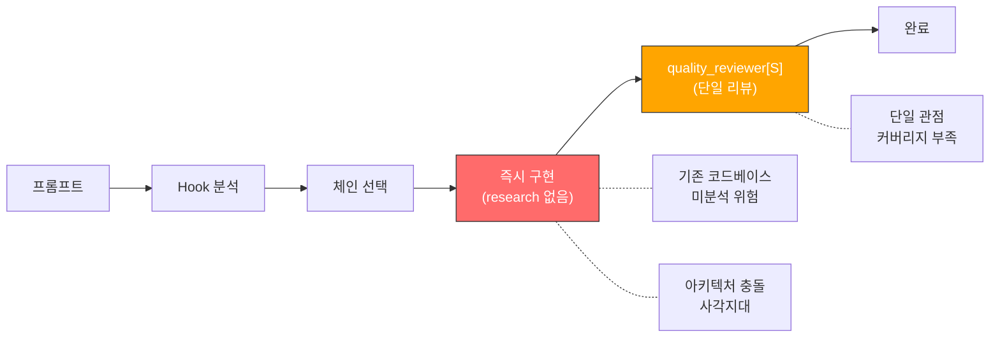
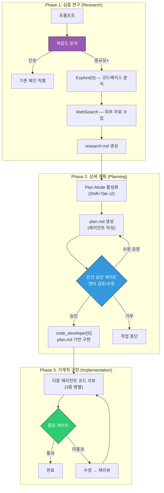
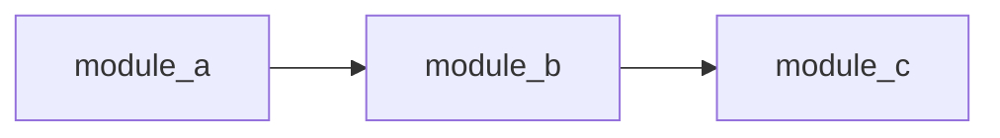
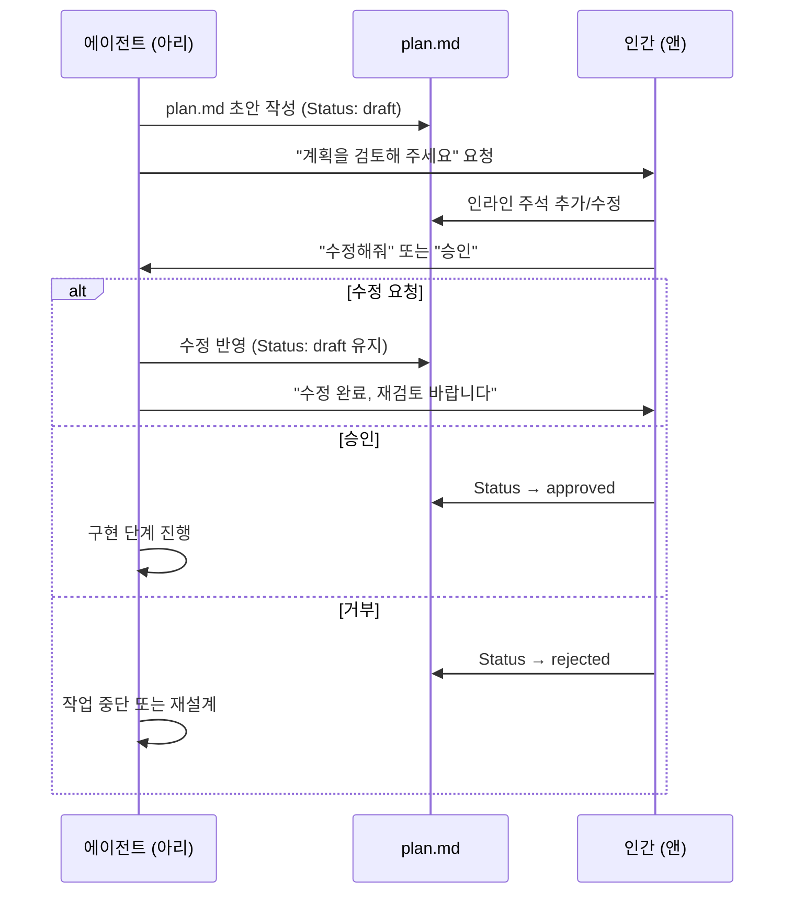
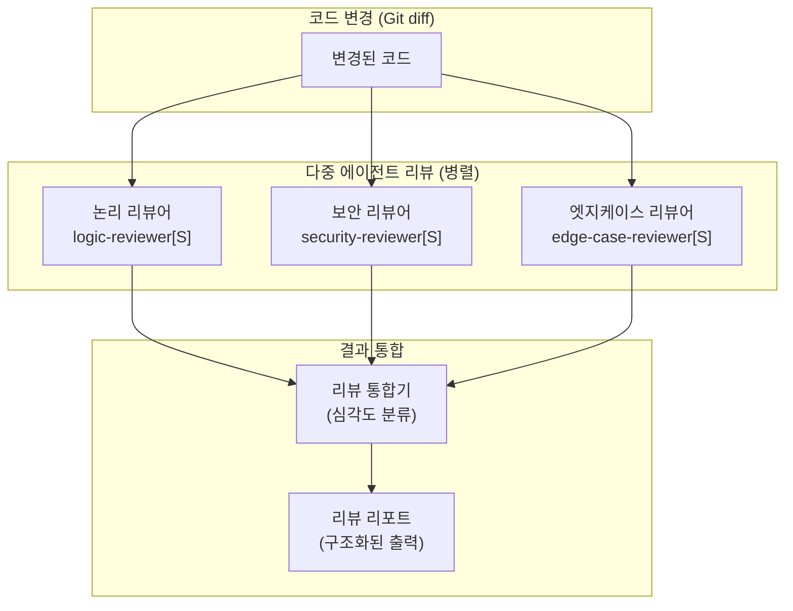
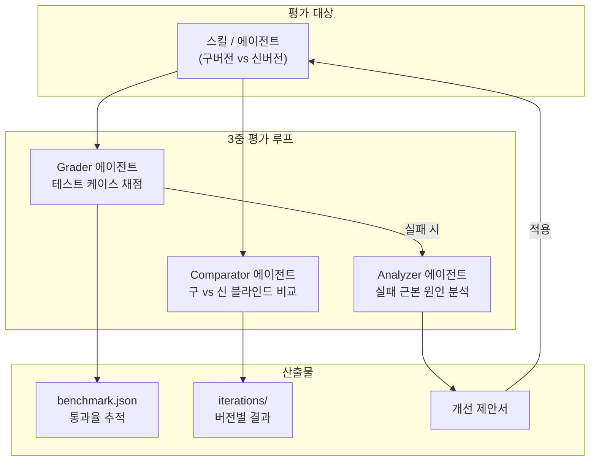
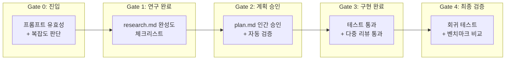
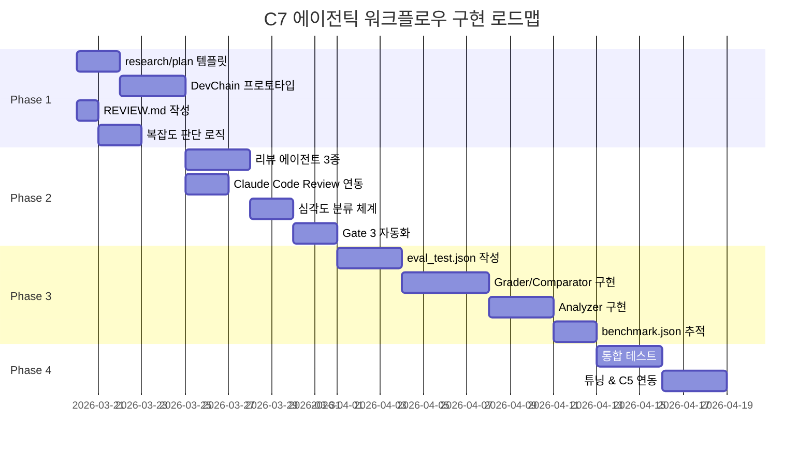

## 🔄 Next Session Handoff

### 현재 상태
- 이 문서의 완성도: completed
- 마지막 작업: C7 에이전틱 워크플로우 패러다임 전환 심층 설계 — research.md/plan.md 3단계 워크플로우, 다중 에이전트 코드 리뷰, 평가 루프, 품질 게이트, Phase별 구현 계획

### 다음 작업 (TODO)
- [ ] Phase 1 구현: DevChain에 research→plan 단계 삽입 프로토타입 (`.claude/skills/chains/dev-chain/` 내부)
- [ ] Phase 1 구현: REVIEW.md 규칙 파일 작성 (프로젝트별 커스텀 리뷰 규칙)
- [ ] Phase 2 구현: 코드 리뷰 에이전트 3종 정의 (`logic-reviewer`, `security-reviewer`, `edge-case-reviewer`)
- [ ] Phase 2 구현: 공식 Claude Code Review 연동 (`claude review --print`)
- [ ] Phase 3 구현: 평가 루프 프로토타입 — `eval_test.json` + `benchmark.json` 구조 정의
- [ ] Phase 3 구현: 블라인드 비교 테스트 자동화 스크립트
- [ ] Phase 4 검증: 실제 DevChain 작업에 전체 워크플로우 적용 → 품질 비교 리포트

### 작업 조언
> [!tip] 다음 Claude Code에게
> - 이 문서는 [[01_001_Improvement_Direction_Overview#C7. 에이전틱 워크플로우 패러다임 전환|C7 개선 방향]]의 심층 설계이다
> - **대전제**: 공식 기능 우선 → 공식 강화 → 자체 개발 ([[01_001_Improvement_Direction_Overview#1.5 개선 대전제|Section 1.5]])
> - 핵심 근거는 [[06_001_Agentic_Software_Engineering_Analysis#2. 미시적 워크플로우 분석|마크다운 3단계 워크플로우]] (Section 2)와 [[06_001_Agentic_Software_Engineering_Analysis#3. 평가 루프 메커니즘|평가 루프]] (Section 3)
> - 공식 Plan Mode(`Shift+Tab` 두 번)와 공식 Claude Code Review가 1순위 기반 — 커스텀은 그 위에 확장
> - C2(병렬 시스템)와 긴밀 연계 — 코드 리뷰 에이전트는 Agent Teams 병렬 실행 대상
> - C5(Observability)와 연계 — 워크플로우 각 단계의 실행 로그가 메트릭 데이터
> - 기존 체인 시스템(A~J)은 그대로 유지하면서, 체인 **내부**에 research→plan 단계를 삽입하는 구조
> - 품질 게이트는 Hook 기반 자동 검증 + 인간 승인 게이트 혼합

---

# C7. 에이전틱 워크플로우 패러다임 전환 심층 설계

> **상위 문서**: [[01_001_Improvement_Direction_Overview#C7. 에이전틱 워크플로우 패러다임 전환|C7 개선 방향]]
> **대전제**: [[01_001_Improvement_Direction_Overview#1.5 개선 대전제|공식 우선 → 공식 강화 → 자체 개발]]
> **핵심 근거**: [[06_001_Agentic_Software_Engineering_Analysis#2. 미시적 워크플로우 분석|마크다운 3단계 워크플로우]] / [[06_001_Agentic_Software_Engineering_Analysis#3. 평가 루프 메커니즘|Skill Creator 평가 루프]]
> **연계 카테고리**: C2(병렬 시스템), C4(Hook/Skill), C5(Observability)

---

## 1. 설계 목표

### 1.1 한 문장 목표

> **"계획 승인 전까지 코드를 쓰지 않는" 원칙을 시스템에 내재화하여, 에이전트의 자율적 코드 생성을 인간의 아키텍처 통제 아래 두는 에이전틱 워크플로우를 구축한다.**

### 1.2 구체적 목표

| 목표 | 현재 상태 (V4.2.1) | 목표 상태 (V5.0) | 측정 기준 |
|------|-------------------|-----------------|----------|
| **구조화된 워크플로우** | 프롬프트 → 체인 → 즉시 구현 | research.md → plan.md → 구현의 3단계 | 중규모+ 작업에서 plan.md 생성률 100% |
| **인간 통제 게이트** | 체인 선택만 인간 개입 | 계획 단계에 인간 승인 게이트 | 승인 없이 구현 진행된 케이스 0% |
| **다중 에이전트 리뷰** | quality_reviewer[S] 단일 | 논리/보안/엣지케이스 3종 병렬 | 리뷰 커버리지 3x 증가 |
| **코드 리뷰 표준화** | 커스텀 리뷰 규칙 없음 | REVIEW.md + 심각도 분류 체계 | 모든 PR에 일관된 리뷰 기준 적용 |
| **자동 평가 루프** | 수동 피드백만 | Grader/Comparator/Analyzer 3중 | 스킬/에이전트 성능 회귀 자동 감지 |
| **품질 게이트** | 없음 (체인 완료 = 작업 완료) | Phase별 진입/완료 조건 자동 검증 | 게이트 미통과 시 진행 차단률 100% |

### 1.3 대전제 적용

| 계층 | 원칙 | 구현 |
|------|------|------|
| **1순위: 공식 사용** | Plan Mode (`Shift+Tab` 두 번), Claude Code Review (`claude review --print`) | 공식 기능을 워크플로우의 핵심 축으로 활용 |
| **2순위: 공식 강화** | Plan Mode 출력을 plan.md로 영속화, REVIEW.md로 리뷰 규칙 커스터마이징 | 공식 기능 위에 영구 상태 + 커스텀 규칙 추가 |
| **3순위: 자체 개발** | 다중 에이전트 리뷰, 평가 루프, 품질 게이트 자동화 | 공식에 없는 3중 평가와 Stage/Gate 시스템 |

### 1.4 **하지 않는 것**

| 하지 않는 것 | 이유 |
|-------------|------|
| 기존 체인 A~J 구조 변경 | 체인 내부에 단계를 삽입하는 것이지, 체인 자체를 교체하지 않음 |
| 모든 작업에 3단계 강제 | 단순 Q&A, HotfixChain 등은 기존대로 — 복잡도 기준으로 분기 |
| 공식 Code Review 재구현 | `claude review --print`이 이미 존재 — 결과를 가공/확장만 |
| 에이전트 모델 변경 | 논리/보안/엣지케이스 리뷰어는 기존 Sonnet 모델 재활용 |

---

## 2. 현재 문제 상세 분석

### 2.1 워크플로우 부재의 구조적 문제



### 2.2 문제 근거

| 문제 | 근거 | 영향 |
|------|------|------|
| **계획 없이 즉시 구현** | [[06_001_Agentic_Software_Engineering_Analysis#2. 미시적 워크플로우 분석\|에이전틱 분석 Section 2]] — "즉각적 코드 작성이 가장 치명적 오류" | 기존 레이어 무시, API 중복, 아키텍처 붕괴 |
| **단일 리뷰어 한계** | [[06_001_Agentic_Software_Engineering_Analysis#2.2 다중 에이전트 코드 검토\|다중 에이전트 코드 검토]] — 단일 AI 자기 참조적 모순 | 논리/보안/엣지케이스 중 1개만 검토 |
| **리뷰 규칙 부재** | 현재 REVIEW.md 미정의, quality_reviewer 에이전트 범용 지시만 | 프로젝트별 리뷰 일관성 부재 |
| **성능 회귀 미감지** | [[06_001_Agentic_Software_Engineering_Analysis#3. 평가 루프 메커니즘\|평가 루프]] — 스킬 업데이트 시 기존 기능 상실 빈번 | 스킬/에이전트 수정 시 품질 보증 없음 |
| **Plan Mode 미활용** | [[02_001_Claude_Code_Official_Docs_Core_Engine#6.1 핵심 패턴 요약\|Plan Mode]] 공식 존재하나 워크플로우에 통합되지 않음 | 공식 기능 미활용, 계획 단계 누락 |

### 2.3 현재 quality_reviewer의 한계

현재 `quality_reviewer[S]` 에이전트는 거의 모든 체인의 마지막 단계에서 호출된다 ([[104_current_system/CLAUDE.md#2.3 통합 매핑 테이블|매핑 테이블]]). 그러나:

| 한계 | 상세 |
|------|------|
| **단일 관점** | 한 에이전트가 논리/보안/성능/엣지케이스를 모두 검토 → 전문성 분산 |
| **심각도 미분류** | "문제 있음"만 보고, Critical/Warning/Info 구분 없음 |
| **리뷰 기준 부재** | 프로젝트별 REVIEW.md가 없어 일관된 리뷰 불가 |
| **블라인드 비교 없음** | 구버전 vs 신버전 비교 메커니즘 없음 |

---

## 3. 아키텍처 설계

### 3.1 전체 아키텍처 — 3단계 워크플로우



### 3.2 복잡도 기반 워크플로우 분기

모든 작업에 3단계를 적용하면 오버헤드가 과도하다. 작업 복잡도에 따라 분기한다.

| 복잡도 | 기준 | 워크플로우 | 적용 체인 |
|--------|------|-----------|----------|
| **단순** | 한 줄 수정, 파일 읽기, Q&A | 기존 체인 직행 (워크플로우 생략) | HotfixChain, 단순 Q&A |
| **중규모** | 파일 3개 이상 수정, 새 기능 1개 | research.md + plan.md | DevChain, AutomationChain |
| **대규모** | 아키텍처 변경, 다중 파일, 신규 시스템 | 전체 3단계 + 인간 승인 게이트 | SystemDesignChain, WebDevChain+ |

**복잡도 판단 주체**: Hook 분석(prompt_analyzer.py)이 1차 판단, 아리가 2차 보정

```python
# prompt_analyzer.py V5.0 확장 (복잡도 판단 추가)
complexity_indicators = {
    "단순": ["수정해줘", "고쳐줘", "보여줘", "읽어줘"],
    "중규모": ["기능 추가", "구현", "만들어줘", "개발"],
    "대규모": ["아키텍처", "시스템 설계", "전면 리팩토링", "마이그레이션"]
}
```

### 3.3 기존 체인과의 공존 구조

> [!important] 핵심 설계 원칙
> 체인을 교체하지 않는다. 체인 **내부**에 research→plan 단계를 삽입한다.

**변경 전 (V4.2.1 DevChain)**:
```
requirements_analyst[O] → (system_architect[O] ∥ Explore[S] ∥ Context7[∥])
→ code_developer[S] → (quality_reviewer[S] ∥ Bash[테스트][-])
```

**변경 후 (V5.0 DevChain)**:
```
requirements_analyst[O] → (system_architect[O] ∥ Explore[S] ∥ Context7[∥])
→ [research.md 생성] → [plan.md 생성 + 인간 승인 게이트]
→ code_developer[S] → (multi_reviewer[S×3] ∥ Bash[테스트][-])
```

**삽입 위치 원칙**:
- `system_architect` / `Explore` 단계의 출력 = `research.md`의 입력
- `code_developer` 단계의 입력 = 승인된 `plan.md`
- `quality_reviewer` = `multi_reviewer` (3종 병렬)로 확장

### 3.4 체인별 워크플로우 적용 매핑

| 체인 | 복잡도 | research.md | plan.md | 인간 게이트 | 다중 리뷰 |
|------|--------|-------------|---------|-----------|----------|
| **SystemDesignChain** | 대규모 | O (필수) | O (필수) | O (필수) | O |
| **DevChain** | 중규모 | O | O | 조건부 (대규모 시) | O |
| **WebDevChain+** | 대규모 | O (필수) | O (필수) | O (필수) | O |
| **AutomationChain** | 중규모 | O | O | 조건부 | O |
| **GameDevChain** | 대규모 | O (필수) | O (필수) | O (필수) | O |
| **ResearchChain** | - | 내재적 (연구 자체가 목적) | X | X | X |
| **DocChain+** | - | X | X | X | X |
| **MetaThinkChain** | - | X | X | X | X |
| **RailsDevChain** | 대규모 | `/rails-prd` = research | `/rails-plan` = plan | O (이미 존재) | O |
| **HotfixChain** | 단순 | X (긴급) | X (긴급) | X | 축소 (1종) |

---

## 4. research.md 상세 설계

### 4.1 research.md의 역할과 산출물

> **목적**: 에이전트가 기존 코드베이스의 모든 구조, 의존성, 인터페이스를 심층 분석하여 문서화함으로써, 구현 단계에서 기존 시스템과의 충돌을 사전 차단한다.

| 항목 | 설명 |
|------|------|
| **생성 주체** | 에이전트 (`Explore[S]` + `system_architect[O]`) |
| **형식** | 마크다운 파일 (프로젝트 루트 또는 `.claude/workflow/`) |
| **수명** | 작업 세션 동안 유지, 완료 후 아카이브 또는 삭제 |
| **읽기 대상** | plan.md 생성 에이전트 + 인간 검토자(앤) |

### 4.2 research.md 템플릿

```markdown
# Research: [작업 제목]

## 1. 작업 요약
- 요청 내용: [프롬프트 원문 또는 요약]
- 예상 변경 범위: [파일 수, 모듈, 계층]

## 2. 기존 코드베이스 분석
### 2.1 관련 파일 목록
| 파일 | 역할 | 변경 필요 여부 |
|------|------|-------------|
| `path/to/file.ts` | [역할] | [Y/N/검토필요] |

### 2.2 의존성 그래프


### 2.3 인터페이스 / API 현황
- 기존 API 엔드포인트: [목록]
- 기존 타입/인터페이스: [목록]
- 중복 위험 영역: [식별 결과]

## 3. 외부 자료 조사
- [URL 또는 문서 참조]: [핵심 내용 1줄]
- 관련 라이브러리/패턴: [목록]

## 4. 리스크 & 제약 조건
| 리스크 | 심각도 | 완화 방안 |
|--------|--------|----------|
| [리스크 1] | High/Medium/Low | [방안] |

## 5. 핵심 발견 요약
1. [발견 1]
2. [발견 2]
3. [발견 3]
```

### 4.3 공식 Plan Mode 통합

| 기능 | 공식 Plan Mode | research.md | 통합 방식 |
|------|---------------|-------------|----------|
| **활성화** | `Shift+Tab` 두 번 / `--permission-mode plan` | 에이전트가 생성 | Plan Mode로 탐색 → research.md로 영속화 |
| **범위** | 파일 수정 없이 분석만 | 코드베이스 + 외부 자료 | Plan Mode의 읽기 전용 보장을 활용 |
| **휘발성** | 컨텍스트 윈도우 내 휘발 | 파일로 영속 저장 | Plan Mode 결과를 research.md에 기록 |
| **재활용** | 세션 종료 시 소실 | 다음 세션에서 참조 가능 | PostCompact Hook으로 복원 가능 |

**통합 흐름**:
```
Plan Mode 활성화 (Shift+Tab x2)
    → 에이전트가 코드베이스 분석 (파일 수정 불가)
    → 분석 결과를 research.md로 저장 (Plan Mode 내에서 Write만 허용)
    → Plan Mode 해제 후 plan.md 작성 단계로 진행
```

---

## 5. plan.md 상세 설계

### 5.1 plan.md의 역할과 산출물

> **목적**: research.md를 바탕으로 구현 계획을 작성하되, 인간이 직접 개입하여 아키텍처 통제권을 유지하는 단계이다. 계획이 승인되기 전까지 어떤 코드도 작성되지 않는다.

| 항목 | 설명 |
|------|------|
| **초안 작성 주체** | 에이전트 (`system_architect[O]`) |
| **검토/수정 주체** | **인간(앤)** — 인라인 주석으로 제약 조건 추가 |
| **승인 주체** | **인간(앤)** — "응 진행해줘" 또는 명시적 승인 |
| **형식** | 마크다운 파일 (research.md와 동일 위치) |

### 5.2 plan.md 템플릿

```markdown
# Plan: [작업 제목]

> **Status**: draft | approved | rejected
> **Research**: [[research.md]] 기반
> **Approver**: 앤

## 1. 구현 개요
- 목표: [1줄 요약]
- 예상 변경 파일: [N개]
- 예상 소요: [세션 수 또는 시간]

## 2. 아키텍처 결정
| 결정 | 선택 | 대안 | 근거 |
|------|------|------|------|
| [결정 1] | [A 방식] | [B 방식] | [이유] |

## 3. 구현 단계 (체크리스트)
- [ ] **Step 1**: [구체적 행동] — 파일: `path/to/file`
- [ ] **Step 2**: [구체적 행동] — 파일: `path/to/file`
- [ ] **Step 3**: 테스트 작성 및 실행
- [ ] **Step 4**: 코드 리뷰 실행

## 4. 변경하지 않을 것 (Constraints)
- [기존 API 엔드포인트 유지]
- [데이터베이스 스키마 변경 금지]

## 5. 앤의 인라인 주석
<!-- 앤이 직접 추가하는 제약 조건/수정 요청 -->
<!-- 예: "Step 2에서 캐싱 로직은 제거할 것" -->
<!-- 예: "이 API는 v2 엔드포인트를 사용할 것" -->

## 6. 승인
- [ ] 앤 승인 완료 → Status를 `approved`로 변경
```

### 5.3 인간 승인 게이트 메커니즘



**승인 트리거 패턴**:

| 앤의 입력 | 해석 | 동작 |
|----------|------|------|
| "응 진행해줘" | 승인 | plan.md Status → approved, 구현 시작 |
| "좋아", "ㅇㅇ" | 승인 | 동일 |
| "Step 2 수정해줘" | 부분 수정 | plan.md 수정 후 재검토 요청 |
| "다시 해", "아니야" | 거부/재설계 | plan.md Status → rejected, 재작성 |
| (수정 없이 엔터) | 암묵적 승인 | 구현 시작 (단, 대규모 작업은 명시 승인 필수) |

---

## 6. 다중 에이전트 코드 리뷰 설계

### 6.1 공식 Claude Code Review 활용 (1순위)

> **공식 기능**: `claude review --print` 명령으로 자동 PR 리뷰 실행 가능
> **커스터마이징**: `REVIEW.md` 파일로 프로젝트별 리뷰 규칙 정의

| 공식 기능 | 설명 | 활용 |
|----------|------|------|
| `claude review` | Git diff 기반 자동 코드 리뷰 | PR/커밋 단위 자동 실행 |
| `claude review --print` | 터미널 출력 (비파괴) | 로컬 리뷰, 커밋 전 검증 |
| `REVIEW.md` | 프로젝트별 커스텀 리뷰 규칙 | 팀/프로젝트 특화 검증 기준 |
| 심각도 색상 코드 | 빨강/노랑/보라 | 우선순위 기반 수정 판단 |

### 6.2 REVIEW.md 규칙 설계

```markdown
# REVIEW.md — 프로젝트 리뷰 규칙

## 필수 검증 (Critical)
- 데이터베이스 변경 시 하위 호환성 보장할 것
- 외부 API 호출 시 타임아웃과 재시도 로직 포함할 것
- 인증/인가 로직 변경 시 기존 테스트 전체 통과 확인할 것
- 환경변수(.env) 참조 시 기본값 설정 확인할 것

## 권장 검증 (Warning)
- 매직 넘버 금지, 상수로 추출할 것
- 함수 30줄 초과 시 분리 권장
- 주석이 없는 복잡한 비즈니스 로직 경고
- 미사용 import/변수 제거

## 코드 스타일 (Info)
- 네이밍 컨벤션 준수 (camelCase / snake_case)
- 일관된 에러 처리 패턴 사용
- 로깅 레벨 적절성 확인
```

### 6.3 다중 에이전트 리뷰 아키텍처 (2순위: 공식 강화)

단일 `quality_reviewer[S]`를 3개의 전문 리뷰 에이전트로 확장한다.



### 6.4 리뷰 에이전트 스펙

| 에이전트 | 모델 | 전문 영역 | 검증 항목 |
|---------|------|----------|----------|
| **logic-reviewer** | S | 논리적 정합성 | 변수 흐름, 조건 분기 누락, 반환값 불일치, 타입 불일치, 데드코드 |
| **security-reviewer** | S | 보안 취약점 | SQL 인젝션, XSS, 인증 우회, 민감 데이터 노출, 의존성 취약점 |
| **edge-case-reviewer** | S | 엣지케이스 | 널 포인터, 빈 배열, 경계값, 동시성 경합, 대용량 데이터 처리 |

**에이전트 정의 파일 구조** (`.claude/agents/`):

```yaml
# logic-reviewer.md
---
name: logic-reviewer
description: 코드의 논리적 정합성을 전문적으로 검토하는 리뷰 에이전트. 변수 흐름, 조건 분기, 반환값, 타입 일관성을 중점 분석한다.
model: sonnet
---

## 리뷰 지침
1. 전체 변경 diff를 읽고 논리적 흐름을 추적할 것
2. 각 함수의 입력→처리→출력 경로에서 누락된 분기를 식별할 것
3. 발견된 문제를 심각도(Critical/Warning/Info)로 분류할 것
4. REVIEW.md의 필수 검증 항목과 대조할 것

## 출력 형식
| 파일 | 라인 | 심각도 | 문제 | 수정 제안 |
|------|------|--------|------|----------|
```

### 6.5 심각도 분류 체계

| 심각도 | 색상 | 기준 | 동작 |
|--------|------|------|------|
| **Critical** | 빨강 | 런타임 오류, 보안 취약점, 데이터 손실 위험 | **필수 수정** — 통과 전까지 병합 차단 |
| **Warning** | 노랑 | 성능 저하, 유지보수 어려움, 베스트 프랙티스 위반 | **권장 수정** — 사유 기재 시 무시 가능 |
| **Info** | 보라 | 기존 코드의 내재적 버그, 스타일, 개선 제안 | **참고** — 현재 변경과 무관한 기존 문제 |

**결정 매트릭스**:

```
Critical 1개 이상 → 품질 게이트 차단 (수정 필수)
Warning 3개 이상 → 경고 출력 (진행은 가능, 앤 판단)
Info만 → 자동 통과
```

### 6.6 리뷰 통합 리포트 형식

```markdown
# Code Review Report

## 요약
| 심각도 | 건수 |
|--------|------|
| Critical | 0 |
| Warning | 2 |
| Info | 3 |

## Critical Issues (즉시 수정 필수)
(없음)

## Warning Issues (권장 수정)
### W-1: 타임아웃 미설정 (security-reviewer)
- **파일**: `src/api/client.ts:45`
- **문제**: 외부 API 호출에 타임아웃이 설정되지 않음
- **수정 제안**: `fetch(url, { signal: AbortSignal.timeout(5000) })`

### W-2: 매직 넘버 (logic-reviewer)
- **파일**: `src/utils/calc.ts:12`
- **문제**: `if (count > 100)` — 100의 의미 불명확
- **수정 제안**: `const MAX_ITEMS = 100` 상수 추출

## Info Issues (참고)
[...]

## 리뷰 메타데이터
- 리뷰 일시: YYYY-MM-DD HH:MM
- 리뷰 에이전트: logic-reviewer, security-reviewer, edge-case-reviewer
- 대상: [commit hash 또는 PR #]
```

---

## 7. 평가 루프 설계 (Skill Creator 패턴 적용)

### 7.1 3중 평가 구조

[[06_001_Agentic_Software_Engineering_Analysis#3. 평가 루프 메커니즘|Skill Creator 평가 루프]]의 Grader/Comparator/Analyzer 패턴을 우리 시스템에 적용한다.



### 7.2 평가 에이전트 스펙

| 에이전트 | 역할 | 입력 | 출력 |
|---------|------|------|------|
| **Grader** | 테스트 케이스 기반 채점 | `eval_test.json` (시나리오 N개) + 스킬/에이전트 출력 | 통과/실패/부분통과 + 점수 |
| **Comparator** | 블라인드 비교 | 구버전 출력(A) + 신버전 출력(B) (버전 라벨 없이) | A vs B 승/패/무 + 사유 |
| **Analyzer** | 근본 원인 분석 | Grader 실패 결과 + 스킬/에이전트 정의 + 입출력 쌍 | 근본 원인 + 구체적 수정 제안 |

### 7.3 eval_test.json 구조

```json
{
  "target": "quality_reviewer",
  "version": "2.0.0",
  "test_cases": [
    {
      "id": "TC-001",
      "name": "SQL 인젝션 감지",
      "input": {
        "code_diff": "user_input = request.params['query']\ndb.execute(f'SELECT * FROM users WHERE name = {user_input}')"
      },
      "expected": {
        "severity": "Critical",
        "category": "security",
        "detected": true
      }
    },
    {
      "id": "TC-002",
      "name": "빈 배열 처리",
      "input": {
        "code_diff": "const avg = sum / items.length;"
      },
      "expected": {
        "severity": "Critical",
        "category": "edge-case",
        "detected": true
      }
    }
  ]
}
```

### 7.4 benchmark.json 구조

```json
{
  "target": "quality_reviewer",
  "history": [
    {
      "version": "1.0.0",
      "date": "2026-03-10",
      "pass_rate": 0.72,
      "total_cases": 25,
      "passed": 18,
      "failed": 7,
      "critical_misses": 3
    },
    {
      "version": "2.0.0",
      "date": "2026-03-15",
      "pass_rate": 0.88,
      "total_cases": 25,
      "passed": 22,
      "failed": 3,
      "critical_misses": 0
    }
  ],
  "comparison": {
    "v1_vs_v2": {
      "winner": "v2.0.0",
      "improvement": "+16%",
      "regression_detected": false
    }
  }
}
```

### 7.5 블라인드 비교 프로세스

```
1. 동일 입력(eval_test.json)에 대해 구버전/신버전 각각 실행
2. 출력 결과에서 버전 식별자 제거 (Output A / Output B)
3. Comparator에게 "어떤 출력이 더 우수한가?" 판단 요청
4. 판단 결과를 iterations/ 폴더에 저장
5. 신버전이 구버전보다 우수 + Grader 통과율 유지 → 업데이트 승인
6. 회귀 감지(구버전이 우수) → 업데이트 거부, Analyzer에게 분석 요청
```

> [!warning] 회귀 방지 원칙
> 신버전이 새로운 테스트를 통과하더라도, **기존 테스트의 통과율이 하락하면 업데이트를 거부**한다. 이것이 평가 루프의 핵심 가치이다.

---

## 8. 품질 게이트 (Stage/Gate) 설계

### 8.1 전체 게이트 구조



### 8.2 게이트별 진입/완료 조건

#### Gate 0: 진입 게이트

| 조건 | 유형 | 검증 방법 |
|------|------|----------|
| 프롬프트가 10자 이상 | 자동 | prompt_analyzer.py |
| 복잡도 판단 완료 | 자동 | 단순/중규모/대규모 분기 |
| 대상 프로젝트 식별 | 자동 | cwd 기반 프로젝트 매핑 |

#### Gate 1: 연구 완료 게이트

| 조건 | 유형 | 검증 방법 |
|------|------|----------|
| research.md 생성됨 | 자동 | 파일 존재 확인 |
| 관련 파일 목록 포함 | 자동 | Section 2.1 테이블 존재 확인 |
| 리스크 섹션 포함 | 자동 | Section 4 존재 확인 |
| 핵심 발견 1개 이상 | 자동 | Section 5 비어있지 않음 |

**체크리스트** (자동 검증 스크립트):
```bash
#!/bin/bash
# gate1_checker.sh — research.md 완성도 검증
FILE="$1"
PASS=true

# 필수 섹션 존재 확인
for section in "기존 코드베이스 분석" "리스크" "핵심 발견"; do
    if ! grep -q "$section" "$FILE"; then
        echo "FAIL: '$section' 섹션 누락"
        PASS=false
    fi
done

if [ "$PASS" = true ]; then
    echo "PASS: Gate 1 통과"
    exit 0
else
    echo "BLOCKED: research.md 완성도 미달"
    exit 1
fi
```

#### Gate 2: 계획 승인 게이트

| 조건 | 유형 | 검증 방법 |
|------|------|----------|
| plan.md 생성됨 | 자동 | 파일 존재 확인 |
| Status가 `approved` | **인간** | 앤이 승인 후 Status 변경 |
| 구현 단계 체크리스트 포함 | 자동 | `- [ ]` 패턴 존재 확인 |
| 아키텍처 결정 테이블 포함 | 자동 | Section 2 테이블 존재 확인 |

> [!important] 인간 승인이 핵심
> Gate 2는 유일하게 **인간 승인이 필수**인 게이트이다. 에이전트가 자체적으로 통과시킬 수 없다. 이것이 "계획 승인 전까지 코드를 쓰지 않는" 원칙의 기술적 구현이다.

#### Gate 3: 구현 완료 게이트

| 조건 | 유형 | 검증 방법 |
|------|------|----------|
| 모든 테스트 통과 | 자동 | `Bash[테스트]` 실행 결과 |
| Critical 리뷰 이슈 0건 | 자동 | 다중 리뷰 리포트 파싱 |
| Warning 3건 미만 또는 사유 기재 | 자동/인간 | 리포트 + 인간 판단 |
| plan.md 체크리스트 전체 완료 | 자동 | `- [x]` 비율 100% |

#### Gate 4: 최종 검증 게이트 (선택적)

| 조건 | 유형 | 검증 방법 |
|------|------|----------|
| 기존 테스트 회귀 없음 | 자동 | 전체 테스트 스위트 실행 |
| 벤치마크 비교 통과 | 자동 | benchmark.json 성능 유지/향상 |
| 블라인드 비교 승리 | 자동 | Comparator 판정 |

### 8.3 게이트 자동화 구현

**Hook 기반 자동 게이트**:

| 게이트 | Hook | 트리거 시점 |
|--------|------|-----------|
| Gate 0 | UserPromptSubmit | 프롬프트 입력 시 |
| Gate 1 | PostToolUse (Write) | research.md 작성 완료 시 |
| Gate 2 | UserPromptSubmit | 앤의 승인 입력 시 |
| Gate 3 | PostToolUse (Bash) | 테스트 실행 완료 시 |
| Gate 4 | Stop | 전체 작업 완료 시 |

---

## 9. 기술 선정 매트릭스

### 9.1 워크플로우 영속 저장소

| 후보 | 장점 | 단점 | 선정 |
|------|------|------|------|
| **프로젝트 루트 파일** | 간단, Git 추적 가능 | 프로젝트마다 산재, 정리 필요 | 단순 프로젝트 |
| **`.claude/workflow/`** | 일관된 위치, 프로젝트 독립 | 새 디렉토리 관리 필요 | **선정 (기본)** |
| **메모리 시스템 연동** | C1 온톨로지와 통합 | 복잡도 높음, C1 선행 필요 | Phase 3+ |

### 9.2 리뷰 에이전트 실행 방식

| 후보 | 장점 | 단점 | 선정 |
|------|------|------|------|
| **순차 실행** | 간단, 결과 순차 집계 | 느림 (3x 시간) | X |
| **Agent Teams 병렬** | 3종 동시 실행, 빠름 | C2 공식 전환 선행 필요 | Phase 2+ |
| **Subagent 병렬 (공식)** | 공식 API, 안정적 | 환경 미지원 시 fallback 필요 | **선정 (기본)** |

### 9.3 평가 데이터 저장

| 후보 | 장점 | 단점 | 선정 |
|------|------|------|------|
| **JSON 파일** | 간단, 버전 관리 용이 | 대량 데이터 시 비효율 | **선정 (초기)** |
| **SQLite** | 쿼리 가능, 집계 용이 | 별도 도구 필요 | Phase 3+ |
| **C1 온톨로지 통합** | 메모리 시스템과 통합 | C1 선행 필수 | 장기 |

---

## 10. 리스크 & 완화 방안

| 리스크 | 심각도 | 확률 | 완화 방안 |
|--------|--------|------|----------|
| **워크플로우 오버헤드** — 3단계가 단순 작업까지 느리게 만듦 | Medium | High | 복잡도 기반 분기 (Section 3.2), 단순 작업은 기존 체인 직행 |
| **인간 병목** — 앤의 승인 대기로 작업 중단 | Medium | Medium | 중규모 작업은 조건부 승인 (명시적 거부 없으면 진행), 대규모만 필수 |
| **리뷰 에이전트 과잉 보고** — 사소한 이슈를 Critical로 분류 | Low | Medium | REVIEW.md에 심각도 기준 명확히 정의, 초기 캘리브레이션 기간 운영 |
| **평가 루프 비용** — Grader/Comparator/Analyzer 3중 실행 | Medium | Low | 스킬/에이전트 업데이트 시에만 실행, 일상 작업에는 미적용 |
| **기존 체인 호환성** — 삽입된 단계가 기존 체인 흐름을 방해 | High | Low | 체인 내부 삽입 (교체 아님), 호환성 테스트 필수 |
| **Plan Mode 한계** — Plan Mode에서 파일 쓰기 제한 | Low | Medium | Plan Mode 분석 후 일반 모드로 전환하여 research.md 저장 |

---

## 11. 성공 측정 지표 (KPI)

| 지표 | 현재 | 목표 | 측정 방법 |
|------|------|------|----------|
| **plan.md 생성률** (중규모+ 작업) | 0% | 100% | 체인 실행 로그 (C5 연계) |
| **리뷰 커버리지** | 1종 (quality_reviewer) | 3종 (논리/보안/엣지) | 리뷰 리포트 에이전트 수 |
| **Critical 이슈 누락률** | 측정 불가 | 5% 미만 | eval_test.json 통과율 |
| **아키텍처 충돌 발생률** | 측정 불가 (사후 감지) | 50% 감소 | research.md에서 사전 식별된 충돌 수 |
| **스킬 성능 회귀율** | 측정 불가 | 0% (블라인드 비교 기반) | benchmark.json 회귀 이벤트 |
| **게이트 차단률** | N/A | 측정 시작 | Gate 3 차단 → 수정 → 통과 사이클 |

---

## 12. 구현 계획 (Phase별)

### Phase 1: 기반 구축 (1~2세션)

| 작업 | 대전제 | 산출물 | 검증 |
|------|--------|--------|------|
| research.md / plan.md 템플릿 생성 | 2순위 (강화) | `.claude/workflow/templates/` | 템플릿 파일 존재 |
| DevChain에 research→plan 삽입 프로토타입 | 2순위 (강화) | DevChain 스킬 수정 | 실제 DevChain 작업에서 research.md 생성 확인 |
| REVIEW.md 초안 작성 | 1순위 (공식) | 프로젝트 루트 `REVIEW.md` | `claude review --print` 실행 시 REVIEW.md 규칙 반영 확인 |
| 복잡도 판단 로직 추가 | 2순위 (강화) | prompt_analyzer.py V5.0 확장 | 단순/중규모/대규모 분기 동작 확인 |

### Phase 2: 다중 리뷰 도입 (2~3세션)

| 작업 | 대전제 | 산출물 | 검증 |
|------|--------|--------|------|
| 리뷰 에이전트 3종 정의 | 3순위 (자체) | `.claude/agents/` 에 3개 파일 | 에이전트 호출 동작 확인 |
| 공식 Claude Code Review 연동 | 1순위 (공식) | Hook 또는 체인에 `claude review` 통합 | PR 생성 시 자동 리뷰 실행 |
| 심각도 분류 체계 적용 | 2순위 (강화) | 리뷰 통합 리포트 형식 | Critical/Warning/Info 분류 정확도 |
| 품질 게이트 Gate 3 자동화 | 2순위 (강화) | gate3_checker.sh | Critical 0건 시 자동 통과 확인 |

### Phase 3: 평가 루프 구축 (3~5세션)

| 작업 | 대전제 | 산출물 | 검증 |
|------|--------|--------|------|
| eval_test.json 초기 테스트 셋 작성 (25개) | 3순위 (자체) | `.claude/eval/eval_test.json` | 테스트 케이스 실행 가능 |
| Grader 에이전트 구현 | 3순위 (자체) | `.claude/agents/grader.md` | 채점 결과 benchmark.json 반영 |
| Comparator 블라인드 비교 구현 | 3순위 (자체) | 비교 스크립트 + iterations/ | 구/신 라벨 없이 비교 동작 확인 |
| Analyzer 근본 원인 분석 구현 | 3순위 (자체) | `.claude/agents/analyzer.md` | 실패 시 수정 제안 생성 확인 |
| benchmark.json 자동 추적 | 3순위 (자체) | `.claude/eval/benchmark.json` | 버전별 통과율 히스토리 누적 |

### Phase 4: 통합 검증 및 최적화 (2~3세션)

| 작업 | 대전제 | 산출물 | 검증 |
|------|--------|--------|------|
| 실제 DevChain 작업에 전체 워크플로우 적용 | - | 비교 리포트 | 기존 방식 vs 새 방식 품질/시간 비교 |
| 게이트 자동화 전체 연결 | 2순위 (강화) | Gate 0~4 통합 동작 | 엔드-투-엔드 게이트 통과 시나리오 |
| 워크플로우 튜닝 | - | 피드백 반영 | 오버헤드 30% 이내, 품질 향상 50% 이상 |
| C5 Observability 연동 | 2순위 (강화) | 워크플로우 단계별 로그 | C5 로그에 Gate 통과/차단 기록 |

### Phase 로드맵 시각화



---

## 13. C7과 다른 카테고리의 교차 시너지

### 13.1 C7 x C2 (병렬 시스템)

| 시너지 | 설명 |
|--------|------|
| 리뷰 에이전트 병렬 실행 | 3종 리뷰 에이전트를 Agent Teams로 동시 실행 → 리뷰 시간 1/3 |
| 평가 루프 병렬화 | Grader/Comparator를 병렬 실행 → 평가 시간 단축 |
| 체인 내 삽입 = 스킬 | research→plan 단계를 스킬로 정의하면 C2 마이그레이션과 동시 진행 |

### 13.2 C7 x C4 (Hook/Skill)

| 시너지 | 설명 |
|--------|------|
| 게이트 자동화 = Hook | Gate 1~4를 PostToolUse/Stop Hook으로 자동 트리거 |
| REVIEW.md = 커스텀 규칙 | 공식 Code Review의 커스터마이징 인터페이스 활용 |
| 워크플로우 = Skill | research→plan 단계를 `.claude/skills/chains/`에 스킬로 정의 |

### 13.3 C7 x C5 (Observability)

| 시너지 | 설명 |
|--------|------|
| 게이트 통과/차단 로그 | Gate 차단 횟수, 사유, 수정 시간을 로그로 추적 |
| 리뷰 메트릭 | Critical/Warning/Info 건수 추이를 월간 리포트에 포함 |
| 워크플로우 효율성 | research→plan 소요 시간 vs 구현 시간 비율 최적화 |
| 평가 루프 데이터 | benchmark.json 히스토리가 C5 자기 진화의 핵심 데이터 |

### 13.4 C7 x C1 (온톨로지 메모리)

| 시너지 | 설명 |
|--------|------|
| research.md 벡터화 | 과거 research.md를 벡터 DB에 저장 → 유사 작업 시 자동 참조 |
| plan.md 재활용 | 승인된 plan.md 패턴을 학습 → 계획 초안 품질 향상 |
| 리뷰 결과 학습 | 반복 발생하는 리뷰 이슈를 메모리에 축적 → 예방적 경고 |

---

## 관련 문서

### 직접 참조 (Direct Links)
- [[01_001_Improvement_Direction_Overview#C7. 에이전틱 워크플로우|C7 개선 방향]] — 상위 방향 문서

### 역참조 (Backlinks)
- [[01_001_Improvement_Direction_Overview#6. 카테고리별 심층 문서 계획|심층 문서 계획]]

### 관련 주제 (Topic Links)
- [[02_002_C2_Parallel_System_Official_Migration#4. 체인 → 스킬 전환|C2 체인 스킬화]] — research→plan→구현 워크플로우와 체인 패턴의 공존
- [[02_004_C4_Hook_Skill_Official_Migration#4. Hook 타입 확장|C4 Hook 타입]] — prompt/agent Hook이 워크플로우 자동화 채널
- [[02_005_C5_Observability_Self_Evolution#5. Effort Level|C5 Effort]] — 워크플로우 복잡도별 effort 자동 분기
- [[02_001_C1_Ontology_Memory_Deep_Design#5. 인덱싱 파이프라인|C1 인덱싱]] — research.md를 메모리로 자동 인덱싱

---

## Release Notes

### v1.0.0 (2026-03-15)
- C7 에이전틱 워크플로우 패러다임 전환 심층 설계 초기 작성
- **5대 설계 영역**: (1) research.md/plan.md 3단계 워크플로우, (2) 다중 에이전트 코드 리뷰 3종, (3) Grader/Comparator/Analyzer 평가 루프, (4) Stage/Gate 품질 게이트 4단계, (5) Phase 1~4 구현 로드맵
- 공식 Plan Mode + Claude Code Review를 1순위 기반으로 설계
- 복잡도 기반 워크플로우 분기 (단순/중규모/대규모)
- 기존 체인 A~J 교체 없이 내부 삽입 구조
- eval_test.json / benchmark.json 데이터 스키마 정의
- REVIEW.md 커스텀 리뷰 규칙 + 심각도 분류 체계 (Critical/Warning/Info)
- C2/C4/C5/C1 교차 시너지 4개 분석
- 리스크 6개 + KPI 6개 + 성공 측정 지표 정의
> **프롬프트:** "응 진행해줘" (C6~C8 병렬 지시)
