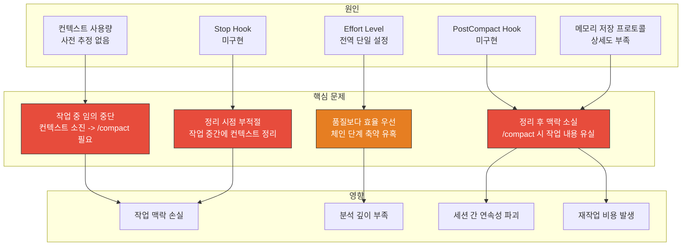
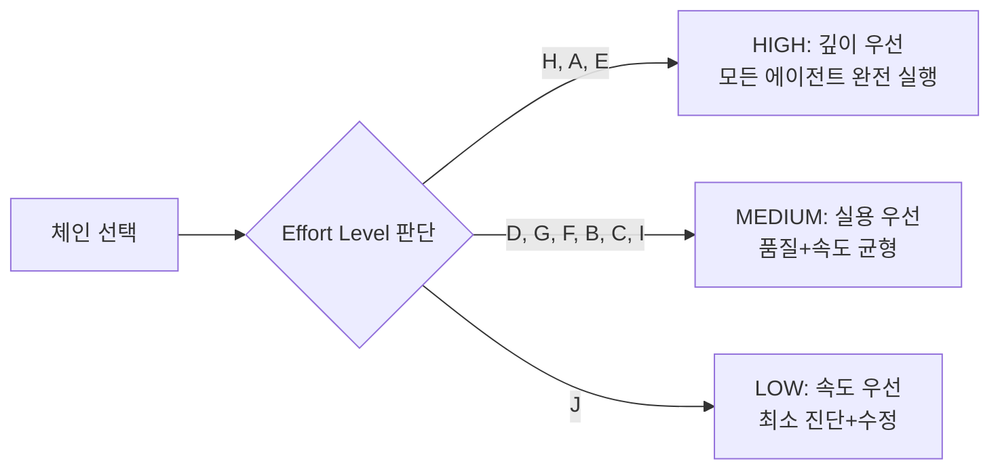
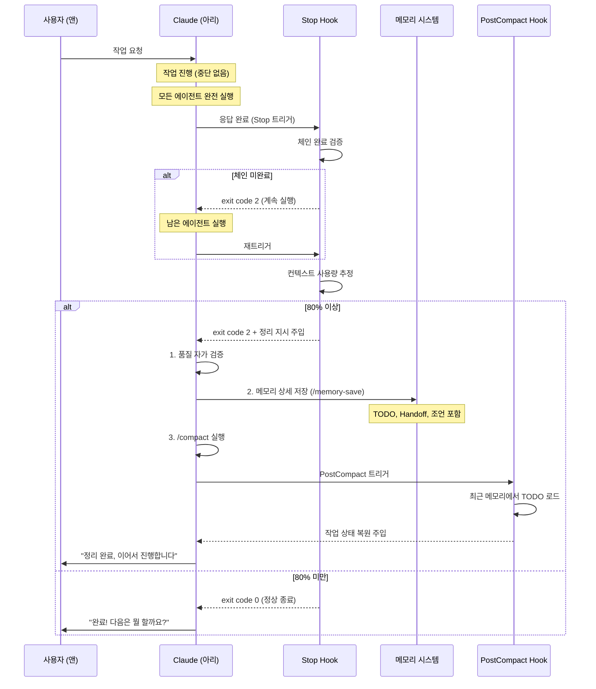
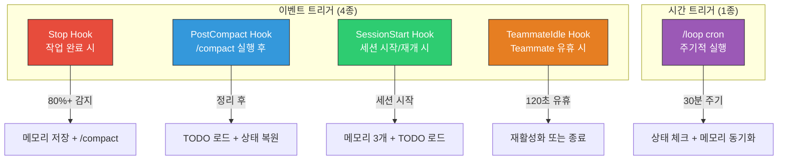
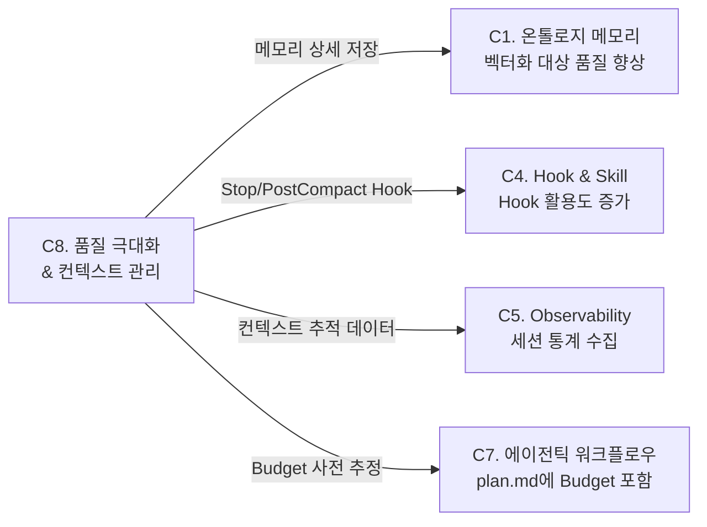

## 🔄 Next Session Handoff

### 현재 상태
- 이 문서의 완성도: completed
- 마지막 작업: C8 결과물 품질 극대화 & 컨텍스트 관리 심층 설계 -- Quality-First 원칙, 작업 중단 방지, Post-Task Cleanup (Stop/PostCompact Hook), 메모리 상세 저장 프로토콜, 트리거 기반 예약 작업 5종, Phase별 구현 + 검증

### 다음 작업 (TODO)
- [ ] Phase 1 구현: `stop-cleanup.sh` V2.0 작성 + settings.json 등록 (Stop Hook)
- [ ] Phase 1 구현: `post-compact-restore.sh` 작성 + settings.json 등록 (PostCompact Hook)
- [ ] Phase 1 구현: `context-tracker.sh` 작성 + PostToolUse에 등록 (컨텍스트 추적)
- [ ] Phase 1 구현: CLAUDE.md에 Quality-First 원칙 + Effort Level 분화 반영
- [ ] Phase 2 구현: 품질 자가 검증 체크리스트를 Stop Hook에 통합
- [ ] Phase 2 구현: 메모리 상세 저장 프로토콜을 `/memory-save` 스킬에 반영
- [ ] Phase 3 구현: 컨텍스트 Budget Estimator 프로토타입 (`context_budget.py`)
- [ ] Phase 3 구현: Handoff 섹션 자동 갱신 스크립트
- [ ] Phase 4 검증: T-1 ~ T-12 시나리오 전체 실행

### 작업 조언
> [!tip] 다음 Claude Code에게
> - 이 문서는 [[01_001_Improvement_Direction_Overview#C8. 결과물 품질 극대화|C8 개선 방향]]의 심층 설계이다
> - **대전제**: 공식 기능 우선 -> 공식 강화 -> 자체 개발 (Section 1.5 참조)
> - C4(Hook 전환)의 [[02_004_C4_Hook_Skill_Official_Migration#3.2.3 Stop Hook|Stop Hook]]과 [[02_004_C4_Hook_Skill_Official_Migration#3.2.2 PostCompact Hook|PostCompact Hook]]이 C8의 핵심 실행 채널
> - C5(Observability)의 [[02_005_C5_Observability_Self_Evolution#5. Effort Level 체인별 분화 설계|Effort Level 분화]]와 밀접하게 연동
> - C1(온톨로지 메모리)의 [[02_001_C1_Ontology_Memory_Deep_Design#4.3 Hook 통합 설계|벡터 검색]]이 메모리 상세 저장의 목적지
> - Stop Hook의 exit code 2 사용이 핵심 -- "정지 방지"로 메모리 저장 + /compact를 자동 수행
> - 컨텍스트 사용량은 공식 API 미제공 -> 턴/도구 호출 기반 휴리스틱 추정 (C4/C5와 공유)
> - 앤의 핵심 요구: **시간/토큰 무제한, 품질만 최우선, 작업 중 중단 금지, 작업 후 정리**

---

# C8. 결과물 품질 극대화 & 컨텍스트 관리 심층 설계

> **상위 문서**: [[01_001_Improvement_Direction_Overview#C8. 결과물 품질 극대화|C8 개선 방향]]
> **대전제**: [[01_001_Improvement_Direction_Overview#1.5 개선 대전제|공식 우선 -> 공식 강화 -> 자체 개발]]
> **연계 카테고리**: C4(Hook/Skill 전환), C5(Observability), C1(온톨로지 메모리)
> **앤의 원문**: "시간과 토큰은 얼마가 들든 상관없어. 결과물의 품질만 높으면 돼."

---

## 1. 설계 목표

### 1.1 한 문장 목표

> **결과물의 품질을 유일한 최적화 변수로 설정하고, 작업 중 임의 중단을 구조적으로 불가능하게 만들며, 작업 완료 후에만 컨텍스트를 자동 정리하되 그 전에 메모리에 모든 것을 상세히 기록하는 시스템.**

### 1.2 구체적 목표

| 목표 | 현재 상태 | 목표 상태 | 측정 기준 |
|------|----------|----------|----------|
| **품질 최우선** | effortLevel: "high" 전역 (형식적) | 체인별 Effort 분화 + 품질 체크리스트 강제 | 체인 단계 생략률 0% |
| **작업 중 중단 방지** | 컨텍스트 소진 시 수동 /compact | 사전 Budget 추정 + 단계 분할 | 작업 중 /compact 발생률 0% 수렴 |
| **작업 후 자동 정리** | 없음 (수동 /compact) | Stop Hook 80%+ 감지 -> 메모리 저장 -> /compact | 자동 정리 성공률 95%+ |
| **메모리 상세 저장** | 간략한 요약만 저장 | TODO, Handoff, 다음 세션 조언까지 상세 | Handoff 완전성 90%+ |
| **트리거 기반 예약** | 없음 | 5종 트리거 패턴 운용 | 트리거 동작 성공률 95%+ |

### 1.3 대전제 적용

| 계층 | 원칙 | 구현 |
|------|------|------|
| **1순위: 공식 사용** | Stop Hook, PostCompact Hook, /compact 명령 | 공식 Hook 이벤트로 자동 정리 + 복원 |
| **2순위: 공식 강화** | Stop Hook exit code 2로 정리 작업 속행 | 공식 "정지 방지" 메커니즘 위에 메모리 저장 로직 |
| **3순위: 자체 개발** | 컨텍스트 Budget Estimator, 품질 체크리스트 | 공식에 없는 사전 추정 + 사후 검증 도구 |

### 1.4 **하지 않는 것**

| 하지 않는 것 | 이유 |
|-------------|------|
| 토큰 정확한 계량 | Claude Code API가 토큰 수를 직접 노출하지 않음, 프록시 추정으로 충분 |
| 작업 중 /compact 강제 | 앤의 핵심 요구에 정면 위배 -- "작업 중에 정리되는 게 아니라" |
| 품질 수치 자동 점수화 | 분석/설계의 "품질"은 정량화하기 어려움, 체크리스트 기반 정성 검증 |
| 무한 컨텍스트 가정 | 1M 토큰이라도 유한, Budget 사전 추정 필수 |

---

## 2. 현재 문제 상세 분석

### 2.1 문제 구조도



### 2.2 문제 근거

| 문제 | 근거 | 심각도 |
|------|------|--------|
| 컨텍스트 소진 시 중단 | [[01_001_Improvement_Direction_Overview#C8. 결과물 품질 극대화\|C8 방향]] -- 작업 중 /compact 필요 | Critical |
| 체인 단계 축약 유혹 | [[01_001_Current_System_Analysis#3.3 추상화 차원\|추상화 차원]] -- "충분하다" 자의적 판단 | High |
| 수동 /compact만 존재 | [[02_001_Claude_Code_Official_Docs_Core_Engine#1.3 Context Window 관리\|Context Window 관리]] -- 자동 컴팩션은 있으나 제어 불가 | High |
| 정리 후 컨텍스트 재주입 없음 | [[02_004_C4_Hook_Skill_Official_Migration#3.2.2 PostCompact Hook\|PostCompact]] -- C4에서 설계했으나 미구현 | High |
| effortLevel 전역 단일 | 현재 settings.json: `"effortLevel": "high"` | Medium |
| 메모리 저장 상세도 부족 | [[01_002_Memory_System_Analysis#2.3 읽기 (Read) 메커니즘\|메모리 읽기 부재]] -- 간략한 요약만 | Medium |

### 2.3 앤의 요구사항 분해

앤의 원문 프롬프트에서 추출한 핵심 요구:

| # | 원문 발췌 | 요구사항 분해 | 설계 매핑 |
|---|----------|-------------|----------|
| R1 | "시간과 토큰은 얼마가 들든 상관없어" | Quality-First: 시간/토큰 < 품질 | Section 3 |
| R2 | "결과물의 품질만 높으면 돼" | 품질 자가 검증 체크리스트 | Section 3.4 |
| R3 | "작업이 임의 중단되면 안 돼" | 작업 중 중단 방지, 사전 Budget 추정 | Section 4 |
| R4 | "계획을 세울 때 컨텍스트 1만 토큰을 적용해서" | 컨텍스트 Budget 사전 추정 | Section 4.3 |
| R5 | "중단 없이 작업이 끝나고 컨텍스트가 정리되게" | 작업 완료 후 정리 (Post-Task Cleanup) | Section 5 |
| R6 | "작업 중에 정리되는 게 아니라" | 작업 중 /compact 금지 원칙 | Section 5.1 |
| R7 | "훅을 만드는 것도 좋을 것 같아" | Stop Hook, PostCompact Hook | Section 5.2, 5.3 |
| R8 | "예약작업을 트리거 기반으로" | 트리거 기반 예약 작업 5종 | Section 7 |
| R9 | "작업이 끝났을 때 80 이상 컨텍스트가 차면 자동으로 정리" | Stop Hook 80%+ 감지 -> 자동 정리 | Section 5.2 |
| R10 | "메모리에 작업 내용을 자세히 정리한다" | 메모리 상세 저장 프로토콜 | Section 6 |

---

## 3. Quality-First 원칙 설계

### 3.1 원칙 정의

```
                                 품질
                                  |
                        시간 ----+---- 토큰
                                  |
                              (제약 없음)

            Quality-First: 품질 = 유일한 최적화 변수
            시간, 토큰 = 제약이 아닌 자원
```

> **핵심**: "시간과 토큰은 얼마가 들든 상관없다"는 것은 **비용 무시**가 아니라, **품질이 유일한 최적화 대상**이라는 선언이다. 시간과 토큰은 품질을 달성하기 위한 도구이지, 절약해야 할 제약이 아니다.

### 3.2 Effort Level 체인별 분화

> 연계: [[02_005_C5_Observability_Self_Evolution#5. Effort Level 체인별 분화 설계|C5 Effort Level 분화]]

현재 settings.json의 `"effortLevel": "high"`는 전역 설정으로 유지하되, **체인별 실행 가이드**에서 Effort 수준을 분화한다.

| Effort Level | 의미 | 대상 체인 | 행동 지침 |
|-------------|------|----------|----------|
| **HIGH** | 깊이 있는 탐색, 완전한 분석, 모든 관점 고려 | MetaThinkChain (H), SystemDesignChain (A), ResearchChain (E) | 에이전트 전원 완전 실행, 다차원 분석, Why/What-If 탐색 |
| **MEDIUM** | 실용적 완성도, 구현 품질 확보 | DevChain (D), WebDevChain+ (G), DocChain+ (F), AutomationChain (B), GameDevChain (C), RailsDevChain (I) | 코드 품질 + 테스트 커버리지 확보, 실질적 산출물 |
| **LOW** | 최소 진단, 빠른 수정, 즉시 배포 | HotfixChain (J) | 문제 원인 특정 -> 최소 변경 -> 즉시 검증 |

**구현 방식**:



**접근 1 (Phase 1 -- 즉시 가능)**: CLAUDE.md의 체인 정의 옆에 Effort Level 명시

```markdown
#### A. SystemDesignChain (시스템 설계) — Effort: HIGH
> 모든 에이전트 완전 실행. 탐색 범위 제한 금지. 깊이 있는 분석 필수.
```

**접근 2 (Phase 2 -- C2 체인 스킬화 후)**: 체인 스킬 SKILL.md 내부에 Effort Level 가이드 포함

```markdown
---
name: system-design-chain
description: 시스템 설계 체인. Effort Level HIGH.
effort: high
---
```

### 3.3 체인 완전 실행 보장

> [[01_001_Improvement_Direction_Overview#2.4 Dynamic Chain Patterns|임의 축약 금지 원칙]]의 구조적 강화

현재 CLAUDE.md에 자연어로만 명시된 "임의 축약 금지"를 **구조적으로 강제**한다:

**메커니즘 1: 체인 진행 체크포인트**

```
체인 시작
    -> 에이전트 1 실행 -> [CHECKPOINT 1] 상태 파일에 기록
    -> 에이전트 2 실행 -> [CHECKPOINT 2] 상태 파일에 기록
    -> ...
    -> 마지막 에이전트 실행 -> [FINAL] "체인 완료" 기록
    -> 결과 출력
```

```bash
# /tmp/claude_chain_progress_{SESSION_ID}.json
{
    "chain": "SystemDesignChain",
    "total_steps": 6,
    "completed_steps": [
        {"agent": "Explore", "status": "OK", "timestamp": "2026-03-15 14:32"},
        {"agent": "Read", "status": "OK", "timestamp": "2026-03-15 14:33"},
        {"agent": "system_architect", "status": "OK", "timestamp": "2026-03-15 14:35"},
        {"agent": "problem_reframer", "status": "OK", "timestamp": "2026-03-15 14:36"}
    ],
    "remaining_steps": ["solution_innovator", "integrated_sage", "Edit", "quality_reviewer"],
    "is_complete": false
}
```

**메커니즘 2: Stop Hook에서 완료 여부 확인**

Stop Hook이 트리거될 때, 체인 진행 상태 파일을 확인한다. 체인이 미완료이면 exit code 2로 계속 실행을 강제한다.

```bash
# stop-cleanup.sh 내부 — 체인 완료 검증
PROGRESS_FILE="/tmp/claude_chain_progress_${SESSION_ID}.json"
if [ -f "$PROGRESS_FILE" ]; then
    IS_COMPLETE=$(jq -r '.is_complete // false' "$PROGRESS_FILE")
    if [ "$IS_COMPLETE" = "false" ]; then
        REMAINING=$(jq -r '.remaining_steps | join(", ")' "$PROGRESS_FILE")
        echo "체인 미완료: 남은 단계 [$REMAINING]. 체인을 완료하세요."
        exit 2  # 정지 방지 -- 체인 완료까지 계속
    fi
fi
```

### 3.4 품질 자가 검증 체크리스트

모든 의미 있는 작업 완료 시, Stop Hook 또는 아리의 자체 검증으로 아래 체크리스트를 실행한다:

**분석/설계 작업 (HIGH Effort)**:

| # | 검증 항목 | 판단 기준 |
|---|----------|----------|
| Q1 | 모든 에이전트가 생략 없이 실행되었는가? | 체인 진행 상태 파일 `is_complete: true` |
| Q2 | 분석 깊이가 충분한가? | 표면 수준이 아닌 근본 원인(Why)까지 도달 |
| Q3 | 다차원 관점으로 분석했는가? | 최소 2개 이상의 관점/프레임워크 적용 |
| Q4 | 구조화된 출력인가? | 테이블, 다이어그램, 매트릭스 중 2개 이상 |
| Q5 | 다음 세션이 이어받을 수 있는가? | Handoff 섹션 갱신 완료 |
| Q6 | 메모리에 저장할 가치가 있는가? | 분석/설계/결정/인사이트 -> 저장, 단순 Q&A -> 미저장 |

**구현 작업 (MEDIUM Effort)**:

| # | 검증 항목 | 판단 기준 |
|---|----------|----------|
| Q1 | 코드가 정상 동작하는가? | 테스트 통과 또는 수동 검증 |
| Q2 | 에러 핸들링이 있는가? | 주요 실패 경로에 에러 처리 |
| Q3 | 문서/주석이 있는가? | 핵심 함수/설정에 설명 포함 |
| Q4 | 보안 이슈가 없는가? | .env, 비밀번호, API 키 노출 없음 |
| Q5 | 롤백 가능한가? | 변경 사항을 되돌릴 수 있는 경로 존재 |

**긴급 수정 (LOW Effort)**:

| # | 검증 항목 | 판단 기준 |
|---|----------|----------|
| Q1 | 문제가 해결되었는가? | 증상 재현 불가 |
| Q2 | 부작용이 없는가? | 수정 범위 최소, 기존 기능 영향 없음 |
| Q3 | 원인이 기록되었는가? | 버그 원인과 수정 내용 로그 기록 |

---

## 4. 작업 중단 방지 설계

### 4.1 핵심 원칙

> [!important] 절대 규칙
> **작업 중**에는 컨텍스트 정리가 발생하지 않는다. 정리는 **작업이 끝난 후**에만 수행한다.
> 작업 중 컨텍스트가 부족하면, 작업을 **단계 분할**하여 각 단계를 완전히 마치고 단계 사이에 정리한다.

### 4.2 1M 컨텍스트 윈도우 활용 전략

```
1,000,000 토큰 (1M 컨텍스트)
├── 시스템 프롬프트 + CLAUDE.md      ~5,000 토큰   (0.5%)
├── SessionStart 메모리 로드          ~3,000 토큰   (0.3%)
├── 프로젝트 CLAUDE.md + rules/       ~2,000 토큰   (0.2%)
├── ─────── 가용 영역 ───────          ~990,000 토큰 (99%)
│   ├── 안전 마진 (20%)               ~200,000 토큰
│   └── 실질 가용                     ~790,000 토큰
│       ├── 도구 입출력 (읽기/쓰기)    ~400,000 토큰 (대형 파일 다수 읽기 시)
│       ├── 대화 (프롬프트+응답)        ~200,000 토큰
│       └── 에이전트 호출              ~190,000 토큰
└── 정리 트리거 (80% = 800,000)       ~800,000 토큰
```

### 4.3 컨텍스트 Budget 사전 추정

**목적**: 작업 계획 수립 시 예상 컨텍스트 소비를 사전 추정하여, 1M 윈도우 내에서 작업이 완료될 수 있는지 판단한다. 초과 예상 시 단계 분할을 수행한다.

**추정 공식**:

| 활동 | 추정 토큰/회 | 근거 |
|------|------------|------|
| 프롬프트 1개 | ~500 | 평균 프롬프트 길이 |
| 응답 1개 | ~2,000 | 평균 응답 길이 |
| 파일 읽기 (Read) | ~3,000 | 평균 파일 크기 ~200줄 |
| 파일 쓰기 (Write/Edit) | ~1,500 | 변경 내용 + 메타데이터 |
| Bash 실행 | ~800 | 명령 + 출력 |
| 에이전트 호출 | ~8,000 | 서브에이전트 1턴 평균 |
| WebSearch/WebFetch | ~5,000 | 검색 결과 + 페이지 내용 |

**체인별 Budget 추정 테이블**:

| 체인 | 에이전트 수 | 도구 호출 예상 | 추정 총 토큰 | 1M 대비 |
|------|-----------|-------------|------------|--------|
| SystemDesignChain (A) | 6 | ~20 | ~100,000 | 10% |
| MetaThinkChain (H) | 8 | ~15 | ~80,000 | 8% |
| ResearchChain (E) | 5 | ~25 | ~90,000 | 9% |
| DevChain (D) | 4 | ~30 | ~70,000 | 7% |
| WebDevChain+ (G) | 5 | ~35 | ~80,000 | 8% |
| HotfixChain (J) | 3 | ~10 | ~40,000 | 4% |

> [!note] 핵심 인사이트
> 단일 체인 실행은 1M의 4~10%만 소비한다. **문제는 단일 세션에서 여러 체인을 연속 실행하거나, 대용량 파일을 다수 읽을 때 발생한다.** 따라서 Budget 추정은 "이 세션에서 몇 개의 체인을 실행할 것인가"가 핵심 변수이다.

### 4.4 대규모 작업 단계 분할

**분할 기준**: 추정 Budget이 실질 가용(~790K 토큰)의 70%를 초과하면 분할한다.

```
작업 요청 수신
    -> Budget 추정 (체인 수 x 체인별 토큰 + 파일 읽기 + 대화)
    -> 추정치 > 553K (가용의 70%)?
        -> Yes: 단계 분할 선언
            -> "이 작업은 N단계로 분할합니다"
            -> 단계 1: [범위] -- 예상 ~200K
            -> 단계 2: [범위] -- 예상 ~200K
            -> 각 단계 사이: 메모리 저장 -> /compact -> 재시작
        -> No: 단일 세션 작업
            -> 작업 완료 -> Stop Hook 트리거
```

**분할 시 Handoff 프로토콜**:

```markdown
## 단계 N 완료 Handoff

### 완료된 작업
- [x] 단계 N의 구체적 완료 항목

### 다음 단계 (N+1) 작업
- [ ] 구체적 작업 항목 1
- [ ] 구체적 작업 항목 2

### 중간 산출물
- 파일: `/path/to/output` -- 설명
- 상태: [구체적 상태]

### 이어받기 조언
> 단계 N+1 시작 시 `/path/to/output`를 먼저 확인하고,
> [구체적 접근법]으로 시작하세요.
```

### 4.5 작업 중 컨텍스트 보호

| 보호 메커니즘 | 설명 | 구현 |
|-------------|------|------|
| **자동 컴팩션 지연** | Claude Code의 자동 컴팩션은 방지할 수 없으나, 핵심 지시를 CLAUDE.md에 기재하여 재주입 보장 | CLAUDE.md (이미 동작 중) |
| **체인 상태 파일** | 체인 진행 중 상태를 /tmp에 기록, 컴팩션 후에도 PostCompact Hook이 복원 | `/tmp/claude_chain_progress_{SESSION_ID}.json` |
| **대용량 파일 분할 읽기** | 단일 파일 전체 읽기 대신 섹션별 읽기로 토큰 절약 | 신경망 참조 `[[파일#섹션]]` 활용 |
| **불필요한 컨텍스트 제거** | 이전 도구 출력 중 불필요한 것은 Claude Code가 자동 정리 | 공식 자동 컴팩션 (변경 없음) |

---

## 5. 작업 완료 후 자동 정리 설계 (Post-Task Cleanup)

### 5.1 핵심 규칙

> [!important] C8의 핵심 설계 원칙
> ```
> 작업 시작 --> 작업 진행 (중단 없음) --> 작업 완료
>     --> [Stop Hook 트리거]
>     --> 컨텍스트 사용량 체크
>     --> 80% 이상이면:
>         |-- 1. 품질 자가 검증 체크리스트 실행
>         |-- 2. 메모리에 작업 내용 상세 저장
>         |-- 3. 다음 작업 TODO 기록
>         |-- 4. Handoff 섹션 자동 갱신
>         +-- 5. 자동 /compact 실행
>     --> 80% 미만이면:
>         +-- 정리 없이 다음 작업 대기
> ```

### 5.2 Stop Hook 상세 설계 (V2.0)

> 연계: [[02_004_C4_Hook_Skill_Official_Migration#3.2.3 Stop Hook|C4 Stop Hook V1.0]]을 확장

**C4의 V1.0과의 차이점**:

| 항목 | C4 V1.0 | C8 V2.0 (이 문서) |
|------|---------|------------------|
| 컨텍스트 추정 | 턴+도구 호출 기반 | 턴+도구+에이전트+파일 크기 기반 (정밀화) |
| 메모리 저장 지시 | "메모리에 저장하세요" (일반적) | **상세 저장 프로토콜** 명시 (Section 6) |
| 체인 완료 검증 | 없음 | **체인 진행 상태 파일 검증** 추가 |
| 품질 체크리스트 | 없음 | **자가 검증 체크리스트** 주입 |
| /compact 자동 실행 | 지시만 (수동) | exit code 2로 정리 작업 강제 속행 |

**구현: `~/.claude/hooks/stop-cleanup.sh` V2.0**

```bash
#!/bin/bash
# Stop Hook: 작업 완료 시 컨텍스트 자동 관리
# V2.0 (2026-03-15) — C8 Quality-First + Context Management
#
# 기능:
# 1. 체인 완료 여부 검증 (미완료 시 계속 실행)
# 2. 컨텍스트 사용량 정밀 추정
# 3. 80%+ 시 상세 메모리 저장 프로토콜 + 품질 체크리스트 + /compact 지시
# 4. C5 Observability 로깅

INPUT=$(cat)
SESSION_ID=$(echo "$INPUT" | jq -r '.sessionId // empty')
STOP_REASON=$(echo "$INPUT" | jq -r '.stopReason // "end_turn"')

# === Teammate 감지 -> 스킵 ===
if [ "$CLAUDE_CODE_AGENT_TEAM_ROLE" = "teammate" ]; then
    exit 0
fi

# === 로깅 (C5 Observability) ===
LOG_DIR="$HOME/.claude/logs"
mkdir -p "$LOG_DIR"
TIMESTAMP=$(date "+%Y-%m-%d %H:%M")
echo "$TIMESTAMP | Stop | reason=$STOP_REASON | session=$SESSION_ID" \
    >> "$LOG_DIR/$(date +%Y%m%d).log"

# === 1. 체인 완료 여부 검증 ===
PROGRESS_FILE="/tmp/claude_chain_progress_${SESSION_ID}.json"
if [ -f "$PROGRESS_FILE" ]; then
    IS_COMPLETE=$(jq -r '.is_complete // true' "$PROGRESS_FILE" 2>/dev/null)
    if [ "$IS_COMPLETE" = "false" ]; then
        CHAIN=$(jq -r '.chain // "unknown"' "$PROGRESS_FILE")
        REMAINING=$(jq -r '.remaining_steps | join(", ")' "$PROGRESS_FILE" 2>/dev/null)
        REMAINING_COUNT=$(jq -r '.remaining_steps | length' "$PROGRESS_FILE" 2>/dev/null)

        CONTINUE_MSG="
## 체인 미완료 -- 계속 실행

> [!warning] **${CHAIN}** 체인이 완료되지 않았습니다.
> 남은 단계 (${REMAINING_COUNT}개): ${REMAINING}
>
> **임의 축약 금지 원칙**에 따라 체인을 완료하세요.
"
        jq -n --arg ctx "$CONTINUE_MSG" '{
            "hookSpecificOutput": {
                "hookEventName": "Stop",
                "additionalContext": $ctx
            }
        }'
        exit 2  # 정지 방지 -- 체인 완료까지 계속
    fi
fi

# === 2. 컨텍스트 사용량 정밀 추정 ===
STATE_FILE="/tmp/claude_context_tracker_${SESSION_ID}.json"

if [ -f "$STATE_FILE" ]; then
    TURN_COUNT=$(jq -r '.turns // 0' "$STATE_FILE" 2>/dev/null)
    TOOL_CALLS=$(jq -r '.toolCalls // 0' "$STATE_FILE" 2>/dev/null)
    AGENT_CALLS=$(jq -r '.agentCalls // 0' "$STATE_FILE" 2>/dev/null)
    FILE_READS=$(jq -r '.fileReads // 0' "$STATE_FILE" 2>/dev/null)

    # 정밀 추정 공식 (V2.0)
    # 턴: ~2,500 (프롬프트 500 + 응답 2,000)
    # 도구: ~1,500 (입력 + 출력 평균)
    # 에이전트: ~8,000 (서브에이전트 1턴)
    # 파일 읽기: ~3,000 (평균 파일 크기)
    ESTIMATED_TOKENS=$(( \
        (TURN_COUNT * 2500) + \
        (TOOL_CALLS * 1500) + \
        (AGENT_CALLS * 8000) + \
        (FILE_READS * 3000) \
    ))
    USAGE_PERCENT=$(( (ESTIMATED_TOKENS * 100) / 1000000 ))

    # 로그에 추정치 기록
    echo "$TIMESTAMP | ContextEstimate | turns=$TURN_COUNT tools=$TOOL_CALLS agents=$AGENT_CALLS files=$FILE_READS estimated=${ESTIMATED_TOKENS}tok (${USAGE_PERCENT}%)" \
        >> "$LOG_DIR/$(date +%Y%m%d).log"

    # === 3. 80%+ 시 자동 정리 ===
    if [ "$USAGE_PERCENT" -ge 80 ]; then
        CLEANUP_MSG="
## 컨텍스트 자동 정리 (추정 ${USAGE_PERCENT}%)

> [!warning] 컨텍스트 사용량이 80%를 초과했습니다.
> 추정: 턴 ${TURN_COUNT}회, 도구 ${TOOL_CALLS}회, 에이전트 ${AGENT_CALLS}회, 파일읽기 ${FILE_READS}회 = ~${ESTIMATED_TOKENS} 토큰

### 실행 순서 (반드시 이 순서대로)

**1단계: 품질 자가 검증**
- [ ] 모든 에이전트가 생략 없이 실행되었는가?
- [ ] 분석 깊이가 충분한가? (근본 원인까지 도달)
- [ ] 구조화된 출력인가? (테이블/다이어그램/매트릭스)
- [ ] 다음 세션이 이어받을 수 있는가? (Handoff 갱신)

**2단계: 메모리 상세 저장** (\`/memory-save\`)
아래 내용을 **반드시 포함**하여 메모리에 저장:
- **작업 제목**: 이번 세션에서 수행한 작업의 핵심 제목
- **완료 항목**: 이번 세션에서 완료한 작업 목록 (체크박스)
- **미완료 TODO**: 다음 세션에서 이어야 할 작업 (체크박스)
- **핵심 결정/인사이트**: 이번 세션에서 내린 중요 결정들
- **생성/수정된 파일**: 파일 경로 + 변경 내용 1줄 요약
- **다음 세션 조언**: 이어받는 Claude Code에게 주는 구체적 조언

**3단계: /compact 실행**
메모리 저장이 완료된 후에만 /compact를 실행하세요.
"
        jq -n --arg ctx "$CLEANUP_MSG" '{
            "hookSpecificOutput": {
                "hookEventName": "Stop",
                "additionalContext": $ctx
            }
        }'
        exit 2  # 정지 방지 -- 정리 작업을 수행하도록 계속
    fi
fi

# === 80% 미만: 정상 종료 ===
exit 0
```

### 5.3 PostCompact Hook 상세 설계

> 연계: [[02_004_C4_Hook_Skill_Official_Migration#3.2.2 PostCompact Hook|C4 PostCompact V1.0]]을 C8 관점에서 보강

**목적**: /compact 실행 후, 직전에 메모리에 저장한 작업 컨텍스트를 자동으로 재주입하여 작업 연속성을 보장한다.

**구현: `~/.claude/hooks/post-compact-restore.sh`**

```bash
#!/bin/bash
# PostCompact Hook: 정리 후 작업 상태 복원
# V1.0 (2026-03-15) — C8 Context Management
#
# 기능:
# 1. 컴팩션 발생 로깅
# 2. 최근 메모리에서 TODO + Handoff 재주입
# 3. 체인 상태 파일에서 진행 정보 복원

INPUT=$(cat)
SESSION_ID=$(echo "$INPUT" | jq -r '.sessionId // empty')
COMPACT_REASON=$(echo "$INPUT" | jq -r '.compactReason // "unknown"')

# === Teammate 감지 -> 스킵 ===
if [ "$CLAUDE_CODE_AGENT_TEAM_ROLE" = "teammate" ]; then
    exit 0
fi

# === 로깅 ===
LOG_DIR="$HOME/.claude/logs"
mkdir -p "$LOG_DIR"
echo "[$(date +%Y-%m-%d\ %H:%M)] PostCompact | reason=$COMPACT_REASON | session=$SESSION_ID" \
    >> "$LOG_DIR/$(date +%Y%m%d).log"

# === 복원 컨텍스트 조립 ===
RESTORE_CONTEXT=""

# --- 체인 상태 파일 복원 ---
CHAIN_STATE="/tmp/claude_chain_progress_${SESSION_ID}.json"
if [ -f "$CHAIN_STATE" ]; then
    CHAIN=$(jq -r '.chain // empty' "$CHAIN_STATE" 2>/dev/null)
    COMPLETED=$(jq -r '.completed_steps | length' "$CHAIN_STATE" 2>/dev/null)
    TOTAL=$(jq -r '.total_steps // 0' "$CHAIN_STATE" 2>/dev/null)
    REMAINING=$(jq -r '.remaining_steps | join(", ")' "$CHAIN_STATE" 2>/dev/null)
    IS_COMPLETE=$(jq -r '.is_complete // false' "$CHAIN_STATE" 2>/dev/null)

    if [ "$IS_COMPLETE" = "false" ] && [ -n "$CHAIN" ]; then
        RESTORE_CONTEXT="
## 체인 상태 복원 (PostCompact)
- **진행 중 체인**: ${CHAIN}
- **완료 단계**: ${COMPLETED}/${TOTAL}
- **남은 단계**: ${REMAINING}
> [!important] 컴팩션 발생. **${CHAIN}** 체인의 남은 단계를 이어서 실행하세요.
"
    fi
fi

# --- 최근 메모리 복원 ---
MEMORY_DIR="$HOME/.claude/memory"
if [ -d "$MEMORY_DIR" ]; then
    LATEST_FILE=$(ls -t "$MEMORY_DIR"/*.md 2>/dev/null | head -1)
    if [ -n "$LATEST_FILE" ]; then
        FILENAME=$(basename "$LATEST_FILE")
        TITLE=$(head -20 "$LATEST_FILE" | grep -E '^# ' | head -1 | sed 's/^# //')
        TODOS=$(grep -E '^\- \[ \]' "$LATEST_FILE" 2>/dev/null | head -10)
        ADVICE=$(grep -A5 '다음 세션 조언' "$LATEST_FILE" 2>/dev/null | tail -4)

        MEMORY_CONTEXT="
## 최근 메모리 복원
- **파일**: ${FILENAME}
- **작업**: ${TITLE}
"
        if [ -n "$TODOS" ]; then
            MEMORY_CONTEXT="${MEMORY_CONTEXT}
### 미완료 TODO
${TODOS}
"
        fi
        if [ -n "$ADVICE" ]; then
            MEMORY_CONTEXT="${MEMORY_CONTEXT}
### 다음 세션 조언
${ADVICE}
"
        fi
        RESTORE_CONTEXT="${RESTORE_CONTEXT}${MEMORY_CONTEXT}"
    fi
fi

# === 출력 ===
if [ -n "$RESTORE_CONTEXT" ]; then
    jq -n --arg ctx "$RESTORE_CONTEXT" '{
        "hookSpecificOutput": {
            "hookEventName": "PostCompact",
            "additionalContext": $ctx
        }
    }'
fi

exit 0
```

### 5.4 컨텍스트 추적 보조 스크립트

PostToolUse Hook에 추가하여 도구 호출마다 카운터를 증가시킨다.

**구현: `~/.claude/hooks/context-tracker.sh`**

```bash
#!/bin/bash
# PostToolUse Hook: 컨텍스트 사용량 추적
# 모든 도구 호출 시 카운터를 증가시켜 Stop Hook의 추정에 사용

# SESSION_ID 결정 (환경변수 또는 고정값)
SESSION_ID="${CLAUDE_SESSION_ID:-default}"
STATE_FILE="/tmp/claude_context_tracker_${SESSION_ID}.json"

# stdin에서 입력
INPUT=$(cat)
TOOL_NAME=$(echo "$INPUT" | jq -r '.toolName // "unknown"' 2>/dev/null)

# 상태 파일 초기화 또는 업데이트
if [ ! -f "$STATE_FILE" ]; then
    echo '{"turns": 1, "toolCalls": 0, "agentCalls": 0, "fileReads": 0}' > "$STATE_FILE"
fi

# 카운터 증가
TOOL_CALLS=$(jq -r '.toolCalls // 0' "$STATE_FILE")
AGENT_CALLS=$(jq -r '.agentCalls // 0' "$STATE_FILE")
FILE_READS=$(jq -r '.fileReads // 0' "$STATE_FILE")

case "$TOOL_NAME" in
    Agent|Task)
        AGENT_CALLS=$((AGENT_CALLS + 1))
        ;;
    Read|Glob|Grep)
        FILE_READS=$((FILE_READS + 1))
        ;;
    *)
        TOOL_CALLS=$((TOOL_CALLS + 1))
        ;;
esac

# 턴 카운트는 UserPromptSubmit에서 증가 (여기서는 도구만)
jq -n \
    --argjson turns "$(jq -r '.turns // 1' "$STATE_FILE")" \
    --argjson tc "$TOOL_CALLS" \
    --argjson ac "$AGENT_CALLS" \
    --argjson fr "$FILE_READS" \
    '{"turns": $turns, "toolCalls": $tc, "agentCalls": $ac, "fileReads": $fr}' \
    > "${STATE_FILE}.tmp" && mv "${STATE_FILE}.tmp" "$STATE_FILE"

exit 0
```

### 5.5 전체 정리 흐름 다이어그램



---

## 6. 메모리 상세 저장 프로토콜

### 6.1 현재 vs 목표

| 항목 | 현재 (V4.2.1) | 목표 (V5.0 C8) |
|------|-------------|---------------|
| 저장 시점 | 수동 (/memory-save) 또는 응답 완료 프로토콜 | Stop Hook 80%+ 시 **자동** 트리거 |
| 저장 내용 | 제목, 요약, 관련 메모리 (간략) | **상세 프로토콜** (8개 필수 섹션) |
| TODO 기록 | 있을 수도 없을 수도 | **필수** (체크박스 형식) |
| Handoff 기록 | 없음 | **필수** (다음 세션 이어받기) |
| 다음 세션 조언 | 없음 | **필수** (구체적 접근법 제시) |
| 파일 변경 기록 | 없음 | **필수** (경로 + 변경 요약) |

### 6.2 상세 저장 템플릿

Stop Hook이 80%+ 감지 시 아래 템플릿으로 저장을 지시한다:

```markdown
# [작업 제목]

## 사용자 프롬프트
> [앤의 원본 프롬프트 전문]

## 메타 정보
- **작성일**: YYYY-MM-DD
- **세션 통계**: 턴 N회, 도구 N회, 에이전트 N회
- **사용 체인**: [체인명]
- **Effort Level**: [HIGH/MEDIUM/LOW]
- **요약**: [1-2문장 핵심 요약]
- **시사점**: [이 작업에서 도출된 핵심 인사이트]

## 사용된 도구
### Chain
- [체인명]: [체인 내 실행된 단계 나열]

### Agents
- [에이전트명]: [역할과 결과 1줄]

### Skills
- [스킬명]: [사용 맥락]

### Tools
- Read, Write, Edit, Bash 등 (주요 도구만)

## 완료 항목
- [x] 완료한 작업 1
- [x] 완료한 작업 2
- [x] 완료한 작업 3

## 미완료 TODO
- [ ] 다음에 해야 할 작업 1
- [ ] 다음에 해야 할 작업 2
- [ ] 다음에 해야 할 작업 3

## 핵심 결정 및 인사이트
1. **[결정 1]**: [근거] -> [결과]
2. **[인사이트 1]**: [발견 내용] -> [시사점]

## 생성/수정된 파일
| 파일 경로 | 변경 유형 | 변경 내용 1줄 요약 |
|----------|----------|------------------|
| `/path/to/file1` | 생성 | C8 심층 설계 문서 작성 |
| `/path/to/file2` | 수정 | Stop Hook V2.0으로 업그레이드 |

## 다음 세션 조언
> [!tip] 다음 Claude Code에게
> - [이어받을 때 먼저 확인할 것]
> - [주의해야 할 점]
> - [추천 접근법]
> - [참고할 문서 [[파일#섹션]]]

## 관련 메모리
- [이전 관련 메모리 파일명과 관계]
```

### 6.3 Handoff 섹션 자동 갱신

Stop Hook이 트리거될 때, **작업 대상 문서에 Handoff 섹션도 자동으로 갱신**하도록 지시한다.

```
Stop Hook -> 메모리 저장 지시
         -> Handoff 갱신 지시:
            "작업한 문서의 '## Next Session Handoff' 섹션을 갱신하세요:
             - 현재 상태: 작업 완성도 업데이트
             - 마지막 작업: 이번 세션에서 한 것
             - 다음 작업: 미완료 TODO
             - 작업 조언: 다음 Claude Code에게 구체적 가이드"
```

### 6.4 메모리-Handoff 이중 보호

| 보호 계층 | 위치 | 내용 | 용도 |
|----------|------|------|------|
| **메모리 파일** | `~/.claude/memory/YYMM_SEQ_keyword.md` | 전체 작업 기록 (상세) | 세션 간 장기 연속성 |
| **문서 Handoff** | 작업 대상 문서의 `## Next Session Handoff` | 해당 문서 맥락의 TODO/조언 | 문서별 작업 연속성 |

> [!note] 이중 보호의 이유
> 메모리 파일은 **범용적** 작업 기록이고, 문서 Handoff는 **특정 문서 맥락**의 연속성을 보장한다. 둘 다 있어야 다음 세션이 "어디서 무엇을 이어야 하는지" 정확히 알 수 있다.

---

## 7. 트리거 기반 예약 작업 설계

### 7.1 트리거 5종 총괄



### 7.2 트리거별 상세 설계

---

#### 7.2.1 Stop Hook 트리거 -- 작업 완료 시 자동 정리

| 항목 | 내용 |
|------|------|
| **트리거** | Claude 응답 완료 (Stop 이벤트) |
| **조건** | (1) 체인 완료 여부 검증 AND (2) 컨텍스트 80%+ |
| **동작** | 품질 검증 -> 메모리 상세 저장 -> Handoff 갱신 -> /compact |
| **Exit Code** | 체인 미완료: `exit 2` (계속) / 80%+: `exit 2` (정리) / 80% 미만: `exit 0` (종료) |
| **stdin** | `{"sessionId": "...", "stopReason": "end_turn\|max_tokens"}` |
| **스크립트** | `~/.claude/hooks/stop-cleanup.sh` V2.0 |
| **연계** | C4 [[02_004_C4_Hook_Skill_Official_Migration#3.2.3 Stop Hook\|Stop Hook]], C5 Observability 로깅 |

---

#### 7.2.2 PostCompact Hook 트리거 -- 정리 후 작업 상태 복원

| 항목 | 내용 |
|------|------|
| **트리거** | /compact 또는 자동 컴팩션 완료 |
| **조건** | 항상 실행 (Teammate 제외) |
| **동작** | (1) 체인 상태 파일 복원 (2) 최근 메모리에서 TODO/Handoff/조언 로드 (3) 작업 연속성 컨텍스트 주입 |
| **Exit Code** | `exit 0` (차단 불가 -- 공식 제약) |
| **stdin** | `{"sessionId": "...", "compactReason": "auto\|manual", "summaryLength": N}` |
| **스크립트** | `~/.claude/hooks/post-compact-restore.sh` |
| **연계** | C4 [[02_004_C4_Hook_Skill_Official_Migration#3.2.2 PostCompact Hook\|PostCompact]], C1 메모리 자동 로드 |

---

#### 7.2.3 SessionStart Hook 트리거 -- 세션 시작 시 메모리 로드

| 항목 | 내용 |
|------|------|
| **트리거** | 세션 시작 또는 재개 |
| **조건** | 항상 실행 (Teammate 제외) |
| **동작** | (1) 최근 메모리 3개 요약 로드 (2) Resume 시 이전 TODO 로드 (3) 컨텍스트 추적 상태 파일 초기화 |
| **Exit Code** | `exit 0` |
| **stdin** | `{"sessionId": "...", "isResume": true\|false}` |
| **스크립트** | `~/.claude/hooks/session-start.sh` (C4 설계) |
| **연계** | C1 [[02_001_C1_Ontology_Memory_Deep_Design#4.3 Hook 통합 설계\|메모리 자동 로드]], C4 [[02_004_C4_Hook_Skill_Official_Migration#3.2.1 SessionStart Hook\|SessionStart Hook]] |
| **C8 추가 사항** | 컨텍스트 추적 상태 파일 초기화 추가 |

**C8 추가 코드 (session-start.sh에 추가)**:

```bash
# === 컨텍스트 추적 상태 파일 초기화 ===
STATE_FILE="/tmp/claude_context_tracker_${SESSION_ID}.json"
echo '{"turns": 0, "toolCalls": 0, "agentCalls": 0, "fileReads": 0}' > "$STATE_FILE"
```

---

#### 7.2.4 TeammateIdle Hook 트리거 -- Teammate 유휴 관리

| 항목 | 내용 |
|------|------|
| **트리거** | Teammate 유휴 상태 진입 |
| **조건** | 유휴 시간 기반 (120초/300초) |
| **동작** | 120초: 재활성화 (exit 2) / 300초: 종료 허용 (exit 0) |
| **Exit Code** | `exit 2` (120~299초) / `exit 0` (300초+) |
| **stdin** | `{"teammateId": "...", "idleDuration": N, "lastActivity": "..."}` |
| **스크립트** | `~/.claude/hooks/teammate-idle.sh` (C4 설계) |
| **연계** | C2 [[02_002_C2_Parallel_System_Official_Migration#5.3 TeammateIdle Hook 설계\|Resilience]], C4 [[02_004_C4_Hook_Skill_Official_Migration#3.2.5 TeammateIdle Hook\|TeammateIdle]] |
| **C8 관점** | Teammate도 품질 보장 -- 유휴 시 자동 재활성화로 작업 중단 방지 |

---

#### 7.2.5 /loop cron 트리거 -- 주기적 상태 체크

| 항목 | 내용 |
|------|------|
| **트리거** | `/loop 30m` (30분 주기) 또는 사용자 설정 |
| **조건** | 장시간 세션에서 수동 활성화 |
| **동작** | (1) 컨텍스트 사용량 체크 (2) 70%+ 시 경고 (3) 메모리 동기화 확인 |
| **Exit Code** | N/A (Claude Code /loop 기능) |
| **사용 예시** | `/loop "30분마다 컨텍스트 사용량을 체크하고 70%+ 시 경고"` |
| **용도** | 작업이 매우 긴 세션에서 예방적 모니터링 |

**사용 시나리오**:

```
앤: /loop 30m 컨텍스트 상태 체크해줘

아리: (30분마다 실행)
    -> 컨텍스트 추적 상태 파일 확인
    -> 추정 60%: "현재 약 60%. 여유 있습니다."
    -> 추정 72%: "현재 약 72%. 작업을 마무리하고 정리를 준비하세요."
    -> 추정 80%+: "80% 초과. 메모리 저장 + /compact를 실행합니다."
```

### 7.3 트리거 전후 비교

| 항목 | V4.2.1 (현재) | V5.0 C8 (목표) |
|------|-------------|---------------|
| Stop Hook | 미사용 | 체인 완료 검증 + 80% 감지 + 자동 정리 |
| PostCompact Hook | 미사용 | TODO/Handoff/조언 자동 복원 |
| SessionStart Hook | 빈 배열 | 메모리 3개 로드 + 컨텍스트 추적 초기화 |
| TeammateIdle Hook | 미사용 | 120초/300초 유휴 관리 |
| /loop cron | 미사용 | 장시간 세션 예방적 모니터링 |
| **작업 중단율** | 높음 | **0% 목표** |
| **메모리 저장** | 수동/간략 | **자동/상세** |
| **정리 후 복원** | 없음 | **자동 복원** |

---

## 8. settings.json 변경 설계

### 8.1 추가/변경 항목

현재 settings.json ([[02_004_C4_Hook_Skill_Official_Migration#6. settings.json 최종 설계|C4 전체 설계]])에 C8 관련 추가:

```json
{
  "hooks": {
    "SessionStart": [{
      "hooks": [{
        "type": "command",
        "command": "/Users/changjaeyou/.claude/hooks/session-start.sh"
      }]
    }],

    "UserPromptSubmit": [{
      "hooks": [{
        "type": "command",
        "command": "/Users/changjaeyou/.claude/hooks/auto-analyze.sh"
      }]
    }],

    "PostToolUse": [
      {
        "matcher": "Write|Edit",
        "hooks": [
          { "type": "command", "command": "echo '[파일 수정 완료]'" },
          { "type": "command", "command": "FILE=\"$CLAUDE_FILE_PATH\"; EXT=\"${FILE##*.}\"; ... (기존 포매팅)" },
          { "type": "command", "command": "if [ -d .git ]; then git status -s 2>/dev/null | head -5; fi" }
        ]
      },
      {
        "matcher": "*",
        "hooks": [
          {
            "type": "command",
            "command": "/Users/changjaeyou/.claude/hooks/context-tracker.sh"
          }
        ]
      }
    ],

    "Stop": [{
      "hooks": [{
        "type": "command",
        "command": "/Users/changjaeyou/.claude/hooks/stop-cleanup.sh"
      }]
    }],

    "PostCompact": [{
      "hooks": [{
        "type": "command",
        "command": "/Users/changjaeyou/.claude/hooks/post-compact-restore.sh"
      }]
    }]
  },
  "effortLevel": "high"
}
```

### 8.2 C8 전용 변경 요약

| 변경 항목 | 파일 | 내용 |
|----------|------|------|
| **Stop Hook 등록** | settings.json | `stop-cleanup.sh` V2.0 등록 |
| **PostCompact Hook 등록** | settings.json | `post-compact-restore.sh` 등록 |
| **컨텍스트 추적 등록** | settings.json PostToolUse | `context-tracker.sh` 추가 (matcher: *) |
| **effortLevel 유지** | settings.json | `"high"` 전역 유지 (체인별 분화는 스킬 내부) |

---

## 9. 파일 구조 (C8 관련)

```
~/.claude/
├── hooks/
│   ├── auto-analyze.sh              <- 유지 (UserPromptSubmit)
│   ├── session-start.sh             <- C4 설계, C8에서 초기화 코드 추가
│   ├── stop-cleanup.sh              <- C8 핵심: V2.0 (품질 검증 + 정밀 추정 + 상세 저장)
│   ├── post-compact-restore.sh      <- C8 핵심: 정리 후 복원 (TODO + Handoff + 조언)
│   ├── context-tracker.sh           <- C8 신규: 도구 호출 카운터 (PostToolUse)
│   ├── observability-logger.sh      <- C5 설계: 1줄 로그 (PostToolUse)
│   ├── instructions-loaded.sh       <- C4 설계: 규칙 로딩 로깅
│   └── teammate-idle.sh             <- C4 설계: Teammate 유휴 관리
│
├── logs/
│   ├── YYMMDD.log                   <- 일별 로그 (C5 Observability)
│   ├── sessions/                    <- 세션별 통계
│   └── reports/                     <- 월간/분기 리포트
│
├── memory/
│   └── YYMM_SEQ_keyword.md          <- 상세 저장 프로토콜 적용
│
└── settings.json                    <- Stop, PostCompact, context-tracker 등록
```

---

## 10. 구현 단계 (Phase)

### Phase 1: 핵심 Hook + Quality-First (즉시, 1~2세션)

> **ROI 최고** -- 작업 중단 방지, 자동 정리, 자동 복원

| 단계 | 작업 | 산출물 | 검증 |
|------|------|--------|------|
| 1-1 | `stop-cleanup.sh` V2.0 작성 | `~/.claude/hooks/stop-cleanup.sh` | T-1, T-2 |
| 1-2 | `post-compact-restore.sh` 작성 | `~/.claude/hooks/post-compact-restore.sh` | T-3 |
| 1-3 | `context-tracker.sh` 작성 | `~/.claude/hooks/context-tracker.sh` | T-4 |
| 1-4 | `session-start.sh`에 컨텍스트 추적 초기화 추가 | 수정 | T-5 |
| 1-5 | settings.json에 Stop, PostCompact, context-tracker 등록 | 설정 업데이트 | T-6 |
| 1-6 | CLAUDE.md에 체인별 Effort Level 명시 | CLAUDE.md 수정 | - |
| 1-7 | 세션 재시작하여 전체 동작 확인 | 통합 테스트 | T-7 |

### Phase 2: 품질 체크리스트 + 메모리 프로토콜 (단기, 1세션)

| 단계 | 작업 | 산출물 | 검증 |
|------|------|--------|------|
| 2-1 | Stop Hook에 품질 체크리스트 주입 강화 | `stop-cleanup.sh` 업데이트 | T-8 |
| 2-2 | `/memory-save` 스킬에 상세 저장 프로토콜 반영 | `skills/memory-save/SKILL.md` 업데이트 | T-9 |
| 2-3 | 체인 진행 체크포인트 메커니즘 구현 | 상태 파일 기록 로직 | T-10 |
| 2-4 | PostCompact Hook에 Handoff 복원 강화 | 스크립트 업데이트 | T-3 재검증 |

### Phase 3: Budget Estimator + Handoff 자동화 (중기, 1~2세션)

| 단계 | 작업 | 산출물 | 검증 |
|------|------|--------|------|
| 3-1 | `context_budget.py` 프로토타입 작성 | `~/.claude/scripts/context_budget.py` | T-11 |
| 3-2 | Budget Estimator를 체인 시작 시 자동 실행 | Hook/스킬 연동 | T-11 |
| 3-3 | Handoff 섹션 자동 갱신 스크립트 | Stop Hook 연동 | T-12 |
| 3-4 | /loop cron 패턴 테스트 | 30분 주기 상태 체크 | - |

### Phase 4: 통합 검증 + 최적화 (단기, 1세션)

| 단계 | 작업 | 산출물 | 검증 |
|------|------|--------|------|
| 4-1 | T-1 ~ T-12 전체 시나리오 실행 | 검증 리포트 | 전체 |
| 4-2 | 컨텍스트 추정 정확도 보정 | 추정 공식 업데이트 | 실측 대비 |
| 4-3 | C5 로그 데이터와 교차 분석 | 최적 정리 시점 도출 | - |
| 4-4 | 문서 최종 업데이트 (이 문서 + Overview) | 버전업 | - |

---

## 11. 검증 계획

### 11.1 검증 시나리오

| # | 시나리오 | 대상 | 검증 항목 | 성공 기준 |
|---|---------|------|----------|----------|
| **T-1** | 장시간 작업 후 Stop 트리거 | Stop Hook | 80%+ 감지 -> 정리 지시 발생 | exit code 2 + 지시 메시지 출력 |
| **T-2** | 체인 미완료 상태에서 Stop | Stop Hook | 체인 미완료 감지 -> 계속 실행 | exit code 2 + 남은 단계 표시 |
| **T-3** | /compact 후 작업 재개 | PostCompact Hook | TODO + Handoff + 조언 재주입 | 이전 맥락 복원 확인 |
| **T-4** | 도구 20회 호출 후 추적 파일 확인 | context-tracker | 카운터 정확 증가 | toolCalls + agentCalls + fileReads 합산 = 20 |
| **T-5** | 새 세션 시작 시 추적 초기화 | SessionStart | 상태 파일 초기화 | 모든 카운터 0 |
| **T-6** | settings.json 저장 후 재시작 | 전체 | 모든 Hook 정상 로딩 | 에러 없음 |
| **T-7** | 전체 흐름: 작업 -> Stop -> 정리 -> PostCompact | 통합 | 끊김 없는 연속성 | 정리 후 이전 작업 이어받기 가능 |
| **T-8** | HIGH Effort 체인에서 품질 체크리스트 실행 | 품질 검증 | 6개 항목 모두 체크 | 모든 항목 통과 |
| **T-9** | Stop Hook에서 상세 메모리 저장 | 메모리 프로토콜 | 8개 필수 섹션 존재 | 템플릿 완전성 |
| **T-10** | SystemDesignChain 중간에 Stop 발생 | 체인 체크포인트 | 남은 에이전트 표시 + 계속 실행 | 체인 완료까지 중단 없음 |
| **T-11** | Budget 추정 후 대규모 작업 분할 | Budget Estimator | 사전 분할 선언 발생 | 단계별 Budget 표시 |
| **T-12** | Handoff 자동 갱신 확인 | Handoff 프로토콜 | 작업 문서의 Handoff 섹션 업데이트 | TODO/조언 최신 상태 |

### 11.2 롤백 계획

| 문제 | 감지 방법 | 롤백 |
|------|----------|------|
| Stop Hook 무한 루프 | exit code 2 연속 3회 이상 | stop-cleanup.sh에 최대 재시도 횟수 제한 (3회) 추가 |
| 컨텍스트 추정 과다 (항상 80%+) | 정상 세션에서도 정리 트리거 | 추정 공식 계수 하향 조정 |
| 컨텍스트 추정 과소 (80% 못 감지) | 실제 컨텍스트 소진 시 정리 미발생 | 추정 공식 계수 상향 조정 |
| PostCompact 복원 실패 | 정리 후 빈 컨텍스트 | 최근 메모리 파일 직접 Read fallback |
| context-tracker 성능 이슈 | 도구 호출 지연 | 비동기 처리 또는 N회마다 1회 기록 |
| 상태 파일 /tmp 삭제 | 재부팅 시 상태 유실 | 세션 재시작 = 초기화이므로 문제 없음 |

---

## 12. 카테고리 교차 의존성

### 12.1 C8 -> 다른 카테고리 기여



### 12.2 다른 카테고리 -> C8 의존

| 카테고리 | C8에 의존하는 이유 |
|---------|------------------|
| **C1** | 메모리 상세 저장 프로토콜이 벡터화 대상의 정보 밀도를 높임 -- 검색 정확도 향상 |
| **C4** | Stop/PostCompact Hook이 C8의 핵심 실행 채널 -- Hook 없이 C8 불가 |
| **C5** | 컨텍스트 추적 데이터가 Observability의 추가 데이터 소스 |
| **C7** | 에이전틱 워크플로우의 plan.md에 Budget 추정 섹션이 포함되어야 함 |

### 12.3 순환 의존성 해결

```
C8 -> C4 (Hook 필요) -> C8 (Hook이 C8 로직 실행)
```

이 순환은 **구현 순서**로 해결한다:
1. C4에서 Hook 스켈레톤을 먼저 등록 (빈 스크립트)
2. C8에서 Hook 내부 로직을 구현
3. C4의 스크립트를 C8 로직으로 교체

---

## 13. 리스크 및 완화

| 리스크 | 확률 | 영향 | 완화 |
|--------|------|------|------|
| **Stop Hook exit code 2 무한 루프** | Medium | Critical | 최대 재시도 3회 제한 + 로그에 재시도 횟수 기록 |
| **컨텍스트 추정 부정확** | High | Medium | 초기값은 보수적(과다 추정) -> C5 실측 데이터로 보정 |
| **상태 파일 경합 (Teams 모드)** | Low | Medium | SESSION_ID별 분리 + Teammate 스킵 |
| **메모리 상세 저장 오버헤드** | Medium | Low | 핵심 섹션 6개만 필수, 나머지 선택 |
| **PostCompact 복원 정보 부족** | Medium | Medium | 메모리 파일 + 상태 파일 이중 소스 |
| **/loop cron 남용** | Low | Low | 최소 주기 10분 제한, 사용자 수동 활성화만 |
| **체인 진행 상태 파일 부정확** | Medium | Medium | Phase 2에서 체인 스킬화 시 자동 기록으로 전환 |

---

## 14. 성공 측정

| 지표 | 현재 | Phase 1 목표 | Phase 3 목표 |
|------|------|------------|------------|
| 작업 중 /compact 발생률 | 높음 (수동) | 30% 감소 | **0% 수렴** |
| 자동 정리 성공률 | 0% | 80% | **95%+** |
| 메모리 저장 완전성 (8개 섹션) | 30% (간략) | 70% | **90%+** |
| 정리 후 작업 재개 성공률 | 0% | 70% | **90%+** |
| 체인 단계 생략률 | 측정 불가 | 10% 이하 | **0%** |
| 품질 체크리스트 통과율 | 없음 | 측정 시작 | 90%+ |
| Handoff 완전성 | 50% | 70% | **90%+** |

---

## 관련 문서

### 직접 참조 (Direct Links)
- [[01_001_Improvement_Direction_Overview#C8. 결과물 품질 극대화|C8 개선 방향]] — 상위 방향 문서

### 역참조 (Backlinks)
- [[01_001_Improvement_Direction_Overview#6. 카테고리별 심층 문서 계획|심층 문서 계획]]

### 관련 주제 (Topic Links)
- [[02_001_C1_Ontology_Memory_Deep_Design#4.5 memory-stats|C1 메모리 stats]] — 메모리 완전성 측정이 C8 KPI
- [[02_004_C4_Hook_Skill_Official_Migration#3.2 Hook별 상세 설계|C4 Stop Hook]] — Stop Hook이 응답 완료 프로토콜 자동화
- [[02_005_C5_Observability_Self_Evolution#4. 최소 Observability|C5 데이터 수집]] — 품질 메트릭의 데이터 소스
- [[02_007_C7_Agentic_Workflow_Paradigm#3.2 복잡도 기반 분기|C7 복잡도 분기]] — Budget 포함 워크플로우

---

## Release Notes

### v1.0.0 (2026-03-15)
- 초기 작성: C8 결과물 품질 극대화 & 컨텍스트 관리 심층 설계
- **Quality-First 원칙**: 시간/토큰 < 품질, Effort Level 체인별 3단계 분화 (HIGH/MEDIUM/LOW)
- **체인 완전 실행 보장**: 체인 진행 체크포인트 + Stop Hook에서 미완료 감지 -> exit code 2 계속 실행
- **품질 자가 검증 체크리스트**: HIGH(6항목), MEDIUM(5항목), LOW(3항목) 3단계
- **작업 중단 방지**: 1M 컨텍스트 윈도우 활용 전략 + Budget 사전 추정 공식 + 대규모 작업 단계 분할
- **Post-Task Cleanup**: Stop Hook V2.0 전문 (체인 완료 검증 + 정밀 추정 + 상세 저장 프로토콜 + /compact 자동)
- **PostCompact Hook**: 정리 후 체인 상태 + TODO + Handoff + 조언 자동 복원
- **컨텍스트 추적**: context-tracker.sh (PostToolUse 모든 도구 카운터)
- **메모리 상세 저장 프로토콜**: 8개 필수 섹션 (사용자 프롬프트, 메타 정보, 완료/미완료, 결정/인사이트, 파일 변경, 다음 세션 조언)
- **Handoff 이중 보호**: 메모리 파일 (범용) + 문서 Handoff (문서별)
- **트리거 기반 예약 작업 5종**: Stop, PostCompact, SessionStart, TeammateIdle, /loop cron
- **settings.json 변경 설계**: Stop, PostCompact, context-tracker 3개 Hook 등록
- **4단계 Phase 구현 계획 + 검증 시나리오 12개 + 롤백 계획 6개 + 리스크 7개**
- **카테고리 교차 의존성**: C1(메모리 품질 향상), C4(Hook 채널), C5(데이터 수집), C7(Budget 포함)
- **성공 측정 7개 지표**: 작업 중단율 0%, 자동 정리 95%+, 메모리 완전성 90%+
> **프롬프트:** "응 진행해줘" (C6~C8 병렬 지시)
