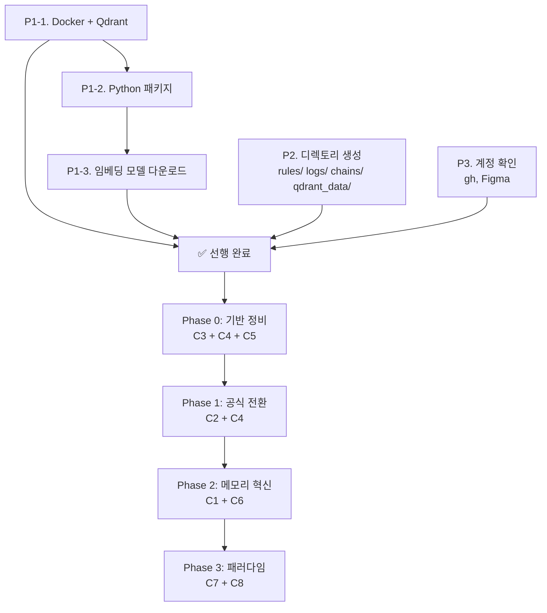

## 🔄 Next Session Handoff

### 현재 상태
- 이 문서의 완성도: completed
- 마지막 작업: C1~C8 문서 + 현재 시스템 상태 분석 → 사전 준비 체크리스트 도출

### 다음 작업 (TODO)
- [ ] P1 (환경 설치): Docker 실행 확인 + Qdrant 설치 + Python 패키지
- [ ] P2 (디렉토리): rules/, logs/, skills/chains/ 생성
- [ ] P3 (계정/API): 필요한 계정 연결 확인
- [ ] P4 (삭제/정리): Rails 관련 커맨드 정리 (필요 시)
- [ ] 선행 완료 후 Phase 0 본작업 시작

### 작업 조언
> [!tip] 다음 Claude Code에게
> - 이 체크리스트는 **본작업(Phase 0~3) 전에 선행**되어야 할 것들을 정리한 것이다
> - Section 7의 "본작업 이관" 항목은 선행이 아니라 각 Phase에서 수행할 것
> - 현재 시스템 상태 스캔 결과(Section 2)를 기준으로 판단했으므로, 시간이 지나면 재스캔 필요
> - Docker Desktop은 설치되어 있지만 실행 상태 미확인 — 먼저 `docker info` 실행하여 확인

---

# V5.0 사전 준비 체크리스트

> **목적**: C1~C8 심층 설계의 본작업(Phase 0~3) 시작 전에 완료해야 할 선행 작업 정리
> **기준**: 현재 시스템 상태 스캔 (2026-03-15) + C1~C8 문서 8개 분석

---

## 1. 현재 시스템 상태 요약

### 1.1 설치된 것 ✅

| 항목 | 버전 | 비고 |
|------|------|------|
| Python | 3.9.6 | macOS 기본, 패키지 거의 없음 |
| Node.js | v24.4.1 | 최신 |
| gh (GitHub CLI) | 2.86.0 | Git 워크플로우 OK |
| Playwright | 1.58.2 | E2E 테스트 OK |
| curl | 8.7.1 | HTTP 요청 OK |
| jq | 1.7.1 | JSON 처리 OK |
| Homebrew | 5.0.14 | 패키지 관리 OK |
| Docker Desktop | 앱 존재 | **실행 상태 미확인** |

### 1.2 미설치 / 미설정 ❌

| 항목 | 필요 카테고리 | 용도 |
|------|-------------|------|
| Docker CLI 응답 | C1 | Qdrant 컨테이너 실행 |
| sentence-transformers (Python) | C1 | 임베딩 생성 |
| qdrant-client (Python) | C1 | 벡터 DB 클라이언트 |
| fastmcp (Python) | C1 | MCP 서버 프레임워크 |
| torch (Python) | C1 | 임베딩 모델 의존성 |
| fswatch | C1/C5 | 파일 변경 감시 |
| supabase CLI | C6 | DB 직접 조작 (선택) |
| `~/.claude/rules/` | C3 | 규칙 모듈화 디렉토리 |
| `~/.claude/logs/` | C5 | Observability 로그 |
| `~/.claude/skills/chains/` | C2 | 체인 스킬화 디렉토리 |
| `~/.claude/qdrant_data/` | C1 | 벡터 DB 데이터 볼륨 |

### 1.3 현재 MCP 서버

| 서버 | 상태 |
|------|------|
| prompt-analyzer | ✅ 활성 |
| pencil | ✅ 활성 |
| **memory-ontology** (신규) | ❌ 미구현 (C1에서 생성) |
| **obsidian** (신규) | ❌ 미구현 (C6에서 생성) |

---

## 1.5 실행 환경

| 항목 | 내용 |
|------|------|
| **OS** | macOS (Darwin) |
| **터미널** | iTerm2 + tmux |
| **Claude Code** | 같은 tmux 세션에서 실행 중 |
| **셸** | zsh |

### 실행 주체 표기 규칙

| 아이콘 | 실행 주체 | 설명 | 어디서 실행? |
|--------|----------|------|------------|
| 🖥️ **터미널** | 앤이 직접 | iTerm2/tmux에서 명령어 입력 | tmux의 다른 pane 또는 별도 탭 |
| 🤖 **Claude Code** | 아리가 실행 | Claude Code 세션에서 프롬프트로 지시 | 현재 Claude Code 세션 |

> [!warning] Claude Code 세션과 터미널 분리
> Claude Code가 실행 중인 tmux pane에서 직접 터미널 명령을 입력하면 안 된다.
> **tmux 다른 pane** (`Ctrl+B` → `%` 또는 `"`)이나 **별도 iTerm 탭**에서 터미널 작업을 수행한다.

---

## 2. 선행 작업 체크리스트

### P1. 프로그램 & 패키지 설치

#### P1-1. Docker 확인 및 Qdrant 설치 (C1 필수)

**🖥️ 터미널에서 실행** (tmux 별도 pane):

```bash
# Step 1. Docker Desktop 실행 확인
docker info

# Step 2. 미실행 시 Docker Desktop 실행
open /Applications/Docker.app
# → Docker Desktop 아이콘이 메뉴바에 나타날 때까지 대기 (약 30초)
# → 다시 docker info 로 확인

# Step 3. Qdrant 설치 + 데이터 볼륨 마운트
docker pull qdrant/qdrant
docker run -d --name qdrant \
  -p 6333:6333 \
  -v ~/.claude/qdrant_data:/qdrant/storage \
  --restart unless-stopped \
  qdrant/qdrant

# Step 4. 확인
curl http://localhost:6333/healthz
# → 정상이면 응답 반환
```

- [ ] Docker Desktop 실행 확인 (`docker info` 응답)
- [ ] Qdrant 컨테이너 실행 (`docker ps`에 qdrant 표시)
- [ ] healthz 응답 확인 (`curl localhost:6333/healthz`)

#### P1-2. Python 가상환경 + 패키지 설치 (C1 필수)

**🖥️ 터미널에서 실행**:

```bash
# Step 1. 가상환경 생성 (시스템 Python과 격리)
python3 -m venv ~/.claude/venv

# Step 2. 가상환경 활성화
source ~/.claude/venv/bin/activate

# Step 3. 패키지 설치
pip install sentence-transformers qdrant-client fastmcp

# Step 4. 설치 확인
python3 -c "from sentence_transformers import SentenceTransformer; print('✅ sentence-transformers OK')"
python3 -c "from qdrant_client import QdrantClient; print('✅ qdrant-client OK')"
python3 -c "from fastmcp import FastMCP; print('✅ fastmcp OK')"

# Step 5. 가상환경 비활성화 (작업 완료 후)
deactivate
```

> [!important] Hook/스크립트에서 가상환경 Python 경로 사용
> 설치 후 Hook이나 스크립트에서는 시스템 python3이 아닌 **`~/.claude/venv/bin/python3`** 경로를 사용해야 패키지를 찾을 수 있다.

- [ ] venv 생성 (`~/.claude/venv/`)
- [ ] sentence-transformers 설치 + 확인
- [ ] qdrant-client 설치 + 확인
- [ ] fastmcp 설치 + 확인

#### P1-3. 임베딩 모델 다운로드 (C1 필수)

**🖥️ 터미널에서 실행** (venv 활성화 상태에서):

```bash
# 가상환경 활성화
source ~/.claude/venv/bin/activate

# 모델 다운로드 (~1.1GB, 네트워크 속도에 따라 5~15분)
python3 -c "
from sentence_transformers import SentenceTransformer
model = SentenceTransformer('intfloat/multilingual-e5-large')
print('✅ Model loaded:', model.get_sentence_embedding_dimension(), 'dims')
"

deactivate
```

- [ ] multilingual-e5-large 모델 다운로드 (~1.1GB)
- [ ] "✅ Model loaded: 1024 dims" 출력 확인

#### P1-4. CLI 도구 설치 (선택)

**🖥️ 터미널에서 실행**:

```bash
# fswatch — 파일 변경 감시 (C1 인덱싱 자동화)
brew install fswatch

# supabase CLI (C6 선택사항)
brew install supabase/tap/supabase
```

- [ ] fswatch 설치 (C1 자동 인덱싱 시 필요)
- [ ] supabase CLI 설치 (선택 — C6 DB 조작 시)

---

### P2. 디렉토리 생성

**🤖 Claude Code에서 실행** — 아래 프롬프트를 Claude Code에 입력:

> **프롬프트**: "아래 디렉토리 4개를 생성해줘: `~/.claude/rules/`, `~/.claude/logs/`, `~/.claude/skills/chains/`, `~/.claude/qdrant_data/`"

또는 **🖥️ 터미널에서 직접 실행**:

```bash
mkdir -p ~/.claude/rules ~/.claude/logs ~/.claude/skills/chains ~/.claude/qdrant_data
```

- [ ] `~/.claude/rules/` 생성
- [ ] `~/.claude/logs/` 생성
- [ ] `~/.claude/skills/chains/` 생성
- [ ] `~/.claude/qdrant_data/` 생성

---

### P3. 계정 연결 & API 키

#### P3-1. 확인 필요한 계정

| 서비스 | 용도 | 현재 상태 | 필요 조치 |
|--------|------|----------|----------|
| **GitHub** (gh CLI) | Git 워크플로우, PR 리뷰 | ✅ gh 2.86.0 설치됨 | `gh auth status`로 로그인 확인 |
| **Figma** | 디자인 토큰 MCP | ⚠️ settings.local.json에 도메인 허용됨 | 토큰 유효성 확인 |
| **Anthropic API** | Claude Code 자체 | ✅ 내부 관리 | 추가 조치 불필요 |
| **HuggingFace** | 임베딩 모델 다운로드 | ⚠️ 공개 모델이므로 계정 불필요 | 네트워크 접근만 확인 |

**🖥️ 터미널에서 실행**:

```bash
# GitHub 로그인 확인
gh auth status

# 미로그인 시
gh auth login
```

**🤖 Claude Code에서 확인** — 아래 프롬프트 입력:

> **프롬프트**: "gh auth status 실행해서 GitHub 로그인 상태 확인해줘"

- [ ] `gh auth status` — GitHub 로그인 확인
- [ ] Figma MCP 토큰 유효성 확인 (C6 진행 시)

#### P3-2. 신규 생성 불필요한 계정

| 서비스 | 이유 |
|--------|------|
| OpenAI API | 로컬 임베딩(multilingual-e5-large) 사용 → 불필요 |
| Pinecone | Qdrant(로컬) 사용 → 불필요 |
| Redis Cloud | 로컬 Qdrant 사용 → 불필요 |
| **Obsidian CLI** | 파일 직접 Read/Write 방식으로 결정 → **불필요** (Catalyst $25 절약) |
| **Obsidian MCP** | 상동 — Claude Code 기본 도구(Read/Write/Glob/Grep)로 Vault 조작 |
| supabase CLI | C6 선택사항 — 필요 시 `brew install supabase/tap/supabase` |

---

### P4. 삭제 대상 (정리)

#### P4-1. 본작업에서 삭제 예정 (선행 아님 → Phase에서 처리)

| 대상 | 카테고리 | 시점 | 비고 |
|------|---------|------|------|
| CLAUDE.md Section 2.4 (체인 정의 ~70줄) | C2 | Phase 2 | 스킬로 대체 후 삭제 |
| CLAUDE.md Section 2.5 (Resilience 규칙) | C2 | Phase 3 | Hook으로 대체 후 삭제 |
| CLAUDE.md Section 3 (메모리 규칙 ~44줄) | C3 | Phase 1 | `rules/memory-protocol.md`로 이동 |
| `commands/rails-*.md` (7개) | — | 이미 104에서 제거 | 글로벌에서도 제거 판단은 앤 |

#### P4-2. 선행에서 삭제할 것 (지금 정리 가능)

> [!note] 현재 삭제 필요한 선행 항목 없음
> 모든 삭제/이동 작업은 본작업(Phase) 내에서 수행. 사전에 삭제하면 현재 시스템이 고장날 수 있으므로, **본작업에서 대체물을 만든 후 삭제**하는 것이 안전.

---

### P5. 신규 생성 대상 (선행 vs 본작업 분류)

#### P5-1. 선행에서 생성 (디렉토리/설정만)

| 생성 대상 | 내용 | 체크 |
|----------|------|------|
| `~/.claude/rules/` | 빈 디렉토리 | P2에서 처리 |
| `~/.claude/logs/` | 빈 디렉토리 | P2에서 처리 |
| `~/.claude/skills/chains/` | 빈 디렉토리 | P2에서 처리 |
| `~/.claude/qdrant_data/` | Docker 볼륨 마운트 포인트 | P2에서 처리 |

#### P5-2. 본작업에서 생성 (Phase별)

| 생성 대상 | 카테고리 | Phase | 비고 |
|----------|---------|-------|------|
| `rules/orchestration.md` | C3 | Phase 0 | CLAUDE.md Section 2 이동 |
| `rules/memory-protocol.md` | C3 | Phase 0 | CLAUDE.md Section 3 이동 |
| `hooks/session-start.sh` | C4 | Phase 0 | SessionStart Hook |
| `hooks/stop-cleanup.sh` | C4/C8 | Phase 0 | Stop Hook (80%+ 정리) |
| `hooks/post-compact.sh` | C4/C8 | Phase 1 | PostCompact Hook |
| `hooks/instructions-loaded.sh` | C4 | Phase 1 | InstructionsLoaded Hook |
| `hooks/teammate-idle.sh` | C4/C2 | Phase 1 | TeammateIdle Hook |
| `hooks/observability-logger.sh` | C5 | Phase 0 | PostToolUse 로그 |
| `scripts/memory_mcp.py` | C1 | Phase 2 | Memory MCP 서버 |
| `scripts/memory_indexer.py` | C1 | Phase 2 | 메모리 벡터화 |
| `scripts/memory_embedder.py` | C1 | Phase 2 | 임베딩 모듈 |
| `scripts/log_analyzer.py` | C5 | Phase 2 | 로그 분석 |
| `skills/chains/system-design.md` | C2 | Phase 1 | 체인 A 스킬화 |
| `skills/chains/` (9개 추가) | C2 | Phase 1 | 체인 B~J 스킬화 |

---

### P6. 수정 대상 (선행 vs 본작업 분류)

#### P6-1. 선행에서 수정 없음

> 현재 시스템을 깨뜨리지 않기 위해 선행 단계에서는 **어떤 기존 파일도 수정하지 않는다**. 디렉토리 생성과 프로그램 설치만 수행.

#### P6-2. 본작업에서 수정 (Phase별)

| 수정 대상 | 카테고리 | Phase | 변경 내용 |
|----------|---------|-------|----------|
| `CLAUDE.md` | C3 | Phase 0 | 393줄 → ~100줄 (Section 2,3 → rules/ 이동) |
| `settings.json` | C4 | Phase 0 | SessionStart, Stop, PostToolUse Hook 등록 |
| `settings.json` | C1 | Phase 2 | Memory MCP 서버 등록 |
| `.claude.json` | C1 | Phase 2 | MCP 서버에 memory-ontology 추가 |
| `agents/101~114_*.md` | C2 | Phase 1 | frontmatter에 memory, isolation, maxTurns 추가 |
| `auto-analyze.sh` | C1 | Phase 2 | V5.0 벡터 검색 연동 추가 |
| `prompt_analyzer.py` | C5 | Phase 2 | Effort Level 분화 로직 추가 |

---

## 3. 의존성 순서



**핵심**: P1(설치) + P2(디렉토리) + P3(계정)은 **동시 진행 가능**. 모두 완료 후 Phase 0 시작.

---

## 4. 예상 소요 시간

| 작업 | 예상 시간 | 비고 |
|------|----------|------|
| P1-1 Docker + Qdrant | 5~10분 | Docker 이미 설치, 이미지 pull |
| P1-2 Python 패키지 | 5~10분 | pip install 3개 |
| P1-3 임베딩 모델 | 5~15분 | ~1.1GB 다운로드 (네트워크 속도 의존) |
| P1-4 CLI 도구 | 2~5분 | brew install |
| P2 디렉토리 | 1분 | mkdir 4개 |
| P3 계정 확인 | 2~5분 | gh auth, Figma 토큰 |
| **합계** | **~20~45분** | 네트워크 속도 의존 |

---

## 5. 검증 스크립트

**🖥️ 터미널에서 실행** 또는 **🤖 Claude Code에서 실행** (둘 다 가능):

> **Claude Code 프롬프트**: "V5.0 선행 작업 검증 스크립트를 실행해줘 — Docker, Python 패키지, 임베딩 모델, 디렉토리, GitHub 로그인 상태를 체크해줘"

또는 터미널에서 직접:

```bash
#!/bin/bash
echo "=== V5.0 선행 작업 검증 ==="
echo ""

# P1-1: Docker + Qdrant
echo "[P1-1] Docker..."
docker info > /dev/null 2>&1 && echo "  ✅ Docker 실행 중" || echo "  ❌ Docker 미실행"
curl -s http://localhost:6333/healthz > /dev/null 2>&1 && echo "  ✅ Qdrant 응답" || echo "  ❌ Qdrant 미응답"

# P1-2: Python 패키지 (venv 경로 사용)
VENV_PY="$HOME/.claude/venv/bin/python3"
echo "[P1-2] Python 패키지..."
$VENV_PY -c "from sentence_transformers import SentenceTransformer" 2>/dev/null && echo "  ✅ sentence-transformers" || echo "  ❌ sentence-transformers"
$VENV_PY -c "from qdrant_client import QdrantClient" 2>/dev/null && echo "  ✅ qdrant-client" || echo "  ❌ qdrant-client"
$VENV_PY -c "from fastmcp import FastMCP" 2>/dev/null && echo "  ✅ fastmcp" || echo "  ❌ fastmcp"

# P1-3: 임베딩 모델
echo "[P1-3] 임베딩 모델..."
$VENV_PY -c "from sentence_transformers import SentenceTransformer; SentenceTransformer('intfloat/multilingual-e5-large')" 2>/dev/null && echo "  ✅ multilingual-e5-large 로드" || echo "  ❌ 모델 미다운로드"

# P1-4: CLI
echo "[P1-4] CLI 도구..."
command -v fswatch > /dev/null && echo "  ✅ fswatch" || echo "  ⚠️ fswatch (선택)"
command -v supabase > /dev/null && echo "  ✅ supabase" || echo "  ⚠️ supabase (선택)"

# P2: 디렉토리
echo "[P2] 디렉토리..."
[ -d ~/.claude/rules ] && echo "  ✅ rules/" || echo "  ❌ rules/"
[ -d ~/.claude/logs ] && echo "  ✅ logs/" || echo "  ❌ logs/"
[ -d ~/.claude/skills/chains ] && echo "  ✅ skills/chains/" || echo "  ❌ skills/chains/"
[ -d ~/.claude/qdrant_data ] && echo "  ✅ qdrant_data/" || echo "  ❌ qdrant_data/"

# P3: 계정
echo "[P3] 계정..."
gh auth status > /dev/null 2>&1 && echo "  ✅ GitHub 로그인" || echo "  ❌ GitHub 미로그인"

echo ""
echo "=== 검증 완료 ==="
```

---

## 6. 요약: 선행 vs 본작업 구분

### 선행 (이 문서의 범위) — 설치/생성만, 기존 파일 수정 없음

| 구분 | 항목 수 | 내용 |
|------|--------|------|
| **프로그램 설치** | 6개 | Docker 확인, Qdrant, sentence-transformers, qdrant-client, fastmcp, 임베딩 모델 |
| **CLI 도구** | 2개 | fswatch, supabase (선택) |
| **디렉토리 생성** | 4개 | rules/, logs/, skills/chains/, qdrant_data/ |
| **계정 확인** | 2개 | GitHub, Figma |
| **삭제** | 0개 | 선행에서 삭제 없음 (안전) |
| **수정** | 0개 | 선행에서 수정 없음 (안전) |

### 본작업 이관 (Phase 0~3에서 수행)

| 구분 | 항목 수 | 대표 예시 |
|------|--------|----------|
| **신규 파일 생성** | ~20개 | Hook 5개, 스크립트 4개, 스킬 10개, 규칙 2개+ |
| **기존 파일 수정** | ~20개 | CLAUDE.md, settings.json, 에이전트 14개, auto-analyze.sh |
| **기존 파일 삭제** | ~3개 | CLAUDE.md 내 섹션 이동(삭제), 중복 규칙 제거 |

---

## 7. 충돌 예상 지점 & 해결책

> [!danger] 핵심 위험
> 현재 V4.2.1이 **운영 중인 상태**에서 V5.0 엔진을 변경하면 충돌이 발생한다. 아래 7개 충돌 지점을 사전에 인지하고 순서대로 해결해야 한다.

### 7.1 충돌 매트릭스

| # | 충돌 지점 | 위험도 | 발생 시점 | 영향 범위 | 해결책 |
|---|---------|--------|----------|----------|--------|
| **C-1** | CLAUDE.md 축소 시 체인 정의 소실 | 🔴 Critical | Phase 0 | 전체 오케스트레이션 중단 | rules/ 먼저 생성 → 내용 복사 → CLAUDE.md 축소 (순서 중요) |
| **C-2** | settings.json Hook 등록 시 기존 Hook 덮어쓰기 | 🔴 Critical | Phase 0 | auto-analyze.sh 무력화 | **병합(merge)** 방식으로 추가, 기존 Hook 유지 확인 |
| **C-3** | auto-analyze.sh V5.0 업그레이드 시 기존 4-Layer 분석 깨짐 | 🟡 High | Phase 2 | 프롬프트 분석 중단 | 기존 코드 **보존**, 벡터 검색을 **추가**만 (교체 X) |
| **C-4** | 에이전트 frontmatter 변경 시 기존 호출 방식 비호환 | 🟡 High | Phase 1 | 특정 에이전트 실행 실패 | 기존 필드 유지 + 신규 필드 **추가**만 |
| **C-5** | commands/ → skills/ 이전 시 기존 `/명령어` 사라짐 | 🟡 High | Phase 1 | 슬래시 커맨드 사용 불가 | **양쪽 모두 유지** → 검증 후 commands/ 삭제 |
| **C-6** | Qdrant Docker 포트 충돌 (6333) | 🟢 Low | 선행 | Qdrant 미기동 | `docker ps`로 포트 확인, 충돌 시 6334로 변경 |
| **C-7** | Python 패키지 버전 충돌 (torch/numpy) | 🟢 Low | 선행 | 임베딩 모델 로드 실패 | 가상환경(venv) 사용 또는 호환 버전 지정 |

### 7.2 충돌별 상세 해결책

#### C-1. CLAUDE.md 축소 시 체인 정의 소실 🔴

**문제**: Section 2(245줄)를 `rules/orchestration.md`로 이동할 때, **이동 순서가 잘못되면** 체인 정의가 양쪽 모두에서 없어짐

**해결 순서** (반드시 이 순서):
```
1. rules/orchestration.md 생성 → Section 2 내용 복사
2. Claude Code 재시작 → rules/ 로드 확인 (/memory 명령)
3. 확인 완료 후 → CLAUDE.md에서 Section 2 삭제
4. 다시 확인 → 체인 선택이 정상 작동하는지 테스트
```

**절대 금지**: 한 번에 "이동" 하지 않는다. 복사 → 확인 → 삭제의 3단계.

**롤백**: `104_current_system/CLAUDE.md`에서 원본 복원

#### C-2. settings.json Hook 등록 시 기존 Hook 덮어쓰기 🔴

**문제**: 새 Hook을 등록할 때 기존 `UserPromptSubmit` Hook(auto-analyze.sh)이 삭제될 수 있음

**해결책**:
```json
// ❌ 잘못된 방식 (덮어쓰기)
"hooks": {
  "UserPromptSubmit": [{ "command": "new-hook.sh" }]
}

// ✅ 올바른 방식 (기존 유지 + 추가)
"hooks": {
  "UserPromptSubmit": [
    { "command": "~/.claude/hooks/auto-analyze.sh" },  // 기존 유지!
  ],
  "SessionStart": [
    { "command": "~/.claude/hooks/session-start.sh" }   // 신규 추가
  ],
  "Stop": [
    { "command": "~/.claude/hooks/stop-cleanup.sh" }    // 신규 추가
  ]
}
```

**검증**: 수정 후 `claude` 재시작 → 프롬프트 입력 → 4-Layer 분석 출력 확인

#### C-3. auto-analyze.sh V5.0 업그레이드 🟡

**문제**: 기존 4-Layer 분석 코드를 건드리면 프롬프트 분석이 중단됨

**해결책**:
```bash
# auto-analyze.sh 수정 원칙
# 기존 코드 (Line 1~151) 절대 수정하지 않음
# Line 152 이후에 벡터 검색 코드를 "추가"만 함

# === 기존 코드 (유지) ===
# ... (Line 1~151 그대로)

# === V5.0 추가 (Line 152~) ===
if [ ${#PROMPT} -ge 10 ]; then
    MEMORY_RESULTS=$(curl -s --max-time 2 ...)  # 타임아웃 2초
    # ...
fi
```

**타임아웃 필수**: 벡터 검색 실패해도 기존 분석은 정상 동작하도록 `--max-time 2`

#### C-4. 에이전트 frontmatter 변경 🟡

**문제**: `memory: true` 등 신규 필드 추가 시 기존 에이전트 동작이 변할 수 있음

**해결책**: 기존 필드는 **절대 삭제/수정하지 않고** 신규 필드만 추가
```yaml
# 변경 전
---
name: insight_explorer
description: ...
subagent_type: insight_explorer
model: sonnet
---

# 변경 후 (기존 4줄 유지 + 3줄 추가만)
---
name: insight_explorer
description: ...
subagent_type: insight_explorer
model: sonnet
maxTurns: 15          # 추가
memory: true          # 추가
permissionMode: default  # 추가
---
```

**1개씩 테스트**: 14개를 한 번에 바꾸지 말고, `insight_explorer` 1개만 변경 → 테스트 → 나머지 일괄

#### C-5. commands/ → skills/ 이전 🟡

**문제**: commands/를 삭제하면 기존 `/commit-push` 등 슬래시 커맨드가 사라짐

**해결책**: **양쪽 공존 기간** 운영
```
1. skills/ 에 새 스킬 생성 (commands/ 유지한 채)
2. 같은 이름이면 skill이 우선 (공식 동작)
3. 스킬 동작 확인 후 → commands/ 에서 해당 파일 삭제
4. 한 번에 삭제하지 않고, 1~2개씩 이전
```

### 7.3 유의사항 (작업 전 필독)

#### 🛡️ 안전 원칙 5가지

| # | 원칙 | 설명 |
|---|------|------|
| **1** | **104 백업 절대 건드리지 않음** | V4.2.1 원본이 104에 보존되어 있으므로 최악의 경우 복원 가능 |
| **2** | **한 번에 하나만 변경** | CLAUDE.md + settings.json + 에이전트를 동시에 바꾸면 문제 원인 특정 불가 |
| **3** | **변경 → 테스트 → 다음 변경** | 각 변경 후 반드시 1회 이상 Claude Code 사용 테스트 |
| **4** | **삭제 전 복사 완료 확인** | C-1(CLAUDE.md)처럼 복사→확인→삭제 3단계 필수 |
| **5** | **롤백 방법 미리 확인** | 각 단계에서 "이전으로 돌리려면?" 답을 알고 진행 |

#### ⚠️ 특별 유의사항

**1. Claude Code 세션 중 settings.json 수정 금지**
- settings.json은 Claude Code **시작 시** 로드됨
- 세션 중 수정하면 반영 안 되거나 예측 불가 동작
- **반드시 세션 종료 → 수정 → 재시작**

**2. CLAUDE.md 수정 시 현재 세션에서 테스트하지 않음**
- CLAUDE.md도 세션 시작 시 로드됨
- 수정 후 **새 세션**에서 효과 확인
- 현재 세션에서는 이전 CLAUDE.md가 적용된 상태

**3. Docker Qdrant는 macOS 재시작 시 자동 시작 설정 필요**
```bash
# --restart unless-stopped 옵션으로 자동 재시작
docker run -d --name qdrant \
  --restart unless-stopped \
  -p 6333:6333 \
  -v ~/.claude/qdrant_data:/qdrant/storage \
  qdrant/qdrant
```

**4. Python 가상환경 권장**
```bash
# 시스템 Python과 격리하여 패키지 충돌 방지
python3 -m venv ~/.claude/venv
source ~/.claude/venv/bin/activate
pip install sentence-transformers qdrant-client fastmcp
```
- Hook/스크립트에서 `~/.claude/venv/bin/python3` 경로 사용

**5. 작업 순서 철칙**

```
선행 (이 문서) → Phase 0 (C3+C4+C5) → Phase 1 (C2+C4) → Phase 2 (C1+C6) → Phase 3 (C7+C8)
     ↓              ↓                    ↓                   ↓
  기존 시스템     CLAUDE.md 축소      에이전트 업그레이드    벡터 DB 연동
  건드리지 않음   + Hook 추가         + 스킬 이전          + MCP 서버
```

> [!danger] 절대 하면 안 되는 것
> - Phase 0 전에 CLAUDE.md를 수정하는 것
> - Phase 1 전에 에이전트 frontmatter를 변경하는 것
> - Phase 2 전에 auto-analyze.sh를 수정하는 것
> - 104 폴더의 어떤 파일이든 수정/삭제하는 것

---

## 관련 문서

### 직접 참조 (Direct Links)
- [[01_001_Improvement_Direction_Overview#5. 실행 순서 권고|Phase 0~3 실행 순서]] — 선행 완료 후 이 순서대로 본작업 진행
- [[02_001_C1_Ontology_Memory_Deep_Design#3.1 벡터 DB: Qdrant 선정|Qdrant 선정 근거]] — P1-1 Docker+Qdrant의 기술 근거
- [[02_001_C1_Ontology_Memory_Deep_Design#3.2 임베딩 모델|임베딩 모델 선정]] — P1-3 multilingual-e5-large 선정 근거

### 역참조 (Backlinks)
- [[01_001_Improvement_Direction_Overview#5. 실행 순서 권고|실행 순서]] — Phase 0 시작 전 이 문서의 체크리스트 완료 필요

### 관련 주제 (Topic Links)
- [[02_003_C3_CLAUDE_MD_Modularization|C3 모듈화]] — P2의 rules/ 디렉토리 사용처
- [[02_004_C4_Hook_Skill_Official_Migration|C4 Hook 전환]] — P5-2의 Hook 파일 생성 상세
- [[02_005_C5_Observability_Self_Evolution|C5 Observability]] — P2의 logs/ 디렉토리 사용처
- [[02_006_C6_CLI_Ecosystem_Integration|C6 CLI 생태계]] — P1-4, P3의 CLI/계정 사용처

---

## Release Notes

### v1.2.0 (2026-03-15)
- **Section 1.5 추가**: 실행 환경 (macOS, iTerm2+tmux, Claude Code 동일 세션)
- 실행 주체 표기 도입: 🖥️ 터미널 / 🤖 Claude Code
- P1~P3 전체에 실행 주체 + 구체적 명령어/프롬프트 추가
- P1-2: Python 가상환경(venv) 방식으로 전환 (`~/.claude/venv/`)
- 검증 스크립트: venv 경로 반영 + Claude Code 프롬프트 추가
- tmux pane 분리 주의사항 추가
> **프롬프트:** "설치방법은 맥에서 나는거고 iterm - tmux 터미널에서 진행해. 현재 클로드 코드에서 같은 환경에서 실행중이야. 이걸 문서에 넣어줘 그리고 설치는 되도록 맥에서 터미널 명령어로 하거나 혹은 클로드코드가 실행주었으면해. 설치 내용에 따라 터미널명령어인지 클로드코드 실행인지 표기해주고 각 명령어와 프롬프트도 넣어줘"

### v1.1.0 (2026-03-15)
- **Section 7 추가**: 충돌 예상 지점 7개 + 상세 해결책 + 유의사항
- 충돌 매트릭스: C-1~C-7 (Critical 2, High 3, Low 2)
- 안전 원칙 5가지 + 특별 유의사항 5개
- 작업 순서 철칙 + 절대 하면 안 되는 것 4가지
- Python 가상환경(venv) 권장사항 추가
> **프롬프트:** "나 이제 설치 들어가야하는데. 현재시스템에서 설치를 진행하고 엔진을 변경하면 충돌할거 같아. 충돌 예상 지점과 해결책등을 03_001 번에 추가해줘 유의사항도"

### v1.0.0 (2026-03-15)
- 초기 작성: C1~C8 문서 8개 + 현재 시스템 상태 스캔 기반 사전 준비 체크리스트
- 선행 6개 카테고리: 프로그램 설치(6), CLI(2), 디렉토리(4), 계정(2), 삭제(0), 수정(0)
- 본작업 이관: 신규 생성 ~20개, 수정 ~20개, 삭제 ~3개
- 의존성 그래프 + 검증 스크립트 포함
- 예상 소요: ~20~45분
> **프롬프트:** "103 폴더에 사전설치가 필요한 내역을 정리해줘 여기에는 새로운 프로그램 예를들어 파이선, 노드, 등, 그리고 서브에이전트 스킬 커맨드 훅등 삭제해야할것 그리고 재생성해야할것, 수정해야할것, 등등 실작업 전에 선행되어야 할것 정리해줘"
> **프롬프트 (추가):** "각종 cli 도 있겠다" / "그에 따른 계정 연결도 있고 말이야"
