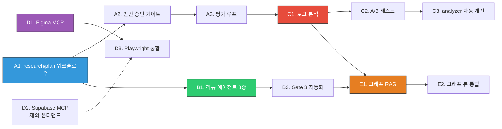

## 🔄 Next Session Handoff

| 항목 | 내용 |
|------|------|
| 현재 단계 | Phase 3 대주제 A+B 완료 (5/12), C~E 차단/온디맨드 |
| 다음 작업 | C1~C3은 로그 90일+ 후 (2026-06 예상). D1/D3은 프로젝트 발생 시. 잔여 작업: commands/ 정리, 체인 B~J 스킬화 |
| 차단 요소 | C1~C3: 로그 데이터 90일+ 필요. D1/D3: 실제 프로젝트 필요. E1~E2: C1 선행. |
| 주의사항 | 코어 엔진 완성 → 체인/에이전트/스킬 자유 수정. hooks/scripts/settings.json만 신중. |

### 선행 조건 체크리스트

- [x] Phase 0 완료 (CLAUDE.md 모듈화, SessionStart Hook, Observability 기반, Stop Hook, Effort Level)
- [x] Phase 1 완료 (에이전트 마이그레이션, skills/ 전환, PostCompact Hook)
- [x] Phase 2 완료 (Qdrant 설치, 메모리 임베딩 파이프라인, Memory MCP 서버, Obsidian MCP)
- [x] C1 벡터 DB에 기존 메모리 파일이 임베딩되어 검색 가능한 상태

---

# Phase 3 Implementation — Plan + Log

> **위상**: Phase 0(기반 정비) → Phase 1(공식 전환) → Phase 2(메모리 혁신) → **Phase 3(패러다임 전환)** ← 이 문서
> **상위 문서**: [[01_001_Improvement_Direction_Overview#5. 실행 순서 권고|실행 순서 Section 5]]
> **핵심 근거**: [[02_006_C6_CLI_Ecosystem_Integration]], [[02_007_C7_Agentic_Workflow_Paradigm]], [[02_008_C8_Quality_Context_Management]]

---

## 1. 실행 계획 (Plan)

### 1.1 Phase 3 개요

| 항목 | 내용 |
|------|------|
| **한 문장 목표** | V4 "규칙으로 통제하는 시스템"에서 V5 "원칙으로 가이드하고, 에이전트가 스스로 계획하며, 자기 진화하는 시스템"으로의 패러다임 전환 |
| **관련 카테고리** | C6(CLI 생태계), C7(에이전틱 워크플로우), C5/C8(체인 메타러닝) |
| **난이도** | HIGH — 철학적 전환 + 장기 구현 |
| **의존성** | Phase 0+1+2 전체 완료 필수 (특히 C1 메모리 시스템, C5 Observability 로그 데이터) |
| **예상 세션 수** | 15~25세션 (장기 프로젝트) |

### 1.2 Phase 3 비전

Phase 3는 단순한 기능 추가가 아니라 **시스템의 사고방식 자체를 바꾸는 전환**이다.

```
V4 (현재): 프롬프트 → Hook 분석 → 체인 선택 → 즉시 구현 → 리뷰
V5 Phase3: 프롬프트 → research.md → plan.md → 인간 승인 → 병렬 구현 → 다중 리뷰 → 메타러닝
```

핵심 변화:
1. **계획 승인 전 코드 없음** — research→plan 워크플로우가 표준이 됨
2. **자기 진화** — 실행 로그가 체인 최적화로 자동 환류
3. **CLI 생태계 완성** — 외부 도구(Figma/Supabase/Playwright)가 워크플로우에 통합
4. **병렬 품질 보증** — 단일 quality_reviewer → 3종 전문 리뷰어 병렬

### 1.3 Phase 3 구성 단계

Phase 3는 5개의 대주제, 13개의 세부 단계로 구성된다.

| 대주제 | 세부 단계 | 카테고리 | 효과 |
|--------|----------|---------|------|
| **A. 에이전틱 워크플로우 기반** | A1~A3 | C7 | research→plan→구현 패러다임 정착 |
| **B. 다중 에이전트 코드 리뷰** | B1~B2 | C7 | 리뷰 커버리지 3x 증가 |
| **C. 체인 메타러닝** | C1~C3 | C5/C8 | A/B 테스트 기반 자기 진화 |
| **D. 외부 도구 CLI 통합** | D1~D3 | C6 | Figma/Supabase/Playwright MCP 운영화 |
| **E. 온톨로지 그래프 고도화** | E1~E2 | C1/C6 | 다단계 추론 + 옵시디언 시각화 |

---

### 1.4 대주제 A — 에이전틱 워크플로우 기반 구축

> **근거**: [[02_007_C7_Agentic_Workflow_Paradigm#3.1 전체 아키텍처|C7 Section 3.1]]
> **핵심 원칙**: "계획 승인 전까지 코드를 쓰지 않는다"를 시스템에 내재화

#### A1. research.md / plan.md 워크플로우 정착

**목표**: 중규모 이상 작업에서 research→plan→구현의 3단계 워크플로우를 100% 적용

**구체적 작업**:
- [[02_007_C7_Agentic_Workflow_Paradigm#4.2 research.md 템플릿|research.md 템플릿]] 및 [[02_007_C7_Agentic_Workflow_Paradigm#5.2 plan.md 템플릿|plan.md 템플릿]]을 `.claude/workflow/templates/`에 배포
- DevChain, SystemDesignChain, WebDevChain+에 research→plan 단계 삽입
- 공식 Plan Mode(`Shift+Tab` 두 번)와 연동: Plan Mode 탐색 결과 → research.md 영속화
- REVIEW.md 초안 작성 (Critical/Warning/Info 심각도 분류 체계)

**복잡도 분기 기준** ([[02_007_C7_Agentic_Workflow_Paradigm#3.2 복잡도 기반 분기|C7 Section 3.2]]):

| 복잡도 | 적용 체인 | 워크플로우 |
|--------|----------|-----------|
| 단순 | HotfixChain, 단순 Q&A | 기존 체인 직행 (3단계 생략) |
| 중규모 | DevChain, AutomationChain | research.md + plan.md |
| 대규모 | SystemDesignChain, WebDevChain+ | 전체 3단계 + 인간 승인 게이트 |

**성공 기준**: 중규모+ 작업에서 plan.md 생성률 100%

#### A2. 인간 승인 게이트 (Gate 2) 구현

**목표**: plan.md Status가 `approved`가 되기 전까지 code_developer가 실행되지 않는 구조적 보장

**구체적 작업**:
- plan.md의 `Status: draft | approved | rejected` 필드가 Gate 2의 기술적 잠금 장치
- 앤의 승인 트리거 패턴 표준화 ("응 진행해줘" → approved로 변경, 구현 시작)
- Gate 1~4 체크리스트 자동화 스크립트 배포 (`gate1_checker.sh` 등)
- 체인별 워크플로우 적용 매핑 완료 (SystemDesignChain: 필수, HotfixChain: 생략)

**성공 기준**: 승인 없이 구현이 진행된 케이스 0%

#### A3. 평가 루프 (Skill Creator 패턴) 구현

**목표**: 스킬/에이전트 업데이트 시 성능 회귀를 자동으로 감지하는 3중 평가 구조

**구체적 작업**:
- `eval_test.json` 초기 테스트 셋 25개 작성 (SQL 인젝션, 빈 배열, 타임아웃 등)
- Grader, Comparator, Analyzer 에이전트 3종을 `.claude/agents/`에 정의
- `benchmark.json` 구조 정의 + 버전별 통과율 히스토리 자동 누적
- 블라인드 비교 프로세스: 구버전(A) vs 신버전(B) → Comparator 판정 → 회귀 감지 시 업데이트 거부

**핵심 원칙**: 신버전이 새 테스트를 통과하더라도 기존 테스트 통과율이 하락하면 업데이트 거부

**성공 기준**: 스킬 성능 회귀율 0% (블라인드 비교 기반)

---

### 1.5 대주제 B — 다중 에이전트 코드 리뷰

> **근거**: [[02_007_C7_Agentic_Workflow_Paradigm#6.3 다중 에이전트 리뷰 아키텍처|C7 Section 6.3]]
> **공식 기반**: `claude review --print` + REVIEW.md 커스터마이징

#### B1. 리뷰 에이전트 3종 정의 및 병렬화

**목표**: 단일 quality_reviewer[S]를 전문화된 3종 병렬 리뷰로 교체

**에이전트 스펙** ([[02_007_C7_Agentic_Workflow_Paradigm#6.4 리뷰 에이전트 스펙|C7 Section 6.4]]):

| 에이전트 | 전문 영역 | 검증 항목 |
|---------|----------|----------|
| logic-reviewer[S] | 논리적 정합성 | 변수 흐름, 분기 누락, 타입 불일치, 데드코드 |
| security-reviewer[S] | 보안 취약점 | SQL 인젝션, XSS, 인증 우회, 민감 데이터 노출 |
| edge-case-reviewer[S] | 엣지케이스 | 널 포인터, 빈 배열, 경계값, 동시성 경합 |

**구체적 작업**:
- `.claude/agents/`에 logic-reviewer.md, security-reviewer.md, edge-case-reviewer.md 배포
- C2(Agent Teams)와 연계하여 3종 병렬 실행 (순차 실행 대비 1/3 시간)
- 리뷰 통합기로 Critical/Warning/Info 분류 후 구조화된 리포트 생성
- `.pr-reviews/` 폴더에 리뷰 결과 자동 저장

**성공 기준**: 리뷰 커버리지 3x 증가, Critical 이슈 누락률 5% 미만

#### B2. 품질 게이트 (Gate 3) 자동화

**목표**: Critical 이슈 0건 확인 전까지 PR 병합 차단

**결정 매트릭스**:
```
Critical 1개 이상 → 품질 게이트 차단 (수정 필수)
Warning 3개 이상 → 경고 출력 (앤 판단)
Info만 → 자동 통과
```

**구체적 작업**:
- `gate3_checker.sh` — 리뷰 리포트 파싱 → Critical 0건 확인 → 자동 통과/차단
- PostToolUse Hook에서 Bash 실행 완료 시 Gate 3 자동 트리거
- plan.md 체크리스트 `- [x]` 비율 100% 확인 로직

---

### 1.6 대주제 C — 체인 메타러닝 (자기 진화)

> **근거**: [[01_001_Improvement_Direction_Overview#C5. Observability & 자기 진화|C5 개선 방향 Section 5]]
> **전제 조건**: Phase 2의 C5 Observability 로그 데이터 누적 필수

#### C1. 로그 기반 체인 성능 분석

**목표**: 실행 로그 데이터를 분석하여 체인 효율성 패턴을 도출

**구체적 작업**:
- Phase 0에서 구축한 `~/.claude/logs/YYMMDD.log`에서 월간 데이터 집계
- 미사용 체인 식별 (3개월간 실행 0회인 체인)
- 오탐 패턴 분석: prompt_analyzer.py가 잘못 분류한 케이스 역추적
- 체인별 평균 실행 시간 / 토큰 소비 / 품질 게이트 차단률 통계

**산출물**: 월간 체인 생존율 리포트 (`chain_analysis_YYYYMM.md`)

#### C2. 체인 A/B 테스트 프레임워크

**목표**: "이 유형 작업에서 A 체인이 B 체인보다 N% 효율적"을 데이터로 증명

**구체적 작업**:
- 동일 유형 작업을 두 체인으로 각각 실행 → Comparator 에이전트로 결과 비교
- A/B 테스트 결과를 `benchmark.json`에 누적 (C7 평가 루프와 동일 인프라 활용)
- 3개월 이상 데이터 확보 후 체인 매핑 테이블 자동 최적화 제안

**성공 기준**: 데이터 기반 체인 선택 전환 1건 이상

#### C3. prompt_analyzer.py 자동 개선 제안

**목표**: 오탐 패턴 분석 결과를 prompt_analyzer.py에 자동으로 반영

**구체적 작업**:
- Analyzer 에이전트가 오탐 케이스에서 키워드 패턴 역추출
- "이 키워드 조합 + 이 동사 구조 → 이 체인으로 자주 오탐" 규칙 도출
- 규칙을 prompt_analyzer.py V5.1+ 업데이트 권고안으로 정리
- 앤 검토 → 승인 → 실제 코드 반영

**성공 기준**: prompt_analyzer 오탐률 10% 이하 달성

---

### 1.7 대주제 D — 외부 도구 CLI 통합 운영화

> **근거**: [[02_006_C6_CLI_Ecosystem_Integration#5. 외부 도구 MCP 설계|C6 Section 5]]
> **대전제**: 공식 MCP 프로토콜(2순위: 공식 강화) 위에 서드파티 서버 연동

Phase 2에서 구축한 Obsidian 파일 직접 접근 방식을 기반으로, 필요한 외부 MCP를 프로젝트별 온디맨드로 활성화한다.

#### D1. Figma MCP 운영화

**목표**: Figma 디자인 토큰 추출 → 코드 생성 파이프라인을 표준 워크플로우로 정착

**구체적 작업**:
- `settings.json`에 Figma MCP 등록 (disabled: true 기본, 프로젝트 시 활성화)
- Figma → 디자인 토큰 JSON → `/frontend-design` 스킬 → HTML/CSS 파이프라인 문서화
- 디자인 변경 감지: `figma_get_file_versions` → diff → 변경 컴포넌트 식별
- 2603_001 메모리의 기존 경험을 표준 SOP(표준 운영 절차)로 문서화

**성공 기준**: Figma → 코드 파이프라인 완전 자동화 1회 이상 검증 (T-9)

#### ~~D2. Supabase MCP 연동~~ (제외 — 온디맨드)

> **제외 사유**: 앤 결정 (2026-03-17) — 현재 Supabase 프로젝트 없음. 필요 시 추가.
> **원본 보존**: DevChain/RailsDevChain에서 DB 스키마 조회 및 마이그레이션을 MCP로 실행

#### D3. Playwright MCP E2E 테스트 통합

**목표**: WebDevChain+ 완료 후 E2E 테스트가 자동으로 실행되는 파이프라인

**구체적 작업**:
- Playwright MCP 설정 (`settings.json`, 기본 disabled)
- WebDevChain+의 `/webapp-testing` 스킬과 Playwright MCP 연동 명확화
- E2E 테스트 실패 시 HotfixChain 자동 트리거 패턴 정의
- C6의 `/loop` 기반 CI 모니터링과 연동: 테스트 실패 → CI 경보

**성공 기준**: Figma→코드→E2E 테스트 풀 파이프라인 1회 완전 검증 (T-12)

---

### 1.8 대주제 E — 온톨로지 그래프 RAG 고도화

> **근거**: [[01_001_Improvement_Direction_Overview#C1. 온톨로지 메모리 시스템|C1 개선 방향]]
> **전제 조건**: Phase 2의 C1 Qdrant 벡터 DB + Obsidian MCP 완료 필수

#### E1. 그래프 RAG 파이프라인 구축

**목표**: 단순 벡터 검색(Top-K)에서 그래프 탐색을 결합한 다단계 추론으로 업그레이드

**구체적 작업**:
- `obsidian_to_ontology.py` 작성: Obsidian 위키링크 → Qdrant 그래프 엣지 변환
- 프롬프트 벡터 → Top-K 메모리 검색 → 그래프 탐색으로 연관 메모리 추가 로드
- 4가지 관계 유형(direct/topic/contrast/evidence)을 Qdrant 페이로드에 저장
- 검색 정확도 측정: 연관 메모리 추천 정확도 70%+ 목표

**성공 기준**: 그래프 RAG 검색으로 단순 벡터 검색 대비 연관성 30%+ 향상

#### E2. 옵시디언 그래프 뷰 = 온톨로지 시각화

**목표**: 옵시디언 그래프 뷰가 Qdrant 온톨로지 데이터를 실시간으로 반영하는 통합

**구체적 작업**:
- Vault 노트의 위키링크 파싱 → Qdrant 그래프 동기화 (`obsidian_to_ontology.py`)
- Neural Map Topic Links를 벡터 유사도 기반 자동 추천으로 전환
- `neural_map_generator.py`의 Topic Section에 Qdrant 검색 결과 자동 주입
- 허브/브릿지/입구/탐색자/고립 노드 분류 → 옵시디언 태그로 자동 레이블

**성공 기준**: 옵시디언 그래프 뷰 = 온톨로지 그래프 (동일 데이터 소스) (T-13, T-14)

---

### 1.9 단계 의존성 맵



### 1.10 세션 추정 및 우선순위

| 우선순위 | 대주제 | 예상 세션 | 이유 |
|---------|--------|----------|------|
| 1순위 | A (에이전틱 워크플로우) | 5~7세션 | V5의 핵심 패러다임 전환 |
| 2순위 | B (다중 리뷰) | 3~4세션 | 즉각적 품질 향상 효과 |
| 3순위 | C (메타러닝) | 4~6세션 | 데이터 누적 후 시작 가능 |
| 4순위 | D (외부 MCP) | 2~3세션 | 프로젝트 발생 시 온디맨드 |
| 5순위 | E (그래프 RAG) | 3~5세션 | Phase 2 C1 완료 후 시작 |

---

## 2. 실행 로그 (Log)

> [!note] Phase 3 시작 전 안내
> Phase 3는 Phase 0~2가 완전히 완료된 후 시작한다.
> 아래 모든 섹션은 **Phase 3 시작 시 상세화 예정**이다.
> 현재 상태: 계획(Plan) 수립 완료, 실행 대기 중.

---

### 2.1 Step A1 — research.md / plan.md 워크플로우 정착

**상태**: ✅ 완료 (세션 1)

| 항목 | 내용 |
|------|------|
| 시작일 | 2026-03-17 |
| 완료일 | 2026-03-17 |
| 담당 체인 | DevChain (직접 구현) |
| 선행 조건 | Phase 0~2 완료 ✅ |

**작업 기록**:
- 2026-03-17: 플랜 모드로 구현 계획 수립 → 앤 승인 → 구현 착수
- 04_004 고도화 검토 (GAP 8개 도출 → 앤 필터링 → 전체 제외: 이미 충분)
- D2(Supabase MCP) 제외 결정 (앤: 필요 시 추가)
- Phase 3 파일 수정 제약 해제 합의 (코어 엔진 완성, 체인/에이전트/스킬 자유 수정)
- 워크플로우 디렉토리 구조 + 템플릿 2종 + 체인 2종 + gate1_checker.sh + REVIEW.md + orchestration.md §2.6 완성
- gate1_checker.sh 검증: PASS/BLOCKED 모두 정상 동작

**산출물**:
- `.claude/workflow/templates/research_template.md` ✅
- `.claude/workflow/templates/plan_template.md` ✅
- `.claude/workflow/instances/.gitkeep` ✅
- `.claude/skills/chains/dev-chain.md` ✅ (신규 — 7단계 research/plan 포함)
- `.claude/skills/chains/system-design.md` ✅ (수정 — 5→7단계)
- `.claude/scripts/gate1_checker.sh` ✅ (Gate 1 자동 검증)
- `.claude/REVIEW.md` ✅ (Critical/Warning/Info 3단계)
- `.claude/rules/orchestration.md` §2.6 ✅ (복잡도 분기 + 인간 게이트 + 미적용 체인)

---

### 2.2 Step A2 — 인간 승인 게이트 (Gate 2) 구현

**상태**: ✅ 완료

| 항목 | 내용 |
|------|------|
| 시작일 | 2026-03-17 |
| 완료일 | 2026-03-17 |
| 담당 체인 | DevChain (직접 구현) |
| 선행 조건 | A1 완료 ✅ |

**작업 기록**:
- gate2_checker.sh 작성 — plan.md Status 필드 검증 (draft/approved/rejected)
- 승인 트리거 패턴: orchestration.md §2.6에 문서화 ("응 진행해줘", "좋아", "ㅇㅇ" → approved)
- 검증: approved→PASS(exit 0), draft→BLOCKED(exit 1) 모두 정상

**산출물**:
- `.claude/scripts/gate2_checker.sh` ✅
- 승인 트리거 패턴 → orchestration.md §2.6에 통합 ✅

---

### 2.3 Step A3 — 평가 루프 구현

**상태**: ✅ 인프라 완료 (실제 평가 실행은 데이터 누적 후)

| 항목 | 내용 |
|------|------|
| 시작일 | 2026-03-17 |
| 완료일 | 2026-03-17 (인프라) |
| 담당 체인 | DevChain (직접 구현) |
| 선행 조건 | A2 완료 ✅ (실행은 C5 로그 30일+ 누적 후) |

**작업 기록**:
- eval_test.json 25개 테스트 케이스 작성 (보안 10, 논리 6, 엣지케이스 7, 오탐방지 2)
- Grader/Comparator/Analyzer 에이전트 3종 정의
- benchmark.json 초기 구조 생성
- eval/ 디렉토리 레이아웃: eval_test.json + benchmark.json + (iterations/ 향후 추가)

**산출물**:
- `.claude/eval/eval_test.json` ✅ (25개 TC)
- `.claude/eval/benchmark.json` ✅ (초기 구조)
- `.claude/agents/grader.md` ✅
- `.claude/agents/comparator.md` ✅
- `.claude/agents/eval-analyzer.md` ✅

---

### 2.4 Step B1 — 리뷰 에이전트 3종 정의 및 병렬화

**상태**: ✅ 완료

| 항목 | 내용 |
|------|------|
| 시작일 | 2026-03-17 |
| 완료일 | 2026-03-17 |
| 담당 체인 | DevChain (직접 구현) |
| 선행 조건 | Phase 1 완료 ✅ |

**작업 기록**:
- logic-reviewer: 변수 흐름, 조건 분기, 반환값, 타입, 데드코드, 루프 검증
- security-reviewer: OWASP Top 10 기반 (인젝션, 인증, 민감데이터, CORS)
- edge-case-reviewer: 널/빈값, 경계값, 동시성, 대용량, 리소스 관리
- 출력 형식: 파일|라인|심각도|문제|수정제안 테이블 통일
- 리뷰 통합 리포트 형식: ### C-N (Critical), ### W-N (Warning), ### I-N (Info) → gate3_checker.sh와 연동

**산출물**:
- `.claude/agents/logic-reviewer.md` ✅
- `.claude/agents/security-reviewer.md` ✅
- `.claude/agents/edge-case-reviewer.md` ✅
- 리뷰 리포트 형식 → gate3_checker.sh 패턴과 통합 ✅

---

### 2.5 Step B2 — Gate 3 자동화

**상태**: ✅ 완료 (스크립트 작성 완료, Hook 연동은 향후)

| 항목 | 내용 |
|------|------|
| 시작일 | 2026-03-17 |
| 완료일 | 2026-03-17 |
| 담당 | DevChain (직접 구현) |
| 선행 조건 | B1 완료 ✅ |

**작업 기록**:
- gate3_checker.sh 작성 — ### C-N/W-N/I-N 패턴으로 이슈 카운트
- 결정 매트릭스: Critical 1+→BLOCKED, Warning 3+→WARNING, Info만→PASS
- 검증: Critical 2건 리포트→BLOCKED(exit 1), Clean 리포트→PASS(exit 0) 모두 정상
- Hook 연동(PostToolUse)은 settings.json 변경이므로 별도 세션에서 신중하게 진행 예정

**산출물**:
- `.claude/scripts/gate3_checker.sh` ✅
- settings.json PostToolUse Hook 업데이트 (향후 — 코어 엔진 신중 규칙 적용)

---

### 2.6 Step C1 — 로그 기반 체인 성능 분석

**상태**: ⏳ 차단 (로그 데이터 누적 필요)

| 항목 | 내용 |
|------|------|
| 시작일 | — (2026년 6월 이후 예상) |
| 완료일 | — |
| 담당 체인 | ResearchChain (월간 분석) |
| 선행 조건 | Phase 0 C5 Observability 로그 **90일+** 누적 (현재 ~2일) |

**차단 사유**: 2026-03-17 기준 로그 데이터 ~2일분. 최소 90일 필요. 2026년 6월 이후 착수 가능.

---

### 2.7 Step C2 — 체인 A/B 테스트 프레임워크

**상태**: ⏳ 차단 (C1 선행 필요)

| 항목 | 내용 |
|------|------|
| 시작일 | — (C1 완료 후) |
| 완료일 | — |
| 담당 체인 | A3 평가 루프 인프라 재사용 |
| 선행 조건 | C1 완료 + A3 Comparator 에이전트 ✅ (Comparator 생성 완료) |

**차단 사유**: C1(로그 분석) 완료 전까지 진행 불가. Comparator 에이전트는 A3에서 이미 생성됨.

---

### 2.8 Step C3 — prompt_analyzer.py 자동 개선 제안

**상태**: ⏳ 차단 (C2 선행 필요)

| 항목 | 내용 |
|------|------|
| 시작일 | — (C2 완료 후) |
| 완료일 | — |
| 담당 에이전트 | A3 Analyzer ✅ (생성 완료) + requirements_analyst |
| 선행 조건 | C2 완료 + 오탐 케이스 10건+ 수집 |

**차단 사유**: C1→C2 순차 의존. 로그 데이터 90일+ 누적 후 진행 가능.

---

### 2.9 Step D1 — Figma MCP 운영화

**상태**: ⏳ 온디맨드 대기 (Figma 프로젝트 발생 시 착수)

| 항목 | 내용 |
|------|------|
| 시작일 | — (Figma 프로젝트 발생 시) |
| 완료일 | — |
| 담당 체인 | WebDevChain+ |
| 선행 조건 | Phase 2 완료 ✅ + Figma 프로젝트 존재 |

**차단 사유**: 현재 Figma 프로젝트 없음. 프로젝트 발생 시 settings.json 등록(disabled:true→false) + SOP 문서화.
**참조**: 2603_001 메모리에 기존 Figma MCP 경험 있음.

---

### ~~2.10 Step D2 — Supabase MCP 연동~~ (제외)

**상태**: ❌ 제외 (2026-03-17 앤 결정 — 현재 Supabase 프로젝트 없음, 필요 시 복원)

---

### 2.11 Step D3 — Playwright MCP E2E 테스트 통합

**상태**: ⏳ 온디맨드 대기 (D1 완료 + 웹 프로젝트 발생 시)

| 항목 | 내용 |
|------|------|
| 시작일 | — (D1 완료 후) |
| 완료일 | — |
| 담당 체인 | WebDevChain+ (webapp-testing 스킬 연계) |
| 선행 조건 | D1 Figma MCP 완료 |

**차단 사유**: D1(Figma) 온디맨드 대기 중. 웹 프로젝트 발생 시 D1→D3 순차 진행.

---

### 2.12 Step E1 — 그래프 RAG 파이프라인 구축

**상태**: ⏳ 대기 (B2/C1 의존성 맵 기준 — 우선순위 5)

| 항목 | 내용 |
|------|------|
| 시작일 | — (B2+C1 완료 후, 의존성 맵 기준) |
| 완료일 | — |
| 담당 체인 | AutomationChain (스크립트 개발) |
| 선행 조건 | Phase 2 C1 완료 ✅ + B2/C1 완료 필요 (의존성 맵) |

**차단 사유**: 의존성 맵에서 B2→E1, C1→E1. C1은 로그 90일+ 차단이므로 E1도 장기 대기.
**비고**: obsidian_to_ontology.py 스크립트는 C1 차단 해소 시 착수 가능.

---

### 2.13 Step E2 — 옵시디언 그래프 뷰 = 온톨로지 시각화

**상태**: ⏳ 대기 (E1 선행 필요)

| 항목 | 내용 |
|------|------|
| 시작일 | — (E1 완료 후) |
| 완료일 | — |
| 담당 체인 | AutomationChain (스크립트 개발) |
| 선행 조건 | E1 완료 필요 |

**차단 사유**: E1(그래프 RAG) 장기 대기 → E2도 자동 대기.

---

## 3. 최종 결과 요약

| 단계 | 이름 | 상태 | 완료일 |
|------|------|------|--------|
| A1 | research/plan 워크플로우 정착 | ✅ 완료 | 2026-03-17 |
| A2 | 인간 승인 게이트 구현 | ✅ 완료 | 2026-03-17 |
| A3 | 평가 루프 구현 | ✅ 인프라 완료 | 2026-03-17 |
| B1 | 리뷰 에이전트 3종 | ✅ 완료 | 2026-03-17 |
| B2 | Gate 3 자동화 | ✅ 완료 | 2026-03-17 |
| C1 | 로그 기반 체인 분석 | ⏳ 차단 (90일+ 로그) | — |
| C2 | 체인 A/B 테스트 | ⏳ 차단 (C1 선행) | — |
| C3 | analyzer 자동 개선 | ⏳ 차단 (C2 선행) | — |
| D1 | Figma MCP 운영화 | ⏳ 온디맨드 | — |
| ~~D2~~ | ~~Supabase MCP 연동~~ | ❌ 제외 | 2026-03-17 |
| D3 | Playwright E2E 통합 | ⏳ 온디맨드 (D1 후) | — |
| E1 | 그래프 RAG 파이프라인 | ⏳ 차단 (C1 선행) | — |
| E2 | 그래프 뷰 온톨로지 통합 | ⏳ 차단 (E1 선행) | — |

**진행률**: 5 / 12 완료 (A1~A3 + B1~B2 ✅, C1~C3 차단, D1/D3 온디맨드, E1~E2 차단, D2 제외)

---

## 관련 문서

### 직접 참조 (Direct Links)
- [[02_006_C6_CLI_Ecosystem_Integration#8. 구현 단계|C6 Phase 3~4]] — CLI 생태계 외부 도구 MCP 통합 (D1~D3 근거)
- [[02_007_C7_Agentic_Workflow_Paradigm#12. 구현 계획|C7 Phase 1~4]] — 에이전틱 워크플로우 + 다중 리뷰 (A1~A3, B1~B2 근거)
- [[02_008_C8_Quality_Context_Management#7. 트리거 기반 예약 작업|C8 Section 7]] — 메타러닝과 트리거 기반 예약의 교차 시너지 (C1~C3 근거)
- [[01_001_Improvement_Direction_Overview#5. 실행 순서 권고|Overview Phase 3]] — Phase 3 전체 맥락

### 역참조 (Backlinks)
- [[04_003_Phase2_Implementation]] — Phase 2 완료가 Phase 3 선행 조건

### 관련 주제 (Topic Links)
- [[01_001_Improvement_Direction_Overview#2. 7대 개선 카테고리|C1~C8 의존성 그래프]] — Phase 3에서 다루는 C5/C6/C7 카테고리 간 시너지

---

## Release Notes

### v1.2.0 (2026-03-17)
- **대주제 A 전체 완료**: A1(워크플로우) + A2(Gate 2) + A3(평가 인프라) — 총 17개 파일 생성/수정
- **대주제 B 전체 완료**: B1(리뷰 에이전트 3종) + B2(Gate 3) — 에이전트 3개 + 스크립트 1개
- **C1~C3 차단 확정**: 로그 데이터 90일+ 필요 (현재 ~2일, 2026-06 이후 착수)
- **D1/D3 온디맨드 확정**: 실제 프로젝트 발생 시 착수
- **E1~E2 차단 확정**: C1 선행 의존으로 장기 대기
- 진행률: 0/12 → **5/12 완료**
> **프롬프트:** "잔여 작업 내역도 순차로 다 진행해줘"

### v1.1.0 (2026-03-17)
- Phase 0~2 완료 반영: Handoff 섹션 업데이트, 선행 조건 전체 체크
- D2(Supabase MCP 연동) 제외 — 앤 결정: 현재 프로젝트 없음, 필요 시 복원
- steps_total 13→12, A1 상태 "진행 중"으로 변경
- 의존성 맵 D2 점선 처리
- 두 원본 연구 문서 대조 분석 결과: 04_004 고도화 불필요 판정 (GAP 8개 도출 → 전체 제외)
> **프롬프트:** "이 2개의 문서를 다시 점검해보자 그리고 04_004를 좀 더 발전시켜보자"

### v1.0.0 (2026-03-15)
- 초기 작성: Phase 3 구현 계획 문서 (Plan + Log 통합 구조)
- 5대 대주제(A~E) + 13개 세부 단계 정의
- 대주제 A: 에이전틱 워크플로우 (research→plan→구현, 인간 승인 게이트, 평가 루프)
- 대주제 B: 다중 에이전트 코드 리뷰 (logic/security/edge-case 3종 병렬 + Gate 3)
- 대주제 C: 체인 메타러닝 (로그 분석 + A/B 테스트 + analyzer 자동 개선)
- 대주제 D: 외부 도구 CLI 통합 (Figma/Supabase/Playwright MCP 운영화)
- 대주제 E: 온톨로지 그래프 RAG 고도화 (그래프 RAG + 옵시디언 그래프 뷰 통합)
- Log 섹션: 13개 단계 모두 플레이스홀더 (Phase 3 시작 시 상세화 예정)
- 단계 의존성 맵 (mermaid), 세션 추정, 우선순위 매트릭스 포함
- Neural Map: C6/C7/C8 심층 설계 문서 양방향 연결
> **프롬프트:** "Phase 3 구현 문서를 작성해줘"
