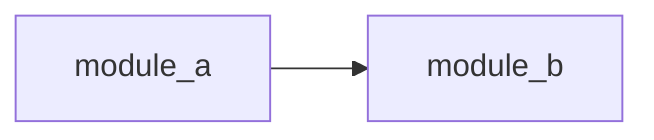

# Research: [작업 제목]

## 1. 작업 요약
- **요청 내용**: [프롬프트 원문 또는 요약]
- **예상 변경 범위**: [파일 수, 모듈, 계층]
- **복잡도 판단**: [중규모 | 대규모]

## 2. 기존 코드베이스 분석

### 2.1 관련 파일 목록

| 파일 | 역할 | 변경 필요 여부 |
|------|------|-------------|
| `path/to/file` | [역할] | [Y/N/검토필요] |

### 2.2 의존성 그래프

### 2.3 인터페이스 / API 현황
- 기존 API 엔드포인트: [목록]
- 기존 타입/인터페이스: [목록]
- 중복 위험 영역: [식별 결과]

## 3. 외부 자료 조사
- [URL 또는 문서 참조]: [핵심 내용 1줄]
- 관련 라이브러리/패턴: [목록]

## 4. 리스크 & 제약 조건

| 리스크 | 심각도 | 완화 방안 |
|--------|--------|----------|
| [리스크 1] | High/Medium/Low | [방안] |

## 5. 핵심 발견 요약
1. [발견 1]
2. [발견 2]
3. [발견 3]
