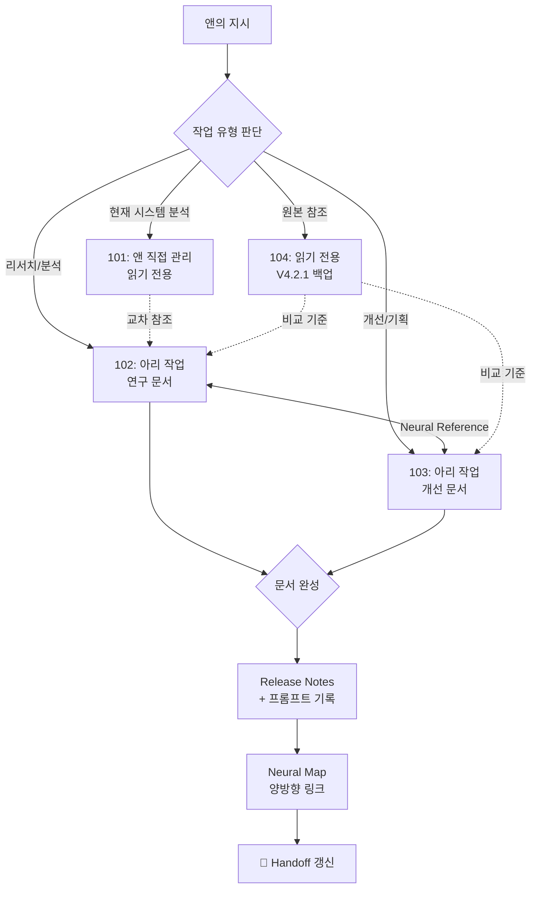

# CLAUDE.md - 1012 Claude Code 개선 프로젝트

> Version: 2.0.0 | Created: 2026-03-15 | Updated: 2026-03-15
> 목적: 1012 프로젝트 전체 관할 — 유일한 규칙 파일 (하위 CLAUDE.md 없음)

---

## 0. 프로젝트 개요

이 프로젝트(`1012_`)는 Claude Code 시스템의 **개선 리서치 & 기획**을 수행하는 작업 공간이다.

```
1012_/
├── CLAUDE.md                          ← 이 파일 (유일한 규칙 파일)
├── 101_doc_current_system_analysis/   ← 현재 시스템 분석 (앤 관리)
├── 102_doc_future_system_research/    ← 미래 시스템 연구 (아리 관리)
├── 103_doc_/                          ← 개선 문서 (아리 관리)
└── 104_current_system/                ← 현재 시스템 백업 V4.2.1 (앤 관리)
```

> [!important] 이 파일이 유일한 규칙 파일
> 하위 폴더에 CLAUDE.md가 없다. 이 파일의 규칙이 모든 하위 폴더에 직접 적용된다.

---

## 1. 접근 제어 (MANDATORY)

| 폴더 | 역할 | 관리자 | Claude Code 권한 |
|------|------|--------|-----------------|
| **`101_doc_current_system_analysis/`** | 현재 시스템 분석 | **앤** | **읽기 전용** — 생성/수정/삭제 금지 |
| **`102_doc_future_system_research/`** | 미래 시스템 연구 | **아리** | 읽기/쓰기 |
| **`103_doc_/`** | 개선 문서 | **아리** | 읽기/쓰기 |
| **`104_current_system/`** | V4.2.1 원본 백업 | **앤** | **읽기 전용** — 원본 보존 |

> [!warning] 절대 규칙
> - **101, 104 폴더는 절대 수정 금지** (앤이 직접 관리)
> - 앤이 명시적으로 특정 폴더에 저장을 지시하면 해당 지시를 따른다
> - 기본 작업 결과물은 **앤이 지정한 폴더**에 저장

---

## 2. 문서 작성 규칙 (모든 폴더 적용)

### 2.1 파일명 규칙

```
[순번]_[제목].md
```

- 순번: `01_`, `02_` ... (2자리, 폴더별 독립)
- 제목: snake_case 영문
- 확장자: `.md` (Obsidian 마크다운)

### 2.2 Obsidian 문법

- 문서 간 연결: `[[파일명]]` 위키링크 사용
- 태그: `#claude-code`, `#research`, `#planning` 등
- 콜아웃: `> [!note]`, `> [!warning]`, `> [!tip]` 활용
- Frontmatter(YAML): 모든 문서 상단에 메타데이터 포함

### 2.3 Claude Code 친화적 작성 (MANDATORY)

> ⚠️ **강력 규칙**: 이 프로젝트의 모든 문서는 Claude Code가 주 작업자다.
> 문서는 사람이 아닌 **다음 세션의 Claude Code가 읽고, 분석하고, 개선안을 낼 수 있도록** 작성해야 한다.

1. **구조화된 데이터 우선**: 산문보다 테이블, 리스트, 코드블록을 우선 사용
2. **명시적 컨텍스트**: 암묵적 배경지식에 의존하지 않고, 모든 맥락을 문서 내에 기술
3. **액션 가능한 서술**: "~해야 한다"가 아닌 구체적 단계, 파일 경로, 명령어 포함
4. **분석 가능한 형식**: 비교 시 테이블, 프로세스 시 다이어그램(mermaid), 결정 시 장단점 매트릭스

### 2.4 세션 핸드오프 섹션 (MANDATORY)

> ⚠️ **강력 규칙**: 모든 문서는 반드시 frontmatter 바로 다음에 `## 🔄 Next Session Handoff` 섹션을 포함해야 한다.

```markdown
## 🔄 Next Session Handoff

### 현재 상태
- 이 문서의 완성도: [draft | 70% | completed]
- 마지막 작업: [무엇을 했는지 1줄]

### 다음 작업 (TODO)
- [ ] [구체적 작업 1]
- [ ] [구체적 작업 2]

### 작업 조언
> [!tip] 다음 Claude Code에게
> - [주의할 점, 추천 접근법, 참고 문서, 피해야 할 실수]
```

- 문서 생성/수정 시 반드시 이 섹션을 최신 상태로 갱신
- TODO 항목은 체크박스(`- [ ]`)로 작성
- 작업 조언은 실질적이고 구체적으로 (빈말 금지)

### 2.5 문서 템플릿

```markdown
---
title: "[문서 제목]"
version: "1.0.0"
created: "YYYY-MM-DD"
updated: "YYYY-MM-DD"
tags: [claude-code, 관련태그]
status: draft | in-progress | completed
---

## 🔄 Next Session Handoff

### 현재 상태
- 이 문서의 완성도: draft
- 마지막 작업: 초기 작성

### 다음 작업 (TODO)
- [ ] [다음에 할 작업]

### 작업 조언
> [!tip] 다음 Claude Code에게
> - [작업 시 참고사항]

---

# [문서 제목]

## 개요
[문서의 목적과 범위]

## 내용
[본문]

## 관련 문서

### 직접 참조 (Direct Links)
- [[파일명#섹션|표시명]] — 관계 설명

### 역참조 (Backlinks)
- [[파일명#섹션|표시명]] — 이 문서를 참조하는 곳

### 관련 주제 (Topic Links)
- [[파일명#섹션|표시명]] — 동일 주제 다른 관점

---

## Release Notes

### v1.0.0 (YYYY-MM-DD)
- 초기 작성
> **프롬프트:** "앤이 제시한 원본 프롬프트"
```

### 2.6 버전 관리

| 변경 수준 | 규칙 | 예시 |
|----------|------|------|
| 초기 작성 | `1.0.0` | 문서 생성 |
| 내용 보완/수정 | `1.x.0` (minor) | 섹션 추가, 내용 개선 |
| 오타/서식 수정 | `1.0.x` (patch) | 단순 수정 |
| 구조 대폭 변경 | `x.0.0` (major) | 전면 재작성 |

- frontmatter의 `version`과 `updated` 필드를 반드시 갱신
- Release Notes 섹션에 변경 이력 추가 (최신이 위)

### 2.7 릴리즈 노트 프롬프트 기록 (MANDATORY)

> ⚠️ **강력 규칙**: 모든 릴리즈 노트에 해당 작업을 유발한 **앤의 원본 프롬프트를 반드시 기록**한다.

```markdown
### vX.Y.Z (YYYY-MM-DD)
- 변경 내용 1
- 변경 내용 2
> **프롬프트:** "앤이 제시한 원본 프롬프트 전문"
```

- 문서 **생성** 시: `> **프롬프트:** "..."` 로 생성 지시 프롬프트 기록
- 문서 **수정** 시: 해당 버전의 수정 지시 프롬프트 기록
- Gemini 등 외부 도구로 생성된 원본은 `> **원본 생성:** Gemini (앤 직접 생성)` 추가
- 여러 단계의 프롬프트는 `> **프롬프트 (단계명):**` 로 구분

---

## 3. 신경망 참조 시스템 (Neural Reference) (MANDATORY)

> ⚠️ **강력 규칙**: 모든 문서는 **신경망처럼 상호 연결**되어야 한다.
> 단순 문서명 링크가 아닌, **참조할 문서의 특정 섹션까지 명시**하여 다음 Claude Code가 전체를 서치하지 않고 정확한 위치로 점프할 수 있게 한다.

### 3.1 인라인 참조 (Inline Neural Link)

본문에서 다른 문서를 언급할 때 **특정 섹션을 앵커로 지정**한다:

```markdown
이 패턴은 [[01_001_Claude_Code_2026_Changelog_Analysis#4. 우리 시스템 영향 분석|시스템 영향 분석]]에서 도출된 것이다.
```

| 형식 | 설명 | 용도 |
|------|------|------|
| `[[파일명]]` | 문서 전체 참조 | **지양** |
| `[[파일명#섹션]]` | 특정 섹션 참조 | **권장** |
| `[[파일명#섹션\|별칭]]` | 섹션 참조 + 표시명 | **최선** |
| `[[파일명#섹션^블록]]` | 특정 블록 참조 | 정밀 참조 시 |

### 3.2 관련 문서 섹션 (Neural Map)

`## 관련 문서` 섹션은 **참조 지도(Neural Map)**로 작성한다:

```markdown
## 관련 문서

### 직접 참조 (Direct Links)
- [[파일명#섹션|표시명]] — 이 문서의 근거/소스

### 역참조 (Backlinks)
- [[파일명#섹션|표시명]] — 이 문서를 참조하는 곳

### 관련 주제 (Topic Links)
- [[파일명#섹션|표시명]] — 동일 주제 다른 관점
```

### 3.3 참조 작성 규칙

1. **섹션 레벨 필수**: `[[파일명]]`만 쓰지 말고 반드시 `#섹션` 포함
2. **관계 설명 필수**: 링크 뒤에 `—` 로 관계를 1줄 설명
3. **양방향 연결**: A→B 링크를 걸면, B에도 A 역참조 추가
4. **본문 인라인**: 관련 내용이 나오는 본문 위치에도 인라인 링크 삽입
5. **블록 ID 활용**: 중요 테이블/결론에 `^block-id`를 달아 정밀 참조 가능
6. **최소 연결**: 모든 문서는 최소 2개 이상의 다른 문서와 연결
7. **폴더 간 교차**: 101↔102↔103 교차 연결 허용

### 3.4 효율성 원칙

- 다음 Claude Code가 **전체 서치 없이** 필요한 섹션으로 직접 점프
- 옵시디언 그래프 뷰에서 문서 간 연결 밀도를 시각적 확인 가능
- 고립된 문서(orphan)가 없도록 최소 2개 이상의 다른 문서와 연결

### 3.5 참조 효율성 수치 (참고)

| 시나리오 | 전체 읽기 | 신경망 참조 | 토큰 절감 |
|---------|---------|-----------|----------|
| 단일 근거 확인 | ~500줄 | ~30줄 | **94%** |
| 주제 추적 (3문서) | ~1,200줄 | ~120줄 | **90%** |
| 6개 문서 전체 탐색 | ~2,400줄 | ~200줄 | **92%** |

---

## 4. 자동 저장 & 갱신 (MANDATORY)

- 문서 생성 시: 즉시 파일로 저장
- **수정 지시 시: 해당 문서에 반드시 수정사항을 직접 반영** → 버전업 → Release Notes 추가 → 즉시 저장
- 별도 저장 요청 불필요 (항상 자동 저장)
- ⚠️ 수정 내용을 텍스트로 설명만 하고 문서에 반영하지 않는 것은 금지

---

## 5. 프로젝트 작업 흐름



### 작업 판단 기준

| 앤의 지시 키워드 | 대상 폴더 | 예시 |
|----------------|----------|------|
| "분석해줘", "체인지로그", "공식 문서", "리서치" | **102** | 체인지로그 분석, 공식 문서 정리, 유튜브 분석 |
| "개선안", "V5.0", "마이그레이션", "로드맵" | **103** | 개선 방향 문서, 업그레이드 계획 |
| "현재 시스템", "V4.2.1 상태" | **101** (앤이 명시 지시 시만) | 현재 설정 분석 |
| "원본", "비교", "백업" | **104** (읽기만) | V4.2.1과 비교 |

---

## 6. 104 폴더 참조 가이드

`104_current_system/`은 글로벌 CLAUDE.md V4.2.1의 **원본 백업**을 보관한다. V5.0 업그레이드 시 비교 기준점(baseline)으로 사용된다.

| 항목 | 내용 | 경로 |
|------|------|------|
| 글로벌 규칙 원본 | V4.2.1 CLAUDE.md | `104_current_system/CLAUDE.md` |
| 변경 이력 | CHANGELOG.md | `104_current_system/CHANGELOG.md` |
| 에이전트 정의 | 14개 에이전트 | `104_current_system/agents/` |
| 커스텀 명령 | 16개 명령 | `104_current_system/commands/` |
| Hook 스크립트 | Hook 원본 | `104_current_system/hooks/` |
| 스킬/플러그인 | 스킬+플러그인 | `104_current_system/skills/`, `plugins/` |
| 설정 | settings.json | `104_current_system/settings.json` |

---

## 7. 현재 문서 현황

### 101_doc_current_system_analysis/ (앤 관리, 읽기 전용)

| 파일 | 내용 |
|------|------|
| `01_001_Current_System_Analysis.md` | 현재 시스템 분석 |
| `01_002_Memory_System_Analysis.md` | 메모리 시스템 분석 |
| `02_001_Translation_Classification_System_and_Automatic_Judgment_Methodology.md` | 번역 분류체계 및 자동판단 방법론 ⚠️ |
| `02_002_Genius_Insight_Derivation_Formulas.md` | 천재적 통찰 도출 공식 ⚠️ |

> [!note] ⚠️ 표시 파일 안내
> `02_` 파일 2개는 **외부에서 가져온 기존 문서**이며, 이 프로젝트의 템플릿 형식(frontmatter, handoff, neural map, release notes)으로 수정하지 않는다. 원본 그대로 보존.

### 102_doc_future_system_research/ (아리 관리)

| 파일 | 내용 |
|------|------|
| `01_001_Claude_Code_2026_Changelog_Analysis.md` | 체인지로그 종합 분석 + V4.3 권고안 9개 |
| `02_001_Claude_Code_Official_Docs_Core_Engine.md` | 공식 문서 핵심 엔진 레퍼런스 |
| `03_001_Ontology_YouTube_Summary.md` | 온톨로지 유튜브 2개 요약 |
| `04_001_Claude_Code_YouTube_Summary.md` | 클로드코드 유튜브 4개 요약 |
| `05_001_Intelligence_Architecture_Ontology_Research.md` | 온톨로지 심층 연구 |
| `06_001_Agentic_Software_Engineering_Analysis.md` | 에이전틱 엔지니어링 포괄적 분석 |
| `07_001_Neural_Reference_Deep_Analysis.md` | 신경망 참조 심층 분석 |

### 103_doc_/ (아리 관리)

| 파일 | 내용 |
|------|------|
| `01_001_Improvement_Direction_Overview.md` | V5.0 개선 방향 개요 |
| `02_001_C1_Ontology_Memory_Deep_Design.md` | C1 온톨로지 메모리 심층 설계 |
| `02_002_C2_Parallel_System_Official_Migration.md` | C2 병렬 시스템 공식 전환 심층 설계 |
| `02_003_C3_CLAUDE_MD_Modularization.md` | C3 CLAUDE.md 모듈화 & 경량화 심층 설계 |
| `02_004_C4_Hook_Skill_Official_Migration.md` | C4 Hook & Skill 공식 체계 전환 심층 설계 |
| `02_005_C5_Observability_Self_Evolution.md` | C5 Observability & 자기 진화 심층 설계 |
| `02_006_C6_CLI_Ecosystem_Integration.md` | C6 CLI 생태계 통합 (옵시디언/Git/외부 도구) 심층 설계 |
| `02_007_C7_Agentic_Workflow_Paradigm.md` | C7 에이전틱 워크플로우 패러다임 전환 심층 설계 |
| `02_008_C8_Quality_Context_Management.md` | C8 결과물 품질 극대화 & 컨텍스트 관리 심층 설계 |

### 105_folder_system/ (아리 관리)

| 파일 | 내용 |
|------|------|
| `CLAUDE.md` | 105 폴더 전용 규칙 (상위 CLAUDE.md 상속) |
| `TEMPLATE.md` | 105 문서 작성 템플릿 (M1 방법론/M2 표준/M3 프로세스) |
| `01_001_Folder_Structure_Methodology.md` | 폴더 구조 방법론 (서울시 × 숫자 계층 × 옵시디언) |
| `01_002_Document_Template_Standard.md` | 문서 양식 표준 (공통 헤더/풋터/몸통 작성룰 + 템플릿) |

---

## Release Notes

### v2.1.0 (2026-03-15)
- 105_folder_system 폴더 추가 (영문명 변경 반영)
- 폴더 구조 방법론 문서 등록
> **프롬프트:** "105 폴더에 서울시 개발방법론을 서치해서 찾아줘. 숫자 폴더 구조 방법론을 인터넷에서 찾아서 정리해줘."

### v2.0.0 (2026-03-15)
- **전면 재구성 (major)**: 하위 CLAUDE.md 3개 삭제 반영 → 상위 단일 관할 구조로 전환
- Section 0: "각 폴더 독립 CLAUDE.md" → "유일한 규칙 파일" 선언
- Section 2: 기존 3개 하위 파일의 공통 규칙을 통합 (2.1~2.7)
- Section 3: 신경망 참조 시스템을 독립 섹션으로 승격 (기존 하위 2.7에서)
- Section 4: 자동 저장 독립 섹션
- Section 5: 작업 흐름 — 문서 완성 후 릴리즈→Neural Map→Handoff 시퀀스 추가
- Section 6: 104 참조 가이드 (기존 4.3에서 독립)
- Section 7: 문서 현황 최신화
- 기존 Section 4 (하위 비교), Section 6 (동기화 정책) 제거 — 하위 파일 없으므로 불필요
> **프롬프트:** "101, 102, 103 의 클로드 엠디는 삭제했어. CLAUDE.md 파일의 6.3 현재 동기화 상태의 내용을 동기화 해줘. 신경망 참조에 따라 문서 작성 규칙을 재 체크해서 잘 적용해줘"

### v1.0.0 (2026-03-15)
- 초기 작성: 101/102/103/104 폴더 CLAUDE.md 분석 통합
> **프롬프트:** "101, 102, 103 폴더의 CLAUDE.md 파일을 분석 통합해서 1012_ 폴더 상위 클로드 엠디 파일을 만들어줘"

---

*1012 Project Guidelines v2.0.0*
