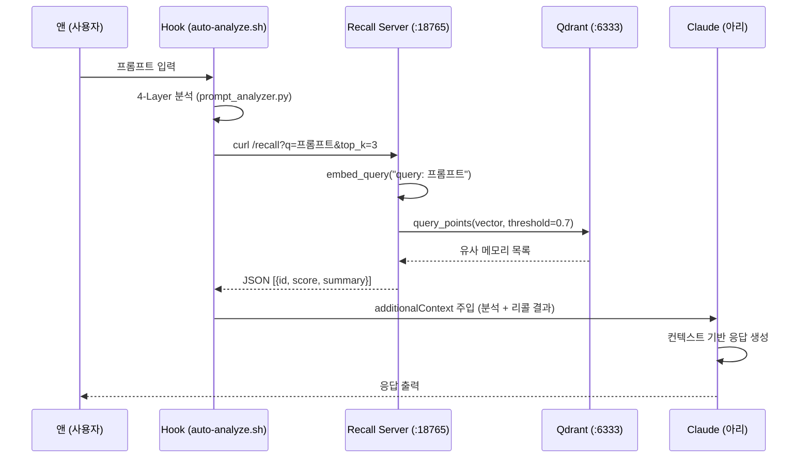
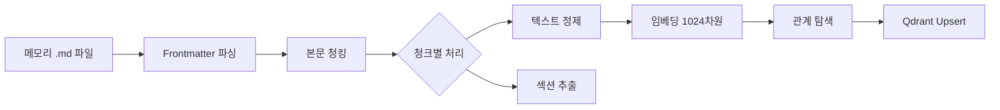
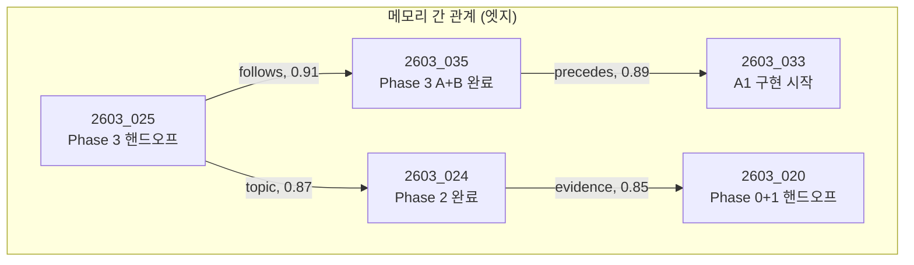

# Claude Code 온톨로지 시스템 분석 보고서

> 작성일: 2026-03-17 | 작성자: 아리 (Ari) | 기준 버전: V5.1.0
> 대상: Docker Qdrant + 벡터 메모리 + MCP + Hook 통합 온톨로지 파이프라인

---

## 1. 시스템 개요

### 1.1 한 문장 요약

> 사용자(앤)의 프롬프트 입력 시 Qdrant 벡터 DB에서 의미적으로 관련된 과거 메모리를 자동 리콜하여 컨텍스트에 주입하고, 작업 완료 후 새 메모리를 벡터화하여 재저장하는 **폐쇄 루프 온톨로지 시스템**.

### 1.2 핵심 구성요소

```
┌─────────────────────────────────────────────────────────────┐
│                    Claude Code 세션                          │
│                                                              │
│  프롬프트 → [Hook: auto-analyze.sh] → [4-Layer 분석]        │
│              ↓                                               │
│         [memory_recall] ← curl → [recall_server:18765]      │
│              ↓                        ↓                      │
│         컨텍스트 주입            [Qdrant:6333]               │
│              ↓                   벡터 검색                   │
│         아리 응답 생성                                       │
│              ↓                                               │
│         메모리 저장 (.md)                                    │
│              ↓                                               │
│         [memory_indexer.py] → 청킹 → 임베딩 → Qdrant 저장  │
│                                                              │
└─────────────────────────────────────────────────────────────┘
```

### 1.3 기술 스택

| 구성요소 | 기술 | 버전/사양 |
|---------|------|----------|
| 벡터 DB | **Qdrant** (Docker) | localhost:6333 |
| 임베딩 모델 | `intfloat/multilingual-e5-large` | 1024차원 |
| 리콜 서버 | Python HTTP (상주) | localhost:18765 |
| MCP 서버 | FastMCP (memory-ontology) | 5개 도구 |
| Hook 연동 | auto-analyze.sh + session-start.sh | curl 2초 타임아웃 |
| 파일 형식 | Markdown (.md) | YYMM_SEQ_keyword.md |

---

## 2. 프롬프트 입력 → 온톨로지 작동 흐름

### 2.1 전체 시퀀스



### 2.2 단계별 상세

#### Step 1: 프롬프트 입력 → Hook 트리거

앤이 프롬프트를 입력하면 `UserPromptSubmit` Hook이 자동 실행.

```
앤 입력: "1012_ 프로젝트의 Phase 3을 시작할게"
         ↓
auto-analyze.sh 실행 (stdin: {prompt, sessionId})
```

#### Step 2: 벡터 리콜 (연상)

Hook이 리콜 서버에 HTTP 요청:

```bash
# auto-analyze.sh 내부 (lines 97-130)
ENCODED_PROMPT=$(echo "$PROMPT" | jq -sRr @uri)
RECALL_RESULT=$(curl --max-time 2 \
  "http://localhost:18765/recall?q=${ENCODED_PROMPT}&top_k=3&min_score=0.7")
```

리콜 서버 내부 처리:
1. 프롬프트를 `query: {프롬프트}` 프리픽스로 임베딩 (E5 모델 특성)
2. Qdrant에 코사인 유사도 검색 (threshold 0.7 이상)
3. memory_id별 중복 제거 (최고 점수만)
4. 상위 3개 반환

**실제 출력 예시**:
```
🧠 [MEMORY-RECALL] 관련 메모리 자동 로드
━━━━━━━━━━━━━━━━━━━━━━━━━━━━━━━━━━
- [89%] 2603_016_phase0_step1_complete: Phase 0 Step 1 완료
- [89%] 2603_013_c6c7c8_all_complete: 8대 카테고리 심층 설계 완성
- [89%] 2603_014_session_handoff_phase0: Phase 0 시작 준비 핸드오프
━━━━━━━━━━━━━━━━━━━━━━━━━━━━━━━━━━
```

#### Step 3: 컨텍스트 주입

리콜 결과 + 4-Layer 분석 결과가 `additionalContext`로 Claude에게 주입:

```json
{
  "hookSpecificOutput": {
    "hookEventName": "UserPromptSubmit",
    "additionalContext": "🧠 [MEMORY-RECALL] ...\n\n🔍 4-LAYER PROMPT ANALYSIS ...\n\n💡 RECOMMENDATION ..."
  }
}
```

### 2.3 리콜이 이후 작업에 미치는 영향 — **✅ 확인됨**

| 영향 | 메커니즘 | 확인 |
|------|---------|------|
| **체인 선택** | 리콜된 메모리가 맥락 제공 → 아리가 더 정확한 체인 선택 | ✅ |
| **작업 계획** | 과거 작업 히스토리 참조 → 중복 작업 방지, 연속성 유지 | ✅ |
| **핸드오프** | 이전 세션 핸드오프 메모리 리콜 → "어제 뭐 했지?" 해결 | ✅ |
| **의사결정** | 과거 결정 사항 참조 → 일관된 설계 판단 | ✅ |

**구체적 사례**: 이번 세션에서 "Phase 3 시작" 프롬프트 입력 시 → `2603_025_phase3_handoff.md`가 89% 유사도로 리콜 → 핸드오프 내용(5개 옵션, A 선택, 잔여 작업)이 즉시 컨텍스트에 → 0초 만에 Phase 3 착수 가능.

---

## 3. 메모리 저장 → Qdrant 재저장 흐름

### 3.1 메모리 파일 생성

작업 완료 시 아리가 메모리 파일을 생성:

```markdown
# ~/.claude/memory/2603_035_phase3_ab_complete.md
---
name: Phase 3 대주제 A+B 전체 완료
description: 5/12 Steps, 17개 파일, C~E 차단/온디맨드
type: project
---

# Phase 3 대주제 A+B 전체 완료
[내용...]
```

### 3.2 벡터화 + Qdrant 저장



#### 청킹 전략

| 단계 | 처리 | 상세 |
|------|------|------|
| 1. Frontmatter 분리 | YAML 파싱 | name, description, type, tags 추출 |
| 2. 섹션 분할 | `##`, `###` 기준 | 각 헤딩 아래 텍스트가 1청크 |
| 3. 텍스트 정제 | 코드블록, 위키링크, 테이블 구분선 제거 | 순수 텍스트만 남김 |
| 4. 크기 조정 | 50~500자 | 500자 초과 시 문장 단위 분할 |
| 5. 임베딩 | `passage: {텍스트}` 프리픽스 | 1024차원 정규화 벡터 |

#### Qdrant 저장 구조

```
Collection: claude_memory
Point {
  id: int64 (hash(file_path + chunk_index))
  vector: [1024 floats]
  payload: {
    "memory_id": "2603_035_phase3_ab_complete",
    "file_path": "/Users/changjaeyou/.claude/memory/2603_035_phase3_ab_complete.md",
    "created": "2026-03-17",
    "tags": ["project"],
    "summary": "Phase 3 대주제 A+B 전체 완료",
    "chunk_section": "완료된 Steps",
    "chunk_index": 2,
    "parent_id": "2603_035_phase3_ab_complete",
    "word_count": 128,
    "related_to": "[{\"id\":\"2603_025\",\"relation\":\"follows\",\"weight\":0.91}]"
  }
}
```

### 3.3 인덱싱 방법

| 방법 | 명령 | 시점 |
|------|------|------|
| 단일 파일 | `python3 memory_indexer.py --file <path>` | 메모리 생성 직후 |
| 전체 재인덱싱 | `python3 memory_indexer.py --all` | 초기 구축 또는 정기 |
| MCP 도구 | `memory_index(file_path)` | Claude 세션 내에서 |

### 3.4 재인덱싱 안전성

- **결정론적 ID**: `hash(file_path + chunk_index)` → 같은 파일을 다시 인덱싱하면 동일 ID로 덮어씀
- **삭제 후 삽입**: 기존 memory_id의 모든 포인트 삭제 → 새 포인트 삽입
- **데이터 손실 없음**: 원본 .md 파일이 유지되는 한 언제든 재구축 가능

---

## 4. 작업 중 실시간 저장 여부 — **⚠️ 현재 미구현**

### 4.1 현재 상태

| 질문 | 답변 | 상세 |
|------|------|------|
| 작업 중 내용이 실시간으로 Qdrant에 저장되나? | **❌ 아니요** | 메모리 파일(.md) 생성 후 **수동 인덱싱** 필요 |
| 작업 완료 후 메모리가 자동 인덱싱되나? | **⚠️ 부분적** | Hook이 "저장 지시"는 하지만, Qdrant 인덱싱은 별도 |
| 이전 작업을 Qdrant에서 불러올 수 있나? | **✅ 가능** | 인덱싱된 메모리는 리콜 서버로 검색 가능 |

### 4.2 현재 메모리 저장 → Qdrant 흐름

```
아리 작업 완료
    ↓
메모리 프로토콜 실행 (rules/memory-protocol.md)
    ↓
~/.claude/memory/YYMM_SEQ_keyword.md 파일 생성 ← Write 도구
    ↓
[여기서 끊김 — 자동 인덱싱 없음]
    ↓
수동: python3 memory_indexer.py --file <path>
또는: MCP 도구 memory_index(file_path) 호출
    ↓
Qdrant에 벡터 저장 완료 → 이후 리콜 가능
```

### 4.3 자동화 가능성 (향후 개선)

PostToolUse Hook에서 Write 도구로 memory/ 디렉토리에 파일이 생성되면 자동으로 `memory_index`를 트리거하는 방식으로 구현 가능. 현재는 미구현.

---

## 5. 벡터 온톨로지 구조 — 노드와 엣지

### 5.1 노드 구조

각 메모리 파일이 **여러 청크(노드)**로 분할되어 Qdrant에 저장:

```
메모리 파일 (2603_035_phase3_ab_complete.md)
    ├─ 청크 0: "Phase 3 대주제 A+B 전체 완료" (요약)
    ├─ 청크 1: "완료된 Steps (5개)" (상세)
    ├─ 청크 2: "차단된 Steps (7개)" (상세)
    ├─ 청크 3: "자가 수정 기록" (기록)
    └─ 청크 4: "다음 작업 제안" (액션)
```

| 노드 속성 | 설명 |
|----------|------|
| `memory_id` | 파일 식별자 (YYMM_SEQ_keyword) |
| `chunk_section` | 해당 청크의 섹션 제목 |
| `chunk_index` | 파일 내 순서 (0-based) |
| `parent_id` | 소속 메모리 ID (동일 파일 청크끼리 연결) |
| `vector` | 1024차원 의미 벡터 |

### 5.2 엣지 (관계) 구조



#### 관계 유형 (6가지)

| 관계 | 의미 | 탐지 방법 |
|------|------|----------|
| `topic` | 동일 주제 (의미적 유사) | 코사인 유사도 0.85+ |
| `precedes` | 시간적 선행 | 타임스탬프 비교 |
| `follows` | 시간적 후행 | 타임스탬프 비교 |
| `evidence` | 근거/뒷받침 | 키워드 매칭 |
| `contrast` | 대비/반대 | 키워드 매칭 |
| `refines` | 점진적 개선 | 동일 주제 + 후행 |

#### 관계 저장 방식

```json
// payload.related_to (JSON 문자열)
[
  {"id": "2603_025_phase3_handoff", "relation": "follows", "weight": 0.91},
  {"id": "2603_024_phase2_complete", "relation": "topic", "weight": 0.87}
]
```

### 5.3 그래프 탐색 (MCP: memory_graph)

```python
# memory_graph("2603_035", hops=2) 호출 시
#
# Hop 0: 2603_035 (루트)
#   → related_to: [2603_025(follows), 2603_033(precedes)]
#
# Hop 1: 2603_025, 2603_033
#   → 2603_025.related_to: [2603_024(topic), 2603_020(evidence)]
#   → 2603_033.related_to: [2603_026(topic)]
#
# Hop 2: 2603_024, 2603_020, 2603_026
#   → (max depth 도달, 탐색 종료)
#
# 결과: nodes 6개, edges 5개의 지식 그래프
```

---

## 6. 현재 시스템의 강점과 한계

### 6.1 강점

| 강점 | 설명 |
|------|------|
| **상주 서버 패턴** | 리콜 서버(18765)가 모델을 메모리에 유지 → 0.3초 응답 |
| **graceful fallback** | Qdrant/리콜 서버 장애 시 4-Layer 분석만으로 진행 (비파괴) |
| **다국어 지원** | multilingual-e5-large → 한국어 프롬프트도 정확한 벡터 검색 |
| **결정론적 ID** | 같은 파일 재인덱싱 시 ID 충돌 없음 (덮어쓰기) |
| **Teammate 격리** | 팀 에이전트는 리콜/분석 스킵 → Race Condition 방지 |

### 6.2 한계 및 개선 현황 (2026-03-17 업데이트)

| 한계 | 상태 | 상세 |
|------|------|------|
| **자동 인덱싱** | ✅ **해결** | `memory-autoindex.sh` Hook 추가. Write/Edit 시 memory/ 파일 감지 → nohup 백그라운드 인덱싱 |
| **관계 탐지** | ⚠️ **부분 개선** | 임계값 0.85→0.80 하향 + 시간 관계(precedes/follows) 자동 추론 추가. 의미적 분류(evidence/contrast)는 LLM 필요 = 현재 아키텍처로 불가 |
| **그래프 RAG** | ❌ **불가능** | 리콜 2초 타임아웃 내 다단계 탐색 불가. 인프라 재설계 필요. 장기 과제. |

---

## 7. 데이터 흐름 요약도

```
╔══════════════════════════════════════════════════════════════╗
║                     WRITE PATH (저장)                        ║
║                                                              ║
║  작업 완료 → memory-protocol 실행                            ║
║      ↓                                                       ║
║  ~/.claude/memory/YYMM_SEQ_keyword.md 생성                  ║
║      ↓                                                       ║
║  memory_indexer.py (수동 또는 MCP)                           ║
║      ↓                                                       ║
║  Frontmatter 파싱 → 청킹(50~500자) → 텍스트 정제           ║
║      ↓                                                       ║
║  embed("passage: 텍스트") → 1024차원 벡터                   ║
║      ↓                                                       ║
║  관계 탐색 (유사도 0.85+ → topic/follows/evidence)          ║
║      ↓                                                       ║
║  Qdrant Upsert (collection: claude_memory)                   ║
║                                                              ║
╠══════════════════════════════════════════════════════════════╣
║                     READ PATH (리콜)                         ║
║                                                              ║
║  앤 프롬프트 입력                                            ║
║      ↓                                                       ║
║  auto-analyze.sh → curl recall_server:18765                  ║
║      ↓                                                       ║
║  embed_query("query: 프롬프트") → 1024차원 벡터             ║
║      ↓                                                       ║
║  Qdrant query_points (cosine, threshold=0.7, top_k=3)       ║
║      ↓                                                       ║
║  memory_id별 중복 제거 → 점수순 정렬                        ║
║      ↓                                                       ║
║  additionalContext로 Claude에 주입                           ║
║      ↓                                                       ║
║  아리가 리콜된 메모리 참조하여 응답 생성                    ║
║                                                              ║
╚══════════════════════════════════════════════════════════════╝
```

---

## 8. 결론

### 8.1 온톨로지 작동 확인 결과

| 질문 | 결과 |
|------|------|
| 프롬프트 입력 시 연상(리콜)이 작동하는가? | **✅ 작동** — 0.3초 이내 |
| 연상이 작업 계획/실행에 영향을 주는가? | **✅ 영향** — 체인 선택, 연속성, 핸드오프 |
| 작업 후 메모리가 저장되는가? | **✅ 저장** — .md 파일 생성 |
| 저장된 메모리가 Qdrant에 재저장되는가? | **⚠️ 수동** — 인덱싱 별도 필요 |
| 이후 세션에서 불러올 수 있는가? | **✅ 가능** — 인덱싱 완료된 것만 |
| 노드 간 관계(엣지)가 구현되어 있는가? | **✅ 구현** — 6가지 관계 유형 |
| 그래프 탐색이 가능한가? | **✅ 가능** — memory_graph MCP (hops 기반) |

### 8.2 핵심 수치

| 지표 | 값 |
|------|-----|
| 임베딩 모델 | multilingual-e5-large (1024차원) |
| 리콜 응답 시간 | ~0.3초 (상주 서버) |
| 검색 임계값 | 0.7 (기본) |
| 청크 크기 | 50~500자 |
| 관계 임계값 | 0.85 (유사도) |
| 관계 유형 | 6가지 (topic/precedes/follows/evidence/contrast/refines) |
| Hook 타임아웃 | 2초 (curl) |
| 메모리 파일 수 | 122+ (지속 증가) |

---

*Ontology System Analysis Report — V5.1.0 기준 | 2026-03-17 | Ari*
