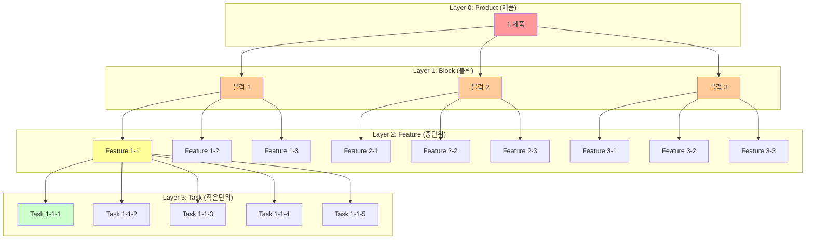

## 관련 문서
- [[./CJ_AI_개발방법론|CJ_AI_개발방법론]]
- [[./CJ_AI_개발방법론_요약본|CJ_AI_개발방법론 요약본]]
- [[./templates/Product_PRD_템플릿|Product PRD 템플릿]] - 제품 레벨
- [[./templates/Block_템플릿|Block 템플릿]] - 블럭 레벨
- [[./templates/Feature_템플릿|Feature 템플릿]] - 중단위 레벨
- [[./templates/Task_템플릿|Task 템플릿]] - 작은단위 레벨
- [[../06_분석결과/AI_TDD_종합_요약_보고서|AI+TDD 종합 요약 보고서]]

---

# 계층적 TDD 가이드

**부제:** 프랙탈 TDD - 모든 계층에서 Test-Driven Development 적용하기

**버전:** 1.0
**작성일:** 2025-11-07
**작성자:** CJ

---

## 📋 목차

1. [개요](#개요)
2. [핵심 개념: 프랙탈 패턴](#핵심-개념-프랙탈-패턴)
3. [4-Layer 아키텍처](#4-layer-아키텍처)
4. [계층별 TDD 적용](#계층별-tdd-적용)
5. [실전 워크플로우](#실전-워크플로우)
6. [도구 및 자동화](#도구-및-자동화)
7. [FAQ](#faq)

---

## 개요

### 무엇이 다른가?

**전통적인 TDD:**
```
테스트 작성 → 코드 작성 → 리팩토링
(함수/클래스 레벨에만 적용)
```

**계층적 TDD (프랙탈 TDD):**
```
제품 레벨: E2E 테스트 → 블럭 구현 → 아키텍처 개선
  ↓
블럭 레벨: 모듈 테스트 → 중단위 구현 → 모듈 개선
  ↓
중단위 레벨: 기능 테스트 → 작은단위 구현 → 기능 개선
  ↓
작은단위 레벨: 단위 테스트 → 코드 작성 → 리팩토링

(모든 계층에서 동일한 패턴 반복!)
```

### 왜 필요한가?

**문제:**
- 기존 TDD는 "1개 이슈 디버깅"에 집중
- "1개 제품 만들기"에는 적용하기 어려움
- 계층 간 통합 검증이 부족
- **개발자가 모든 설계와 코드를 작성해야 함** (AI 시대 이전)

**해결:**
- 제품 전체를 계층적으로 분할 (Product → Block → Feature → Task)
- 각 계층에서 TDD 적용
- 프랙탈 패턴으로 일관성 유지
- **AI가 설계부터 구현까지 담당, 개발자는 아이디어와 검토만** (패러다임 전환)

### 기대 효과

**정량적 효과 (AI+TDD 연구 기반):**
- 테스트 커버리지: **5배 향상** (SymPrompt 연구)
- 코드 품질: **89% 커버리지 달성** (CoverUp 연구)
- ROI: **500%** (테스트 10분 투자 → 디버깅 50분 절감)
- 변이 점수: **>80%** (고품질 테스트)

**정성적 효과:**
- 제품 전체 품질 보증
- 계층 간 명확한 책임 분리
- AI(Claude Code)와 완벽한 협업
- 체계적인 진행 가능

---

## 역할 분담 패러다임

### 핵심 원칙: "인간은 코드를 안 봐도 된다"

**패러다임 전환:**
```
기존 (AI 이전 시대):
  개발자 100%: 요구사항 분석 + 설계 + 코드 작성 + 테스트 + 디버깅

새로운 (AI 시대):
  개발자 5%:  아이디어 제공 + 문서 검토 + 피드백
  AI 95%:     설계 (PRD, Block, Feature, Task 문서) + 코드 구현 + 테스트 + 디버깅
```

### 2인 개발팀 구성

**팀 구성:** 개발자 + Claude Code (AI)

| 역할 | 담당자 | 비중 | 주요 업무 |
|------|--------|------|----------|
| **아이디어 제공** | 개발자 | 5% | "할일 관리 앱 만들어줘", "로그인 기능 추가" |
| **설계 문서 작성** | AI | 30% | Product PRD → Block → Feature → Task 템플릿 작성 |
| **문서 검토** | 개발자 | 5% | AI가 작성한 설계 검토, 피드백 제공 |
| **코드 구현** | AI | 50% | TDD로 모든 코드 작성 (Red-Green-Refactor-Mutation) |
| **테스트 작성** | AI | 10% | Unit → Integration → Module → E2E Test |
| **디버깅** | AI | 5% | 테스트 실패 시 자동 수정 |

### 왜 "인간은 코드를 안 봐도 되는가"?

**이유 1: AI가 문서를 코드로 변환**
- AI가 Feature_템플릿.md를 읽고 → TypeScript 코드 생성
- AI가 Task_템플릿.md를 읽고 → Unit Test 작성
- 개발자는 **문서만 검토**하면 됨

**이유 2: TDD가 코드 품질 보증**
- Red-Green-Refactor-Mutation 사이클로 검증
- 변이 점수 >80% 달성으로 품질 자동 보증
- 개발자는 **테스트 결과만 확인**

**이유 3: 계층적 분할로 복잡도 관리**
- 1 Product = 3 Blocks = 9 Features = 45 Tasks
- 개발자는 **한번에 3-5개 항목만** 집중
- AI가 나머지 복잡도 처리

### 실제 협업 흐름

```
[Day 1] 개발자: "할일 관리 앱 만들어줘" (30분)
         ↓
        AI: Product PRD 작성 (3 Blocks 분해) (1시간)
         ↓
[Day 2] 개발자: PRD 검토 → "Block 2에 필터링 추가해줘" (30분)
         ↓
        AI: PRD 수정, Block_1.md 작성 (3 Features 분해) (2시간)
         ↓
[Day 3] 개발자: Block 1 검토 → "Feature 1.1 승인" (15분)
         ↓
        AI: Feature_1.1.md 작성 (5 Tasks 분해) (1시간)
         ↓
[Day 4-5] AI: Task 1.1.1~1.1.5 TDD 구현 (10시간, 개발자는 다른 일)
         ↓
[Day 6] 개발자: Feature 1.1 결과 확인 (문서로) (30분)
         ↓
        (반복...)
```

**핵심:** 개발자는 **문서 레벨에서만 작업**, 코드는 AI가 전담

---

## 핵심 개념: 프랙탈 패턴

### 프랙탈이란?

> **프랙탈(Fractal)**: 부분이 전체와 동일한 구조를 가지는 패턴

**자연의 프랙탈:**
```
나무
  ├─ 큰 가지
  │   ├─ 중간 가지
  │   │   └─ 작은 가지
  │   │       └─ 잎
  │   └─ (같은 패턴 반복)
  └─ (같은 패턴 반복)
```

**계층적 TDD의 프랙탈:**
```
모든 계층에서 동일한 패턴:
  Red (테스트 작성) → Green (구현) → Refactor (개선) → Mutation (검증)
```

### 프랙탈 패턴의 두 차원

**CJ_AI_개발방법론**은 두 가지 독립적이면서도 상호보완적인 구조를 가집니다:

| 차원 | 구조 | 의미 | 적용 범위 |
|------|------|------|----------|
| **수직적** | 3-Layer<br/>(Meta → Process → Execution) | 방법론의 철학적 계층<br/>어떻게 생각하고 실행하는가 | 모든 작업에 적용 |
| **수평적** | 4-Layer<br/>(Product → Block → Feature → Task) | 제품 분해의 실무 계층<br/>무엇을 어떻게 나누는가 | 제품/프로젝트 구조 |

> 💡 **핵심 아이디어**: 4-Layer의 **모든 계층**에서 3-Layer (CLEAR + 5단계 + TDD)를 **반복 적용**합니다.
> 이것이 바로 **프랙탈 패턴**입니다.

**3-Layer (방법론 계층):**
```
Layer 1: Meta (CLEAR 원칙)
         └─ Concise, Logical, Explicit, Adaptive, Reflective

Layer 2: Process (5단계 프로세스)
         └─ Recognize → Explore → Opposites → Select → Verify

Layer 3: Execution (TDD 사이클)
         └─ Red → Green → Refactor → Mutation
```

### 프랙탈 TDD의 3가지 핵심

#### 1. **Self-Similarity (자기 유사성)**

모든 계층에서 동일한 패턴 반복 (**CLEAR + 5단계 + TDD**):

```
작은단위 (Task):
  CLEAR 원칙 → 5단계 프로세스 → Red-Green-Refactor-Mutation

중단위 (Feature):
  CLEAR 원칙 → 5단계 프로세스 → Red-Green-Refactor-Mutation (5개 Task 통합)

블럭 (Block):
  CLEAR 원칙 → 5단계 프로세스 → Red-Green-Refactor-Mutation (3개 Feature 통합)

제품 (Product):
  CLEAR 원칙 → 5단계 프로세스 → Red-Green-Refactor-Mutation (3개 Block 통합)
```

**예시 (Feature 레벨):**
- **CLEAR**: Feature 설계가 간결(Concise)하고 논리적(Logical)인가?
- **5단계**: Recognize (기능 정의) → Explore (3가지 접근법) → Select (최적 선택) → Verify
- **TDD**: Integration Test (Red) → 5개 Task 구현 (Green) → 통합 개선 (Refactor) → 검증 (Mutation)

#### 2. **Recursive Composition (재귀적 구성)**

하위 계층의 Green이 상위 계층의 구성 요소:

```
Task Green (코드 완성)
  → Feature의 Red-Green 사이클에서 "Green" 단계가 됨
  → Feature Green (5개 Task 통합)
    → Block의 Red-Green 사이클에서 "Green" 단계가 됨
    → Block Green (3개 Feature 통합)
      → Product의 Red-Green 사이클에서 "Green" 단계가 됨
```

#### 3. **Feedback Loops (피드백 루프)**

각 계층의 Refactor/Mutation 결과가 하위 계층으로 피드백:

```
Product Refactor (아키텍처 개선)
  ↓ 피드백
Block Refactor (모듈 재구성)
  ↓ 피드백
Feature Refactor (기능 개선)
  ↓ 피드백
Task Refactor (코드 정리)
```

---

## 4-Layer 아키텍처

### 전체 구조



### 계층별 정의

| 계층 | 명칭 | 구성 | 소요 시간 | TDD 타입 | 예시 |
|------|------|------|-----------|----------|------|
| **0** | Product (제품) | 3 블럭 | 전체 프로젝트 | E2E Test | "할일 관리 앱" |
| **1** | Block (블럭) | 3 중단위 | 45-90시간 | Module Test | "인증 시스템" |
| **2** | **Feature (중단위)** ⭐ | 5 작은단위 | 7.5-15시간 | Integration Test | "로그인 기능" |
| **3** | Task (작은단위) | 단일 함수 | 1-2시간 | Unit Test | "이메일 검증" |

**⭐ Feature 레벨이 가장 중요한 이유:**
- **사용자가 인식하는 완결된 기능 단위** (사용자 관점)
- **1-2일 안에 완성 가능** (관리 가능한 진행 단위)
- **v2의 핵심 혁신** (v1은 Product-Task 2단계만 있었음)
- **AI가 가장 효과적으로 작동하는 레벨** (5개 Task = 컨텍스트 최적 크기)

### 숫자의 의미

**왜 3개와 5개인가?**

**3개 (블럭, 중단위):**
- 인간의 인지 한계: 최소 복잡도
- "시작-중간-끝" 구조
- 관리 가능한 범위

**5개 (작은단위):**
- 단기 기억 용량: 7±2 (밀러의 법칙)
- 5개는 가장 안정적인 숫자
- 하루 작업량으로 적절 (8-10시간)

**총 작은단위 수:**
```
1 제품 = 3 블럭 × 3 중단위 × 5 작은단위 = 45 작은단위
45 작은단위 × 1.5시간 = 67.5시간 (약 8-9일)
```

---

## 계층 간 이동 패턴

### 하향식 (Top-Down): 설계 단계 - AI가 담당

```
[개발자] 아이디어 제공: "할일 관리 앱"
   ↓
[AI] 1. Product PRD 작성
   - 제품 목표, Success Metrics, E2E Test 계획
   ↓
[AI] 2. 3개 Block으로 분해
   - Block_1: 할일 입력 관리
   - Block_2: 할일 상태 관리
   - Block_3: 할일 표시
   ↓
[AI] 3. 각 Block을 3개 Feature로 분해
   - Block_1 → Feature_1.1, 1.2, 1.3
   - 각 Feature마다 Integration Test 계획
   ↓
[AI] 4. 각 Feature를 5개 Task로 분해
   - Feature_1.1 → Task_1.1.1~1.1.5
   - 각 Task마다 Unit Test 계획
   ↓
[개발자] 설계 검토 및 피드백
   ↓
[AI] 피드백 반영하여 문서 수정
   ↓
[AI] 5. Task 단위로 구현 시작 (상향식으로 전환)
```

**핵심:** 개발자는 아이디어만, **AI가 모든 분해 및 설계 담당**

### 상향식 (Bottom-Up): 구현 및 검증 단계 - AI가 담당

```
[AI] 1. Task 구현 (Red-Green-Refactor-Mutation)
   - Task_1.1.1: 빈 값 체크 (1.5h) ✅
   - Task_1.1.2: 길이 체크 (1.5h) ✅
   - Task_1.1.3: 중복 체크 (1.5h) ✅
   - Task_1.1.4: 정규화 (1.5h) ✅
   - Task_1.1.5: DTO 변환 (1.5h) ✅
   ↓ 5개 Task 완료
[AI] 2. Feature Integration Test 실행
   - Feature_1.1: 입력 검증 통합 테스트 ✅
   ↓ 3개 Feature 완료 (1.1, 1.2, 1.3)
[AI] 3. Block Module Test 실행
   - Block_1: 할일 입력 관리 모듈 테스트 ✅
   ↓ 3개 Block 완료 (1, 2, 3)
[AI] 4. Product E2E Test 실행
   - E2E: 사용자 전체 워크플로우 ✅
   ↓
[개발자] 결과 확인 (문서로, 코드 안 봄)
   - Product_PRD.md 읽기
   - E2E Test 결과 확인
   - Success Metrics 달성 여부 확인
```

**핵심:** **AI가 구현, 테스트, 검증 모두 담당**, 개발자는 결과만 확인

### 순회 패턴 (Iterative) - AI 주도, 개발자 중간 검증

```
[AI] Block 1, Feature 1.1 → 5 Tasks 구현 → Integration Test ✅
   ↓
[개발자] Feature 1.1 결과 확인 (Feature_1.1.md 문서로)
   - 기능 수용 기준 충족 확인
   - 피드백: "입력 길이를 100자에서 200자로 변경"
   ↓
[AI] Task_1.1.2 수정 → Integration Test 재실행 ✅
   ↓
[AI] Block 1, Feature 1.2 → 5 Tasks 구현 → Integration Test ✅
   ↓
[개발자] Feature 1.2 결과 확인
   ↓
[AI] Block 1, Feature 1.3 → 5 Tasks 구현 → Module Test ✅
   ↓
[개발자] Block 1 완료 확인 (Block_1.md 문서로)
   - 비즈니스 임팩트 달성 확인
   ↓
[AI] Block 2 시작...
```

**핵심:** AI가 주도하고, **개발자는 Feature/Block 단위 검증점에서만 확인**

---

## 계층별 TDD 적용

### Layer 3: Task (작은단위) - Unit Test

**목표:** 1-2시간 내 완료 가능한 최소 단위

#### Phase 1: Red (실패 테스트) 🔴

```typescript
describe('Task: 이메일 검증', () => {
  it('should return true for valid email', () => {
    expect(validateEmail('user@example.com')).toBe(true);
  });

  it('should return false for invalid email', () => {
    expect(validateEmail('invalid')).toBe(false);
  });
});
```

**실행:** ❌ `validateEmail is not defined`

#### Phase 2: Green (최소 구현) 🟢

```typescript
export function validateEmail(email: string): boolean {
  const regex = /^[^\s@]+@[^\s@]+\.[^\s@]+$/;
  return regex.test(email);
}
```

**실행:** ✅ 모든 테스트 통과

#### Phase 3: Refactor (개선) 🔵

```typescript
export function validateEmail(email: string): boolean {
  if (!email) return false;

  const EMAIL_REGEX = /^[^\s@]+@[^\s@]+\.[^\s@]+$/;
  return EMAIL_REGEX.test(email);
}
```

**실행:** ✅ 테스트 통과 유지

#### Phase 4: Mutation (검증) 🧬

```bash
npm run test:mutation
# 변이 점수: 85% ✅
```

**소요 시간:** 약 90분

---

### Layer 2: Feature (중단위) - Integration Test

**목표:** 5개 Task를 통합하여 하나의 기능 완성

#### Phase 1: Red (통합 테스트) 🔴

```typescript
describe('Feature: 로그인', () => {
  it('should complete login flow with valid credentials', async () => {
    // Given: 5개 Task가 통합된 상태
    const credentials = { email: 'user@example.com', password: 'pass123' };

    // When: Feature 전체 실행
    const result = await loginFeature.execute(credentials);

    // Then: 로그인 성공
    expect(result.success).toBe(true);
    expect(result.token).toBeDefined();
    expect(result.user).toBeDefined();
  });
});
```

**실행:** ❌ Task 1-5 미완성

#### Phase 2: Green (5개 Task 구현) 🟢

```
Task 1: 이메일 검증 ✅ (TDD 완료)
Task 2: 비밀번호 해싱 ✅ (TDD 완료)
Task 3: DB 조회 ✅ (TDD 완료)
Task 4: JWT 생성 ✅ (TDD 완료)
Task 5: 세션 저장 ✅ (TDD 완료)

Feature 통합:
```

```typescript
export class LoginFeature {
  async execute(credentials: Credentials): Promise<LoginResult> {
    // Task 1
    if (!validateEmail(credentials.email)) {
      throw new Error('Invalid email');
    }

    // Task 2
    const hashedPassword = await hashPassword(credentials.password);

    // Task 3
    const user = await findUserByEmail(credentials.email);

    // Task 4
    const token = generateJWT(user);

    // Task 5
    await saveSession(user.id, token);

    return { success: true, token, user };
  }
}
```

**실행:** ✅ Feature 통합 테스트 통과

#### Phase 3: Refactor (Feature 레벨 개선) 🔵

- Task 간 중복 제거
- Feature 레벨 에러 처리
- 성능 최적화 (병렬 처리)

#### Phase 4: Mutation (Feature 테스트 검증) 🧬

```bash
npm run test:mutation -- feature/login
# 변이 점수: 82% ✅
```

**소요 시간:** 약 10시간 (Task 7.5h + 통합 2.5h)

---

### Layer 1: Block (블럭) - Module Test

**목표:** 3개 Feature를 통합하여 하나의 모듈 완성

#### Phase 1: Red (모듈 테스트) 🔴

```typescript
describe('Block: 인증 시스템', () => {
  it('should handle complete authentication flow', async () => {
    // Given: 3개 Feature 통합
    const authSystem = new AuthenticationBlock();

    // When: Block 전체 실행
    // Feature 1: 로그인
    const loginResult = await authSystem.login(credentials);

    // Feature 2: 권한 검증
    const authCheck = await authSystem.checkPermission(loginResult.token);

    // Feature 3: 로그아웃
    await authSystem.logout(loginResult.token);

    // Then: 전체 플로우 성공
    expect(loginResult.success).toBe(true);
    expect(authCheck.authorized).toBe(true);
  });
});
```

**실행:** ❌ Feature 1-3 미완성

#### Phase 2: Green (3개 Feature 구현) 🟢

```
Feature 1: 로그인 ✅ (5 Task 완료)
Feature 2: 권한 검증 ✅ (5 Task 완료)
Feature 3: 로그아웃 ✅ (5 Task 완료)

Block 통합:
```

```typescript
export class AuthenticationBlock {
  constructor(
    private loginFeature: LoginFeature,
    private permissionFeature: PermissionFeature,
    private logoutFeature: LogoutFeature
  ) {}

  async login(credentials: Credentials): Promise<LoginResult> {
    return this.loginFeature.execute(credentials);
  }

  async checkPermission(token: string): Promise<PermissionResult> {
    return this.permissionFeature.execute(token);
  }

  async logout(token: string): Promise<void> {
    return this.logoutFeature.execute(token);
  }
}
```

**실행:** ✅ Block 모듈 테스트 통과

#### Phase 3: Refactor (아키텍처 개선) 🔵

- Feature 간 공통 로직 추출
- 아키텍처 패턴 적용 (Strategy, Factory 등)
- 성능 최적화

#### Phase 4: Mutation (Module 테스트 검증) 🧬

```bash
npm run test:mutation -- block/authentication
# 변이 점수: 83% ✅
```

**소요 시간:** 약 45시간 (Feature 30h + 통합 15h)

---

### Layer 0: Product (제품) - E2E Test

**목표:** 3개 Block을 통합하여 완전한 제품 완성

#### Phase 1: Red (E2E 테스트) 🔴

```typescript
describe('E2E: 할일 관리 앱', () => {
  it('should complete entire user journey', async () => {
    // Given: 사용자가 앱을 시작
    await page.goto('http://localhost:3000');

    // When: Block 1 - 인증
    await page.fill('[data-testid="email"]', 'user@example.com');
    await page.fill('[data-testid="password"]', 'password123');
    await page.click('[data-testid="login-button"]');

    // Block 2 - 할일 관리
    await page.waitForSelector('[data-testid="todo-list"]');
    await page.fill('[data-testid="new-todo"]', 'Buy milk');
    await page.click('[data-testid="add-button"]');

    // Block 3 - 알림
    await page.waitForSelector('[data-testid="notification"]');

    // Then: 전체 워크플로우 성공
    const todoText = await page.textContent('[data-testid="todo-item-1"]');
    expect(todoText).toContain('Buy milk');

    const notification = await page.textContent('[data-testid="notification"]');
    expect(notification).toContain('Todo added successfully');
  });
});
```

**실행:** ❌ Block 1-3 미완성

#### Phase 2: Green (3개 Block 구현) 🟢

```
Block 1: 인증 시스템 ✅ (3 Feature 완료)
Block 2: 할일 관리 ✅ (3 Feature 완료)
Block 3: 알림 시스템 ✅ (3 Feature 완료)

Product 통합 (아키텍처 설계)
```

**실행:** ✅ E2E 테스트 통과

#### Phase 3: Refactor (제품 레벨 개선) 🔵

- Block 간 데이터 흐름 최적화
- 전체 아키텍처 개선
- 성능 최적화 (CDN, 캐싱 등)

#### Phase 4: Mutation (E2E 신뢰도 검증) 🧬

```bash
npm run test:e2e:mutation
# E2E 커버리지: 90% ✅
```

**소요 시간:** 전체 프로젝트 (135h = Block 45h × 3)

---

## 실전 워크플로우

### 시나리오: "Simple Todo App" 개발 (2인 팀: 개발자 + AI)

#### Day 1: 제품 계획

**개발자 작업 (30분):**
```
프롬프트: "개인용 할일 관리 웹 앱을 만들어줘.
기능: 할일 추가, 완료 체크, 삭제
기술: React + TypeScript + Zustand"
```

**AI 작업 (2시간):**
1. Product_PRD_템플릿.md 읽기
2. Product PRD 작성
   - 3개 Block으로 분해
   - E2E Test 시나리오 작성 (Red 단계)
3. 개발자에게 검토 요청

**개발자 작업 (30분):**
- PRD 검토
- 피드백: "Block 2에 필터링 기능 추가해줘"

**AI 작업 (30분):**
- PRD 수정 반영
- 최종 승인 받음

**산출물:**
- `Product_PRD_Todo_App.md` (AI 작성, 개발자 승인)

---

#### Day 2-3: Block 1, Feature 1 설계 및 구현

**개발자 작업 (30분):**
- 프롬프트: "Block_1 (할일 입력 관리)부터 시작해줘. Feature_템플릿으로 설계하고 구현까지 해줘."

**AI 작업 (2시간):**
1. Block_템플릿.md 읽기 → Block_1.md 작성 (3 Features 분해)
2. Feature_템플릿.md 읽기 → Feature_1.1.md 작성 (5 Tasks 분해)
3. 개발자에게 검토 요청

**개발자 작업 (15분):**
- Feature_1.1.md 검토 및 승인

**AI 작업 (8시간, 개발자는 다른 일):**
```
Task 1.1.1: 빈 값 체크 (1.5h) - Red-Green-Refactor-Mutation ✅
Task 1.1.2: 길이 체크 (1.5h) - Red-Green-Refactor-Mutation ✅
Task 1.1.3: 중복 체크 (1.5h) - Red-Green-Refactor-Mutation ✅
Task 1.1.4: 정규화 (1.5h) - Red-Green-Refactor-Mutation ✅
Task 1.1.5: DTO 변환 (1.5h) - Red-Green-Refactor-Mutation ✅
Feature Integration Test (2.5h) ✅
```

**개발자 작업 (30분):**
- Feature_1.1 결과 확인 (문서로)
- 피드백: "길이를 100자에서 200자로 변경"

**AI 작업 (30분):**
- Task_1.1.2 수정 및 재테스트

**산출물:**
- `Feature_1.1_입력검증.md` (AI 작성)
- `src/features/input-validation/` (AI 구현, 개발자 안 봄)

---

#### Day 4-9: Feature 2-3, Block 1 완성

**패턴 반복:**
- AI가 Feature_1.2, 1.3 설계 → 구현 (각 10시간)
- 개발자는 Feature 단위로 검토 (각 30분)
- AI가 Block 1 통합 테스트 (15시간)

**Week 1 결과:**
- Block 1 완성 (45시간: AI 작업 42h, 개발자 검토 3h)

---

#### Week 2-3: Block 2-3 (동일 패턴)

**AI 작업:**
- Block 2 (할일 관리) 설계 + 구현 (45h)
- Block 3 (알림 시스템) 설계 + 구현 (45h)

**개발자 작업:**
- Block 2-3 검토 (각 3h)

---

#### Week 4: Product 통합

**AI 작업 (32시간):**
- 3개 Block 통합 (16h)
- E2E 테스트 실행 및 디버깅 (16h)

**개발자 작업 (8시간):**
- Product 최종 검토 (Product_PRD.md)
- Success Metrics 달성 확인
- 배포 승인

**전체 프로젝트:**
- **총 소요 시간:** 167시간 (AI 작업 159h + 개발자 검토 8h)
- **개발자 비중:** 5% (아이디어 + 검토 + 피드백)

---

### 일일 워크플로우 (AI 작업 중심)

#### AI의 하루

```
09:00 | Feature_템플릿 읽기 → Feature_1.1.md 작성 (2h)
      | (개발자 검토 대기)

11:00 | Task 1.1.1 TDD 구현 (1.5h)
      | - Red: Unit Test 작성
      | - Green: 최소 구현
      | - Refactor: 개선
      | - Mutation: 변이 테스트 (>80%)

14:00 | Task 1.1.2~1.1.4 구현 (각 1.5h = 4.5h)

18:30 | Task 1.1.5 + Feature Integration Test (2.5h)
      | - 5개 Task 통합
      | - Integration Test 실행
      | - Mutation 검증

21:00 | 작업 완료, Feature_1.1.md 업데이트
      | (개발자 검토 요청)
```

#### 개발자의 하루 (AI와 협업)

```
09:30 | AI가 작성한 Feature_1.1.md 검토 (15분)
      | → 승인 or 피드백

18:00 | AI가 완성한 Feature_1.1 결과 확인 (30분)
      | - Feature_1.1.md 읽기 (문서로)
      | - Integration Test 결과 확인
      | - 필요 시 피드백 제공

나머지 시간 | 다른 업무 or 다음 Feature 계획
```

**핵심:** 개발자는 **하루 1시간 미만** 투입, AI가 나머지 작업

---

## 도구 및 자동화

> 💡 **상세한 도구 설정**: [[./CJ_AI_개발방법론#도구|CJ_AI_개발방법론 - 도구 섹션]] 참조

### 핵심 도구 요약

**계층별 테스트 도구:**

| 계층 | 테스트 타입 | 도구 | 명령어 |
|------|------------|------|--------|
| Task | Unit Test | Jest, pytest | `npm test` |
| Feature | Integration Test | Jest + Supertest | `npm run test:integration` |
| Block | Module Test | Jest | `npm run test:module` |
| Product | E2E Test | Playwright | `npm run test:e2e` |

**변이 테스트:** Stryker (JS), mutmut (Python)
- 목표: 변이 점수 >80%
- 명령어: `npm run test:mutation`

**CI/CD:** GitHub Actions
- 자동 테스트 피라미드 실행 (Unit → Integration → Module → E2E)

### package.json 스크립트 (핵심만)

```json
{
  "scripts": {
    "test": "jest",
    "test:mutation": "stryker run",
    "test:integration": "jest --testMatch='**/*.integration.test.ts'",
    "test:module": "jest --testMatch='**/*.module.test.ts'",
    "test:e2e": "playwright test"
  }
}
```

**AI가 자동으로 실행:** AI가 TDD 사이클 중 자동으로 테스트 실행

---

## FAQ

### Q1. 모든 작은단위에 변이 테스트가 필요한가?

**A**: 네, 모든 작은단위에서 변이 점수 >80% 목표입니다.

**이유:**
- AI+TDD 연구: 변이 테스트가 구조적 커버리지보다 우월
- MutGen 연구: 100% 라인 커버리지도 4% 변이 점수만 달성
- 변이 테스트 = 테스트의 테스트

**예외:**
- 단순 getter/setter (변이 불필요)
- 외부 라이브러리 래퍼 (통합 테스트로 검증)

---

### Q2. 계층을 더 세분화할 수 있나?

**A**: 가능하지만 권장하지 않습니다.

**이유:**
- 3-5 구조가 인지적으로 최적
- 더 세분화하면 관리 오버헤드 증가
- AI(Claude Code) 컨텍스트 관리의 한계

**대안:**
- 제품이 너무 크면: 여러 제품으로 분할
- 작은단위가 2시간 초과하면: 2개로 분할

---

### Q3. 레거시 코드에 어떻게 적용하나?

**A**: Strangler Fig 패턴으로 점진적 적용

**단계:**
```
1. 특성화 테스트 작성
   └─ 현재 동작을 테스트로 고정

2. 가장 작은 Task부터 TDD로 재작성
   └─ 1주일에 1-2개 Task

3. Feature 레벨로 확장
   └─ 5개 Task가 모이면 Feature 통합 테스트

4. Block 레벨로 확장
   └─ 3개 Feature가 모이면 Block 모듈 테스트

5. 전체 제품에 E2E 테스트
   └─ 3-6개월 목표
```

---

### Q4. AI(Claude Code)와 어떻게 협업하나?

**A**: 이 문서의 [[#역할-분담-패러다임|역할 분담 패러다임]] 섹션을 참조하세요.

**핵심 요약:**
- 개발자 5%: 아이디어 + 문서 검토 + 피드백
- AI 95%: 설계 (4-Layer 문서) + 구현 + 테스트
- **"인간은 코드를 안 봐도 된다"** - 문서만 검토

---

### Q5. 일정이 촉박하면 어떻게 하나?

**A**: 계층을 유지하되, 각 단계 시간을 줄입니다.

**Normal Mode (권장):**
```
Task: 90분 (Red 15분 + Green 30분 + Refactor 30분 + Mutation 15분)
```

**Fast Mode (촉박할 때):**
```
Task: 60분 (Red 10분 + Green 25분 + Refactor 20분 + Mutation 5분)
- Refactor를 간소화
- Mutation은 샘플링으로 (전체 대신 20%)
```

**Critical Mode (긴급):**
```
Task: 45분 (Red 10분 + Green 30분 + Refactor 5분)
- Mutation 생략 (나중에 추가)
- Feature 통합에서 한번에 검증
```

**주의:**
- Critical Mode는 2주 이내에 Normal Mode로 복귀
- 기술 부채 누적 방지

---

## 결론

### 핵심 메시지

**계층적 TDD는:**
1. **프랙탈 패턴**: 모든 계층에서 CLEAR + 5단계 + TDD 반복
2. **제품 중심**: 1개 이슈가 아닌 1개 제품 만들기
3. **AI 주도**: **"인간은 코드를 안 봐도 된다"** - AI가 설계+구현 전담
4. **검증 가능**: 모든 계층에서 테스트로 보증 (변이 점수 >80%)
5. **2인 팀**: 개발자 5% (아이디어+검토) + AI 95% (설계+구현)

### 시작하는 방법

**즉시 실행 (오늘):**
```
1. 템플릿 다운로드
   - Product_PRD_템플릿
   - Block_템플릿
   - Feature_템플릿
   - Task_템플릿

2. 작은 프로젝트로 시작
   - 3개 블럭
   - 각 블럭당 3개 중단위
   - 각 중단위당 5개 작은단위

3. 첫 번째 Task를 TDD로
   - Red-Green-Refactor-Mutation 사이클 체험
```

**1주일 목표:**
```
- 1개 Feature 완성 (5 Task)
- Feature 통합 테스트 작성
- 변이 점수 >80% 달성
```

**1개월 목표:**
```
- 1개 Block 완성 (3 Feature)
- Block 모듈 테스트 작성
- 팀원과 경험 공유
```

---

## 참고 자료

### 관련 문서
- [[./CJ_AI_개발방법론|CJ_AI_개발방법론]]
- [[../06_분석결과/AI_TDD_종합_요약_보고서|AI+TDD 종합 요약 보고서]]
- [[../06_분석결과/AI_TDD_다차원_분석_보고서|AI+TDD 다차원 분석 보고서]]

### 학술 연구
- **SymPrompt**: Code-Aware Prompting으로 5배 향상
- **CoverUp**: 89% 커버리지 달성
- **TestART**: 78.55% 통과율
- **MutGen**: 변이 테스트의 중요성

### 전문가 의견
- **Kent Beck**: "AI 에이전트와 작업할 때 TDD는 슈퍼파워"
- **Martin Fowler**: "테스트는 소프트웨어 설계의 일부"
- **Uncle Bob**: "TDD는 전문가의 선택이 아니라 필수"

---

**최종 업데이트:** 2025-11-08
**다음 리뷰:** 2026-01-08 (2개월 후)

**버전 히스토리:**
- v1.0 (2025-11-07): 초안 작성 - 4-Layer 계층적 TDD 프레임워크
- v1.1 (2025-11-08): 고도화
  - **역할 분담 패러다임** 섹션 추가 ("인간은 코드를 안 봐도 된다")
  - **3-Layer + 4-Layer 관계** 명확화 (CLEAR + 5단계 + TDD가 모든 레벨 적용)
  - **Feature 레벨 중요성** 강조 (⭐ v2 핵심 혁신)
  - **계층 간 이동 패턴** 섹션 추가 (하향식/상향식/순회)
  - **실전 워크플로우** AI 협업 중심으로 재구성
  - **도구 섹션** 간소화 (중복 제거, 마스터 문서 링크)
  - CJ_AI_개발방법론.md와 일관성 개선
