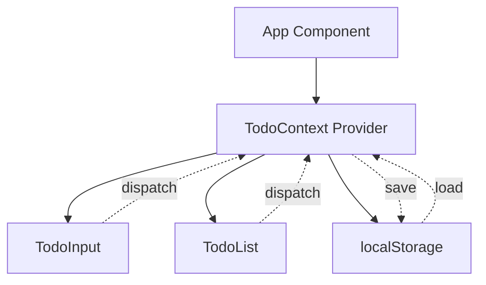
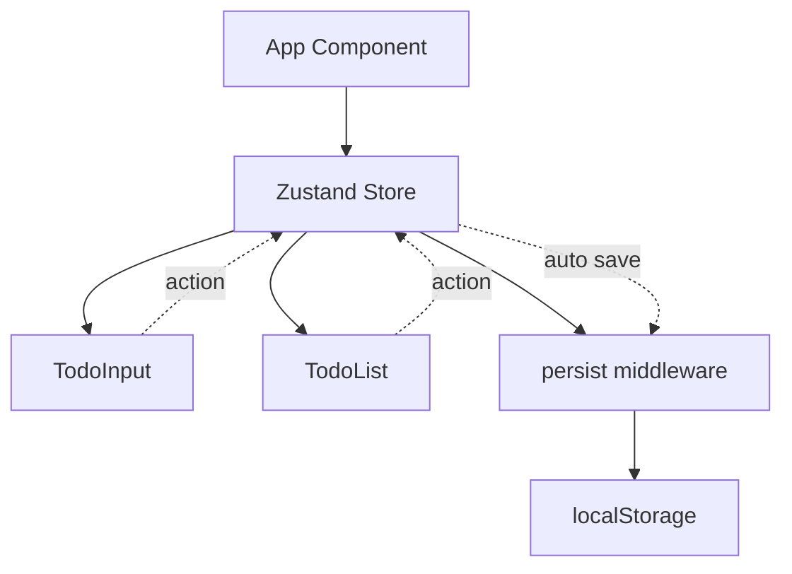
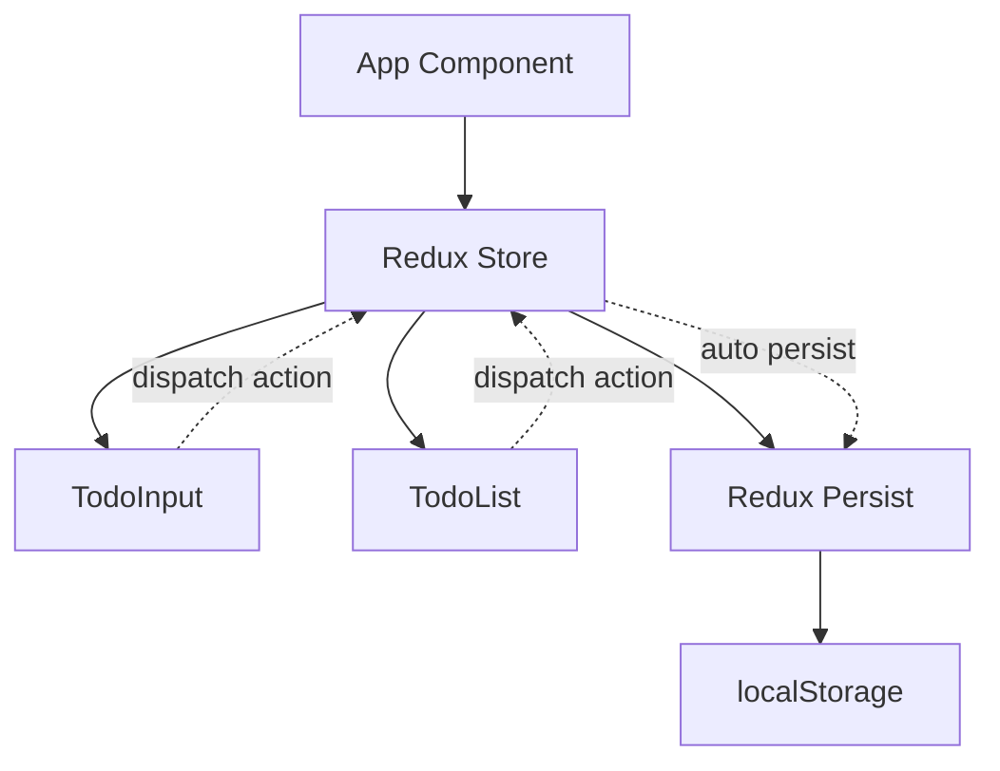
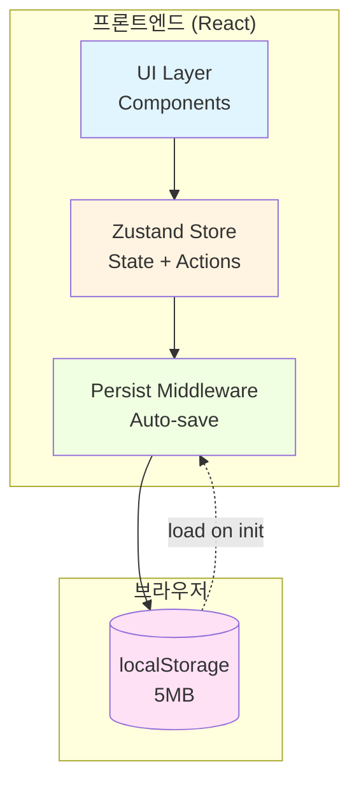
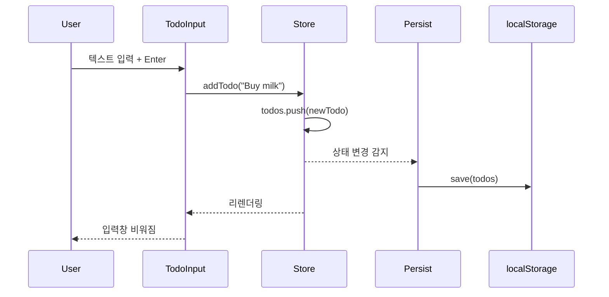

## 관련 문서
- [[../CJ_AI_개발방법론|CJ_AI_개발방법론]]
- [[../templates/DesignDoc_템플릿|Design Doc 템플릿]]
- [[./PRD_예시_할일관리앱|PRD (이전 단계)]]
- [[./ImplementationTracker_예시_할일관리앱|Implementation Tracker (다음 단계)]]

---

# Design Doc: Simple Todo App - 할일 관리 기능

**작성일:** 2025-11-08
**작성자:** 김개발
**버전:** 1.0
**상태:** 승인됨

**PRD 참조:** [[./PRD_예시_할일관리앱]]

---

## 📋 Problem Statement (문제 정의)

### PRD 연결
- **해결할 User Story:** Story 1, 2, 3 (할일 추가/체크/삭제)
- **관련 Goal:** 핵심 기능 3개 구현

### 핵심 과제
> 로컬 스토리지를 활용한 간단한 할일 관리 시스템 설계

**구체적 문제:**
- 데이터를 어디에 저장할 것인가? (로컬 vs 서버)
- 상태 관리를 어떻게 할 것인가? (Context vs Redux vs Zustand)
- 컴포넌트 구조를 어떻게 나눌 것인가?

**제약 조건:**
- 로컬 스토리지만 사용 (서버 없음)
- 응답 시간 < 200ms
- 테스트 커버리지 > 90%, 변이 점수 > 80%

---

## 🔍 Solution Exploration (해법 탐색)

### 옵션 A: Context API + 로컬 스토리지

#### 개요
React의 내장 Context API를 활용하여 전역 상태 관리, 로컬 스토리지에 동기화

#### 아키텍처


#### 장점
- ✅ 추가 라이브러리 불필요 (React 내장)
- ✅ 간단한 구조, 학습 곡선 낮음
- ✅ 번들 크기 최소화

#### 단점
- ❌ 복잡한 상태 관리 시 보일러플레이트 증가
- ❌ DevTools 지원 부족
- ❌ 성능 최적화 수동 필요

#### 복잡도 평가
- **구현 복잡도:** 낮음
- **유지보수 복잡도:** 중간
- **예상 개발 시간:** 8시간

---

### 옵션 B: Zustand + 로컬 스토리지 미들웨어

#### 개요
경량 상태 관리 라이브러리 Zustand 사용, persist 미들웨어로 자동 저장

#### 아키텍처


#### 장점
- ✅ 간결한 API, 보일러플레이트 최소
- ✅ persist 미들웨어로 자동 로컬 스토리지 동기화
- ✅ DevTools 지원
- ✅ 성능 최적화 내장

#### 단점
- ❌ 외부 라이브러리 의존성 추가 (3KB)
- ❌ Context API보다 학습 필요

#### 복잡도 평가
- **구현 복잡도:** 낮음
- **유지보수 복잡도:** 낮음
- **예상 개발 시간:** 6시간

---

### 옵션 C: Redux Toolkit + Redux Persist

#### 개요
Redux Toolkit으로 상태 관리, Redux Persist로 로컬 스토리지 자동 동기화

#### 아키텍처


#### 장점
- ✅ 강력한 상태 관리, 확장성 우수
- ✅ DevTools 우수, 디버깅 용이
- ✅ Redux Persist로 자동 저장
- ✅ 대규모 앱으로 확장 시 유리

#### 단점
- ❌ 과도한 설정 (간단한 앱에 오버엔지니어링)
- ❌ 번들 크기 증가 (30KB+)
- ❌ 보일러플레이트 많음
- ❌ 학습 곡선 높음

#### 복잡도 평가
- **구현 복잡도:** 높음
- **유지보수 복잡도:** 높음
- **예상 개발 시간:** 12시간

---

## ⚠️ Risk Analysis (리스크 분석)

### 옵션별 리스크 매트릭스

| 옵션 | 기술 리스크 | 일정 리스크 | 품질 리스크 | 총점 |
|------|-----------|-----------|-----------|------|
| A (Context) | 낮음 (1) | 중간 (2) | 중간 (2) | 5 |
| B (Zustand) | 낮음 (1) | 낮음 (1) | 낮음 (1) | 3 ✅ |
| C (Redux) | 중간 (2) | 높음 (3) | 낮음 (1) | 6 |

### 주요 리스크

#### 리스크 1: 수동 로컬 스토리지 동기화 로직 누락 (옵션 A)
- **영향도:** 높음 (데이터 손실)
- **발생 확률:** 중간
- **해당 옵션:** A
- **완화 전략:**
  - 모든 상태 변경 시 useEffect로 자동 저장
  - 테스트로 저장 로직 검증

#### 리스크 2: 외부 라이브러리 버전 호환성 (옵션 B, C)
- **영향도:** 중간 (빌드 실패)
- **발생 확률:** 낮음
- **해당 옵션:** B, C
- **완화 전략:**
  - package.json에 정확한 버전 명시
  - 개발 기간 동안 버전 고정

#### 리스크 3: 과도한 복잡도로 인한 일정 지연 (옵션 C)
- **영향도:** 높음 (MVP 지연)
- **발생 확률:** 높음
- **해당 옵션:** C
- **완화 전략:**
  - 옵션 C 선택 시 MVP 범위 축소

### 제약이 기회가 되는 경우
- **3주 일정 제약** → 간결한 설계 강제 (KISS 원칙)
- **로컬 스토리지 제약** → 서버 구축 불필요, 빠른 개발

---

## ✅ Decision (최종 선택)

### 선택: 옵션 B (Zustand + persist 미들웨어)

#### 선택 근거
1. **간결성 (Concise)**
   - Context API(A)보다 보일러플레이트 적음
   - Redux(C)보다 설정 단순

2. **자동화 (Explicit + Adaptive)**
   - persist 미들웨어로 로컬 스토리지 자동 동기화
   - 수동 저장 로직 불필요 → 버그 위험 감소

3. **개발 속도 (일정 리스크 최소)**
   - 예상 개발 시간 6시간 (가장 짧음)
   - 3주 일정에 적합

4. **품질 (Reflective)**
   - DevTools 지원으로 디버깅 용이
   - 테스트 작성 간편
   - 번들 크기 3KB (성능 영향 최소)

#### 트레이드오프

**✅ 얻는 것:**
- 자동 로컬 스토리지 동기화 (persist)
- 간결한 코드 (보일러플레이트 최소)
- 빠른 개발 속도
- DevTools 지원

**⚠️ 포기하는 것 (허용 가능):**
- Context API의 "라이브러리 없음" 장점 (3KB 번들 추가는 허용 가능)
- Redux의 강력한 확장성 (간단한 앱이므로 불필요)

#### 대안 계획 (Plan B)
- **만약 Zustand가 문제 발생 시:** Context API(옵션 A)로 전환
- **전환 시점:** persist 미들웨어 버그 발생 또는 테스트 통과 불가 시

---

## 🏗️ Architecture (아키텍처)

### 시스템 구조



### 컴포넌트 상세

#### 컴포넌트 1: useTodoStore (Zustand Store)
- **책임:** 할일 목록 상태 관리 및 액션 제공
- **인터페이스:**
  ```typescript
  interface TodoStore {
    todos: Todo[];
    addTodo: (text: string) => void;
    toggleTodo: (id: string) => void;
    deleteTodo: (id: string) => void;
  }

  interface Todo {
    id: string;
    text: string;
    completed: boolean;
    createdAt: Date;
  }
  ```
- **의존성:** persist 미들웨어

#### 컴포넌트 2: TodoInput
- **책임:** 새 할일 입력 UI
- **인터페이스:**
  ```typescript
  interface TodoInputProps {
    // No props (uses store directly)
  }
  ```
- **의존성:** useTodoStore

#### 컴포넌트 3: TodoList
- **책임:** 할일 목록 렌더링
- **인터페이스:**
  ```typescript
  interface TodoListProps {
    // No props (uses store directly)
  }
  ```
- **의존성:** useTodoStore, TodoItem

#### 컴포넌트 4: TodoItem
- **책임:** 개별 할일 항목 렌더링
- **인터페이스:**
  ```typescript
  interface TodoItemProps {
    todo: Todo;
  }
  ```
- **의존성:** useTodoStore

### 데이터 흐름



### 데이터 모델

```typescript
// store/todoStore.ts
interface Todo {
  id: string;           // UUID v4
  text: string;         // 최대 500자
  completed: boolean;   // 기본값: false
  createdAt: Date;      // 생성 시간
}

interface TodoState {
  todos: Todo[];
  addTodo: (text: string) => void;
  toggleTodo: (id: string) => void;
  deleteTodo: (id: string) => void;
}
```

---

## 🧪 Test Strategy (테스트 전략)

### 테스트 범위

#### 단위 테스트 (Unit Tests)
- **대상:** useTodoStore의 모든 액션
- **범위:**
  - ✅ `addTodo`: 정상 추가, 빈 텍스트 거부
  - ✅ `toggleTodo`: 완료 상태 토글
  - ✅ `deleteTodo`: 항목 삭제
  - ✅ `persist`: 로컬 스토리지 저장/로드
- **목표 커버리지:** >95%

#### 통합 테스트 (Integration Tests)
- **대상:** 컴포넌트 + Store 연동
- **시나리오:**
  - ✅ 사용자가 할일 추가 → 화면에 표시
  - ✅ 체크박스 클릭 → 취소선 스타일 적용
  - ✅ 삭제 버튼 클릭 → 목록에서 제거
- **목표 커버리지:** >85%

#### E2E 테스트 (End-to-End Tests)
- **대상:** 전체 사용자 워크플로우
- **시나리오:**
  - ✅ Happy Path: 추가 → 체크 → 삭제
  - ✅ Error Cases: 빈 텍스트 추가 시도

### 변이 테스트 (Mutation Testing)
- **목표 변이 점수:** >80%
- **도구:** Stryker for JavaScript/TypeScript

### 테스트 데이터
```typescript
// __tests__/fixtures/todos.ts
export const mockTodos: Todo[] = [
  {
    id: "1",
    text: "Buy milk",
    completed: false,
    createdAt: new Date("2025-11-07")
  },
  {
    id: "2",
    text: "Write code",
    completed: true,
    createdAt: new Date("2025-11-06")
  }
];
```

---

## 📦 Implementation Plan (구현 계획)

### 블럭 분할 전략
```
전체 기능을 4개 블럭으로 분할 (각 블럭 1.5-2시간)
총 예상 시간: 6-8시간
```

### 블럭 1: Zustand Store 구현

**목표:**
- Todo 데이터 모델 정의
- useTodoStore 생성 (addTodo, toggleTodo, deleteTodo)
- persist 미들웨어 적용

**예상 시간:** 2시간

**핵심 테스트:**
1. `test_addTodo_should_add_new_todo_to_list()` - 할일 추가 성공
2. `test_addTodo_should_reject_empty_text()` - 빈 텍스트 거부
3. `test_toggleTodo_should_toggle_completed_status()` - 완료 토글
4. `test_deleteTodo_should_remove_todo_from_list()` - 삭제 성공
5. `test_persist_should_save_to_localStorage()` - 저장 확인
6. `test_persist_should_load_from_localStorage()` - 로드 확인

**의존성:**
- 선행 블럭: 없음

**결과물:**
- [ ] 모든 테스트 통과 (6개)
- [ ] 코드 리뷰 완료
- [ ] 변이 점수 >80%

---

### 블럭 2: TodoInput 컴포넌트

**목표:**
- 입력창 UI 구현
- Enter 키 및 버튼 클릭 이벤트 처리
- addTodo 액션 연동

**예상 시간:** 1.5시간

**핵심 테스트:**
1. `test_input_should_add_todo_on_enter_key()` - Enter 키 동작
2. `test_input_should_add_todo_on_button_click()` - 버튼 클릭
3. `test_input_should_clear_after_adding()` - 입력창 초기화
4. `test_input_should_not_add_empty_text()` - 빈 텍스트 방지

**의존성:**
- 선행 블럭: 블럭 1 (Store)

**결과물:**
- [ ] 모든 테스트 통과 (4개)
- [ ] 코드 리뷰 완료
- [ ] 변이 점수 >80%

---

### 블럭 3: TodoList + TodoItem 컴포넌트

**목표:**
- 할일 목록 렌더링
- 체크박스 및 삭제 버튼 UI
- toggleTodo, deleteTodo 액션 연동

**예상 시간:** 2시간

**핵심 테스트:**
1. `test_list_should_render_all_todos()` - 목록 렌더링
2. `test_item_should_toggle_on_checkbox_click()` - 체크박스 동작
3. `test_item_should_delete_on_button_click()` - 삭제 버튼 동작
4. `test_completed_todo_should_have_strikethrough()` - 완료 스타일

**의존성:**
- 선행 블럭: 블럭 1 (Store)

**결과물:**
- [ ] 모든 테스트 통과 (4개)
- [ ] 코드 리뷰 완료
- [ ] 변이 점수 >80%

---

### 블럭 4: 통합 및 스타일링

**목표:**
- App 컴포넌트에 통합
- CSS 스타일링 (반응형)
- E2E 테스트 작성

**예상 시간:** 1.5시간

**핵심 테스트:**
1. `test_e2e_user_can_add_todo()` - E2E: 추가
2. `test_e2e_user_can_complete_todo()` - E2E: 완료
3. `test_e2e_user_can_delete_todo()` - E2E: 삭제

**의존성:**
- 선행 블럭: 블럭 1, 2, 3

**결과물:**
- [ ] 모든 테스트 통과 (3개)
- [ ] 코드 리뷰 완료
- [ ] 반응형 디자인 확인

---

## 🚀 Rollout Plan (배포 계획)

### 단계별 출시

**Phase 1: 로컬 테스트 (1일)**
- 대상: 개발자 본인
- 목표: 기능 검증
- 성공 기준: 모든 User Story 수용 기준 충족

**Phase 2: Vercel 배포 (1일)**
- 대상: 공개 URL
- 목표: 프로덕션 환경 검증
- 성공 기준: Lighthouse 점수 >90

---

## 💡 Notes (참고 사항)

### CLEAR 원칙 체크
- [x] **Concise**: 4 페이지 (✅ 목표: 3-5 페이지)
- [x] **Logical**: 탐색 → 분석 → 선택 → 계획 순서
- [x] **Explicit**: Zustand 선택 근거 명시, 트레이드오프 투명
- [x] **Adaptive**: 3개 옵션 비교, Plan B 명시
- [x] **Reflective**: Test Strategy 및 변이 테스트 포함

### 5단계 프로세스 매핑
- **이 문서는 5단계의 "2. Explore, 3. Opposites, 4. Select"에 해당합니다.**
- 이전 단계: [[./PRD_예시_할일관리앱|PRD (Recognize)]]
- 다음 단계: [[./ImplementationTracker_예시_할일관리앱|Implementation Tracker (Verify)]]

---

**작성 완료일:** 2025-11-08
**다음 리뷰:** 2025-11-15
