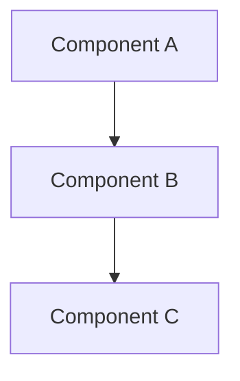
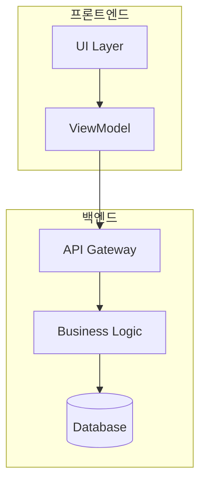
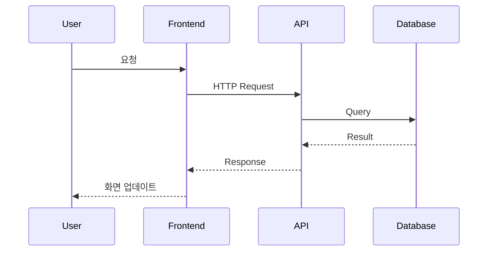

## 관련 문서
- [[../CJ_AI_개발방법론|CJ_AI_개발방법론]]
- [[./PRD_템플릿|PRD 템플릿]]
- [[./ImplementationTracker_템플릿|Implementation Tracker 템플릿]]

---

# Design Doc: [기능명]

**작성일:** YYYY-MM-DD
**작성자:** [이름]
**버전:** 1.0
**상태:** 초안 | 검토 중 | 승인됨

**PRD 참조:** [[PRD 링크]]

---

## 📋 Problem Statement (문제 정의)

### PRD 연결
- **해결할 User Story:** [User Story ID]
- **관련 Goal:** [PRD의 어떤 Goal을 구현하는가?]

### 핵심 과제
> [이 설계가 해결하려는 핵심 문제를 1-2 문장으로]

**구체적 문제:**
- [문제 1]
- [문제 2]
- [문제 3]

**제약 조건:**
- [제약 1]
- [제약 2]

---

## 🔍 Solution Exploration (해법 탐색)

> **5단계의 "2. Explore (다양한 해법 탐색)" 단계**

### 옵션 A: [접근법 이름]

#### 개요
[이 접근법에 대한 간단한 설명]

#### 아키텍처


#### 장점
- ✅ [장점 1]
- ✅ [장점 2]
- ✅ [장점 3]

#### 단점
- ❌ [단점 1]
- ❌ [단점 2]
- ❌ [단점 3]

#### 복잡도 평가
- **구현 복잡도:** 낮음 | 중간 | 높음
- **유지보수 복잡도:** 낮음 | 중간 | 높음
- **예상 개발 시간:** [시간]

---

### 옵션 B: [접근법 이름]

#### 개요
[이 접근법에 대한 간단한 설명]

#### 아키텍처


#### 장점
- ✅ [장점 1]
- ✅ [장점 2]
- ✅ [장점 3]

#### 단점
- ❌ [단점 1]
- ❌ [단점 2]
- ❌ [단점 3]

#### 복잡도 평가
- **구현 복잡도:** 낮음 | 중간 | 높음
- **유지보수 복잡도:** 낮음 | 중간 | 높음
- **예상 개발 시간:** [시간]

---

### 옵션 C: [접근법 이름]

#### 개요
[이 접근법에 대한 간단한 설명]

#### 아키텍처


#### 장점
- ✅ [장점 1]
- ✅ [장점 2]
- ✅ [장점 3]

#### 단점
- ❌ [단점 1]
- ❌ [단점 2]
- ❌ [단점 3]

#### 복잡도 평가
- **구현 복잡도:** 낮음 | 중간 | 높음
- **유지보수 복잡도:** 낮음 | 중간 | 높음
- **예상 개발 시간:** [시간]

---

## ⚠️ Risk Analysis (리스크 분석)

> **5단계의 "3. Opposites (반대를 긍정요소로)" 단계**

### 옵션별 리스크 매트릭스

| 옵션 | 기술 리스크 | 일정 리스크 | 품질 리스크 | 총점 |
|------|-----------|-----------|-----------|------|
| A | 낮음 (1) | 중간 (2) | 낮음 (1) | 4 |
| B | 중간 (2) | 낮음 (1) | 중간 (2) | 5 |
| C | 높음 (3) | 중간 (2) | 낮음 (1) | 6 |

### 주요 리스크

#### 리스크 1: [리스크 설명]
- **영향도:** 높음 | 중간 | 낮음
- **발생 확률:** 높음 | 중간 | 낮음
- **해당 옵션:** A | B | C
- **완화 전략:** [어떻게 대응?]

#### 리스크 2: [리스크 설명]
- **영향도:** 높음 | 중간 | 낮음
- **발생 확률:** 높음 | 중간 | 낮음
- **해당 옵션:** A | B | C
- **완화 전략:** [어떻게 대응?]

### 제약이 기회가 되는 경우
- [제약 1] → [어떻게 기회로 전환?]
- [제약 2] → [어떻게 기회로 전환?]

---

## ✅ Decision (최종 선택)

> **5단계의 "4. Select (최적 방법 선택)" 단계**

### 선택: 옵션 [X]

#### 선택 근거
1. **[근거 1]**
   - [상세 설명]

2. **[근거 2]**
   - [상세 설명]

3. **[근거 3]**
   - [상세 설명]

#### 트레이드오프

**✅ 얻는 것:**
- [이득 1]
- [이득 2]
- [이득 3]

**⚠️ 포기하는 것 (허용 가능):**
- [포기 1] - [왜 허용 가능한가?]
- [포기 2] - [왜 허용 가능한가?]

#### 대안 계획 (Plan B)
- **만약 선택한 옵션이 실패하면:** [Plan B는 무엇인가?]
- **전환 시점:** [언제 Plan B로 전환?]

---

## 🏗️ Architecture (아키텍처)

### 시스템 구조



### 컴포넌트 상세

#### 컴포넌트 1: [이름]
- **책임:** [이 컴포넌트가 하는 일]
- **인터페이스:**
  ```typescript
  interface Component1 {
    method1(param: Type): ReturnType;
    method2(param: Type): ReturnType;
  }
  ```
- **의존성:** [다른 컴포넌트와의 관계]

#### 컴포넌트 2: [이름]
- **책임:** [이 컴포넌트가 하는 일]
- **인터페이스:**
  ```typescript
  interface Component2 {
    method1(param: Type): ReturnType;
  }
  ```
- **의존성:** [다른 컴포넌트와의 관계]

### 데이터 흐름



### API 계약

#### Endpoint 1
```
POST /api/resource
Content-Type: application/json

Request:
{
  "field1": "value",
  "field2": 123
}

Response (200 OK):
{
  "id": "abc123",
  "status": "success"
}
```

#### Endpoint 2
```
GET /api/resource/:id

Response (200 OK):
{
  "id": "abc123",
  "data": {...}
}
```

### 데이터 모델

```typescript
interface Entity {
  id: string;
  name: string;
  createdAt: Date;
  updatedAt: Date;
}

interface ValueObject {
  field1: string;
  field2: number;
}
```

---

## 🧪 Test Strategy (테스트 전략)

> **TDD를 위한 테스트 계획**

### 테스트 범위

#### 단위 테스트 (Unit Tests)
- **대상:** [테스트할 컴포넌트/함수]
- **범위:**
  - ✅ [시나리오 1]
  - ✅ [시나리오 2]
  - ✅ [시나리오 3]
- **목표 커버리지:** >90%

#### 통합 테스트 (Integration Tests)
- **대상:** [테스트할 컴포넌트 간 연동]
- **시나리오:**
  - ✅ [시나리오 1]
  - ✅ [시나리오 2]
- **목표 커버리지:** >80%

#### E2E 테스트 (End-to-End Tests)
- **대상:** [사용자 워크플로우]
- **시나리오:**
  - ✅ [Happy Path]
  - ✅ [Error Cases]

### 변이 테스트 (Mutation Testing)
- **목표 변이 점수:** >80%
- **도구:** Stryker | mutmut | PIT

### 테스트 데이터
- **준비 방법:** Fixture | Factory | Mock
- **데이터 예시:**
  ```json
  {
    "testCase1": {...},
    "testCase2": {...}
  }
  ```

---

## 📦 Implementation Plan (구현 계획)

### 블럭 분할 전략

```
큰 기능을 작은 블럭으로 분할 (각 블럭 1-4시간)
- 블럭이 작을수록 TDD가 쉬움
- 블럭이 작을수록 리스크 감소
```

### 블럭 1: [기능명]

**목표:**
- [이 블럭이 달성할 것]

**예상 시간:** [시간]

**핵심 테스트:**
1. `test_[기능]_[시나리오]()` - [테스트 설명]
2. `test_[기능]_[시나리오]()` - [테스트 설명]
3. `test_[기능]_[시나리오]()` - [테스트 설명]

**의존성:**
- 선행 블럭: 없음 | [블럭 번호]

**결과물:**
- [ ] 테스트 통과
- [ ] 코드 리뷰 완료
- [ ] 변이 점수 >80%

---

### 블럭 2: [기능명]

**목표:**
- [이 블럭이 달성할 것]

**예상 시간:** [시간]

**핵심 테스트:**
1. `test_[기능]_[시나리오]()` - [테스트 설명]
2. `test_[기능]_[시나리오]()` - [테스트 설명]

**의존성:**
- 선행 블럭: 블럭 1

**결과물:**
- [ ] 테스트 통과
- [ ] 코드 리뷰 완료
- [ ] 변이 점수 >80%

---

### 블럭 3: [기능명]

**목표:**
- [이 블럭이 달성할 것]

**예상 시간:** [시간]

**핵심 테스트:**
1. `test_[기능]_[시나리오]()` - [테스트 설명]

**의존성:**
- 선행 블럭: 블럭 1, 2

**결과물:**
- [ ] 테스트 통과
- [ ] 코드 리뷰 완료
- [ ] 변이 점수 >80%

---

## 🚀 Rollout Plan (배포 계획)

### 단계별 출시

**Phase 1: 내부 테스트 (1주)**
- 대상: 개발팀
- 목표: 기능 검증
- 성공 기준: [기준]

**Phase 2: 베타 테스트 (1주)**
- 대상: 파워 유저 10명
- 목표: 사용성 검증
- 성공 기준: [기준]

**Phase 3: 전체 출시**
- 대상: 전체 사용자
- 목표: 안정적 배포
- 성공 기준: [기준]

### 롤백 전략
- **트리거:** [어떤 상황에 롤백?]
- **절차:**
  1. [단계 1]
  2. [단계 2]
- **복구 시간 목표:** [시간]

### 모니터링
- **핵심 지표:**
  - [지표 1]
  - [지표 2]
- **알림 기준:** [언제 알림?]

---

## 🔗 Dependencies (의존성)

### 내부 의존성
- [시스템 A] - [연동 내용]
- [팀 B] - [협업 내용]

### 외부 의존성
- [서드파티 API] - [사용 목적]
- [라이브러리] - [버전]

---

## 📚 References (참고 자료)

### 설계 패턴
- [패턴 1] - [적용 위치]
- [패턴 2] - [적용 위치]

### 기술 문서
- [문서 링크]
- [레퍼런스 구현]

---

## ✅ Approval (승인)

### 검토자
- [ ] [역할 1] - [이름] - [날짜]
- [ ] [역할 2] - [이름] - [날짜]

### 승인자
- [ ] [역할] - [이름] - [날짜]

---

## 📝 Change Log (변경 이력)

| 버전 | 날짜 | 변경 내용 | 작성자 |
|------|------|----------|--------|
| 1.0 | YYYY-MM-DD | 초안 작성 | [이름] |

---

## 💡 Notes (참고 사항)

### CLEAR 원칙 체크
- [ ] **Concise**: 3-5 페이지 이내 (✅ 현재 페이지 수: ___)
- [ ] **Logical**: 탐색 → 분석 → 선택 → 계획 순서 논리적
- [ ] **Explicit**: 선택 근거 명시, 트레이드오프 투명
- [ ] **Adaptive**: 3개 옵션으로 유연성 확보
- [ ] **Reflective**: Test Strategy로 검증 계획

### 5단계 프로세스 매핑
- **이 문서는 5단계의 "2. Explore, 3. Opposites, 4. Select"에 해당합니다.**
- 이전 단계: [[./PRD_템플릿|PRD (Recognize)]]
- 다음 단계: [[./ImplementationTracker_템플릿|Implementation Tracker (Verify)]]

---

**작성 완료일:** YYYY-MM-DD
**다음 리뷰:** YYYY-MM-DD
